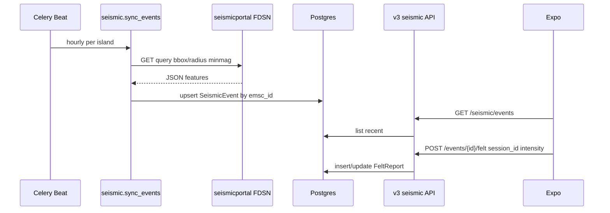

# feat: Seismic module (EMSC sync + felt reports + Expo tab)

## Summary

Ship the **earthquakes / seismic** slice of Phase 3: poll EMSC via FDSN, upsert `SeismicEvent` rows per island, expose v3 read + felt-report APIs, enable the module on São Miguel, and add an Expo tab gated on `enabledModules`—mirroring the news pipeline pattern already on staging.

## Problem Frame

Phase 3 transit and news are live on staging (`enabledModules: transit, news`). `seismic` has **models and migrations only**—no `services.py`, `tasks.py`, v3 routes, Beat schedule, island flag, or Expo UI. Users cannot see Azores-relevant earthquakes or submit pseudonymous “I felt it” reports. MIGRATION_PLAN Phase 3 exit criteria still requires earthquakes alongside news.

## Requirements

| ID | Requirement |
|----|-------------|
| R1 | Celery task polls EMSC FDSN Event WS for events within each island’s `center_lat` / `center_lng` / `radius_km`; upserts by `(island, emsc_id)` without duplicating rows. |
| R2 | `GET /api/v3/seismic/events` returns recent events for the request island (newest first), with optional `min_magnitude` and `limit`. |
| R3 | `GET /api/v3/seismic/events/{id}` returns one event including aggregated felt counts (and optional intensity breakdown). |
| R4 | `POST /api/v3/seismic/events/{id}/felt` accepts `session_id`, `intensity` (1–12), optional coarse `latitude`/`longitude`; stores `session_hash` via stable consent hash; one report per session per event (update or 409). |
| R5 | São Miguel `feature_flags.seismic` enabled via data migration; bootstrap `enabledModules` includes `seismic` when flag is true. |
| R6 | Celery Beat registers periodic `seismic.sync_events` (conservative interval, e.g. hourly). |
| R7 | Expo tab `earthquakes` visible when bootstrap includes `seismic`; list + detail + “I felt it” flow; analytics `module: seismic`, `event_type: engage`. |
| R8 | API tests mock HTTP to EMSC; ≥80% coverage target on `seismic/services.py` per SDD 04 §6. |

## Key Technical Decisions

| ID | Decision | Rationale |
|----|----------|-----------|
| KTD1 | Use **FDSN Event WS** at `https://www.seismicportal.eu/fdsnws/event/1/query` with `format=json`, `minradius`/`maxradius` or lat/lon box derived from island center + `radius_km`. | Official EMSC channel; documented in SDD 09; avoids scraping HTML. |
| KTD2 | Map `emsc_id` from JSON `properties.unid` (fallback: top-level `id`). | Stable upsert key aligned with EMSC identifiers. |
| KTD3 | Default `minmag=2.5` (configurable in service) for poll queries. | Reduces noise; Azores users care about felt events. |
| KTD4 | `session_hash` for felt reports uses **`hash_session_id`** (stable), not rotating analytics salt. | Felt is pseudonymous UGC tied to consent identity; DSAR path already understands stable hash. |
| KTD5 | Rate limiting: **no per-request EMSC proxy** from API views—only Celery poll + DB reads. | SDD 09: respect EMSC limits; cache in Postgres. |
| KTD6 | Expo route folder **`app/(tabs)/earthquakes/`** (SDD 10) while API/bootstrap module key remains **`seismic`**. | Matches frontend architecture doc; analytics already uses `MODULE_SEISMIC = 'seismic'`. |
| KTD7 | Felt intensity validated **1–12** (EMS-style); optional lat/lng rounded to 2 decimals server-side. | Minimizes precision; GDPR-friendly coarse location. |

## High-Level Technical Design

---

## Scope Boundaries

**In scope:** EMSC ingest, v3 list/detail/felt, tenancy flag + Beat, Expo earthquakes tab, basic analytics engage events, staging smoke.

**Out of scope (this plan):** Premium magnitude push alerts, EMSC WebSocket realtime feed, felt-intensity heatmap UI, trails/marketplace, Phase 1 DNS cutover.

### Deferred to Follow-Up Work

- Land uncommitted Expo **news cache/tab** fixes (query key bump, `refetchOnMount`, tab `href` pattern) in a small commit before or parallel to seismic—does not block backend.
- News tab i18n label polish and RSS category chips vs feed taxonomy.
- OpenAPI entries for seismic (Phase 4 docs pass).

---

## Implementation Units

### U1. EMSC sync service and Celery task

**Goal:** Populate `SeismicEvent` from EMSC on a schedule.

**Requirements:** R1, R5 (flag migration in U2), R6.

**Dependencies:** None (models exist).

**Files:**
- `SaoMiguelBus-api/src/seismic/services.py` (create)
- `SaoMiguelBus-api/src/seismic/tasks.py` (create)
- `SaoMiguelBus-api/src/seismic/migrations/0002_periodic_task_sync_events.py` (create)
- `SaoMiguelBus-api/src/seismic/tests/test_services.py` (create)

**Approach:**
- `fetch_events_for_island(island)` builds FDSN query: `starttime` = now − 7d (or last successful poll timestamp stored in cache/key), geographic filter from `center_lat/lng/radius_km`, `minmag`, `limit=500`, `format=json`.
- Parse GeoJSON-like feature list; for each event set `magnitude`, `depth_km`, `latitude`, `longitude`, `occurred_at` (UTC), `region` from `flynn_region` or place string, `emsc_id` from `unid`.
- `sync_all_events(island_key=None)` loops islands with `feature_flags.seismic` true OR all islands when key omitted (match `news.services.poll_all_sources` pattern).
- `@shared_task(name='seismic.sync_events')` calls service; log counts `{created, updated, skipped}`.
- Migration registers CrontabSchedule + PeriodicTask (hourly), same style as `news/migrations/0002_*` and `consent/migrations/0002_periodic_tasks.py`.

**Patterns to follow:** `news/services.py`, `news/tasks.py`.

**Test scenarios:**
- Happy path: mocked JSON with two features → two `SeismicEvent` rows, second run updates same `emsc_id` not duplicate.
- Edge: empty feature list → zero DB writes, task returns ok.
- Edge: malformed JSON / HTTP 503 → task logs error, does not wipe existing rows.
- Edge: event outside island radius (if post-filter applied) → not inserted.
- Error: missing `unid` in payload → row skipped, counted in `skipped`.

**Verification:** After `migrate`, `poll` task on dev DB creates rows; admin lists events.

---

### U2. Tenancy flag, v3 API, URL wiring

**Goal:** Expose seismic data and felt submission under `/api/v3/seismic/`.

**Requirements:** R2, R3, R4, R5.

**Dependencies:** U1 (events exist for integration tests).

**Files:**
- `SaoMiguelBus-api/src/seismic/serializers.py` (create)
- `SaoMiguelBus-api/src/seismic/api_v3.py` (create)
- `SaoMiguelBus-api/src/seismic/urls_v3.py` (create)
- `SaoMiguelBus-api/src/src/urls.py` (modify — include seismic urls)
- `SaoMiguelBus-api/src/tenancy/migrations/0006_enable_seismic_feature_flag.py` (create)
- `SaoMiguelBus-api/src/seismic/tests/test_api_v3.py` (create)

**Approach:**
- List endpoint: query params `limit` (default 50, cap 100), `min_magnitude`; scope with `for_island`; serialize id, emsc_id, magnitude, depth_km, lat/lng, occurred_at, region, `felt_count`, `felt_summary` (optional histogram).
- Detail endpoint: 404 if wrong island/id.
- Felt POST: body `session_id`, `intensity`, optional `latitude`, `longitude`; require island; `session_hash = hash_session_id(session_id, island.key)`; upsert one `FeltReport` per `(event, session_hash)` or return 409 if intensity-only update not allowed (prefer upsert with same intensity policy documented in response).
- Throttle felt POST per island+session (reuse analytics throttle patterns if present, else simple DRF throttle class).
- Data migration sets `feature_flags.seismic = True` for `sao-miguel`.

**Patterns to follow:** `news/api_v3.py`, `news/urls_v3.py`, `tenancy/migrations/0005_enable_news_feature_flag.py`.

**Test scenarios:**
- Happy: GET list returns events ordered by `-occurred_at`.
- Happy: GET detail includes `felt_count` after seeding reports.
- Happy: POST felt with valid session_id → 201/200 and row persisted.
- Edge: POST without `session_id` → 400 `session_required`.
- Edge: intensity 0 or 13 → 400 validation error.
- Edge: POST for unknown event id → 404.
- Error: POST duplicate session different intensity → upsert or 409 per KTD implementation choice (document in test).

**Verification:** `pytest seismic/tests/test_api_v3.py`; curl staging with `X-Island: sao-miguel`.

---

### U3. Bootstrap module gating

**Goal:** Clients discover seismic the same way as news.

**Requirements:** R5.

**Dependencies:** U2 (flag migration).

**Files:**
- `SaoMiguelBus-api/src/tenancy/bootstrap.py` (verify — likely already maps `seismic` from flags)
- `SaoMiguelBus-api/src/tenancy/tests/test_bootstrap.py` (extend if exists)

**Approach:** Confirm `enabledModules` list includes `'seismic'` when `feature_flags['seismic']` is true; add test if missing.

**Test scenarios:**
- Happy: island with seismic flag → bootstrap JSON contains `seismic` in `enabledModules`.
- Edge: flag false → `seismic` omitted.

**Verification:** Staging `GET /api/v3/bootstrap` shows `seismic` after deploy.

---

### U4. Expo earthquakes feature and tab

**Goal:** End-user UI for event list, detail, and felt submission.

**Requirements:** R7.

**Dependencies:** U2, U3.

**Files:**
- `SaoMiguelBus/lib/api/seismic.ts` (create)
- `SaoMiguelBus/features/earthquakes/hooks/useEarthquakeQueries.ts` (create)
- `SaoMiguelBus/features/earthquakes/components/EarthquakeCard.tsx` (create)
- `SaoMiguelBus/features/earthquakes/components/FeltReportSheet.tsx` (create)
- `SaoMiguelBus/app/(tabs)/earthquakes/index.tsx` (create)
- `SaoMiguelBus/app/(tabs)/earthquakes/[id].tsx` (create)
- `SaoMiguelBus/app/(tabs)/_layout.tsx` (modify)
- `SaoMiguelBus/lib/i18n/locales/*.json` (modify — nav + felt copy)
- `SaoMiguelBus/features/earthquakes/types.ts` (create)

**Approach:**
- Mirror `features/news`: TanStack Query keys `seismic/v1/events`, `refetchOnMount: 'always'` on list (avoid empty-cache repeat of news).
- Tab: `showSeismic = modules.includes('seismic')`, `href: showSeismic ? '/earthquakes' : null`, translated title.
- List: magnitude, region, relative time; pull-to-refresh.
- Detail: map preview optional (static lat/lng text ok for v1); felt button opens sheet with intensity picker 1–12; POST with persisted `session_id` from consent/device store (same as analytics).
- Gate analytics `trackEngage('seismic', 'felt', { event_id, intensity })` only when analytics consent granted.

**Patterns to follow:** `features/news/hooks/useNewsQueries.ts`, `app/(tabs)/news/index.tsx`, `lib/api/news.ts`.

**Test scenarios:**
- Happy: bootstrap with `seismic` → tab visible, list renders cards from API.
- Happy: felt submit → POST observed in dev logs, UI confirmation.
- Edge: bootstrap without `seismic` → tab hidden (`href: null`).
- Edge: empty event list → empty state copy, no crash.
- Error: API 400 on felt → inline error message.

**Verification:** Expo web or device against staging; Metro shows `GET /api/v3/seismic/events`.

---

### U5. Analytics instrumentation

**Goal:** Phase 3 exit criterion—instrument earthquakes usage.

**Requirements:** R7 (analytics slice).

**Dependencies:** U4.

**Files:**
- `SaoMiguelBus/lib/analytics/events.ts` (modify or extend)
- `SaoMiguelBus-api/src/analytics/tests/` (extend if ingest validation tests exist)

**Approach:** On list view `module=seismic, event_type=view` (optional); on felt `event_type=engage`, properties `{action: 'felt', event_id, intensity}` per SDD 06. Respect consent gate in existing analytics client.

**Test scenarios:**
- Happy: with analytics consent, felt tap queues event batch containing seismic engage payload.
- Edge: without consent, no analytics POST on felt.

**Verification:** Staging analytics ingest accepts batch after consent.

---

### U6. Deploy and smoke verification

**Goal:** Staging reflects seismic end-to-end.

**Requirements:** R1–R8.

**Dependencies:** U1–U5.

**Files:** None (operational).

**Approach:** Deploy API + run migrations; trigger `seismic.sync_events` once manually; deploy Expo; smoke checklist below.

**Test expectation:** none — manual verification checklist.

**Verification:**
- Bootstrap includes `seismic`.
- `GET /api/v3/seismic/events` returns ≥1 event after sync.
- POST felt succeeds; detail shows incremented `felt_count`.
- Expo tab shows data; pull-to-refresh works.

---

## Risks and Dependencies

| Risk | Mitigation |
|------|------------|
| EMSC API shape changes (2023 FDSN server update) | Pin parser to documented fields; fixture tests; log raw sample on parse failure. |
| EMSC rate limits | Hourly Beat only; no user-triggered EMSC calls. |
| Felt report spam | Per-session dedupe; optional DRF throttle. |
| Module naming drift (`earthquakes` vs `seismic`) | KTD6: document in plan; use `seismic` in API/analytics only. |

**Depends on:** Redis + Celery worker on staging (already required for news). `requests` already in requirements from news.

---

## Open Questions

| Question | Status |
|----------|--------|
| Minimum magnitude for poll default (2.5 vs 3.0)? | Resolve in U1 implementation; document in service constant. |
| Upsert vs reject on second felt from same session? | Prefer **upsert** (update intensity)—simpler UX; test in U2. |
| Show map on detail in v1? | Defer map tile; lat/lng text + external maps link acceptable. |

---

## Sources and Research

- `MIGRATION_PLAN.md` Phase 3 — Earthquakes exit criteria
- `SDD/09-modules.md` §3, `SDD/04-api-design.md` seismic rows, `SDD/10-frontend-architecture.md` earthquakes tab
- `SaoMiguelBus-api/src/news/` — ingest + v3 API reference implementation
- EMSC FDSN Event WS: https://www.seismicportal.eu/fdsn-wsevent.html
