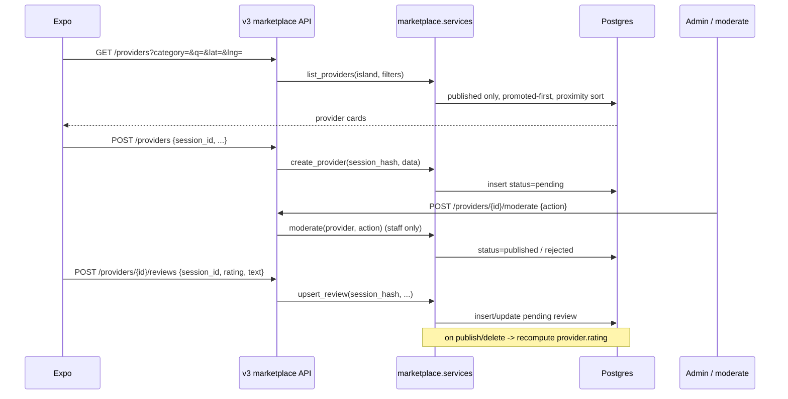

# feat: Marketplace module (free listings + reviews + moderation + Expo tab)

## Summary

Ship the **Marketplace** slice of Phase 4: a tenant-scoped directory of local tradespeople with **100% free listings**, full CRUD over `ServiceProvider` + `Review`, a `pending → published → rejected/deleted` moderation lifecycle, browse/search by category + location, contact via call/WhatsApp/email, and an Expo tab gated on `enabledModules`. It is the first user-generated-content (UGC) module, so it establishes the **ownership + moderation + write-throttle patterns** that Events and Traffic will reuse later — built on the existing `@api_view` + `services.py` + `for_island` convention, not a new ModelViewSet stack.

## Problem Frame

Phase 3 (transit, news, seismic, trails) is live end-to-end. `marketplace` exists only as a feature key: it is in `tenancy/bootstrap.py` `MODULE_KEYS`, `Island.feature_flags` defaults (`False`), and `analytics.MODULE_MARKETPLACE` — but there is **no Django app**, no models, no API, no Expo UI. The whole v3 surface today is read-mostly (`news`, `seismic`, `trails`) plus two narrow writes (seismic felt, transit vote). The codebase has **no ownership permissions, no moderation lifecycle, no UGC create/update/delete, and no user authentication** — only a pseudonymous `session_id`. Marketplace is the first module that needs all of these, so the plan must introduce them in a way Events/Traffic can copy.

---

## Requirements

| ID | Requirement |
|----|-------------|
| R1 | `marketplace` Django app exists with `ServiceCategory`, `ServiceProvider`, `Review` models (tenant-scoped), registered via settings toggle, with admin + migrations. |
| R2 | `GET /api/v3/marketplace/categories` returns the island's categories (name, icon, slug). |
| R3 | `GET /api/v3/marketplace/providers` lists **published** providers for the request island; supports `category`, `q` (name/bio fuzzy), `lat`/`lng` proximity sort, `limit`/cursor; promoted providers rank first with a transparent flag. |
| R4 | `GET /api/v3/marketplace/providers/{id}` retrieves one provider with aggregated `rating` + review count; returns non-published rows only to their owner (by session) or staff, else 404. |
| R5 | `POST /api/v3/marketplace/providers` creates a provider owned by the submitting `session_id` (stored as `created_by_session_hash`), entering `status=pending`. |
| R6 | `PUT/PATCH /api/v3/marketplace/providers/{id}` and `DELETE` (soft-delete → `status=deleted`) are restricted to the owning session or staff; edits re-enter `pending`. |
| R7 | `GET/POST /api/v3/marketplace/providers/{id}/reviews` lists published reviews / creates a review (owned by session, `pending`); `PUT/PATCH/DELETE /api/v3/marketplace/reviews/{id}` restricted to the owning session or staff. |
| R8 | Provider `rating` is the mean of its **published** reviews; recomputed on review create/moderate/delete. |
| R9 | `POST /api/v3/marketplace/providers/{id}/moderate` and the analogous review action are **staff-only** and transition `pending → published`/`rejected`; Django admin offers the same. |
| R10 | Write endpoints (create/update/delete on providers + reviews) are throttled per `(island, session)`; one review per session per provider (update or 409). |
| R11 | São Miguel `feature_flags.marketplace` enabled via data migration; bootstrap `enabledModules` includes `marketplace` when the flag is true. |
| R12 | Expo `marketplace` tab visible when bootstrap includes `marketplace`: category browse + search/proximity list, provider detail with reviews + tel/WhatsApp/mailto contact, submit-review sheet, and create/edit-own-listing form. |
| R13 | Analytics: `module=marketplace` events — `search` (`{query, category, results_count}`) and `engage` (`{action: 'call'|'whatsapp'|'email'|'review'|'view', provider_id}`), consent-gated. |
| R14 | TDD: failing `test_services.py` (CRUD/ownership/moderation/rating) + `test_api_v3.py` (verbs, 403 ownership, 404 tenant isolation, moderation gating, throttle) first; ≥80% coverage on `marketplace/services.py` (SDD 04 §6). |

---

## Key Technical Decisions

| ID | Decision | Rationale |
|----|----------|-----------|
| KTD1 | **Continue the `@api_view` function-view + `services.py` + `urls_v3.py` pattern** for the CRUD verbs; do **not** introduce DRF `ModelViewSet`/`DefaultRouter`. | Every existing v3 module uses `@api_view`; there is zero router/viewset infra in `src/`. Consistency + the seismic-cadence scope beat the SDD's ModelViewSet recommendation. Divergence noted in Open Questions. |
| KTD2 | **Ownership is pseudonymous, keyed on `created_by_session_hash = hash_session_id(session_id, island.key)`** — same stable hash as seismic felt reports. No user accounts, no `PartnerApiKey` in this plan. | The Expo app has no auth today (only `session_id`); felt reports already prove the pattern. Account- and partner-key ownership is a Phase 4 follow-up, not a v1 blocker. |
| KTD3 | **Moderation lifecycle** `pending → published → rejected` + soft-delete `deleted` as a `status` CharField with choices on a shared abstract `ModeratedModel` mixin in the `marketplace` app. | First moderation surface; a local mixin (vs a premature `common/` package) keeps it shippable and copyable by Events/Traffic. Public reads filter `status='published'`. |
| KTD4 | **Owner-or-staff enforced in the service layer + a thin `IsOwnerSessionOrStaff`-style check in views**, not via a global DRF permission class. | Matches the service-centric codebase; ownership depends on `session_id` from the request body/header, which a stock DRF object permission can't see cleanly. |
| KTD5 | **`is_promoted` is an admin-set read-only boolean** that only affects ranking + shows a transparent "Promoted" label. The **Pay-to-Promote purchase flow is out of scope** (Phase 5 / `billing.Promotion`). | SDD 08 puts monetization in Phase 5; marketplace v1 is free listings only. The field exists now so ranking is correct once promotion ships. |
| KTD6 | **Proximity is naive Haversine in Python/SQL `ORDER BY`** over `latitude`/`longitude` floats — no PostGIS. | SDD 03 keeps PostGIS "optional later"; provider counts per island are small; mirrors how transit avoids PostGIS today. |
| KTD7 | **Review uniqueness `(provider, created_by_session_hash)`**; second submit updates the existing review (re-enters `pending`) rather than creating a duplicate. | Mirrors seismic felt upsert UX; prevents review spam from one session; documented in tests. |
| KTD8 | Expo route folder **`app/(tabs)/marketplace/`** with create/edit as **modal routes**; module/analytics key stays **`marketplace`** everywhere. | `ModuleKey` already includes `marketplace`; modal create/edit mirrors `app/onboarding/consent.tsx` modal pattern (no create routes exist yet). |

---

## High-Level Technical Design

---

## Scope Boundaries

**In scope:** `marketplace` app + 3 models + admin; categories/providers/reviews CRUD via `@api_view`; session-based ownership; `pending/published/rejected/deleted` moderation + `moderate` action; search/category/proximity list; rating aggregation; per-session write throttle; tenancy flag + bootstrap gating; Expo browse/detail/contact/review/create-edit UI; marketplace analytics; OpenAPI + guide doc; staging smoke.

**Out of scope (this plan):**
- **Pay-to-Promote purchase** flow and `billing.Promotion` (Phase 5). `is_promoted` is admin-set only.
- **`PartnerApiKey`** / third-party partner write access (Phase 4 follow-up; shared across Events/Traffic).
- **User accounts / login** for ownership (session-based for now).
- **Events** and **Traffic** modules (separate plans).
- Photo/image uploads for listings; provider analytics dashboards.

### Deferred to Follow-Up Work

- Extract the `ModeratedModel` mixin + `IsOwnerSessionOrStaff` check into a shared `common/` location once Events/Traffic land (validate the shape on two more consumers first).
- `PartnerApiKey` model + `Authorization: Api-Key` permission + stricter partner throttle scope (SDD 04 §2.3) — one shared unit serving all three UGC modules.
- Partner API guide page (`documentation/docs/.../partner_api.md`) once partner keys exist.
- Cursor pagination helper if list volume grows (start with `limit`/offset cap like seismic).

---

## Implementation Units

### U1. `marketplace` app: models, moderation mixin, admin, toggle

**Goal:** Create the tenant-scoped data layer + the reusable moderation/ownership base.

**Requirements:** R1, R3 (fields), R5/R6 (ownership fields), R8 (rating field), R11 (toggle).

**Dependencies:** None.

**Files:**
- `SaoMiguelBus-api/src/marketplace/__init__.py` (create)
- `SaoMiguelBus-api/src/marketplace/apps.py` (create)
- `SaoMiguelBus-api/src/marketplace/models.py` (create)
- `SaoMiguelBus-api/src/marketplace/admin.py` (create)
- `SaoMiguelBus-api/src/marketplace/migrations/__init__.py` (create)
- `SaoMiguelBus-api/src/marketplace/migrations/0001_initial.py` (create)
- `SaoMiguelBus-api/src/src/settings.py` (modify — add `('marketplace', True)` to `apps`)
- `SaoMiguelBus-api/src/marketplace/tests/__init__.py` (create)

**Approach:**
- `ModeratedModel(models.Model)` abstract mixin: `status` CharField with choices `PENDING/PUBLISHED/REJECTED/DELETED` (default `PENDING`), `created_by_session_hash` CharField (indexed), `created_at`/`updated_at`. Provides `is_owned_by(session_hash)` helper.
- `ServiceCategory(TenantScopedModel)`: `name`, `slug`, `icon` (str), `unique_together (island, slug)`.
- `ServiceProvider(TenantScopedModel, ModeratedModel)`: `name`, `category` FK, `bio`, `hourly_rate` (nullable Decimal), `phone`, `whatsapp` (nullable), `email` (nullable), `latitude`/`longitude` (nullable floats), `is_promoted` (bool default False), `rating` (Decimal default 0), `review_count` (int default 0). Index `(island, status)`.
- `Review(TenantScopedModel, ModeratedModel)`: `provider` FK (related_name `reviews`), `rating` (int 1–5), `text`. `unique_together (provider, created_by_session_hash)`.
- `admin.py`: register all three; provider/review admin add a `moderate` action (publish/reject selected) and list `status`, `is_promoted`, `rating`.
- Migration depends on `tenancy` initial migration (island FK), mirrors `seismic/migrations/0001_initial.py`.

**Patterns to follow:** `src/seismic/models.py`, `src/seismic/migrations/0001_initial.py`, `src/seismic/apps.py`, `src/transit/models.py` (`unique_together` with island).

**Test scenarios:**
- Happy: create provider with `island` → defaults `status=PENDING`, `rating=0`, `review_count=0`.
- Happy: `is_owned_by(hash)` true for creating session, false for another.
- Edge: two providers, same `(island, slug)` on a category → IntegrityError on category; two reviews same `(provider, session_hash)` → IntegrityError.
- Edge: `rating` accepts 1–5 only (model/serializer validation asserted in U2/U3).
- `Covers AE: listing is not public until published` — published-only queryset helper returns only `PUBLISHED` rows.

**Verification:** `makemigrations marketplace` produces one migration; `migrate` clean; admin shows the three models.

---

### U2. `services.py`: CRUD, ownership, moderation, rating, search

**Goal:** All business logic + dict serialization, test-first.

**Requirements:** R2, R3, R4, R5, R6, R7, R8, R9, R10 (uniqueness), R14.

**Dependencies:** U1.

**Files:**
- `SaoMiguelBus-api/src/marketplace/services.py` (create)
- `SaoMiguelBus-api/src/marketplace/tests/test_services.py` (create)

**Approach:**
- `list_categories(island)`, `serialize_category`.
- `list_providers(island, *, category=None, q=None, lat=None, lng=None, limit=50)`: filter `status=PUBLISHED`; `q` → `name__icontains | bio__icontains` (trigram optional later); if `lat/lng` given, order by Haversine then `-is_promoted`, else `-is_promoted, -rating, name`; cap `limit` at 100.
- `get_provider(island, provider_id, *, viewer_session_hash=None, is_staff=False)`: return published; else only if owner/staff; else raise NotFound.
- `create_provider(island, session_hash, data)` → `status=PENDING`; `update_provider(provider, session_hash, is_staff, data)` enforces owner-or-staff, resets to `PENDING` on owner edit; `soft_delete_provider(...)` sets `status=DELETED`.
- `upsert_review(provider, session_hash, rating, text)` → create or update existing `(provider, session_hash)` review, `status=PENDING`; `update_review`/`delete_review` owner-or-staff.
- `moderate(obj, action)` (`publish`/`reject`) — caller asserts staff.
- `recompute_rating(provider)` — mean + count over `PUBLISHED` reviews; called on review publish/reject/delete.
- `serialize_provider(provider, *, include_private=False)`, `serialize_review`. Hand-built dicts like `news.services.serialize_article`.
- Wrap reads/writes assuming active island; explicit `island=` on creates (tests pass island).

**Patterns to follow:** `src/news/services.py` (dict serializers, `poll_all_sources` loop shape), `src/seismic/services.py` (`submit_felt_report` upsert), `src/blog/services.py` (create delegating from serializer).

**Test scenarios:**
- Happy: `create_provider` → pending; `moderate(publish)` → published, appears in `list_providers`.
- Happy: `upsert_review` twice same session → one row, second updates rating/text, stays pending.
- Happy: publishing two reviews (4★, 2★) → `recompute_rating` sets provider.rating=3.0, review_count=2.
- Ownership: `update_provider` by non-owner non-staff → PermissionDenied; by staff → allowed.
- Ownership: owner edit of a published provider → status back to PENDING.
- Moderation gating: `list_providers` excludes pending/rejected/deleted; `get_provider` returns pending only to owner/staff else NotFound.
- Search: `q='electric'` matches name/bio; `category` filters; proximity orders nearest first when lat/lng supplied.
- Soft delete: `soft_delete_provider` → status DELETED, excluded from public list, reviews' provider rating untouched.
- Edge: rating outside 1–5 rejected; create with unknown category → validation error.

**Verification:** `pytest marketplace/tests/test_services.py`; `coverage report` ≥80% on `services.py`.

---

### U3. v3 API: serializers, endpoints, URLs, throttle, tenancy flag

**Goal:** Expose the full CRUD + moderation surface under `/api/v3/marketplace/` and enable the island flag.

**Requirements:** R2, R3, R4, R5, R6, R7, R9, R10, R11.

**Dependencies:** U2.

**Files:**
- `SaoMiguelBus-api/src/marketplace/serializers.py` (create)
- `SaoMiguelBus-api/src/marketplace/throttling.py` (create)
- `SaoMiguelBus-api/src/marketplace/api_v3.py` (create)
- `SaoMiguelBus-api/src/marketplace/urls_v3.py` (create)
- `SaoMiguelBus-api/src/src/urls.py` (modify — `path('api/v3/marketplace/', include('marketplace.urls_v3'))`)
- `SaoMiguelBus-api/src/src/settings.py` (modify — add throttle scopes `marketplace_write`)
- `SaoMiguelBus-api/src/tenancy/migrations/00NN_enable_marketplace_feature_flag.py` (create — next number after the seismic flag migration)
- `SaoMiguelBus-api/src/marketplace/tests/test_api_v3.py` (create)

**Approach:**
- Request serializers (`serializers.Serializer`, seismic-style): `ProviderWriteSerializer` (name, category_slug, bio, hourly_rate?, phone, whatsapp?, email?, latitude?, longitude?, session_id), `ReviewWriteSerializer` (rating 1–5, text, session_id), `ModerateSerializer` (action in `publish/reject`).
- Endpoints (all `@api_view`, `_require_island`, `with for_island(request.island):`):
  - `GET categories`
  - `GET/POST providers` (POST validates serializer, computes `session_hash`, calls `create_provider`)
  - `GET/PUT/PATCH/DELETE providers/<int:pid>` (resolve viewer `session_id` from body/`X-Session-Id`; owner-or-staff via service)
  - `GET/POST providers/<int:pid>/reviews`
  - `PUT/PATCH/DELETE reviews/<int:rid>`
  - `POST providers/<int:pid>/moderate` — `request.user.is_staff` required, else 403.
- `MarketplaceWriteThrottle(SimpleRateThrottle)` scope `marketplace_write`, cache key `{island_key}:{session_id|ip}` (copy `transit/throttling.py`); applied to create/update/delete + review POST. Add `'marketplace_write': '20/min'` to `DEFAULT_THROTTLE_RATES`.
- Error envelope consistent with existing `_require_island` (`{error: {code, message}}`): `session_required`, `not_owner` (403), `not_found` (404), `validation_error` (400), `duplicate_review` (409 if non-upsert path chosen — KTD7 upserts instead).
- Tenancy migration sets `feature_flags['marketplace'] = True` for `sao-miguel` (copy `tenancy/migrations/0006_enable_seismic_feature_flag.py` shape; confirm actual filename/number).

**Patterns to follow:** `src/seismic/api_v3.py` + `urls_v3.py`, `src/seismic/serializers.py`, `src/transit/throttling.py`, `src/tenancy/migrations/0005_enable_news_feature_flag.py`, `src/tenancy/views.py` (auth-key/staff checks).

**Test scenarios:**
- Happy: `GET providers` returns only published, promoted-first.
- Happy: `POST providers` with `session_id` → 201, row pending, not in public list until moderated.
- Happy: `POST .../moderate {action:publish}` as staff → published, now listed.
- Happy: `POST .../reviews` → 201 pending; after publish, provider detail shows updated rating.
- Ownership: `PATCH providers/{id}` with a different `session_id` → 403 `not_owner`; with owner session → 200, back to pending.
- Tenant isolation: provider created under island A not returned/retrievable under `X-Island: B` → 404.
- Auth: `moderate` by anonymous/non-staff → 403.
- Validation: missing `session_id` on write → 400 `session_required`; rating 0 or 6 → 400.
- Throttle: N+1 rapid writes from one session → 429.
- Upsert: second review same session → single row updated (KTD7).

**Verification:** `pytest marketplace/tests/test_api_v3.py`; curl staging with `X-Island: sao-miguel`; `GET /api/v3/bootstrap` lists `marketplace` after migration.

---

### U4. Bootstrap gating check

**Goal:** Clients discover marketplace exactly like seismic/news.

**Requirements:** R11.

**Dependencies:** U3 (flag migration).

**Files:**
- `SaoMiguelBus-api/src/tenancy/bootstrap.py` (verify — `marketplace` already in `MODULE_KEYS`)
- `SaoMiguelBus-api/src/tenancy/tests/test_bootstrap.py` (extend)

**Approach:** Confirm `enabledModules` includes `'marketplace'` when `feature_flags['marketplace']` is true; add a test asserting present/absent by flag.

**Test scenarios:**
- Happy: island with marketplace flag → bootstrap `enabledModules` contains `marketplace`.
- Edge: flag false → omitted.

**Verification:** Staging `GET /api/v3/bootstrap` shows `marketplace` post-deploy.

---

### U5. Expo marketplace feature + tab

**Goal:** End-user browse/search, detail with reviews + contact, submit review, create/edit own listing.

**Requirements:** R12, R13 (client side).

**Dependencies:** U3, U4.

**Files:**
- `SaoMiguelBus/lib/api.ts` (modify — add marketplace fns)
- `SaoMiguelBus/lib/types.ts` (modify — Provider/Category/Review types)
- `SaoMiguelBus/features/marketplace/hooks/useMarketplaceQueries.ts` (create)
- `SaoMiguelBus/features/marketplace/components/ProviderCard.tsx` (create)
- `SaoMiguelBus/features/marketplace/components/MarketplaceFilters.tsx` (create)
- `SaoMiguelBus/features/marketplace/components/ReviewSheet.tsx` (create)
- `SaoMiguelBus/features/marketplace/components/ContactRow.tsx` (create)
- `SaoMiguelBus/features/marketplace/components/ProviderForm.tsx` (create)
- `SaoMiguelBus/app/(tabs)/marketplace/_layout.tsx` (create)
- `SaoMiguelBus/app/(tabs)/marketplace/index.tsx` (create)
- `SaoMiguelBus/app/(tabs)/marketplace/[id].tsx` (create)
- `SaoMiguelBus/app/(tabs)/marketplace/new.tsx` (create — modal)
- `SaoMiguelBus/app/(tabs)/marketplace/edit/[id].tsx` (create — modal)
- `SaoMiguelBus/app/(tabs)/_layout.tsx` (modify — `showMarketplace` tab gate)
- `SaoMiguelBus/locales/*.json` (modify — nav + marketplace copy, all 8 locales)

**Approach:**
- `lib/api.ts`: `fetchMarketplaceCategories`, `fetchProviders(params)`, `fetchProvider(id)`, `createProvider(body)`, `updateProvider(id, body)`, `deleteProvider(id)`, `fetchReviews(providerId)`, `submitReview(providerId, body)` — all attach `session_id` via `getOrCreateSessionId()` on writes (copy `postSeismicFelt`). Writes use `X-Session-Id` header + body session_id.
- Hooks (TanStack Query v5): keys `['marketplace','v1','providers', params]`, `['marketplace','v1','provider', id]`, `['marketplace','v1','categories']`; `refetchOnMount:'always'` on list; `useMutation` for create/update/delete/review with `invalidateQueries` (copy `useSubmitFeltReport`). Fire `track('marketplace','search',...)` in the list queryFn when `q` present.
- List screen: category chips + search + optional "near me" (Expo Location permission, pass lat/lng); promoted badge; pull-to-refresh; `router.push` to detail.
- Detail screen: provider info, `ContactRow` with `Linking.openURL('tel:'|'https://wa.me/'|'mailto:')` + `track('marketplace','engage',{action,provider_id})`; reviews list; "Write a review" opens `ReviewSheet` (1–5 stars + text, hand-rolled like `FeltReportSheet`); if viewer owns the listing (compare stored session), show Edit/Delete.
- Create/edit: `ProviderForm` (hand-rolled `useState` + `TextInput`, category picker) on modal routes; submit → mutation → invalidate → toast "submitted for review".
- Tab gate in `_layout.tsx`: `const showMarketplace = modules.includes('marketplace'); href: showMarketplace ? '/marketplace' : null`.
- i18n: add `marketplace*` keys to `pt` (source) + all 7 others.

**Patterns to follow:** `features/earthquakes/hooks/useEarthquakeQueries.ts` + `FeltReportSheet.tsx`, `app/(tabs)/earthquakes/{index,[id],_layout}.tsx`, `features/news/components/NewsFilters.tsx`, `app/(tabs)/_layout.tsx` seismic gate, `lib/session.ts`, `lib/analytics.ts`.

**Test scenarios:**
- Happy: bootstrap with `marketplace` → tab visible; list renders published providers.
- Happy: submit review → POST observed, sheet closes, detail rating refreshes.
- Happy: create listing → POST, modal closes, "pending review" confirmation.
- Happy: contact tap → correct `Linking` scheme + analytics engage event (with consent).
- Edge: bootstrap without `marketplace` → tab hidden (`href:null`).
- Edge: empty list / empty reviews → empty-state copy, no crash.
- Edge: owner sees Edit/Delete; non-owner does not.
- Error: API 400/403 on write → inline error message.
- Edge: location permission denied → list falls back to non-proximity order, no crash.

**Verification:** Expo web/device against staging; Metro logs `GET /api/v3/marketplace/providers`; create/review/contact flows work.

---

### U6. Analytics, API docs, deploy + smoke

**Goal:** Phase 4 exit hygiene — instrument usage, document the endpoints (same-PR rule), verify staging end-to-end.

**Requirements:** R13 (server validation), R14 (docs), all R* (smoke).

**Dependencies:** U3, U5.

**Files:**
- `SaoMiguelBus-api/src/documentation/docs/3_apps/marketplace.md` (create — auth, CRUD verb table, filters, moderation states, throttle)
- `SaoMiguelBus-api/src/marketplace/AGENT_INSTRUCTIONS.md` (create — curl + service examples, mirror `blog/AGENT_INSTRUCTIONS.md` if present)
- `SaoMiguelBus/lib/analytics.ts` (verify — generic `track` already supports module/event_type; no change likely)
- `SaoMiguelBus-api/src/analytics/tests/` (extend if a module/event_type validation test exists)

**Approach:**
- Confirm `drf-spectacular` (if wired) picks up the new `@api_view` endpoints; add docstrings/`@extend_schema` only if the schema endpoint exists. If not wired, write the human guide page only and note OpenAPI as a Phase 4 docs follow-up.
- Marketplace guide page: verb table from SDD 04 §2.1, request/response examples, `pending/published` semantics, throttle limits, session-ownership note.
- Smoke: deploy API + migrate; create a category + provider in admin; `moderate→publish`; verify list/detail/review/contact on Expo against staging.

**Test expectation:** none — docs + manual smoke checklist.

**Verification:**
- Bootstrap includes `marketplace`.
- `GET /api/v3/marketplace/providers` returns published rows; pending hidden.
- Review submit → after publish, rating updates.
- Contact links open dialer/WhatsApp/mail; analytics batch accepted with consent.
- Guide page renders in the documentation app.

---

## Risks and Dependencies

| Risk | Mitigation |
|------|------------|
| Introducing UGC ownership/moderation diverges from SDD's ModelViewSet spec | KTD1 documents rationale; pattern is copyable for Events/Traffic; revisit if a true router stack is later adopted. |
| Session-only ownership is spoofable (anyone with the session_id can edit) | Acceptable for free directory v1; same trust level as felt reports/votes; real auth + partner keys deferred. Moderation queue is the real gate before content goes public. |
| Review/listing spam | Per-`(island, session)` write throttle; one-review-per-session upsert; moderation queue before publish. |
| Proximity sort cost without PostGIS | Small per-island provider counts; cap `limit`; revisit with PostGIS/trigram if volume grows. |
| Moderation backlog (manual) | Admin bulk publish/reject actions; staging seeds a published sample so the tab isn't empty. |

**Depends on:** existing tenancy middleware + `for_island`, `consent.hash_session_id`, analytics ingestion, Expo `getOrCreateSessionId`/`track`. No new third-party services. `expo-location` for "near me" (already common in Expo SDK; confirm it's installed, else make proximity optional).

---

## Open Questions

| Question | Status |
|----------|--------|
| Adopt `ModelViewSet`+router now (SDD spec) or keep `@api_view` (codebase reality)? | **Decided KTD1:** `@api_view` for consistency; flag if a future Events/Traffic PR wants to standardize on viewsets. |
| Ownership: session-hash vs require account? | **Decided KTD2:** session-hash v1; account/partner-key deferred. |
| Second review from same session: upsert vs 409? | **Decided KTD7:** upsert (re-pending). Test documents it. |
| Seed sample providers on staging for non-empty tab? | Yes — create 2–3 published providers in smoke step (U6). |
| `expo-location` available for "near me"? | Verify in U5; if absent, ship proximity as optional and default to rating sort. |

---

## Sources and Research

- `MIGRATION_PLAN.md` Phase 4 — Community & crowdsourced modules
- `SDD/09-modules.md` §4 (Marketplace), `SDD/04-api-design.md` §2.1/§2.3/§6/§8, `SDD/03-data-model.md` §7, `SDD/11-security-auth.md` (abuse/trust)
- `SaoMiguelBus-api/src/seismic/` + `src/news/` — v3 `@api_view` + services reference; `src/blog/` — closest CRUD serializer pattern
- `SaoMiguelBus-api/src/tenancy/` — `TenantScopedModel`, `for_island`, middleware; `src/consent/services.py` — `hash_session_id`; `src/transit/throttling.py` — write throttle
- `SaoMiguelBus/features/earthquakes/` — felt-report mutation/sheet template; `SaoMiguelBus/lib/{api,session,analytics}.ts`; `app/(tabs)/_layout.tsx` — tab gating
- Prior plan: `docs/plans/2026-06-02-001-feat-seismic-module-plan.md` (cadence + structure)
