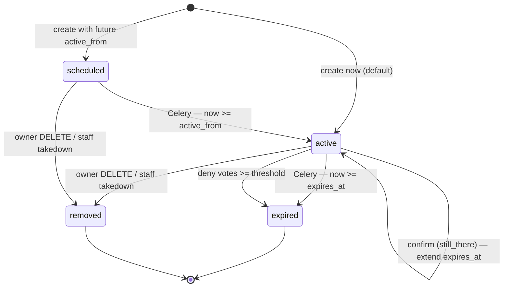
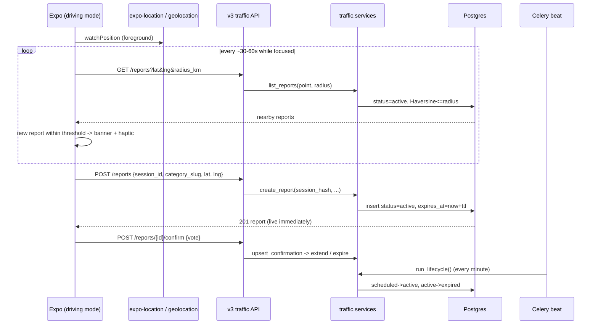

# feat: Traffic module (crowdsourced live alerts + driving-mode map + scheduled radars)

## Summary

Ship the **Traffic** slice of Phase 4: a Waze-style crowdsourced alert layer for São Miguel that replaces the ad-hoc Facebook group locals currently use. Drivers see **active traffic events near them on a live map**, and can **report a new event in one tap** — floating button → pick a category (acidente, inundação, radar, desvio, obras…) → instant publish, details optional. Reports are **public immediately** (no moderation queue), with trust enforced by per-session write throttling, **confirm/deny voting**, and **automatic expiry** (Celery). A driving-focused mode surfaces an **in-app proximity alert** when a fresh report appears nearby. **Scheduled reports** support pre-announced speed traps: a radar can be created with an `active_from` time and flips live automatically.

It is the second UGC module after Marketplace, so it **reuses the session-ownership + `@api_view` + `services.py` + write-throttle conventions** Marketplace established — but deliberately **drops the pending-moderation lifecycle** in favor of an instant-publish + voting + expiry trust model appropriate for ephemeral safety alerts.

## Problem Frame

São Miguel drivers already crowdsource traffic, radar, and hazard alerts — through a **Facebook group**. That surface is slow (no map, no location, no proximity relevance), unstructured (free-text posts), and stale (nothing expires). The app already ships transit, news, seismic, trails, and marketplace; `traffic` exists only as a feature key in `tenancy/bootstrap.py` `MODULE_KEYS` and `analytics.MODULE_TRAFFIC` — there is **no Django app, no API, no Expo UI**.

The new module must beat Facebook on the three things that matter while driving: **speed of reporting** (one tap, optional details), **spatial relevance** (map + proximity), and **freshness** (auto-expiry + confirmations). Unlike Marketplace, a pre-publish moderation queue is a non-starter — an "accident ahead" alert held for staff review is useless. The plan must introduce an **instant-publish trust model** that Events does *not* need but that the SDD already anticipates for traffic (SDD/11 §4: "Stale/false alerts → Auto-expiry + confirmation-based confidence").

---

## Requirements

| ID | Requirement |
|----|-------------|
| R1 | `traffic` Django app exists with `TrafficCategory`, `TrafficReport`, `TrafficConfirmation` models (tenant-scoped), registered via settings toggle, with admin + migrations. |
| R2 | `GET /api/v3/traffic/categories` returns the island's report categories (name, slug, icon, `defaultTtlMinutes`, `isSchedulable`), ordered for quick-pick. |
| R3 | `GET /api/v3/traffic/reports` lists **active** reports for the request island; supports spatial filtering by `lat`/`lng`+`radius_km` **or** `bbox`, plus `category`, `include_scheduled`, `limit`; ordered nearest-first when a point is supplied, else most-recent. |
| R4 | `GET /api/v3/traffic/reports/{id}` retrieves one report with category, location, confidence (confirm/deny counts), lifecycle status, and scheduling window. Returns `removed` reports as 404 to non-staff. |
| R5 | `POST /api/v3/traffic/reports` creates a report owned by the submitting `session_id` (`created_by_session_hash`). **Category + latitude + longitude are required; everything else is optional.** No `active_from` → status `active`, `expires_at = now + category.default_ttl`. With a future `active_from` → status `scheduled`. |
| R6 | `PATCH /api/v3/traffic/reports/{id}` and `DELETE` (soft-delete → `removed`) are restricted to the owning session or staff. |
| R7 | `POST /api/v3/traffic/reports/{id}/confirm` records a `still_there` or `gone` vote, one per `(report, session)` (upsert). `still_there` extends `expires_at` and raises confidence; enough `gone` votes expire the report immediately. |
| R8 | Reports **auto-expire** via a Celery beat task: `scheduled → active` when `now ≥ active_from`; `active → expired` when `now ≥ expires_at`. Idempotent and re-runnable. |
| R9 | Write endpoints (create/update/delete/confirm) are throttled per `(island, session)`. Location is validated as plausible (within `Island` center + `radius_km`). |
| R10 | São Miguel `feature_flags.traffic` enabled via data migration; bootstrap `enabledModules` includes `traffic` when the flag is true. |
| R11 | Expo `traffic` tab visible when bootstrap includes `traffic`: live map of nearby active reports (markers by category), a **floating quick-report button** opening a one-tap category picker, report detail with confirm/deny, a **Scheduled** section, and an optional create-with-details path. |
| R12 | **Driving mode / proximity alert**: while the traffic screen is focused, the app watches device location (native `expo-location`, web `navigator.geolocation`), polls nearby active reports, and surfaces a **prominent in-app alert** (banner + haptic) when a new report appears within a proximity threshold. **No push notifications** (explicitly out of scope). |
| R13 | Analytics: `module=traffic` events — `report` (`{category, scheduled}`), `confirm` (`{report_id, vote}`), `view` (`{surface}`), `search`/`nearby` (`{results_count, radius_km}`), consent-gated. |
| R14 | TDD: failing `test_services.py` (create/lifecycle/voting/expiry/geo) + `test_api_v3.py` (verbs, ownership 403, tenant isolation 404, throttle, schedule, confirm upsert) first; ≥80% coverage on `traffic/services.py`. |

---

## Key Technical Decisions

| ID | Decision | Rationale |
|----|----------|-----------|
| KTD1 | **No pre-publish moderation.** `TrafficReport.status` is a lifecycle field (`active`/`scheduled`/`expired`/`removed`), **not** the Marketplace `pending→published` queue. Reports go public on create. | Real-time safety alerts are useless if held for review. SDD/11 §4 prescribes "auto-expiry + confirmation-based confidence" for traffic, not a moderation gate. Abuse is handled by throttle + voting + expiry + admin `removed` takedown. This is the deliberate divergence from the Marketplace `ModeratedModel`. |
| KTD2 | **Do not reuse `ModeratedModel`.** Define traffic's lifecycle on the model directly; keep `created_by_session_hash` + `is_owned_by()` ownership helper (copied shape, not the moderation mixin). | The mixin's `pending` default and `PUBLISHED`/`REJECTED` semantics fight KTD1. Sharing it would force awkward overrides. The ownership half is tiny to restate. Revisit a shared `common/` ownership base only after a third consumer (per Marketplace plan's deferred note). |
| KTD3 | **Ownership is pseudonymous `created_by_session_hash`** via `consent.hash_session_id(session_id, island.key)` — same as Marketplace/seismic. No accounts, no partner keys. | The app has no auth; one-tap reporting while driving must not require login. Matches felt-report/marketplace trust level. Partner write API stays a Phase 4 follow-up. |
| KTD4 | **Categories are a seeded per-island `TrafficCategory` model** (name, slug, icon, `default_ttl_minutes`, `is_schedulable`, `order`) — admin-managed, **not** user-suggested. | Quick-pick reporting needs a small, fixed, icon'd, localized set; islands may differ; TTL-per-category drives expiry; `is_schedulable` gates the radar scheduling UI. User-suggested categories (Marketplace) would bloat the quick-pick and harm trust. |
| KTD5 | **Scheduling via `active_from` (+ optional `active_until`).** Future `active_from` → `scheduled`; Celery flips to `active`; `expires_at` = `active_until` or `active_from + category.default_ttl`. | Police pre-announce radars; locals want them on the map ahead of time. A single nullable window on the report (vs a separate schedule model) is the smallest thing that works. |
| KTD6 | **Trust = confirm/deny voting + expiry, not reputation scoring (v1).** One vote per `(report, session)`; `still_there` extends `expires_at`; `gone` votes past a threshold expire immediately. Store `confirm_count`/`deny_count` denormalized. | Confidence + freshness without a reputation system. Mirrors the seismic felt-upsert one-per-session rule. Reputation weighting (SDD/11) deferred. |
| KTD7 | **Proximity is naive Haversine over `latitude`/`longitude` floats; spatial query supports both `radius_km` (point) and `bbox` (map viewport).** No PostGIS. | Matches Marketplace/transit (no PostGIS); per-island report counts are small; `bbox` serves the map, `radius_km` serves driving-mode polling. |
| KTD8 | **In-app foreground proximity alerts only; no push.** Native uses `expo-location` `watchPositionAsync` while the screen is focused; web uses `navigator.geolocation`. A new nearby active report triggers a banner + haptic. | User explicitly deferred push. Foreground-only avoids background-location entitlements, battery/privacy review, and Expo Notifications infra — all Phase 5+ concerns. `expo-location` is the one new dependency. |
| KTD9 | **Expo route folder `app/(tabs)/traffic/`** with the quick-report flow as an **in-screen sheet** (not a modal route) so reporting never leaves the map; a details route exists for the optional richer form. Module/analytics key stays `traffic`. | One-tap-while-driving demands the report control live on the map surface. Mirrors `FeltReportSheet`'s in-place sheet rather than Marketplace's modal create route. |

---

## High-Level Technical Design

### Report lifecycle



### Report → alert flow



---

## Output Structure

```
SaoMiguelBus-api/src/traffic/
├── __init__.py
├── apps.py
├── models.py                # TrafficCategory, TrafficReport, TrafficConfirmation
├── admin.py
├── services.py              # CRUD, geo, voting, lifecycle, serializers
├── serializers.py           # request validation (writes)
├── throttling.py            # TrafficWriteThrottle
├── api_v3.py                # @api_view function views
├── urls_v3.py
├── tasks.py                 # Celery lifecycle task
├── management/commands/
│   └── seed_traffic_demo.py # demo reports for staging
├── migrations/
│   ├── 0001_initial.py
│   └── 0002_seed_default_categories.py
└── tests/
    ├── __init__.py
    ├── test_models.py
    ├── test_services.py
    └── test_api_v3.py

SaoMiguelBus/
├── features/traffic/
│   ├── hooks/useTrafficQueries.ts
│   ├── components/
│   │   ├── TrafficMap.tsx
│   │   ├── QuickReportButton.tsx
│   │   ├── CategoryPickerSheet.tsx
│   │   ├── ReportCard.tsx
│   │   ├── ProximityAlert.tsx
│   │   └── ScheduledList.tsx
│   ├── hooks/useNearbyLocation.ts
│   └── types.ts
├── app/(tabs)/traffic/
│   ├── _layout.tsx
│   ├── index.tsx            # live map + quick-report + proximity alert
│   ├── [id].tsx             # report detail + confirm/deny
│   └── new.tsx              # optional details form (route)
```

---

## Scope Boundaries

**In scope:** `traffic` app + 3 models + admin; seeded categories; instant-publish reports with required category+location and optional details; scheduled (radar) reports with `active_from`/`active_until`; spatial list (`radius_km` + `bbox`); confirm/deny voting with expiry effects; Celery lifecycle task; per-session write throttle + location plausibility; tenancy flag + bootstrap gating; Expo traffic tab — live map, floating quick-report sheet, report detail, scheduled list, **in-app foreground proximity alert** (`expo-location`); traffic analytics; OpenAPI/guide doc; staging smoke + demo seed.

**Out of scope (this plan):**
- **Push notifications / background location** (Expo Notifications, background geofencing) — explicitly deferred by the user. Proximity alerts are foreground-only.
- **Reputation weighting / per-user trust scores** — v1 trust is voting + expiry only.
- **`PartnerApiKey`** / third-party write access (shared Phase 4 follow-up).
- **User accounts / login** for ownership (session-based).
- **Turn-by-turn navigation / routing** — this is an alert layer over a map, not a nav engine.
- **Pay-to-Promote / monetization** of traffic (Phase 5).
- **Photo uploads** on reports.

### Deferred to Follow-Up Work

- Push proximity alerts via Expo Notifications + a background-location consent flow (Phase 5 premium "real-time GPS alerts", SDD/09 §1 note).
- Reputation weighting and a content-flag/report-abuse flow beyond admin `removed`.
- Extract shared session-ownership helper into `common/` once a third UGC consumer (Events) lands.
- Heading/route-aware alerting (only alert for reports *ahead* on the driver's bearing) — v1 uses radius only.

---

## Implementation Units

### U1. `traffic` app: models, admin, toggle, category seed

**Goal:** Tenant-scoped data layer for reports, categories, and confirmations + the seeded quick-pick categories.

**Requirements:** R1, R5 (fields), R6 (ownership fields), R7 (vote storage), R8 (lifecycle fields), R10 (toggle).

**Dependencies:** None.

**Files:**
- `SaoMiguelBus-api/src/traffic/__init__.py` (create)
- `SaoMiguelBus-api/src/traffic/apps.py` (create)
- `SaoMiguelBus-api/src/traffic/models.py` (create)
- `SaoMiguelBus-api/src/traffic/admin.py` (create)
- `SaoMiguelBus-api/src/traffic/migrations/__init__.py` (create)
- `SaoMiguelBus-api/src/traffic/migrations/0001_initial.py` (create)
- `SaoMiguelBus-api/src/traffic/migrations/0002_seed_default_categories.py` (create)
- `SaoMiguelBus-api/src/src/settings.py` (modify — add `('traffic', True)` to `apps`)
- `SaoMiguelBus-api/src/traffic/tests/__init__.py` (create)
- `SaoMiguelBus-api/src/traffic/tests/test_models.py` (create)

**Approach:**
- `TrafficCategory(TenantScopedModel)`: `name`, `slug`, `icon` (str), `default_ttl_minutes` (PositiveInt, default 120), `is_schedulable` (bool default False), `order` (int). `unique_together (island, slug)`, `ordering = ['order', 'name']`.
- `TrafficReport(TenantScopedModel)`: lifecycle constants `ACTIVE/SCHEDULED/EXPIRED/REMOVED` + `status` CharField (default `ACTIVE`, indexed); `category` FK (PROTECT); `created_by_session_hash` (indexed); `latitude`/`longitude` (required floats); `description` (TextField blank); `road` (CharField blank — optional free text); `active_from` (nullable DateTime), `active_until` (nullable), `expires_at` (DateTime, indexed); `confirm_count`/`deny_count` (PositiveInt default 0); `created_at`/`updated_at`. `is_owned_by(session_hash)` helper. Index `(island, status, expires_at)`.
- `TrafficConfirmation(TenantScopedModel)`: `report` FK (related_name `confirmations`), `session_hash` (indexed), `vote` CharField choices `STILL_THERE/GONE`. `unique_together (report, session_hash)`.
- Seed migration: insert São Miguel categories with icons + TTLs (see seed list below) using a data migration that resolves the `sao-miguel` island (mirror `marketplace/migrations/0002_seed_default_categories.py`). Idempotent (`get_or_create` by `(island, slug)`).
- `admin.py`: register all three; report admin lists `status`, `category`, `expires_at`, `confirm_count`, `deny_count`, filter by `status`/`category`, action to mark `removed`.

**Seed categories (São Miguel):** acidente (accident, 120m), inundacao (flood, 240m), radar (speed trap, 90m, **schedulable**), desvio (detour, 480m), obras (roadworks, 1440m), transito (heavy traffic, 60m), perigo (hazard on road, 90m), policia (police check, 90m), tempo (weather hazard, 180m).

**Patterns to follow:** `src/marketplace/models.py` (`TenantScopedModel` + ownership helper, `unique_together` with island), `src/marketplace/migrations/0002_seed_default_categories.py` (island-resolving data migration), `src/seismic/models.py` (geo float fields).

**Test scenarios:**
- Happy: create report with island+category → defaults `status=active`, `confirm_count=0`.
- Happy: `is_owned_by(hash)` true for creating session, false for another.
- Edge: two categories same `(island, slug)` → IntegrityError; two confirmations same `(report, session_hash)` → IntegrityError.
- Edge: `latitude`/`longitude` required (model field non-null asserted).
- `Covers AE: report is public immediately` — a freshly created report has `status=active` (no pending state exists).

**Verification:** `makemigrations traffic` produces initial + (manually authored) seed migration; `migrate` clean; admin shows three models; seeded categories present for São Miguel.

---

### U2. `services.py`: CRUD, geo list, voting, lifecycle, serializers

**Goal:** All business logic + dict serialization, test-first.

**Requirements:** R2, R3, R4, R5, R6, R7, R8 (transition helpers), R9 (plausibility), R14.

**Dependencies:** U1.

**Execution note:** Implement the lifecycle + voting effects test-first — the expiry/confirm math is the core correctness surface.

**Files:**
- `SaoMiguelBus-api/src/traffic/services.py` (create)
- `SaoMiguelBus-api/src/traffic/tests/test_services.py` (create)

**Approach:**
- `list_categories()`, `serialize_category`.
- `list_reports(*, lat=None, lng=None, radius_km=None, bbox=None, category=None, include_scheduled=False, limit=100)`: base filter `status=active` (plus `scheduled` when `include_scheduled`); `category` → `category__slug`; if `bbox` (minLng,minLat,maxLng,maxLat) → bound lat/lng range in SQL; if `lat/lng/radius_km` → fetch candidates (bbox prefilter from radius) then Haversine filter+sort nearest-first; else order `-created_at`. Cap `limit` at 200.
- `get_report(report_id, *, is_staff=False)`: return unless `removed` (404 for non-staff).
- `create_report(*, island, session_hash, category_slug, latitude, longitude, description='', road='', active_from=None, active_until=None)`: resolve category; **plausibility check** (within `island` center + `radius_km` via Haversine, else `LocationImplausible`); if `active_from` in future → `status=scheduled`, `expires_at = active_until or active_from + ttl`; else `status=active`, `expires_at = active_until or now + ttl`. `is_schedulable=False` category + `active_from` → `SchedulingNotAllowed`.
- `update_report(report_id, *, session_hash, is_staff, data)` owner-or-staff; `soft_delete_report(...)` → `status=removed`.
- `upsert_confirmation(*, report_id, session_hash, vote)`: `update_or_create` on `(report, session_hash)`; recompute `confirm_count`/`deny_count`; `still_there` → extend `expires_at` (e.g. `+ ttl/2`, capped); if `deny_count >= DENY_THRESHOLD` → set `status=expired`. Return `(serialized, created)`.
- `run_lifecycle(*, now=None)`: `scheduled→active` where `active_from<=now`; `active→expired` where `expires_at<=now`. Bulk updates; returns counts. Island-agnostic (operates across islands for the beat task) — uses unscoped manager via `for_island` per island OR a global sweep; see U4.
- `serialize_report(report)` — hand-built dict (id, category {slug,name,icon}, latitude, longitude, description, road, status, confidence {confirm,deny}, activeFrom, activeUntil, expiresAt, createdAt).
- Error classes: `TrafficError`, `OwnershipError`, `CategoryNotFound`, `LocationImplausible`, `SchedulingNotAllowed`.

**Patterns to follow:** `src/marketplace/services.py` (`_haversine_km`, serialize dicts, ownership errors, `update_or_create` upsert in `upsert_review`), `src/seismic/services.py` (geo report shape).

**Test scenarios:**
- Happy: `create_report` (no schedule) → `active`, `expires_at ≈ now + ttl`, appears in `list_reports`.
- Happy: `create_report` with future `active_from` on a schedulable category → `scheduled`, excluded from default list, included when `include_scheduled=True`.
- Happy: `upsert_confirmation(still_there)` → `confirm_count=1`, `expires_at` extended; second vote same session updates, not duplicates.
- Happy: `deny` votes reaching threshold → `status=expired`, dropped from list.
- Lifecycle: `run_lifecycle` flips a past-`active_from` scheduled report to `active`, and a past-`expires_at` active report to `expired`.
- Geo: `list_reports` with `radius_km` returns only in-radius reports nearest-first; with `bbox` returns only in-box reports.
- Ownership: `update_report`/`soft_delete_report` by non-owner non-staff → `OwnershipError`; by staff → allowed.
- Plausibility: `create_report` with coords outside `island.radius_km` → `LocationImplausible`.
- Edge: `active_from` on a non-schedulable category → `SchedulingNotAllowed`; unknown `category_slug` → `CategoryNotFound`.

**Verification:** `pytest traffic/tests/test_services.py`; `coverage report` ≥80% on `services.py`.

---

### U3. v3 API: serializers, endpoints, URLs, throttle, tenancy flag

**Goal:** Expose reports/categories/confirm under `/api/v3/traffic/` and enable the island flag.

**Requirements:** R2, R3, R4, R5, R6, R7, R9, R10.

**Dependencies:** U2.

**Files:**
- `SaoMiguelBus-api/src/traffic/serializers.py` (create)
- `SaoMiguelBus-api/src/traffic/throttling.py` (create)
- `SaoMiguelBus-api/src/traffic/api_v3.py` (create)
- `SaoMiguelBus-api/src/traffic/urls_v3.py` (create)
- `SaoMiguelBus-api/src/src/urls.py` (modify — `path('api/v3/traffic/', include('traffic.urls_v3'))`)
- `SaoMiguelBus-api/src/src/settings.py` (modify — add throttle scope `traffic_write`)
- `SaoMiguelBus-api/src/tenancy/migrations/0009_enable_traffic_feature_flag.py` (create — next number after `0008_enable_marketplace_feature_flag`)
- `SaoMiguelBus-api/src/traffic/tests/test_api_v3.py` (create)

**Approach:**
- Request serializers (`serializers.Serializer`, marketplace-style): `ReportWriteSerializer` (session_id, category_slug, latitude, longitude, description?, road?, active_from?, active_until?), `ConfirmSerializer` (session_id, vote in `still_there/gone`).
- Endpoints (all `@api_view`, `_require_island`, `with for_island(request.island):`), copying `marketplace/api_v3.py` helpers (`_require_island`, `_error`, `_session_id`, `_is_staff`, `_hash_or_empty`, `_float_or_none`):
  - `GET categories`
  - `GET/POST reports` — GET parses `lat`/`lng`/`radius_km`/`bbox`/`category`/`include_scheduled`/`limit`; POST validates, requires `session_id`+`category_slug`+`latitude`+`longitude`, computes `session_hash`, calls `create_report`.
  - `GET/PATCH/DELETE reports/<int:rid>` — owner-or-staff via service.
  - `POST reports/<int:rid>/confirm` — vote upsert.
- `TrafficWriteThrottle(SimpleRateThrottle)` scope `traffic_write`, key `{island_key}:{session_id|ip}` (copy `marketplace/throttling.py`); applied to POST/PATCH/DELETE/confirm. Add `'traffic_write': '30/min'` to `DEFAULT_THROTTLE_RATES` (higher than marketplace — reporting while driving is bursty).
- Error envelope consistent with marketplace: `session_required`, `validation_error`, `invalid_category`, `location_implausible` (422), `scheduling_not_allowed` (400), `not_owner` (403), `not_found` (404).
- Tenancy migration sets `feature_flags['traffic'] = True` for `sao-miguel` (copy `tenancy/migrations/0008_enable_marketplace_feature_flag.py`).

**Patterns to follow:** `src/marketplace/api_v3.py` + `urls_v3.py` + `throttling.py` + `serializers.py`, `src/tenancy/migrations/0008_enable_marketplace_feature_flag.py`.

**Test scenarios:**
- Happy: `POST reports` with session+category+coords → 201, `status=active`, immediately in `GET reports`.
- Happy: `GET reports?lat&lng&radius_km` returns nearby active reports nearest-first; `?bbox=` returns in-viewport reports.
- Happy: `POST reports/{id}/confirm {vote:still_there}` → 200/201, confidence updated; second same-session vote upserts.
- Happy: scheduled radar (`active_from` future) hidden by default, shown with `include_scheduled=true`.
- Ownership: `PATCH`/`DELETE` with a different `session_id` → 403 `not_owner`; owner → success.
- Tenant isolation: report created under island A not retrievable under `X-Island: B` → 404.
- Validation: missing `session_id` → 400 `session_required`; missing category/coords → 400; coords outside radius → 422 `location_implausible`; `active_from` on non-schedulable category → 400.
- Throttle: rapid writes past `30/min` from one session → 429.

**Verification:** `pytest traffic/tests/test_api_v3.py`; curl staging with `X-Island: sao-miguel`; `GET /api/v3/bootstrap` lists `traffic` after migration.

---

### U4. Celery lifecycle task (activation + expiry)

**Goal:** Reports flip `scheduled→active` and `active→expired` on schedule without a request.

**Requirements:** R8.

**Dependencies:** U2.

**Files:**
- `SaoMiguelBus-api/src/traffic/tasks.py` (create)
- `SaoMiguelBus-api/src/src/settings.py` (modify — add beat schedule entry `traffic.run_lifecycle` every 60s)
- `SaoMiguelBus-api/src/traffic/tests/test_services.py` (extend — task-invoked lifecycle, or a dedicated `test_tasks.py`)

**Approach:**
- `@shared_task(name='traffic.run_lifecycle')` calls `services.run_lifecycle()` and logs counts (mirror `seismic/tasks.py` shape). `run_lifecycle` operates across all islands (global sweep on `status` + time columns — these transitions are tenant-agnostic and time-driven; document that this is an intentional cross-tenant sweep, consistent with SDD/11 §3 "Cross-tenant access only via explicit admin/Celery").
- Register a Celery beat schedule entry (find existing beat config near seismic's sync schedule in `settings.py`; follow that exact structure).

**Patterns to follow:** `src/seismic/tasks.py` (task shape + logging), existing `CELERY_BEAT_SCHEDULE` entries in `src/src/settings.py`.

**Test scenarios:**
- Happy: a scheduled report with past `active_from` becomes `active` after `run_lifecycle`.
- Happy: an active report with past `expires_at` becomes `expired`.
- Edge: idempotent — running twice produces no further changes and no errors.
- Edge: reports not yet due are untouched.

**Verification:** `pytest`; manual `run_lifecycle()` in shell flips seeded rows; beat entry present.

---

### U5. Bootstrap gating check

**Goal:** Clients discover traffic exactly like marketplace/seismic.

**Requirements:** R10.

**Dependencies:** U3 (flag migration).

**Files:**
- `SaoMiguelBus-api/src/tenancy/bootstrap.py` (verify — `traffic` already in `MODULE_KEYS`)
- `SaoMiguelBus-api/src/tenancy/tests/test_bootstrap.py` (extend)

**Approach:** Confirm `enabledModules` includes `'traffic'` when `feature_flags['traffic']` is true; add a test asserting present/absent by flag.

**Test scenarios:**
- Happy: island with traffic flag → bootstrap `enabledModules` contains `traffic`.
- Edge: flag false → omitted.

**Verification:** Staging `GET /api/v3/bootstrap` shows `traffic` post-deploy.

---

### U6. Expo traffic data layer: api, types, hooks

**Goal:** Typed client functions + TanStack Query hooks for categories, nearby reports, create, confirm.

**Requirements:** R11 (data), R13 (client-side tracking).

**Dependencies:** U3.

**Files:**
- `SaoMiguelBus/lib/api.ts` (modify — add traffic fns)
- `SaoMiguelBus/lib/types.ts` (modify — `TrafficCategory`, `TrafficReport`, `TrafficReportWriteInput`, `ConfirmVote`)
- `SaoMiguelBus/features/traffic/types.ts` (create — map/UI-local types if needed)
- `SaoMiguelBus/features/traffic/hooks/useTrafficQueries.ts` (create)

**Approach:**
- `lib/api.ts`: `fetchTrafficCategories()`, `fetchTrafficReports(params)` (lat/lng/radius_km or bbox, category, include_scheduled), `fetchTrafficReport(id)`, `createTrafficReport(body)`, `confirmTrafficReport(id, vote)` — writes attach `session_id` via `getOrCreateSessionId()` + `X-Session-Id` header (copy marketplace write fns).
- Hooks (TanStack v5): keys `['traffic','v1','categories']`, `['traffic','v1','reports', params]`, `['traffic','v1','report', id]`; nearby list uses a **short `staleTime` + `refetchInterval`** (e.g. 30–60s) when driving mode is active; `useMutation` for create/confirm with `invalidateQueries`. Fire `track('traffic','report'|'confirm'|'nearby', …)` in the relevant query/mutation fns.

**Patterns to follow:** `features/marketplace/hooks/useMarketplaceQueries.ts`, marketplace write fns in `lib/api.ts`, `lib/session.ts` (`getOrCreateSessionId`), `lib/analytics.ts` (`track`).

**Test scenarios:** `Test expectation: none` for pure data wiring — behavior is exercised via U7 screens against staging. (If a query-fn test harness exists, add: nearby query fires `track('traffic','nearby',…)` with `results_count`.)

**Verification:** `npx tsc --noEmit` clean for traffic; Metro logs `GET /api/v3/traffic/reports` with params.

---

### U7. Expo traffic tab: live map, quick-report, detail, scheduled, proximity alert

**Goal:** The end-user driving surface — see nearby reports, report in one tap, confirm/deny, see scheduled radars, get a foreground proximity alert.

**Requirements:** R11, R12, R13.

**Dependencies:** U6.

**Files:**
- `SaoMiguelBus/app/(tabs)/traffic/_layout.tsx` (create — stack, green header via `useAppStackScreenOptions`, settings button)
- `SaoMiguelBus/app/(tabs)/traffic/index.tsx` (create — `Screen withStackHeader`, map + quick-report + proximity alert)
- `SaoMiguelBus/app/(tabs)/traffic/[id].tsx` (create — report detail + confirm/deny)
- `SaoMiguelBus/app/(tabs)/traffic/new.tsx` (create — optional details form route)
- `SaoMiguelBus/features/traffic/components/TrafficMap.tsx` (create)
- `SaoMiguelBus/features/traffic/components/QuickReportButton.tsx` (create — floating action button)
- `SaoMiguelBus/features/traffic/components/CategoryPickerSheet.tsx` (create — one-tap category grid)
- `SaoMiguelBus/features/traffic/components/ReportCard.tsx` (create)
- `SaoMiguelBus/features/traffic/components/ProximityAlert.tsx` (create — banner + haptic)
- `SaoMiguelBus/features/traffic/components/ScheduledList.tsx` (create)
- `SaoMiguelBus/features/traffic/hooks/useNearbyLocation.ts` (create — expo-location/web geolocation watcher)
- `SaoMiguelBus/app/(tabs)/_layout.tsx` (modify — `showTraffic` tab gate)
- `SaoMiguelBus/package.json` (modify — add `expo-location`)

**Approach:**
- **Location hook** `useNearbyLocation`: native → `expo-location` `requestForegroundPermissionsAsync` + `watchPositionAsync` (only while screen focused, via `useFocusEffect`); web → `navigator.geolocation.watchPosition`; returns `{coords, permission}`; degrades gracefully to island center (`bootstrap.island.mapCenter`) when denied.
- **Map** `TrafficMap`: `react-native-maps` `MapView` on native (OSM `UrlTile` on Android like `TrailMap`), markers per active report colored/iconed by category; web falls back to a **list view** (no `MapView` on web — same split as `TrailMap`). Tapping a marker → report detail.
- **Quick report**: `QuickReportButton` (floating FAB, bottom-right) → `CategoryPickerSheet` (icon grid of categories, big tap targets). Tapping a category **immediately** `createTrafficReport({category_slug, lat, lng})` at current location and closes — no further input required (mirrors `FeltReportSheet`'s tap-to-submit). A small "add details" affordance routes to `new.tsx` for description/road/scheduling.
- **Scheduling**: `new.tsx` shows `active_from`/`active_until` pickers **only** when the chosen category `isSchedulable` (radar).
- **Detail** `[id].tsx`: report info + confirm/deny buttons (`still_there` / `gone`) → `confirmTrafficReport`; shows confidence + expiry countdown.
- **Proximity alert** `ProximityAlert`: subscribe to the nearby-reports query; when a *new* report id appears within `PROXIMITY_THRESHOLD_KM` (e.g. 2 km), render a prominent banner + `Haptics`/sound; dedupe so each report alerts once. Foreground only.
- **Scheduled section**: `ScheduledList` from `fetchTrafficReports({include_scheduled:true})` filtered to `status=scheduled`.
- **Tab gate**: `const showTraffic = modules.includes('traffic'); href: showTraffic ? '/traffic' : null` (copy marketplace gate; reuse the shared `Screen`/`useAppStackScreenOptions` header pattern shipped with marketplace).

**Patterns to follow:** `features/trails/components/TrailMap.tsx` (react-native-maps web/native split, OSM tiles), `features/earthquakes/components/FeltReportSheet.tsx` (tap-to-submit sheet), `app/(tabs)/marketplace/{_layout,index,[id],new}.tsx` (stack + screen + modal), `app/(tabs)/_layout.tsx` (tab gating), `components/Screen.tsx` + `lib/navigation.ts` (header pattern).

**Test scenarios:**
- Happy: bootstrap with `traffic` → tab visible; map renders nearby active reports.
- Happy: tap FAB → category → report POSTed at current location, marker appears, `track('traffic','report',{category})`.
- Happy: confirm/deny on detail → POST observed, confidence refreshes.
- Happy: scheduled radar appears in Scheduled list, not on the default active map.
- Proximity: a new report within threshold while focused → banner + haptic fires once (no duplicate).
- Edge: location permission denied → falls back to island center, no crash; FAB report uses last-known/center coords with a notice.
- Edge: web → list fallback instead of `MapView`, no crash.
- Edge: bootstrap without `traffic` → tab hidden (`href:null`).

**Verification:** Expo native (Android/iOS) + web against staging; report→marker→confirm→expiry flows work; proximity banner triggers; `tsc --noEmit` clean.

---

### U8. i18n keys (5 locales)

**Goal:** All traffic copy + category labels localized.

**Requirements:** R11 (UI copy).

**Dependencies:** U7 (key names settle during UI build).

**Files:**
- `SaoMiguelBus/locales/pt.json` (modify — source)
- `SaoMiguelBus/locales/en.json` (modify)
- `SaoMiguelBus/locales/de.json` (modify)
- `SaoMiguelBus/locales/es.json` (modify)
- `SaoMiguelBus/locales/fr.json` (modify)

**Approach:** Add `navBarTrafficLabel`, `traffic*` keys (titles, quick-report, category labels by slug, confirm/deny, scheduled, proximity-alert text, permission prompts, empty states). PT is the source; translate the other four. Category display can prefer the API `name` but keep i18n fallbacks keyed by slug.

**Patterns to follow:** existing `marketplace*` / `navBarMarketplaceLabel` keys across the five locale files.

**Test scenarios:** `Test expectation: none` (static copy). Verify no missing-key warnings in Metro for the traffic screens.

**Verification:** Switch locale in-app; all traffic strings resolve; no `i18next::translator` missing-key logs.

---

### U9. Analytics, docs, demo seed, deploy + smoke

**Goal:** Phase 4 exit hygiene — instrument usage, document endpoints (same-PR rule), seed staging, verify end-to-end.

**Requirements:** R13 (server validation), R14 (docs), all R* (smoke).

**Dependencies:** U3, U7.

**Files:**
- `SaoMiguelBus-api/src/documentation/docs/3_apps/traffic.md` (create — endpoints, filters, lifecycle, voting, throttle, scheduling)
- `SaoMiguelBus-api/src/traffic/management/__init__.py` + `commands/__init__.py` + `commands/seed_traffic_demo.py` (create — demo active + scheduled reports around São Miguel; flags `--clear`, `--count`, `--island`)
- `SaoMiguelBus/lib/analytics.ts` (verify — generic `track` already supports module/event_type; no change likely)

**Approach:**
- Confirm `analytics.MODULE_TRAFFIC` already exists (it does) — no model change. Verify ingestion accepts the traffic events.
- Guide page: endpoint table, spatial params (`radius_km` vs `bbox`), lifecycle diagram, voting/expiry semantics, throttle limits, scheduling rules, session-ownership note.
- `seed_traffic_demo`: create a spread of active reports (varied categories) + a couple scheduled radars around São Miguel coords so the map/tab isn't empty on staging (mirror `marketplace/management/commands/seed_marketplace_demo.py`).
- Smoke: deploy API + migrate; run seed; verify map/list/quick-report/confirm/scheduled/proximity on Expo against staging.

**Test expectation:** none — docs + seed + manual smoke checklist.

**Verification:** Bootstrap includes `traffic`; `GET /api/v3/traffic/reports` returns seeded active rows; scheduled hidden by default; confirm extends expiry; guide page renders; demo seed populates the map.

---

## Risks and Dependencies

| Risk | Mitigation |
|------|------------|
| **No moderation → abuse/false alerts** | Per-`(island, session)` write throttle (`30/min`); confirm/deny voting with deny-threshold auto-expire; short per-category TTLs; admin `removed` takedown; location plausibility (within `Island.radius_km`). Moderation can be added later if abuse appears. |
| **Foreground location while driving = battery/privacy** | Foreground-only `watchPositionAsync` gated on `useFocusEffect` (stops when screen unfocused); balanced accuracy; explicit permission prompt; graceful island-center fallback. No background location (deferred). |
| **`expo-location` is a new dependency** | Single, first-party Expo SDK 56 module; install via Expo to match SDK version (per repo AGENTS.md "read the exact versioned docs"); web path uses `navigator.geolocation` so web needs no native module. |
| **Map on web** | `react-native-maps` has no web `MapView`; reuse `TrailMap`'s pattern — list fallback on web, full map on native. |
| **Proximity alert spam** | Dedupe alerted report ids; single threshold (2 km); one alert per report per session; heading/route-aware filtering deferred. |
| **Cross-tenant Celery sweep** | `run_lifecycle` operates globally on time columns by design; documented as an explicit admin/Celery cross-tenant operation per SDD/11 §3. |
| **Scheduled radars create a "known police location" liability** | Same data locals already share publicly on Facebook; categories/labels are neutral ("radar"); no targeting of individuals; admin can remove. Product/legal call flagged, not a code blocker. |

**Depends on:** existing tenancy middleware + `for_island`, `consent.hash_session_id`, analytics ingestion, Celery + beat (already running for seismic), Expo `getOrCreateSessionId`/`track`, `react-native-maps` (installed), the shared `Screen`/`useAppStackScreenOptions` header (shipped with marketplace). New: `expo-location`.

---

## Open Questions

| Question | Status |
|----------|--------|
| Pre-moderation vs instant publish? | **Decided KTD1:** instant publish; trust via voting + expiry + throttle + admin takedown. |
| Reuse `ModeratedModel`? | **Decided KTD2:** no — restate ownership only; lifecycle differs. |
| Separate schedule model vs window fields? | **Decided KTD5:** `active_from`/`active_until` on the report. |
| Push vs in-app alerts? | **Decided (user):** in-app foreground only; push deferred. |
| `radius_km` polling vs `bbox` only? | **Decided KTD7:** support both — `bbox` for map, `radius_km` for driving-mode polling. |
| Deny threshold value + confirm extension amount? | Deferred to implementation — start `DENY_THRESHOLD=3`, `still_there` extends by `ttl/2` capped at original ttl; tune from staging. |
| Heading/route-aware alerting? | Deferred to follow-up — v1 is radius-only. |

---

## Sources and Research

- `MIGRATION_PLAN.md` Phase 4 — Community & crowdsourced modules
- `SDD/09-modules.md` §6 (Traffic), `SDD/11-security-auth.md` §4 (crowdsourcing trust/abuse), `SDD/03-data-model.md`, `SDD/04-api-design.md` §2.1
- `SaoMiguelBus-api/src/marketplace/` — the UGC `@api_view` + `services.py` + throttle + seed-migration template (built this session)
- `SaoMiguelBus-api/src/seismic/` — geo report + Celery task shape; `src/tenancy/bootstrap.py` (`traffic` in `MODULE_KEYS`); `src/analytics/models.py` (`MODULE_TRAFFIC` present)
- `SaoMiguelBus/features/trails/components/TrailMap.tsx` — `react-native-maps` web/native split; `features/earthquakes/components/FeltReportSheet.tsx` — tap-to-submit sheet; `features/marketplace/` + `lib/{api,session,analytics}.ts`; `app/(tabs)/_layout.tsx` — tab gating; `components/Screen.tsx` + `lib/navigation.ts` — header pattern
- Prior plans: `docs/plans/2026-06-02-002-feat-marketplace-module-plan.md`, `docs/plans/2026-06-02-001-feat-seismic-module-plan.md`
