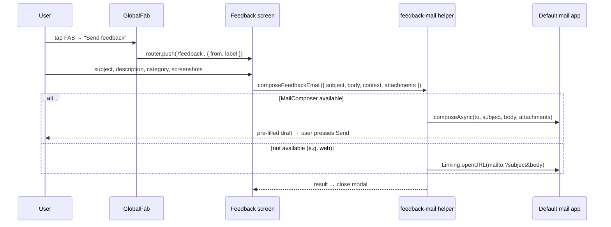

# feat: Smart global floating action button + mail-draft feedback/bug-report

## Summary

Replace the current per-screen, single-action FABs with **one global, context-aware speed-dial FAB** present on every screen of the Expo app. Tapping it expands a small menu whose contents are **smart** — they change based on the current route. Two layers feed the menu:

1. A static **route → actions registry** (`lib/fab-registry.ts`) maps each screen to sensible contextual actions (e.g. transit → "Plan a trip", news → "Suggest a source", trails → "Suggest a trail").
2. A lightweight **runtime store** (`lib/fab-store.ts`) lets a focused screen inject its own stateful action — this is how the existing **traffic** ("Report traffic", which opens a category-picker sheet) and **marketplace** ("Add listing") primary actions move into the speed-dial **without losing their current behavior**, instead of running a second local FAB beside the global one.

Every screen, always, gets a **"Send feedback / report a bug"** action. Choosing it opens a **Feedback form screen** (`app/feedback.tsx`, modal) with: subject, description, a **category** picker (bug / feature / suggestion / feedback), optional **screenshot attachments** (via `expo-image-picker`, new dep), and an optional reply-email field. The form **auto-captures the page the user came from** (route path + human label + app version + platform + locale).

**There is no backend.** On submit, the app builds an email draft and **opens the user's default mail app** (via `expo-mail-composer`, new dep) pre-addressed to **`info@sousadev.com`**, with the subject, a body containing the description + captured context, and the screenshots attached — ready for the user to press send. Where native compose is unavailable (e.g. web), fall back to a `mailto:` link (subject + body only; no attachments).

## Problem Frame

Today the app has a generic `Fab` component (`components/ui/Fab.tsx`) used ad-hoc on exactly two screens — **marketplace** (`app/(tabs)/marketplace/index.tsx`, "Add listing") and **traffic** (`app/(tabs)/traffic/index.tsx` via `QuickReportButton`, "Report traffic"). Most screens have no FAB and there is **no consistent action affordance**. There is also **no in-app way to report bugs or request features** — feedback happens out-of-band, losing the page context that makes a bug actionable.

Two needs combine: (a) a **uniform, always-present action surface** that adapts per screen, and (b) a **frictionless feedback channel** with screenshots and automatic context. The "smart" FAB delivers both — feedback is the one action guaranteed everywhere, and per-screen actions make the FAB earn its permanent real estate. The feedback path is intentionally **zero-infrastructure**: it hands a fully-formed draft to the OS mail client rather than calling a server.

---

## Requirements

| ID | Requirement |
|----|-------------|
| R1 | A single global FAB renders on **every** screen (all tabs, all stack/detail screens, settings, not-found), mounted once near the root rather than per-screen. |
| R2 | The FAB is a **speed-dial**: tapping the primary button expands a labeled action menu; tapping a backdrop or the primary button again collapses it. Collapsed state shows one icon. |
| R3 | Menu contents are **route-aware** — a registry maps the current route to contextual actions, and the visible actions update as the user navigates. |
| R4 | A **"Send feedback / report a bug"** action appears in the menu on **every** screen, always last, regardless of route. |
| R5 | Screens that previously had a local FAB (**marketplace**, **traffic**) keep their primary action **in the speed-dial with identical behavior** (marketplace → push `/(tabs)/marketplace/new`; traffic → open the existing category picker sheet) and no longer render a second standalone FAB. |
| R6 | A screen can register one or more **runtime actions** while focused, which merge with the static registry entries. |
| R7 | A **Feedback form screen** (`app/feedback.tsx`, modal) collects: subject (required), description (required), category (required; bug / feature / suggestion / feedback), 0–N screenshots, and an optional reply email. |
| R8 | The form **auto-captures page context**: originating route path, human-readable screen label, app version, platform (ios/android/web), and active locale. Context is shown read-only so the user knows what is included. |
| R9 | Screenshots are chosen via the OS picker (`expo-image-picker`), shown as removable thumbnails, and capped in count. |
| R10 | On submit, the app **opens the default mail app** (`expo-mail-composer`) with recipient `info@sousadev.com`, a generated subject, a body containing the description + captured context (+ reply email when given), and the screenshots as **attachments**. After the compose sheet returns (sent/cancelled/saved), the feedback screen closes. |
| R11 | When native mail compose is unavailable (web, or `MailComposer.isAvailableAsync()` false), fall back to opening a `mailto:` URL with the same recipient/subject/body (no attachments), via `Linking`. |
| R12 | All new user-facing strings are added to `locales/pt.json` (source of truth) and the other 7 catalogs, keyed identically; locale parity preserved. |
| R13 | No analytics/PII dependency — the feedback path works without analytics consent and attaches only user-typed content + technical context. No network request to SMB servers. |

---

## High-Level Technical Design

### Component shape

```mermaid
flowchart TD
  subgraph Root["app/_layout.tsx (root, once)"]
    Nav["Expo Router Stack/Tabs"]
    GFAB["GlobalFab overlay\n(components/GlobalFab.tsx)"]
  end

  GFAB -->|reads current route| RH["expo-router usePathname"]
  GFAB -->|static actions| REG["lib/fab-registry.ts\nroute → actions"]
  GFAB -->|runtime actions| STORE["lib/fab-store.ts (zustand)"]
  Screens["traffic / marketplace screens"] -->|useFabActions(...)| STORE

  GFAB -->|"Send feedback" action| FORM["app/feedback.tsx (modal)"]
  FORM -->|expo-image-picker| PIX["screenshots (local URIs)"]
  FORM -->|composeFeedbackEmail| MAILER["lib/feedback-mail.ts"]
  MAILER -->|available| MC["expo-mail-composer\n→ default mail app draft"]
  MAILER -->|fallback| ML["Linking.openURL(mailto:)"]
  MC --> TO["info@sousadev.com"]
  ML --> TO
```

### Submission flow



The FAB registry/store split is the load-bearing decision; exact per-route action lists are tunable during implementation.

---

## Key Technical Decisions

- **No backend.** Feedback never touches an SMB server. The form composes a draft and hands it to the OS mail client addressed to `info@sousadev.com`. Eliminates the API endpoint, persistence, Celery email, and multipart upload an earlier draft assumed.
- **`expo-mail-composer` with `mailto:` fallback.** `MailComposer.composeAsync` supports `recipients`, `subject`, `body`, and `attachments` (local file URIs — exactly what `expo-image-picker` returns), and opens the native mail app. Web/unsupported → `Linking.openURL` with a `mailto:` (RFC-6068 encoded subject/body; attachments not supported by `mailto:` so they're omitted with a note to the user).
- **Mount once at root, not per-screen.** `GlobalFab` renders inside `app/_layout.tsx`'s `AppShell` (inside providers, as a sibling overlay above the navigator) so it persists across navigation. It reads the live route via `usePathname()`. Avoids duplicating FAB code and centralizes the smart menu (R1/R3).
- **Registry + runtime store split.** Stateless contextual actions live in declarative `lib/fab-registry.ts` keyed by route; stateful per-screen actions (traffic's picker) are injected via `useFabActions()` backed by a small zustand store (`lib/fab-store.ts`), mirroring `hub-store`/`traffic-store`. This is what lets traffic/marketplace keep exact behavior while centralizing presentation (R5/R6).
- **Two new dependencies.** `expo-image-picker` and `expo-mail-composer`, both at Expo-56-compatible versions. Media permission requested lazily on first attach (matches the lazy-permission pattern in marketplace/traffic location code).
- **Body is plain text with a structured context block.** Description first, then a delimited "— Sent from São Miguel Bus —" footer listing screen, app version, platform, locale, and optional reply email, so triage has context even though there's no server record.

---

## Output Structure

New files (all in `SaoMiguelBus/`):

```
app/feedback.tsx                              # feedback form screen (modal)
components/GlobalFab.tsx                       # speed-dial overlay
components/ui/FabAction.tsx                    # single expanded action row (label + mini-fab)
lib/fab-registry.ts                            # route → static actions
lib/fab-store.ts                               # zustand runtime actions store
lib/feedback-mail.ts                           # build + open mail draft (composer / mailto)
features/feedback/components/ScreenshotPicker.tsx
```

---

## Implementation Units

> Sequencing: FAB data model (U1) and the mail helper (U2) are independent and can start in parallel; the `GlobalFab` overlay (U3) depends on U1; the feedback screen (U4) depends on U2+U3; migrating the existing FABs (U5) depends on U1+U3; i18n/docs/verify (U6) closes it out.

### U1. FAB action model: registry + runtime store

**Goal:** Define the data model that makes the FAB smart.
**Requirements:** R3, R4, R6.
**Dependencies:** none.
**Files:**
- `lib/fab-registry.ts` — `type FabAction = { key: string; labelKey: string; icon: LucideIcon; onPress?: () => void; href?: Href }`; `getStaticActions(pathname): FabAction[]` returning route-appropriate actions (feedback is **not** here — appended by the component so it can't be dropped). Initial map: `transit/index` → "Plan a trip"; `news` → "Suggest a source"; `trails` → "Suggest a trail"; hub/earthquakes/tours → none extra.
- `lib/fab-store.ts` — zustand store: `runtimeActions: FabAction[]`, `setRuntimeActions`, `clearRuntimeActions`; plus `useFabActions(actions, deps)` hook that sets on focus and clears on blur (`useFocusEffect`).
**Approach:** Declarative, icon-driven (lucide), route matched by `pathname` prefix/segment. Mirror existing zustand stores.
**Patterns to follow:** `lib/hub-store.ts`/`lib/traffic-store.ts`, `lib/modules` registry, `useFocusEffect` usage in screens.
**Test scenarios:** Test expectation: none (pure mapping/store; no util-test infra observed) — validated through U3/U5. If tests added: `getStaticActions('/news')` returns the news action; store set/clear toggles list.
**Verification:** Type-checks; quick dev log of `getStaticActions('/news')` shows the expected action.

### U2. Mail-draft helper (`expo-mail-composer` + `mailto` fallback)

**Goal:** One function that opens a pre-filled mail draft to `info@sousadev.com`.
**Requirements:** R10, R11, R13.
**Dependencies:** none.
**Files:**
- `package.json` — add `expo-mail-composer` (Expo 56-compatible).
- `lib/feedback-mail.ts` — `FEEDBACK_RECIPIENT = 'info@sousadev.com'`; `buildSubject(category, subject)`, `buildBody(description, context, replyEmail)`, and `composeFeedbackEmail({ subject, body, attachments })`: if `await MailComposer.isAvailableAsync()` → `MailComposer.composeAsync({ recipients:[FEEDBACK_RECIPIENT], subject, body, attachments })`; else `Linking.openURL('mailto:info@sousadev.com?subject=...&body=...')` (encoded, no attachments). Returns a small result enum (`sent | cancelled | saved | fallback | unavailable`).
**Approach:** Keep recipient + subject/body formatting here so the screen stays presentational. `mailto:` must percent-encode subject/body and watch length limits (truncate body for the fallback if needed).
**Patterns to follow:** `lib/platform.ts` for version/platform; `expo-linking`/`Linking` usage elsewhere in the app.
**Test scenarios:** Test expectation: none (native bridge); manual verification in U4. If a harness exists: `buildBody` includes the context footer and reply email; `mailto:` URL is correctly encoded.
**Verification:** Type-checks; calling `composeFeedbackEmail` on a device opens the mail app with recipient/subject/body populated; web opens a `mailto:` handler.

### U3. `GlobalFab` speed-dial overlay + root mount

**Goal:** The always-present, expandable, route-aware FAB.
**Requirements:** R1, R2, R3, R4.
**Dependencies:** U1.
**Files:**
- `components/ui/FabAction.tsx` — one expanded row: label pill + mini circular button, themed.
- `components/GlobalFab.tsx` — reads `usePathname()`, composes `getStaticActions(pathname)` + `useFabStore` runtime actions + the constant feedback action (always last); open/closed state with a backdrop + simple `Animated`/reanimated expand; feedback action routes to `/feedback` with `{ from: pathname, label }`.
- `app/_layout.tsx` — render `<GlobalFab />` inside `AppShell` as a sibling overlay above the navigator (within providers).
**Approach:** Reuse the `Fab` look for the primary button (`theme.primary`, `elevation(3)`, `radius.full`, bottom-right). Bottom offset must clear the tab bar — apply safe-area bottom inset + tab-bar height (heed the `position:'absolute'` caveat in `(tabs)/_layout.tsx`). Collapse on route change. Respect `accessibilityRole`/labels + `hitSlop.minTouch` like `Fab`.
**Patterns to follow:** `components/ui/Fab.tsx`, `Sheet` backdrop handling, `elevation`/`radius`/`hitSlop` tokens, absolute-positioning in the traffic screen (`scheduledPill`/`ProximityAlert`).
**Test scenarios:** Test expectation: none (RN UI, no component-test infra observed); manual on iOS + Android — FAB visible on hub/transit/news/settings/not-found; expands/collapses; feedback present everywhere; no tab-bar overlap.
**Verification:** App runs; on settings (no registry entry) FAB shows only "Send feedback"; on transit shows "Plan a trip" + feedback.

### U4. Feedback form screen + screenshot picker + page context

**Goal:** Collect feedback and hand a draft to the mail app.
**Requirements:** R7, R8, R9, R10, R11, R12, R13.
**Dependencies:** U2, U3.
**Files:**
- `package.json` — add `expo-image-picker` (Expo 56-compatible).
- `features/feedback/components/ScreenshotPicker.tsx` — pick via expo-image-picker, removable thumbnails, count cap, lazy permission request; exposes selected local URIs.
- `app/feedback.tsx` — modal screen: `Field` subject, `Field` multiline description, category tile/`Chip` chooser (like `CategoryPickerSheet`/`TrafficReportForm`), `ScreenshotPicker`, optional reply-email `Field`, read-only "Included info" card (screen label, app version, platform, locale), submit `Button` (loading/`Banner` error). On submit build context + body and call `composeFeedbackEmail`; then `router.back()`.
- `app/_layout.tsx` — register `<Stack.Screen name="feedback" options={{ presentation: 'modal' }} />`.
- `locales/pt.json` + `en/de/es/fr/it/uk/zh.json` — all new keys.
**Approach:** Build context from `useLocalSearchParams()` (`from`, `label`), `getAppVersion()`/`getAnalyticsPlatform()` (`lib/platform`), `i18n.language`. No analytics-consent dependency (R13). `KeyboardAvoidingView`+`ScrollView` like `TrafficReportForm`. Disable submit until subject+description+category present. If the picker returned attachments but the composer is unavailable (mailto fallback), warn the user that screenshots can't be attached that way.
**Patterns to follow:** `features/traffic/components/TrafficReportForm.tsx`, `Field`/`Button`/`Card`/`Banner`/`Chip`, `lib/platform`, modal registration for `settings`/`onboarding` in `app/_layout.tsx`, i18n add-a-key flow (`lib/i18n.ts` header comment).
**Test scenarios:** Test expectation: none (RN screen); manual — open from FAB on 3+ screens, confirm captured label matches origin; attach/remove screenshots; submit opens the mail app with recipient/subject/body + attachments; required-field gating works; works with analytics consent denied; web falls back to `mailto:`. Run the locale-key parity check — no missing keys.
**Verification:** Locale parity passes; mail draft opens correctly on iOS/Android with attachments; web `mailto:` works.

### U5. Migrate marketplace + traffic FABs into the system

**Goal:** Remove the two standalone FABs; re-express their actions through the global FAB with behavior preserved.
**Requirements:** R5, R6.
**Dependencies:** U1, U3.
**Files:**
- `app/(tabs)/marketplace/index.tsx` — remove the local `<Fab .../>`; add `useFabActions([{ key:'add-listing', labelKey:'marketplaceAddListing', icon: Plus, href:'/(tabs)/marketplace/new' }])`.
- `app/(tabs)/traffic/index.tsx` — remove `<QuickReportButton .../>`; register runtime action `{ key:'report-traffic', labelKey:'trafficReportTitle', icon: Plus, onPress: () => setPickerOpen(true) }` via `useFabActions`, so the existing `CategoryPickerSheet` flow (`quickCreate`, `draftPin`, map pick) is unchanged.
- `features/traffic/components/QuickReportButton.tsx` — delete (grep shows only the traffic screen references it).
**Approach:** Behavior parity is the bar: marketplace still lands on the new-listing screen; traffic still opens the same picker sheet. Only the button presentation moves to the global speed-dial. Marketplace can use the static registry (stateless); traffic must use runtime (needs `setPickerOpen`).
**Patterns to follow:** existing handlers already in those two screens.
**Test scenarios:** Test expectation: none (UI); manual — marketplace FAB shows "Add listing" + "Send feedback" and "Add listing" opens the new-listing screen; traffic FAB shows "Report traffic" + "Send feedback" and "Report traffic" opens the category picker; no duplicate/old FAB remains; draft-pin + map-pick still work.
**Verification:** Each screen shows exactly one (global) FAB with merged actions; old behaviors intact.

### U6. i18n parity, docs, end-to-end verification

**Goal:** Lock translations and record the new shell surface.
**Requirements:** R12 (integration of R1–R13).
**Dependencies:** U3, U4, U5.
**Files:**
- `locales/*.json` — final parity pass across all 8 catalogs (pt authoritative).
- `docs/ui-SDD/02-navigation-shell.md` — note the global FAB overlay is part of the shell + where it mounts.
- (Optional) `docs/ui-SDD/91-global-fab-feedback.md` — registry/store model + feedback form + mail-draft behavior.
**Approach:** Run the app; open the FAB on several screens; submit from a detail screen with 2 screenshots and confirm the mail draft is correct (recipient, subject, body context, attachments). Verify the `mailto:` fallback on web.
**Test scenarios:** End-to-end: from transit trip detail, "Send feedback" → form pre-fills the screen label → attach 2 shots → submit → mail app opens a draft to `info@sousadev.com` with both images attached and the context footer in the body.
**Verification:** Locale parity green; manual e2e pass on iOS + Android + web fallback.

---

## Scope Boundaries

**In scope:** global speed-dial FAB on all screens; route-aware actions + runtime injection; feedback form with screenshots + auto page context; opening the OS mail app pre-filled to `info@sousadev.com`; `mailto:` fallback; migrating the two existing FABs; i18n for all 8 locales.

### Deferred to Follow-Up Work
- Server-side feedback capture / persistence / dashboards (explicitly out — this is mail-draft only).
- In-app "my submissions" history.
- Richer per-route actions (e.g. transit "report wrong schedule", news article "report broken link") — add incrementally now that the registry exists.
- Auto-capturing a screenshot of the current view (vs. user picking from library).

### Non-goals
- No authentication.
- No SMB API endpoint, model, or email-sending service.
- No changes to the `Fab` component's visual style (reused as-is).

---

## Risks & Dependencies

- **Two new native deps (`expo-image-picker`, `expo-mail-composer`).** Need config-plugin/permission entries and a dev-client or rebuild. *Mitigation:* pin to SDK 56-compatible versions; lazy permission; degrade gracefully (submit allowed with no screenshots; warn when attachments can't ride a `mailto:` fallback).
- **No mail account configured on device.** `MailComposer` may open with no account, or `isAvailableAsync()` false. *Mitigation:* fallback to `mailto:`; if that also fails, show a `Banner` with the address `info@sousadev.com` so the user can copy it.
- **`mailto:` length + no attachments.** Long bodies can be truncated by some handlers; attachments are unsupported. *Mitigation:* keep the fallback body concise; tell the user screenshots aren't included in the fallback path.
- **FAB overlap with tab bar / maps.** Codebase warns against `position:'absolute'` content under the tab bar. *Mitigation:* compute bottom offset from safe-area inset + tab-bar height; verify on the traffic map screen.
- **Locale parity.** 8 catalogs must stay in sync. *Mitigation:* add keys to `pt.json` first, mirror, run the parity check before done.

---

## Open Questions (non-blocking)

- **Subject format** — assumed `[<Category>] <subject>` (e.g. `[Bug] Trip times wrong`). Confirm if a different prefix is wanted.
- **Screenshot cap** — assumed ~3–5 images. Tunable in `ScreenshotPicker` (U4).
- **Reply email placement** — assumed included in the body footer (the user is the sender, so a separate reply-to is redundant). Confirm if it should be omitted entirely.
