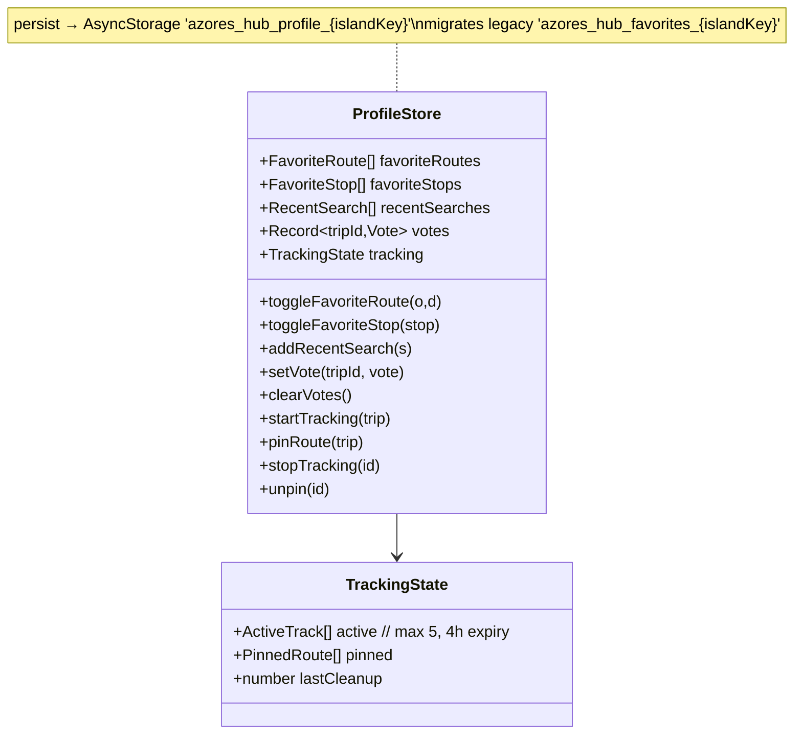
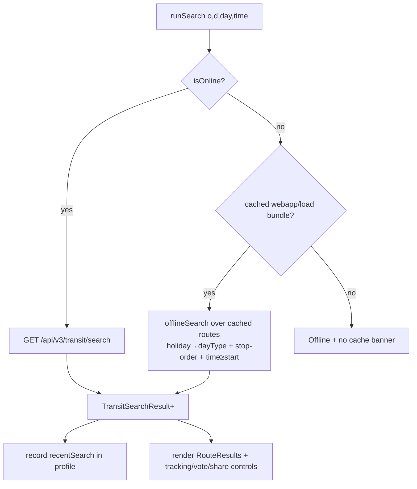
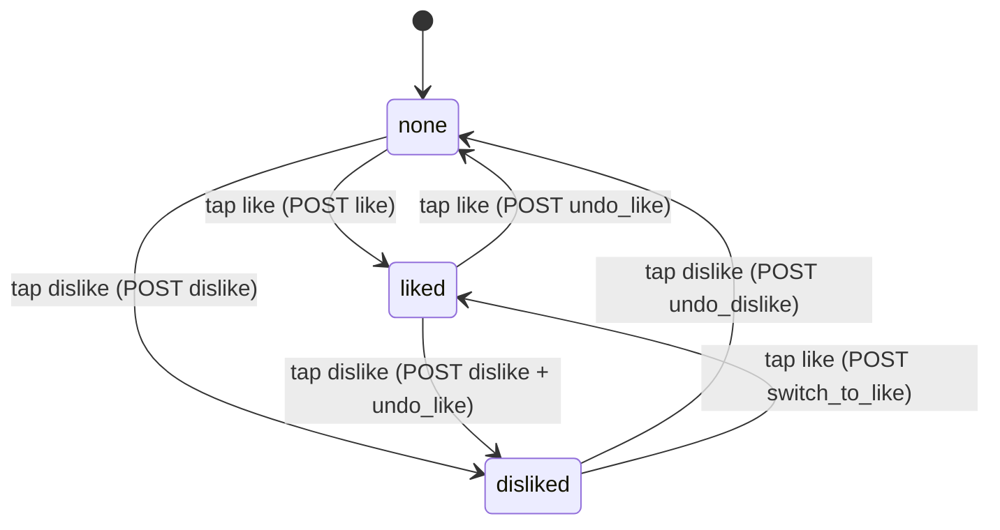

# feat: Buses module — full webapp parity + cache-backed user profile

## Summary

Bring the Expo `transit` (Buses) module to **full feature parity** with the legacy + current web app (`SaoMiguelBus-webapp`), and consolidate every per-user piece of state into a **single cache-backed user profile** (Zustand + `persist` → AsyncStorage). The web app has features the Expo app lacks: **schedule-based bus tracking** (active tracks + pinned routes), **vote persistence** with proper toggle/switch/undo, **recent searches** + **favourite stops**, **offline route search** over a cached bulk bundle, a **multilingual service-alert bell**, **operator notices / popular routes / share**, and **info pages** (bus companies, charter, developer). All of it ships **free for every user** — the web app's premium gating, subscription-verify, and ad-removal flows are **deliberately dropped** (per the request: "skip the no-ads and gatekeep of features, add all features for all users").

The backend needs **no changes**. The v3 transit API already exposes stops (with coords), search, the Google Maps directions proxy, trip detail, line detail, and vote (with `undo_*`/`switch_to_like` verbs), and the legacy **`/api/v2/webapp/load` compat handler** already serves the bulk offline bundle. This is a **client-only** plan against `SaoMiguelBus`.

The unifying move is `lib/profile-store.ts`: it absorbs the existing `lib/favorites-store.ts` (O/D pairs), and adds favourite **stops**, **recent searches**, a **vote ledger** (mirrors the web app's `vote_{id}_{type}` cookies), and **bus-tracking state** (active + pinned, the `busTracking` localStorage object). A new **Profile screen** surfaces and manages all of it, plus the static info pages. "Favourites and all of that" become one coherent, offline-durable profile.

## Problem Frame

The web app (`SaoMiguelBus-webapp`) is the mature product: it has favourites, schedule-based tracking, offline search, an alert bell, like/dislike with persisted vote state, and info pages — all backed by cookies/localStorage. The Expo app (`SaoMiguelBus`, the future client) currently implements only the **search → results → trip detail → directions** happy path plus **local O/D favourites** (`lib/favorites-store.ts`) and **fire-and-forget voting** (no persistence, no toggle, no query invalidation). Everything else from the web app is missing.

The request is twofold:
1. **Parity** — implement what the web app does that the Expo app does not, in the app.
2. **Profile** — "favourites and all of that" should be handled by a **user profile saved in cache** (no server account yet).

Two web-app concerns are explicitly **excluded**: premium **gatekeeping** and **no-ads** flows. Every feature (notably bus tracking, which is premium-gated in the web app) ships unlocked for all users. GPS / map-based stop picking is **not** parity (the web app has neither) and stays out of scope.

The challenge is that "tracking", "votes", "recent searches", and "favourites" are four separate localStorage/cookie islands in the web app. Porting them as four separate Zustand stores would fragment the "user profile" the request asks for. The plan instead introduces **one persisted profile slice** with internally namespaced sections, migrating the existing favourites store into it without data loss.

---

## Requirements

| ID | Requirement |
|----|-------------|
| R1 | A single cache-backed profile store (`lib/profile-store.ts`, Zustand + `persist` → AsyncStorage) holds: favourite O/D pairs, favourite stops, recent searches, a per-trip vote ledger, and bus-tracking state (active + pinned). Persisted per-island. |
| R2 | Existing `lib/favorites-store.ts` data (key `azores_hub_favorites_{islandKey}`) is migrated into the profile store on first load with **zero data loss**; the old store is removed and all call sites updated. |
| R3 | **Recent searches**: each successful search records `{origin, destination, day, time, at}`; the planner surfaces the most recent N (deduped, capped) as one-tap refills. Clearable. |
| R4 | **Favourite stops**: a stop can be starred from the stop picker / profile; favourite stops float to the top of the picker suggestions and appear in the profile. |
| R5 | **Vote persistence + correct UX**: the current vote for a trip is remembered in the profile ledger; tapping the active vote **undoes** it (`undo_like`/`undo_dislike`), tapping the opposite **switches** (`switch_to_like` / dislike+undo), using the existing v3 verbs; vote buttons reflect persisted state; the trip/search queries are invalidated/optimistically updated so percentages refresh. Mirrors web app `count` semantics (`1`/`2`/`-1`). |
| R6 | **Bus tracking engine** (`lib/bus-tracking.ts` + `features/transit/hooks/useBusTracking.ts`): schedule-math port of `busTrackingHandler.js` — start tracking a trip (countdown to departure, progress %, current/next stop derived from wall clock vs stop times), pin a route (recurring), max 5 active tracks, 4h active-session expiry, automatic cleanup. **No API calls.** Available to all users (no premium gate). |
| R7 | **Tracking UI**: a "Track" action on each result card and on trip detail; a "Pin" action for recurring routes; an **Active Tracking** section and a **Pinned Routes** section on the transit home, each with live countdowns and remove controls. |
| R8 | **Offline bundle + offline search**: on connectivity (and refresh), fetch `/api/v2/webapp/load` and cache it (stops, holidays, infos, all route rows) in AsyncStorage; when offline, route search runs **client-side** over the cached bundle using the web app's holiday→day-type logic (`SUNDAY`/`SATURDAY`/`WEEKDAY`, holidays force `SUNDAY`) and time-≥-start filtering, returning the same `TransitSearchResult` shape. Offline banner reflects cache availability. |
| R9 | **Service alerts (infos)**: a bell on the transit home shows the count of active `infos` from bootstrap; tapping opens a modal listing alerts with **locale-aware** title/message (current locale → fallback PT), company, and an external source link. Replaces the PT-only, trip-detail-only rendering. |
| R10 | **Operator notice / popular routes / share**: trip detail renders `trip.information` (operator/notice) locale-aware; a **Popular routes** section (wiring the existing unused `routesPopularTitle` key) offers quick searches; results and trip detail expose a **Share** action (native share sheet / web share). |
| R11 | **Profile screen** (`app/profile.tsx`, modal like settings, reachable from the transit header and hub): tabs/sections for Favourite searches, Favourite stops, Recent searches, Tracking (active + pinned), My votes, and **Info pages** (bus companies + contacts, charter-bus info, developer/links, disclaimer) ported from the web app Info tab. Manage/clear controls throughout. |
| R12 | All new user-facing copy added to the 5 official locales (pt/en/de/es/fr; it/uk/zh resources extended where trivially translatable, else fall back). PT is source. No missing-key warnings. |
| R13 | Analytics: new `track('transit', …)` events for `track_start`/`track_pin`/`track_stop`, `recent_search_apply`, `favorite_stop`, `offline_search`, `alert_open`, `share`, `vote` (with direction). Consent-gated via existing `track()`. No `/api/v1/stat` compat (v3 analytics already covers it). |
| R14 | No premium/ads/subscription gating is introduced; bus tracking and all features are unconditionally available. Existing unused premium/ad i18n keys are left untouched (not wired). |

---

## Key Technical Decisions

| ID | Decision | Rationale |
|----|----------|-----------|
| KTD1 | **One unified `lib/profile-store.ts`** (Zustand + `persist`), internally sectioned (`favoriteRoutes`, `favoriteStops`, `recentSearches`, `votes`, `tracking`), persisted to `azores_hub_profile_{islandKey}`. **Theme, locale, consent stay in their existing dedicated stores.** | The request says favourites "and all of that" → user profile. Collapsing the web app's four storage islands (`favoriteRoutes` cookie, `busTracking` localStorage, `vote_*` cookies, in-DOM recents) into one slice gives a coherent profile and one place for the Profile screen to read/clear. Theme/locale/consent are cross-cutting app concerns with working stores and their own screens — folding them in would be churn for no benefit. |
| KTD2 | **Migrate, don't dual-write.** A one-time migration reads the old `azores_hub_favorites_{islandKey}` key into `profile.favoriteRoutes` on store init, then the old store/file is deleted and all imports repointed. | `favorites-store.ts` is the only pre-existing persisted user data here; a clean migration avoids two sources of truth. Zustand `persist` `migrate`/`onRehydrateStorage` or a small boot step handles it. |
| KTD3 | **Bus tracking is a pure client-side schedule engine, free for all.** Port `busTrackingHandler.js` math (countdown, progress %, current/next stop from stop times vs `Date.now()`); cap 5 active, 4h expiry; no API. Drop the web app's `adRemovalState.isActive` premium gate. | SDD §1 confirms legacy "tracking" is "schedule math + timers client-side, not live operator GPS." The request says drop gatekeeping. No backend exists for live positions, so a faithful port is the correct parity target. |
| KTD4 | **Vote ledger + existing v3 verbs.** Store `votes[tripId] = 'like' | 'dislike'`. Re-tap active → `undo_*`; tap opposite → `switch_to_like` (or dislike-then-undo) — the verbs `transit_trip_vote_view` already supports. Optimistically update the trip/search cache and invalidate `['transit','trip',id]`. | The API already implements `undo_like`, `undo_dislike`, `switch_to_like`. The Expo gap is purely client (no persistence, no toggle, no refresh). Mirrors the web app's `count` 1/2/-1 toggle semantics without any backend change. |
| KTD5 | **Offline search via `/api/v2/webapp/load` compat + ported `getRoutes()`.** Cache the bulk bundle in AsyncStorage; offline path filters cached route rows by stop order + day-type + time, returning `TransitSearchResult[]`. Online path stays on `/api/v3/transit/search`. | This is the web app's exact offline mechanism, and the compat endpoint already exists (per `SaoMiguelBus-api/AGENTS.md` "Webapp drop-in deploy" table). v3 has **no bulk-load endpoint**, so reusing v2 compat is the lowest-risk way to get true offline parity without backend work. TanStack persistence alone can't answer arbitrary offline O/D queries. |
| KTD6 | **Profile is a modal screen (`app/profile.tsx`), not a tab.** Reached via a person icon in the transit stack header (next to the existing settings gear) and optionally a hub entry. | Matches the existing `app/settings.tsx` modal pattern and `SettingsHeaderButton`. Adding a 5th persistent tab fights the hub's 4-pin model (`lib/hub-store.ts`); a modal is the established convention for cross-cutting user screens. |
| KTD7 | **Infos rendered locale-aware from bootstrap**, not re-fetched. Resolve `info.title{LOCALE}` / `info.message{LOCALE}` (web app shape) or the v3 `text` object, current locale → PT fallback. | Bootstrap already ships `infos`; the only defect is the Expo app reads PT only and only on trip detail. A locale resolver + a home bell closes parity with no new endpoint. |
| KTD8 | **Stops keep text autocomplete; favourite stops just re-rank suggestions.** No map picker, no GPS. | The web app has neither map nor GPS for stop selection; parity does not require them. Favourite stops are a pure ranking/quick-pick affordance over the existing `StopPicker`. |
| KTD9 | **Recent searches and the vote ledger are capped + pruned** (recents ~10, dedup by O/D+day; votes pruned only on explicit clear). Tracking auto-prunes expired entries on read (web app `lastCleanup` pattern). | Keeps the persisted blob bounded and the profile screen fast; mirrors web app caps (`maxConcurrentTracks: 5`, recents ephemeral). |

---

## High-Level Technical Design

### Profile store shape (cache-backed)



### Online vs offline search resolution



### Vote toggle state machine (per trip, client ledger + existing API verbs)



---

## Output Structure

```
SaoMiguelBus/
├── lib/
│   ├── profile-store.ts            # NEW — unified cache-backed profile (replaces favorites-store)
│   ├── bus-tracking.ts             # NEW — schedule-math engine (port of busTrackingHandler.js)
│   ├── offline-bundle.ts           # NEW — webapp/load cache + client-side offline search
│   ├── infos.ts                    # NEW — locale-aware info/alert resolver
│   └── favorites-store.ts          # DELETED (migrated into profile-store)
├── features/transit/
│   ├── hooks/
│   │   ├── useBusTracking.ts        # NEW — ticking countdowns, start/stop/pin
│   │   └── useOfflineSearch.ts      # NEW — offline-aware search wrapper
│   └── components/
│       ├── RecentSearches.tsx       # NEW
│       ├── TrackButton.tsx          # NEW
│       ├── ActiveTrackingSection.tsx# NEW
│       ├── PinnedRoutesSection.tsx  # NEW
│       ├── AlertBell.tsx            # NEW
│       ├── AlertsModal.tsx          # NEW
│       ├── PopularRoutes.tsx        # NEW
│       ├── ShareTripButton.tsx      # NEW
│       ├── FavoritesPanel.tsx       # MODIFY (read profile store)
│       ├── FavoriteToggle.tsx       # MODIFY
│       ├── StopPicker.tsx           # MODIFY (favourite stops re-rank + star)
│       ├── RouteResults.tsx         # MODIFY (vote UX, track, share)
│       └── TripDetail.tsx           # MODIFY (vote UX, track, share, locale info)
├── features/transit/components/profile/   # NEW — profile screen sections
│   ├── ProfileFavoritesSection.tsx
│   ├── ProfileStopsSection.tsx
│   ├── ProfileRecentsSection.tsx
│   ├── ProfileTrackingSection.tsx
│   ├── ProfileVotesSection.tsx
│   └── InfoPagesSection.tsx
└── app/
    ├── profile.tsx                 # NEW — modal profile screen
    └── (tabs)/transit/_layout.tsx  # MODIFY (profile header button)
```

---

## Scope Boundaries

**In scope (Expo `SaoMiguelBus` only):** unified cache-backed profile store + migration; recent searches; favourite stops; vote persistence with toggle/switch/undo + cache refresh; client-side bus-tracking engine (active + pinned) free for all; tracking UI (buttons + home sections); offline bundle cache via `/api/v2/webapp/load` + client-side offline search; multilingual service-alert bell + modal; locale-aware operator notice on trip detail; popular routes; share trip; Profile modal screen incl. static info pages; i18n for all new copy; analytics for new events.

**Out of scope (this plan):**
- **Premium / subscription / ad-removal gating** and **ad display** — explicitly dropped; everything is free for all users.
- **GPS / device-location, map-based stop picker, nearest-stop, stops-on-map** — not present in the web app; not parity. (Trails already deep-links to directions.)
- **Any `SaoMiguelBus-api` change** — v3 + v2 compat already cover the needs.
- **`/api/v1/stat` compat** — v3 `/api/v3/analytics/events` already instruments search/engage.
- **Live/real-time vehicle GPS positions** — no operator feed exists (SDD §1, SDD/12).
- **Server-synced profile / user accounts / login** — profile is local cache only ("for now").
- **Desktop web variant** (`SaoMiguelBus-webapp/desktop/`) — legacy v1 subset, not a port target.

### Deferred to Follow-Up Work
- Server-backed profile sync once accounts exist (extend, don't rewrite, the store; gate on `personalization` consent).
- Push notifications for tracking ("your stop is approaching") — needs Expo Notifications + background concerns (SDD §1 premium note).
- A dedicated Profile **hub module/tab** if usage warrants promoting it from a modal.
- Map view of stops / nearest-stop once a product decision adds it (not web-app parity).

---

## Implementation Units

### U1. Unified cache-backed profile store + favourites migration

**Goal:** One persisted Zustand slice for all per-user buses state; migrate existing favourites with no data loss.

**Requirements:** R1, R2.

**Dependencies:** None.

**Files:**
- `SaoMiguelBus/lib/profile-store.ts` (create)
- `SaoMiguelBus/lib/favorites-store.ts` (delete)
- `SaoMiguelBus/features/transit/components/FavoritesPanel.tsx` (modify — import profile store)
- `SaoMiguelBus/features/transit/components/FavoriteToggle.tsx` (modify)
- `SaoMiguelBus/lib/__tests__/profile-store.test.ts` (create, if a jest/vitest harness exists; else assert via a temporary script)

**Approach:**
- Define sections + actions per the class diagram (KTD1). `FavoriteRoute` keeps the existing `{origin,destination,createdAt}` shape so migration is a straight copy. `FavoriteStop = {id,name}`; `RecentSearch = {origin,destination,day,time,at}`; `votes: Record<number,'like'|'dislike'>`; `tracking: {active: ActiveTrack[], pinned: PinnedRoute[], lastCleanup: number}`.
- `persist` to `azores_hub_profile_{staticIslandConfig.islandKey}` via `createJSONStorage(() => AsyncStorage)` (mirror `favorites-store.ts`). Use `version: 1` + `migrate`.
- Migration (KTD2): on rehydrate, if profile has no `favoriteRoutes` and legacy key `azores_hub_favorites_{islandKey}` exists in AsyncStorage, read+parse its `state.routes`, seed `favoriteRoutes`, then `AsyncStorage.removeItem(legacyKey)`. Keep `track()` calls on add/remove favourite (as the old store did).
- Repoint `FavoritesPanel`/`FavoriteToggle` to the profile store selectors; keep their props/behaviour identical.

**Patterns to follow:** `lib/favorites-store.ts` (persist shape, `pairKey` normalization, `track` on toggle), `lib/hub-store.ts` and `lib/traffic-store.ts` (Zustand `persist` + AsyncStorage in this repo), `lib/theme-prefs.ts` (versioned prefs).

**Test scenarios:**
- Happy: `toggleFavoriteRoute` adds then removes by normalized pair key; `isFavoriteRoute` reflects state.
- Migration: given a populated legacy `azores_hub_favorites_*` blob and an empty profile, rehydration moves all routes into `favoriteRoutes` and deletes the legacy key. Running twice does not duplicate or re-create.
- Edge: blank origin/destination is ignored (matches old store guard).
- Edge: `addRecentSearch` dedupes same O/D+day and caps at the configured limit (newest first).

**Verification:** `npx tsc --noEmit` clean; favourites added before the change still appear after upgrading; no references to `favorites-store` remain (`rg favorites-store`).

---

### U2. Vote persistence + correct toggle/switch/undo UX

**Goal:** Remember each trip's vote, support undo/switch using existing v3 verbs, and refresh percentages.

**Requirements:** R5, R13 (vote event).

**Dependencies:** U1.

**Files:**
- `SaoMiguelBus/features/transit/hooks/useTransitQueries.ts` (modify — `useTripVote` reads/writes profile ledger, invalidates, optimistic update)
- `SaoMiguelBus/features/transit/components/RouteResults.tsx` (modify — button active state + toggle logic)
- `SaoMiguelBus/features/transit/components/TripDetail.tsx` (modify — same)
- `SaoMiguelBus/lib/api.ts` (verify — `voteTrip` already accepts all verbs; no change expected)

**Approach:**
- `useTripVote` takes `{tripId, current, intent}` where `current` is the ledger value and `intent` is `'like'|'dislike'`. Resolve the verb (KTD4 state machine): none+like→`like`; like+like→`undo_like`; like+dislike→`dislike` (and call `undo_like` first, or rely on server `switch_*`); dislike+like→`switch_to_like`; etc. After success, set/clear `votes[tripId]` in the profile and `queryClient.invalidateQueries(['transit','trip',tripId])` + optimistic percent update on the search list item.
- Buttons render filled/tonal when `votes[tripId]` matches; reflect pending state.

**Patterns to follow:** existing `useTripVote` (`useTransitQueries.ts`), TanStack mutation `onSuccess`/`onMutate` patterns in `features/marketplace/hooks/useMarketplaceQueries.ts`, `transit_trip_vote_view` verb set (`SaoMiguelBus-api/src/transit/api_v3.py`).

**Test scenarios:**
- Happy: like then like again → second call uses `undo_like`, ledger cleared, button inactive.
- Happy: like then dislike → switches; ledger `dislike`; like button inactive, dislike active.
- Happy: after vote, trip detail query invalidated → percentages reflect server response.
- Edge: vote while offline → mutation guarded/queued or disabled (no crash); ledger only updates on success.
- `Covers parity: web app vote_{id} cookie` — ledger survives reload (persisted in profile).

**Verification:** Metro logs `POST /api/v3/transit/trips/{id}/vote` with the resolved verb; re-tapping toggles; percentages update; ledger persists across app restart.

---

### U3. Recent searches + favourite stops in the planner

**Goal:** One-tap recent searches and starred stops that re-rank the picker.

**Requirements:** R3, R4, R13 (`recent_search_apply`, `favorite_stop`).

**Dependencies:** U1.

**Files:**
- `SaoMiguelBus/features/transit/components/RecentSearches.tsx` (create)
- `SaoMiguelBus/features/transit/components/StopPicker.tsx` (modify — star toggle + favourite-first ordering)
- `SaoMiguelBus/features/transit/components/TransitPlannerCard.tsx` (modify — mount RecentSearches, pass favourite stops)
- `SaoMiguelBus/app/(tabs)/transit/index.tsx` (modify — record recent on successful search)

**Approach:**
- On a successful `useTransitSearch` (results returned), call `profile.addRecentSearch({origin,destination,day,time,at})`. `RecentSearches` renders the capped, deduped list as chips/cards; tapping refills planner O/D+day+time and triggers search (reuse `applyFavorite` path). Clear-all control.
- `StopPicker`: add a star IconButton per suggestion → `toggleFavoriteStop`; sort suggestions favourite-first, then the existing filter (cap 40 unchanged). Track `favorite_stop` add/remove.

**Patterns to follow:** `FavoritesPanel.tsx` (collapsible saved-pairs UI + `onSelect`), existing `StopPicker.tsx` filter/cap, `applyFavorite` in `transit/index.tsx`.

**Test scenarios:**
- Happy: searching A→B records a recent; it appears top of RecentSearches; tapping refills + searches.
- Happy: same A→B+day searched twice → single deduped recent, timestamp updated, capped at limit.
- Happy: starring a stop floats it to the top of picker suggestions; unstar removes it.
- Edge: clear-all empties recents; empty state shown.

**Verification:** Recents persist across restart; favourite stops rank first; `tsc --noEmit` clean.

---

### U4. Bus-tracking engine (schedule math, no API)

**Goal:** Faithful TS port of the web app's client-side tracking math, free for all users.

**Requirements:** R6.

**Dependencies:** U1.

**Execution note:** Implement the schedule math (countdown, progress %, current/next stop, expiry) **test-first** — this is the core correctness surface and has no network to mask bugs.

**Files:**
- `SaoMiguelBus/lib/bus-tracking.ts` (create — pure functions + types)
- `SaoMiguelBus/features/transit/hooks/useBusTracking.ts` (create — ticking state over profile.tracking)
- `SaoMiguelBus/lib/__tests__/bus-tracking.test.ts` (create)

**Approach:**
- Port from `SaoMiguelBus-webapp/js/busTrackingHandler.js`: `ActiveTrack`/`PinnedRoute` types carrying `tripId`, `routeNumber`, `origin`, `destination`, `searchDay`, `stops[] {name,time}`, `nextDeparture`, `estimatedArrival`, `expiresAt`, `type`. Pure helpers: `computeProgress(track, now)` → `{status:'before'|'enroute'|'arrived', currentStopIndex, nextStop, etaMinutes, percent}`; `isExpired(track, now)`; `pruneExpired(tracking, now)` (web app `lastCleanup`).
- Caps: `MAX_ACTIVE = 5`, `ACTIVE_TTL_MS = 4h`. `startTracking` rejects when at cap (surface a toast/error to UI). Pinned routes uncapped (or web app's 3 — pick uncapped per "all features for all").
- `useBusTracking` ticks every ~15–30s (interval cleared on unmount), reads `profile.tracking`, prunes expired, returns derived live views for the UI; exposes `start/stop/pin/unpin` delegating to the profile store.

**Patterns to follow:** `SaoMiguelBus-webapp/js/busTrackingHandler.js` (the math + caps + cleanup), `features/traffic/hooks/useNearbyLocation.ts` (focus-bound interval/cleanup pattern), profile store actions from U1.

**Test scenarios:**
- Happy: a track whose `nextDeparture` is in 10 min → `status:'before'`, `etaMinutes≈10`, `percent` small.
- Happy: now between departure and last stop → `status:'enroute'`, correct `currentStopIndex`/`nextStop`, `percent` interpolated.
- Happy: now past last stop time → `status:'arrived'`.
- Edge: `startTracking` a 6th active track → rejected; existing 5 untouched.
- Edge: a track older than 4h → `isExpired` true; `pruneExpired` removes it and updates `lastCleanup`.
- Edge: DST / midnight-crossing trip times handled (use the search date, not just HH:mm).

**Verification:** `tsc --noEmit` clean; unit tests green; derived countdowns match hand-computed values.

---

### U5. Tracking UI — buttons + Active/Pinned home sections

**Goal:** Start/stop/pin from results & detail; live Active and Pinned sections on the transit home.

**Requirements:** R7, R13 (`track_start`/`track_pin`/`track_stop`).

**Dependencies:** U4.

**Files:**
- `SaoMiguelBus/features/transit/components/TrackButton.tsx` (create)
- `SaoMiguelBus/features/transit/components/ActiveTrackingSection.tsx` (create)
- `SaoMiguelBus/features/transit/components/PinnedRoutesSection.tsx` (create)
- `SaoMiguelBus/features/transit/components/RouteResults.tsx` (modify — add TrackButton)
- `SaoMiguelBus/features/transit/components/TripDetail.tsx` (modify — add Track + Pin)
- `SaoMiguelBus/app/(tabs)/transit/index.tsx` (modify — mount Active + Pinned sections)

**Approach:**
- `TrackButton`: toggles tracking for a trip via `useBusTracking`; shows tracked state; "Pin" variant for recurring. Disabled-with-reason when at the 5-active cap.
- `ActiveTrackingSection`: collapsible (web app pattern) list of live tracks with countdown / current→next stop / progress bar and a remove (X) control; hidden when empty.
- `PinnedRoutesSection`: pinned routes with a one-tap re-search/re-track; remove control; hidden when empty.
- Mount both above the planner on `transit/index.tsx`. Track analytics on start/stop/pin.

**Patterns to follow:** `FavoritesPanel.tsx` (collapsible section + remove control), `RouteResults.tsx` card/vote row layout, `components/ui/{Card,IconButton,Button}`, `lib/tokens` spacing/typography.

**Test scenarios:**
- Happy: tap Track on a result → appears in Active Tracking with a live countdown; tap remove → gone.
- Happy: pin a route → appears in Pinned; one-tap re-runs the search.
- Edge: 6th track attempt → button shows cap reason, no add.
- Edge: both sections hidden when empty; reappear when populated.
- Happy: countdowns advance on the tick interval without full re-render jank.

**Verification:** On device/web, tracking flows work end-to-end; analytics events fire; no premium gate anywhere.

---

### U6. Offline bundle cache + client-side offline search

**Goal:** Cache `/api/v2/webapp/load` and answer route searches offline like the web app.

**Requirements:** R8, R13 (`offline_search`).

**Dependencies:** None (parallel with U1); wires into search at U-level integration.

**Files:**
- `SaoMiguelBus/lib/offline-bundle.ts` (create — fetch+cache + `offlineSearch()`)
- `SaoMiguelBus/lib/api.ts` (modify — add `fetchWebappLoad()` → `GET /api/v2/webapp/load`)
- `SaoMiguelBus/features/transit/hooks/useOfflineSearch.ts` (create — online/offline resolver)
- `SaoMiguelBus/features/transit/hooks/useTransitQueries.ts` (modify — refresh bundle on connectivity)
- `SaoMiguelBus/app/(tabs)/transit/index.tsx` (modify — use offline-aware search; enable search offline when cache exists)
- `SaoMiguelBus/features/transit/components/OfflineBanner.tsx` (modify — reflect cache availability)
- `SaoMiguelBus/lib/__tests__/offline-bundle.test.ts` (create)

**Approach:**
- `fetchWebappLoad()` hits the compat endpoint (`X-Island` header already attached by `apiFetch`); response shape per the web app: `[ {stops,holidays,infos}, ...routeRows ]` where a row = `{id, route, stops[], times[], weekday, likes_percent, dislikes_percent, information?}`.
- `offline-bundle.ts`: persist the bundle to AsyncStorage (`azores_hub_offline_bundle_{islandKey}`) with a fetched-at timestamp; expose `loadCachedBundle()`, `refreshBundle()`, and `offlineSearch({origin,destination,day,time})`. Port the web app `getRoutes()` logic (`SaoMiguelBus-webapp/js/offlineHandler.js`): map date/day → `SUNDAY`/`SATURDAY`/`WEEKDAY` (holidays force `SUNDAY`), match `weekday` field, filter by stop order between matched origin/destination (accent-normalized), keep departures ≥ start time, map to `TransitSearchResult[]`.
- `useOfflineSearch` returns online results when `isOnline` (existing v3 query) else `offlineSearch` over the cached bundle. `transit/index.tsx` enables the search button offline **iff** a cached bundle exists.
- Refresh the bundle opportunistically on regaining connectivity (mirror web app `online` event) via the bootstrap/stops query lifecycle.

**Patterns to follow:** `SaoMiguelBus-webapp/js/offlineHandler.js` (`loadAPIData`, `getRoutes`, holiday/day-type mapping), `lib/query-provider.tsx` (AsyncStorage cache conventions), `lib/network-status.ts` (`useNetworkStatus`), `apiFetch` in `lib/api.ts`.

**Test scenarios:**
- Happy: with a cached bundle and `isOnline=false`, `offlineSearch` returns trips matching O/D, correct day-type, time≥start, sorted by departure.
- Happy: a holiday date forces `SUNDAY` schedule selection.
- Happy: accent/case-insensitive origin/destination matching (e.g. "Ponta Delgada" vs "ponta delgada").
- Edge: no cached bundle + offline → search disabled, banner says cache unavailable.
- Edge: bundle refresh on reconnect overwrites stale cache and updates timestamp.

**Verification:** Airplane-mode search returns sensible results after one online load; banner reflects cache state; `offline_search` analytics fires; `tsc --noEmit` clean.

---

### U7. Service alerts — locale-aware bell + modal

**Goal:** A home alert bell + modal showing active infos in the current locale, replacing the PT-only trip-detail rendering.

**Requirements:** R9, R13 (`alert_open`).

**Dependencies:** None.

**Files:**
- `SaoMiguelBus/lib/infos.ts` (create — `resolveInfo(info, locale)` → `{title,message,source,company}`)
- `SaoMiguelBus/features/transit/components/AlertBell.tsx` (create)
- `SaoMiguelBus/features/transit/components/AlertsModal.tsx` (create)
- `SaoMiguelBus/app/(tabs)/transit/index.tsx` (modify — mount AlertBell in header area)
- `SaoMiguelBus/features/transit/components/TripDetail.tsx` (modify — use `resolveInfo` instead of hardcoded `.pt`)
- `SaoMiguelBus/app/(tabs)/transit/[tripId].tsx` (modify — use `resolveInfo` for `infoNotice`)

**Approach:**
- `resolveInfo` handles both shapes: web app `title{PT,EN,ES,FR,DE,IT,UK,ZH}` / `message*` keys, and the v3 `text`/`title` object keyed by locale. Pick current i18n locale, fall back to PT, then any present.
- `AlertBell`: bell icon + badge with count of active infos from `useBootstrap().data.infos`; opens `AlertsModal`. `AlertsModal`: list with title, truncated message + show-more, company, external source link (`Linking.openURL`). Empty/zero-count → bell hidden or muted.
- Replace the `[tripId].tsx` and `TripDetail.tsx` hardcoded `.pt` reads with `resolveInfo`.

**Patterns to follow:** `SaoMiguelBus-webapp/js/offlineHandler.js` `updateAlertBadge` + `index.html` `#alertModal` (UX), existing modal components in the app (`AlertsModal` can reuse `components/ui` + a sheet/modal like marketplace `ReviewSheet`), `useBootstrap()` infos access in `[tripId].tsx`.

**Test scenarios:**
- Happy: infos present → bell shows count; modal lists them in the active locale.
- Happy: switching locale re-resolves titles/messages; missing locale falls back to PT.
- Happy: source link opens externally.
- Edge: zero infos → no bell/badge; modal not reachable.

**Verification:** Bell count matches bootstrap infos; locale switch updates copy; trip detail no longer PT-locked; `tsc --noEmit` clean.

---

### U8. Operator notice, popular routes, share trip

**Goal:** Round out result/detail parity: operator notice (locale-aware), a popular-routes quick-pick, and share.

**Requirements:** R10, R13 (`share`).

**Dependencies:** U7 (`resolveInfo`).

**Files:**
- `SaoMiguelBus/features/transit/components/PopularRoutes.tsx` (create — wires `routesPopularTitle`)
- `SaoMiguelBus/features/transit/components/ShareTripButton.tsx` (create — `Share`/web share)
- `SaoMiguelBus/features/transit/components/TripDetail.tsx` (modify — render `trip.information` via `resolveInfo`; add ShareTripButton)
- `SaoMiguelBus/features/transit/components/RouteResults.tsx` (modify — add ShareTripButton per card)
- `SaoMiguelBus/app/(tabs)/transit/index.tsx` (modify — mount PopularRoutes)

**Approach:**
- `PopularRoutes`: a small curated/most-recent-derived list (start with a static island list or derive from recents/favourites); tapping refills planner + searches. Uses the already-present unused `routesPopularTitle` key.
- `ShareTripButton`: native `Share.share` (RN) with a text summary (`route`, O→D, times) + optional deep link; web uses `navigator.share` with fallback to copy. Track `share`.
- `TripDetail` renders the operator/notice from `trip.information` via `resolveInfo` (locale-aware), instead of ignoring it.

**Patterns to follow:** existing `RouteResults`/`TripDetail` layouts, `resolveInfo` from U7, RN `Share` usage (new — minimal), `routesPopularTitle` i18n key already shipped.

**Test scenarios:**
- Happy: `trip.information` present → rendered in active locale on detail.
- Happy: share → native sheet/web share invoked with route summary; `share` event tracked.
- Happy: popular route tap → planner filled + search runs.
- Edge: no `information` → section omitted (no empty card).

**Verification:** Detail shows operator notice; share works on native + web; popular routes search; `tsc --noEmit` clean.

---

### U9. Profile screen (modal) + info pages

**Goal:** One screen to view/manage favourites, stops, recents, tracking, votes, and the static info pages — the "user profile."

**Requirements:** R11.

**Dependencies:** U1, U4 (tracking section), U7 (alert/info resolver for company info reuse).

**Files:**
- `SaoMiguelBus/app/profile.tsx` (create — modal screen, registered in `app/_layout.tsx`)
- `SaoMiguelBus/app/_layout.tsx` (modify — add `profile` modal route, like `settings`)
- `SaoMiguelBus/app/(tabs)/transit/_layout.tsx` (modify — profile header button next to settings gear)
- `SaoMiguelBus/components/ProfileHeaderButton.tsx` (create — mirror `SettingsHeaderButton.tsx`)
- `SaoMiguelBus/features/transit/components/profile/ProfileFavoritesSection.tsx` (create)
- `SaoMiguelBus/features/transit/components/profile/ProfileStopsSection.tsx` (create)
- `SaoMiguelBus/features/transit/components/profile/ProfileRecentsSection.tsx` (create)
- `SaoMiguelBus/features/transit/components/profile/ProfileTrackingSection.tsx` (create)
- `SaoMiguelBus/features/transit/components/profile/ProfileVotesSection.tsx` (create)
- `SaoMiguelBus/features/transit/components/profile/InfoPagesSection.tsx` (create — bus companies, charter, developer, disclaimer)

**Approach:**
- `app/profile.tsx`: a `Screen` with scrollable sections reading the profile store; each section reuses the live components where possible (Active/Pinned reuse U5 sections; favourites reuse the panel list). Clear/manage controls per section.
- `InfoPagesSection`: port static content from `SaoMiguelBus-webapp/index.html` Info tab — bus-company contacts (phone/email/links via `Linking`), charter-bus info, developer/social/legal links, the solo-dev disclaimer. Static + i18n.
- Header button: add `ProfileHeaderButton` to the transit stack header (`_layout.tsx`) opening `/profile`; register the modal route in `app/_layout.tsx` mirroring `settings`.

**Patterns to follow:** `app/settings.tsx` + `components/SettingsHeaderButton.tsx` (modal screen + header button registration), `app/_layout.tsx` route registration, `FavoritesPanel`/U5 sections for reuse, `Linking` usage elsewhere in the app.

**Test scenarios:**
- Happy: profile opens from the transit header; all sections render current profile data.
- Happy: removing a favourite / clearing recents / stopping a track from the profile updates the store and the transit home.
- Happy: info-page links open externally (company phone/email, dev links).
- Edge: empty sections show empty states, not blank space.

**Verification:** Profile modal reachable + functional; edits reflected on the transit home; links open; `tsc --noEmit` clean.

---

### U10. i18n for all new copy (5 locales)

**Goal:** Localize every new string; no missing-key warnings.

**Requirements:** R12.

**Dependencies:** U2–U9 (key names settle as UI lands).

**Files:**
- `SaoMiguelBus/locales/pt.json` (modify — source)
- `SaoMiguelBus/locales/en.json` (modify)
- `SaoMiguelBus/locales/de.json` (modify)
- `SaoMiguelBus/locales/es.json` (modify)
- `SaoMiguelBus/locales/fr.json` (modify)
- `SaoMiguelBus/locales/{it,uk,zh}.json` (modify — extend where trivial, else PT fallback)

**Approach:** Add keys for: recent searches (title, clear, empty), favourite stops, vote actions/states, tracking (track/pin/stop, active/pinned titles, countdown/arrived/enroute, cap reached), offline (cache unavailable), alerts (title, show more, source, empty), popular routes (reuse `routesPopularTitle`), share, profile sections + info pages (companies, charter, developer, disclaimer). PT authored first; translate the 4 official locales.

**Patterns to follow:** existing transit/`navBar*`/`favorite*` keys across `locales/*.json`; the repo's locale-key checker if present (`check_locale_keys.js` exists in the **webapp**; verify the Expo repo's i18n test/lint).

**Test scenarios:** `Test expectation: none` (static copy) — verify no `i18next::translator` missing-key logs across all new screens in each official locale.

**Verification:** Switch through pt/en/de/es/fr in-app; all new strings resolve; no missing-key warnings in Metro.

---

### U11. Analytics wiring + parity smoke

**Goal:** Instrument the new features and verify end-to-end parity.

**Requirements:** R13, R14, all R* (smoke).

**Dependencies:** U2–U9.

**Files:**
- `SaoMiguelBus/lib/analytics.ts` (verify — generic `track(module,event,props)` already supports this; no change expected)
- (verification-only across the modified screens)

**Approach:**
- Confirm each new interaction calls `track('transit', …)` with the agreed event types (`track_start`/`track_pin`/`track_stop`, `recent_search_apply`, `favorite_stop`, `offline_search`, `alert_open`, `share`, `vote` with direction). All gated by existing consent.
- Smoke checklist: favourites migrate; recents/stops persist; votes toggle + percentages refresh; tracking active/pinned with live countdowns (no premium gate); offline search after one online load; alert bell localized; operator notice + popular + share; profile manages everything; restart preserves the whole profile.

**Test expectation:** none — analytics verification + manual parity smoke.

**Verification:** Events visible in the analytics pipeline (or logged) when consent granted; the smoke checklist passes on native + web.

---

## Risks and Dependencies

| Risk | Mitigation |
|------|------------|
| **`/api/v2/webapp/load` payload drift** vs the web app's assumed `[meta, ...routeRows]` shape | Validate the live response shape against `SaoMiguelBus-webapp/js/offlineHandler.js` expectations during U6; if v3 has since changed the compat output, adapt the parser (still no backend change). Fall back to "cache unavailable" gracefully. |
| **Profile migration data loss** | U1 migration is read-then-seed-then-delete, idempotent, behind a version guard; tested with a populated legacy blob. Old store deleted only after successful seed. |
| **Tracking schedule math edge cases** (midnight crossing, DST, multi-leg) | Test-first (U4); compute against the search date, not bare HH:mm; cover DST/midnight in unit tests; the web app's logic is the reference oracle. |
| **Vote double-counting** (no per-session dedup server-side) | Client ledger prevents repeated same-direction increments by routing re-taps to `undo_*`; matches web app behaviour. True server dedup is a backend concern, out of scope. |
| **Persisted profile blob growth** | Caps + pruning (KTD9): recents ~10, active tracks 5 + 4h expiry pruned on read, votes cleared via profile screen. |
| **Offline search performance over a large bundle** | Pre-index stops/routes once on load; accent-normalize once; cap result set; the dataset is a single island's routes (bounded), same as the web app handles in-browser. |
| **Adding a 5th tab vs hub 4-pin model** | Avoided — Profile is a modal (KTD6), not a tab. |

**Depends on (all existing):** v3 transit endpoints (`stops`/`search`/`directions`/`trips/{id}`/`vote`), `/api/v2/webapp/load` compat, `useBootstrap` infos/holidays, `lib/network-status`, `lib/analytics.track` + consent store, AsyncStorage + Zustand `persist`, `app/settings.tsx`/`SettingsHeaderButton` pattern, `lib/tokens`/`useAppTheme`. **New deps:** none (RN `Share` is built-in).

---

## Open Questions

| Question | Status |
|----------|--------|
| Unify all per-user state in one store vs keep separate? | **Decided KTD1:** one `profile-store`; theme/locale/consent stay separate. |
| How to get offline route search without backend work? | **Decided KTD5:** `/api/v2/webapp/load` compat + ported `getRoutes()`. |
| Premium gate on bus tracking? | **Decided (user):** dropped — free for all. |
| Profile as tab or modal? | **Decided KTD6:** modal (`app/profile.tsx`), header + hub entry. |
| Map/GPS stop picker? | **Out of scope** — not web-app parity; deferred. |
| Pinned-routes cap (web app uses 3) | Deferred to implementation — start uncapped (per "all features for all"); revisit if the profile blob grows. |
| Popular-routes source (static vs derived) | Deferred to implementation — start static/derived-from-recents; a backend "popular" endpoint is a later enhancement. |

---

## Sources and Research

- **Legacy/current web app** `SaoMiguelBus-webapp/`: `js/apiHandler.js` (search, stops, favourites toggle, like/dislike, ads), `js/favoriteHandler.js` (favourites storage), `js/busTrackingHandler.js` + `js/busTrackingUI.js` (tracking engine + UI), `js/offlineHandler.js` (`webapp/load` cache + `getRoutes` offline search + alert badge), `js/directionsApiHandler.js` (gmaps), `js/i18n.js` (8 locales), `index.html` (Info tab, alert modal, premium UI). Storage keys: `favoriteRoutes` (cookie), `busTracking`/`apiData`/`theme` (localStorage), `vote_{id}_{type}` (cookies).
- **Expo app** `SaoMiguelBus/`: `app/(tabs)/transit/{index,directions,[tripId],_layout}.tsx`, `features/transit/{hooks/useTransitQueries.ts, components/*}`, `lib/{api.ts,types.ts,favorites-store.ts,session.ts,analytics.ts,network-status.ts,query-provider.tsx}`, `app/settings.tsx` + `components/SettingsHeaderButton.tsx`, `lib/{hub-store,traffic-store,theme-prefs,locale-prefs}.ts` (Zustand persist conventions).
- **API** `SaoMiguelBus-api/src/transit/`: `api_v3.py` (vote verbs `undo_*`/`switch_to_like`, search, directions, trip/line detail), `urls_v3.py`, `services/compat.py` (v2 `webapp/load`); `SaoMiguelBus-api/AGENTS.md` "Webapp drop-in deploy" compat table.
- **SDD** `SaoMiguelBus/SDD/09-modules.md` §1 Transit (favorites local-otherwise, offline schedule cache, multilingual operator alerts, "tracking = client-side schedule math"), `SDD/04-api-design.md` §4 (legacy URL surface / compat).
- **Prior plans:** `docs/plans/2026-06-02-003-feat-traffic-module-plan.md` (Expo feature-folder + hook + i18n + analytics conventions, location-hook cleanup pattern).
