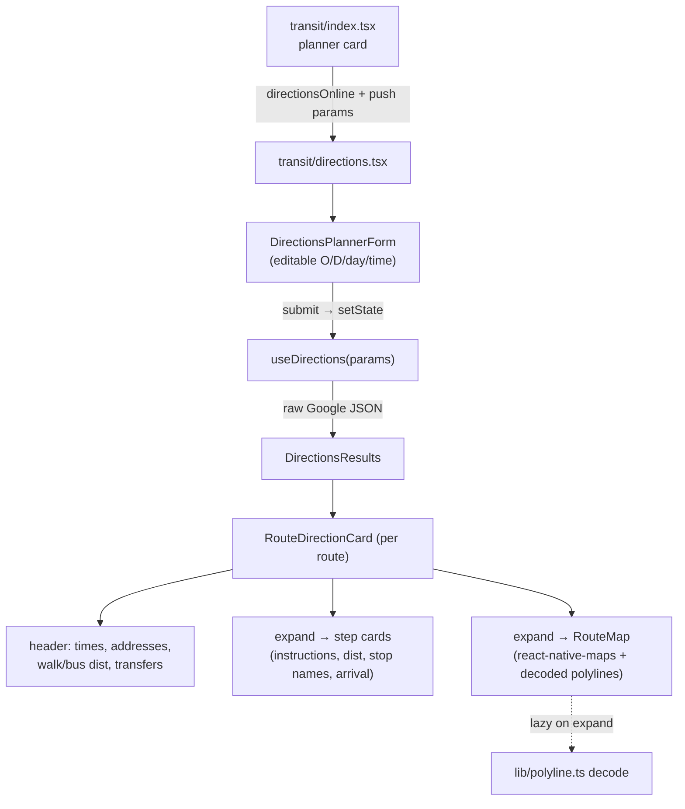
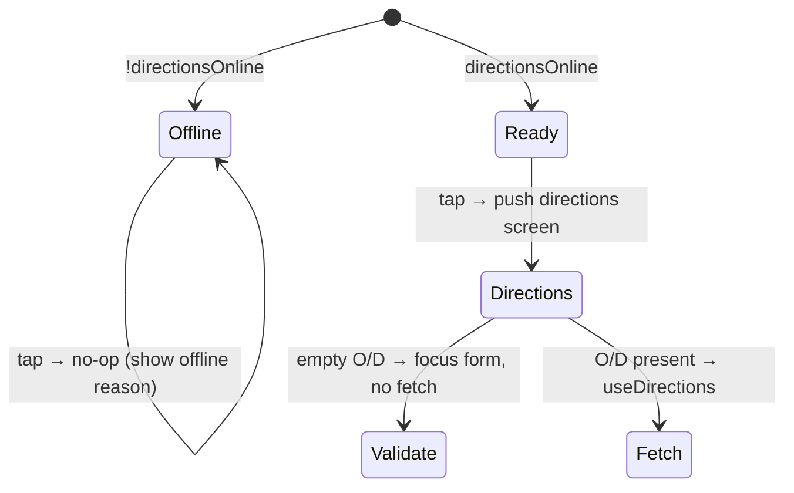

# fix: Transit directions button + screen parity with web app

## Summary

The "Obter Direções" control on the transit (bus) screen looks broken: it renders as a greyed, unlabeled `Route` icon that stays disabled until both origin and destination are picked, gates on the wrong online signal, and — once tapped — pushes a thin, read-only results screen that is far behind the web app's step-by-step directions page. This plan fixes the disabled/gating logic and the entry CTA, makes the directions screen editable (origin/destination/day/time form), and brings `DirectionsResults` to visual + informational parity with the web app (times, addresses, per-step distance, transit stop names, transfers, and per-route map). The backend needs **no changes**: the v3 `/api/v3/transit/directions` endpoint is a raw passthrough of the Google Directions JSON, so every field the web app renders is already available client-side. Journey-tracking buttons on direction routes are explicitly deferred to the buses-module parity plan (`docs/plans/2026-06-02-005-feat-buses-module-parity-profile-plan.md`).

---

## Problem Frame

**Symptom:** the directions button on `app/(tabs)/transit` (bus screen) is greyed out.

**Root cause(s)** in `features/transit/components/TransitPlannerCard.tsx`:

1. **Hard-disabled until both fields filled** — `canDirections = isOnline && Boolean(origin && destination)` (line 62) drives `disabled` + `opacity: 0.5` (lines 239–242). The Search button next to it is only `disabled={!isOnline || searching}`, so it stays visually active and validates on press. The asymmetry makes directions look dead.
2. **Unlabeled icon** — the control is a 44×44 `Route` icon; `directionsButton` ("Obter Direções") is only an `accessibilityLabel`. A greyed circle with no text reads as a bug, not "complete the form first".
3. **Wrong online signal** — `app/(tabs)/transit/index.tsx` passes `isOnline={canSearchOffline}` (line 138). Directions require *live* network (`useDirections` is `networkMode: 'online'`, calls the gmaps proxy), but the gate uses the offline-bundle flag. Offline-with-bundle → button appears enabled but `openDirections` early-returns on the real `isOnline` (dead tap); the inverse mis-disables too.

**Parity gaps vs `SaoMiguelBus-webapp`:**

- **Entry**: web app exposes directions as a labeled, first-class action; Expo hides it behind a disabled-by-default icon.
- **Editable screen**: web app's directions page (`originStepByStep` / `destinationStepByStep` / `datePickerStepByStep` / `timeStepByStep` + `btnSubmitStepByStep`) lets the user edit and re-run on the directions page itself. Expo's `app/(tabs)/transit/directions.tsx` is purely param-driven and read-only.
- **Result richness**: `js/directionsApiHandler.js` renders departure/arrival times, start/end addresses, per-step distance, transit departure/arrival stop names, step arrival times, transfer chips, and a Leaflet map with decoded polylines. Expo's `features/transit/components/DirectionsResults.tsx` shows only route summary, total duration, walk/bus distance, and per-step icon + line + duration.

---

## Scope Boundaries

**In scope (client-only, `SaoMiguelBus`):**
- Fix directions button disabled/gating logic and online signal.
- Promote the directions CTA to a labeled, legible action consistent with the planner card.
- Make `app/(tabs)/transit/directions.tsx` editable (O/D/day/time) and re-runnable in place.
- Expand `DirectionsResponse`/`DirectionsLeg`/`DirectionsStep` types and `DirectionsResults` to web-app informational parity.
- Per-route map (walk/transit polylines, start/end markers) using `react-native-maps` (already a dependency, `1.27.2`).
- Locale keys for any new labels across all 8 locales.

### Deferred to Follow-Up Work
- **Journey-tracking button on direction routes** — owned by `docs/plans/2026-06-02-005-feat-buses-module-parity-profile-plan.md` (tracking engine). This plan leaves a clearly-marked insertion point only.
- **Inline ad insertion between routes** (web app inserts an ad every 2 routes) — ads are a separate module; not required for directions parity.
- **`arrival_departure` toggle** (depart-at vs arrive-by) — web app doesn't expose it either; backend supports it but out of scope here.

### Out of scope
- Any `SaoMiguelBus-api` change. The v3 endpoint already passes through the full Google JSON (`src/transit/services/directions_v3.py` returns `response.json()`).

---

## Key Technical Decisions

1. **Gate directions on live network, not offline cache.** Directions cannot run offline (gmaps proxy). The button's enabled state and `openDirections` must both use the real `useNetworkStatus().isOnline`, not `canSearchOffline`. Pass a distinct `directionsOnline` prop (the true online flag) into `TransitPlannerCard` rather than overloading `isOnline`.

2. **Keep the icon button but make state legible; the directions *screen* carries the labeled CTA.** Minimal-churn for the planner row: keep the compact `Route` icon for the "jump to directions" affordance, but (a) only disable on `!directionsOnline` (mirror Search — allow tap with empty fields and validate/scroll-to-form on the directions screen), and (b) when disabled-for-offline, show the offline reason. The full labeled "Obter Direções" submit button lives on the directions screen's editable form (true web-app parity).

3. **Directions screen owns its own form state, seeded from params.** `directions.tsx` initializes O/D/day/time from route params (current behavior) but holds them in local state with an editable planner (reuse `StopPicker` + `ThemedDateTimePicker` from `TransitPlannerCard`), re-running `useDirections` on submit. This matches the web app's editable directions page and removes the "must go back to edit" friction.

4. **Expand the Directions TS types to model the full Google payload.** Current types in `lib/types.ts` omit `departure_time`/`arrival_time`/`start_address`/`end_address`/`overview_polyline`/`step.polyline`/transit stop times. Add them as optional fields (passthrough is already present in the response) so `DirectionsResults` and the map can render parity content without `any`.

5. **Polyline decoding ported to TS.** Port `decodePolyline` from `js/directionsApiHandler.js` into a small pure helper (`lib/polyline.ts`) with unit tests; `react-native-maps` `Polyline` consumes `{ latitude, longitude }[]`.

6. **Map is lazy/expand-gated.** Mirror the web app: the map renders only when a route card is expanded (avoids mounting N `MapView`s up front — each is a heavy native view). Reduces jank and battery.

---

## High-Level Technical Design

Entry-state logic (the actual bug fix):

---

## Implementation Units

### U1. Fix directions button gating + online signal

**Goal:** the button stops looking broken — enabled whenever the device is online, disabled (with reason) only when offline; uses the correct network signal end-to-end.

**Requirements:** Problem Frame causes 1 & 3.

**Dependencies:** none.

**Files:**
- `features/transit/components/TransitPlannerCard.tsx` (modify)
- `app/(tabs)/transit/index.tsx` (modify)

**Approach:**
- Add a `directionsOnline: boolean` prop to `TransitPlannerCard`. In `index.tsx`, pass `directionsOnline={isOnline}` (real `useNetworkStatus().isOnline`) while leaving search's `isOnline={canSearchOffline}` intact.
- Change the directions `Pressable` to `disabled={!directionsOnline}` (drop the `origin && destination` requirement — mirror Search, which validates on press). Keep `opacity` tied to `!directionsOnline`.
- In `openDirections` (`index.tsx`), keep the `isOnline` guard; if origin/destination are empty, still navigate (the directions screen now has its own editable form per U3) — or, if preferring strict parity with current behavior, scroll/focus. Decision: navigate and let U3's form handle empty state.

**Patterns to follow:** the existing Search `Pressable` disabled/opacity pattern in the same file (lines 215–235).

**Test scenarios:**
- Online + empty O/D → button is enabled (not greyed); tapping navigates to directions screen. (Covers Problem Frame cause 1.)
- Offline → button greyed and tap is a no-op. (Covers cause 3.)
- Online-but-offline-bundle-absent → Search may be gated by `canSearchOffline` but directions button is enabled (separate signals). (Covers cause 3.)
- `directionsOnline` reflects live `isOnline`, not `canSearchOffline` (prop wiring assertion).

---

### U2. Expand Directions response types + polyline helper

**Goal:** model the full Google payload and provide TS polyline decoding so downstream UI/map can render parity content without `any`.

**Requirements:** KTD 4, 5. Enables U3–U5.

**Dependencies:** none.

**Files:**
- `lib/types.ts` (modify — extend `DirectionsStep`, `DirectionsLeg`, `DirectionsRoute`)
- `lib/polyline.ts` (create — `decodePolyline(encoded: string): { latitude: number; longitude: number }[]`)
- `lib/__tests__/polyline.test.ts` (create)

**Approach:**
- Extend types with optional fields actually present in the v3/Google response: `DirectionsLeg.departure_time/arrival_time/start_address/end_address`, `DirectionsStep.polyline?.points`, `DirectionsStep.transit_details.departure_time/arrival_time` and `line.color`/`vehicle`, `DirectionsRoute.overview_polyline?.points`. All optional to stay tolerant of partial payloads.
- Port `decodePolyline` from `js/directionsApiHandler.js` (lines 6–39) to TS, returning `{ latitude, longitude }` objects (react-native-maps shape) instead of `[lat, lng]` tuples.

**Patterns to follow:** existing optional-field style in `lib/types.ts` `DirectionsStep`.

**Test scenarios:**
- `decodePolyline` on a known Google-encoded string returns the expected lat/lng sequence (use a fixture from a real response or the canonical `_p~iF~ps|U_ulLnnqC_mqNvxq`@` example).
- Empty string → `[]`.
- Type-level: a sample full Google route JSON assigns to `DirectionsResponse` without cast (compile check / `tsc`).

---

### U3. Editable directions screen (form parity)

**Goal:** `directions.tsx` lets the user edit origin/destination/day/time and re-run, matching the web app's step-by-step page — no need to go back to search.

**Requirements:** Parity gap "Editable screen"; KTD 3.

**Dependencies:** U1 (entry), reuses existing pickers.

**Files:**
- `app/(tabs)/transit/directions.tsx` (modify)
- `features/transit/components/DirectionsPlannerForm.tsx` (create — extracted/adapted O/D + day/time + submit)
- `locales/{pt,en,es,de,fr,it,uk,zh}.json` (modify if new keys needed)

**Approach:**
- Hold `origin`/`destination`/`date`/`time` in local state seeded from `useLocalSearchParams`. Render `DirectionsPlannerForm` (reuse `StopPicker` and `ThemedDateTimePicker`, plus a labeled `Button` "Obter Direções" using `t('directionsButton')`) above results.
- `useDirections` `enabled` flips on submit; convert `date` → `day` via `resolveDayType` (as `index.tsx` does) and `time` → `start` (`time.replace(':','h')`).
- Preserve existing loading/error/empty states (`LoadingState`/`ErrorState`/`EmptyState`) and the "back to search" CTA.
- Keep the journey-header card (origin → destination) but drive it from the current submitted values.

**Patterns to follow:** `features/transit/components/TransitPlannerCard.tsx` (StopPicker + date/time picker wiring); `app/(tabs)/transit/index.tsx` `day`/`start` derivation; `components/ui/Button.tsx` for the labeled CTA.

**Test scenarios:**
- Screen mounts with params pre-filled into the form; results auto-fetch when both present.
- Editing destination + submit re-runs `useDirections` with new params (query key changes).
- Submit with empty origin → no fetch, validation/focus on the empty field.
- Day/time edits map to correct `day`/`start` query params.
- Offline reached directly → `Banner` offline message, no fetch (parity with `offlineSearchDisabled` pattern in `[tripId].tsx`).

---

### U4. DirectionsResults informational parity

**Goal:** route cards show times, addresses, per-step distance, transit stop names, step arrival times, and transfer chips — matching `createRouteCard`/`createStepCard` in the web app.

**Requirements:** Parity gap "Result richness"; KTD 4.

**Dependencies:** U2 (types).

**Files:**
- `features/transit/components/DirectionsResults.tsx` (modify)
- `locales/*.json` (modify — keys like `departFrom`, `arriveAt` already exist in web app i18n; add any missing to Expo locales)

**Approach:**
- Header per route: departure/arrival time (`leg.departure_time.text` / `leg.arrival_time.text`), start/end address (first comma segment + remainder, `Portugal` stripped — mirror web app lines 257–264), walk/bus distance badges, transfer chip (`Shuffle` icon, count).
- Step rows: keep icon, add `step.distance.text`, render `html_instructions` stripped of tags (already done), and for transit steps show departure/arrival stop names (`transit_details.departure_stop.name` / `arrival_stop.name`) and step arrival time. Reuse `departFrom`/`arriveAt` labels.
- Token-only styling, light/dark, consistent with `RouteCard`. No emoji.

**Patterns to follow:** `js/directionsApiHandler.js` `createRouteCard` (lines 203–280) and `createStepCard` (441–486) for the information architecture; `features/transit/components/RouteCard.tsx` for native styling/tokens.

**Test scenarios:**
- Route with 1 walk + 1 transit + 1 walk renders header times, both addresses, walk+bus distances, 0 transfers.
- Multi-transit route shows correct transfer count (`#transit − 1`, floored at 0).
- Transit step renders departure/arrival stop names and arrival time; walk step renders distance + duration, no stop block.
- Missing optional fields (e.g., no `arrival_time`) degrade gracefully (no crash, omitted line).
- Empty `routes` → existing no-routes card.

---

### U5. Per-route map (react-native-maps parity)

**Goal:** expanding a route reveals a map with color-coded walk/transit polylines and start/end markers, matching the web app's Leaflet map.

**Requirements:** Parity gap "Result richness" (map); KTD 5, 6.

**Dependencies:** U2 (polyline helper + `overview_polyline`/`step.polyline` types), U4 (card expand state).

**Files:**
- `features/transit/components/RouteMap.tsx` (create)
- `features/transit/components/DirectionsResults.tsx` (modify — expand toggle + lazy mount)

**Approach:**
- Add expand/collapse to each route card (chevron, like `RouteCard`). On first expand, mount `RouteMap`.
- `RouteMap` renders a `react-native-maps` `MapView` (default provider) with: walking steps as one color `Polyline`, transit steps as another, start/end `Marker`s from decoded `overview_polyline`. Fit to coordinates via `fitToCoordinates` on `onMapReady`.
- Default region fallback to São Miguel center (`37.7779, -25.5006`) — same as web app — when polylines absent.
- Leave a clearly-commented insertion point for the deferred journey-tracking button.

**Patterns to follow:** web app `initMap` (lines 299–364) for layer/marker/fit logic; `react-native-maps` `Polyline`/`Marker`/`fitToCoordinates` API.

**Execution note:** verify on both iOS and Android — `react-native-maps` provider/styling differs per platform; confirm the screen scrolls with an embedded map (nested gesture handling).

**Test scenarios:**
- Route with polylines → map mounts on expand, draws walk + transit polylines, start/end markers.
- Map mounts only after expand (not on initial render) — lazy assertion.
- Route missing `overview_polyline` → map shows default São Miguel region, no crash.
- Collapse/re-expand does not double-mount or leak the map.
- Test expectation note: native map rendering itself is verified manually on device/simulator; unit tests cover the coordinate/region derivation logic extracted into a pure helper.

---

## Risks & Dependencies

| Risk | Mitigation |
|---|---|
| `react-native-maps` native view nested in `ScrollView` causes gesture conflicts / jank | Lazy-mount on expand (KTD 6); fixed-height container; test scroll on both platforms (U5 execution note). |
| Google payload field drift (optional fields absent for some routes) | All new types optional; UI degrades gracefully (U4 scenarios). |
| Overlap with buses-parity plan `005` directions mentions | This plan owns button/screen/results/map; `005` owns tracking. Journey-tracking button explicitly deferred with a marked insertion point (U5). |
| Locale key gaps across 8 locales | Run `node check_locale_keys.js` (webapp tool) / Expo locale check after adding keys; reuse web app's existing `departFrom`/`arriveAt` strings. |

**Depends on (all existing):** v3 `/api/v3/transit/directions` (raw Google passthrough — `src/transit/services/directions_v3.py`), `useDirections` (`features/transit/hooks/useTransitQueries.ts`), `StopPicker` + `ThemedDateTimePicker`, `lib/network-status`, `lib/tokens`/`useAppTheme`, `components/ui/Button.tsx`, `react-native-maps@1.27.2`. **New deps:** none.

---

## Sources & Research

- Expo: `app/(tabs)/transit/{index,directions,_layout}.tsx`, `features/transit/components/{TransitPlannerCard,DirectionsResults,RouteCard}.tsx`, `features/transit/hooks/{useTransitQueries,useOfflineSearch}.ts`, `lib/{types,api}.ts`, `components/ui/Button.tsx`.
- Web app (parity reference): `SaoMiguelBus-webapp/js/directionsApiHandler.js`, `SaoMiguelBus-webapp/index.html` (directions form `originStepByStep`/`btnSubmitStepByStep`, `directionsContainer`).
- API: `SaoMiguelBus-api/src/transit/services/directions_v3.py` (confirms raw Google JSON passthrough — no backend change needed).
- Related plan: `docs/plans/2026-06-02-005-feat-buses-module-parity-profile-plan.md` (tracking ownership boundary).
- UI spec: `docs/ui-SDD/12-transit-directions.md`.
