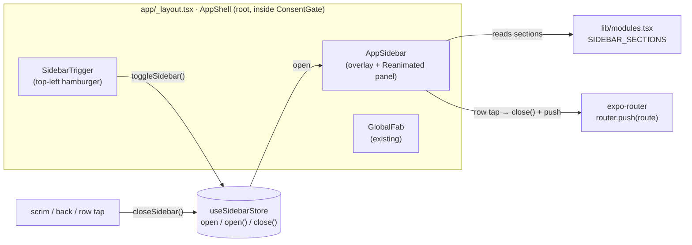
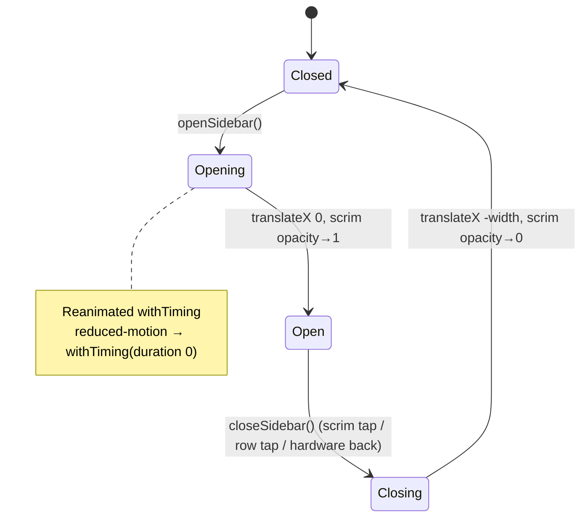

# feat: Left Module Sidebar — Expandable Navigation to Every Module

## Summary

Add a left-edge sidebar drawer that opens on tap (hamburger trigger) and slides in to expose **every** module the app ships — all 8 feature modules in `HUB_MODULES` regardless of enabled/pinned state, plus the Hub and the app-level screens (Settings, Profile, Feedback). It is a single globally-mounted overlay (sibling to `GlobalFab`), animated with Reanimated, controlled by a small Zustand store so any screen can open it.

The sidebar is **additive navigation** — it does not replace the bottom `HubTabBar` (pinned shortcuts) or the Hub grid. It is the one surface that always shows the full catalog.

---

## Problem Frame

Today there are three ways to reach a module, and none shows the full set in one tap:

- **Bottom `HubTabBar`** — only Hub + up to `PIN_CAP` (4) pinned modules (`lib/hub-tab-screens.ts`, `lib/hub-store.ts`).
- **Hub grid** (`app/(tabs)/hub/index.tsx`) — only modules in `resolveEnabledModules(...)`; disabled-but-shipped modules are invisible.
- **Deep links** — not user-discoverable.

A user on São Miguel (default `enabledModules: ['transit', 'events']`) literally cannot navigate to `news`, `trails`, `weather`, etc. from the UI even though those screens exist under `app/(tabs)/`. The sidebar fixes this: one persistent affordance → every module.

**Scope:** navigation surface only. No changes to module screens, routing files, or the enable/pin model.

---

## Key Technical Decisions

### KTD1 — Custom Reanimated overlay, not `@react-navigation/drawer`
`@react-navigation/drawer` requires `react-native-gesture-handler`, which is **not** a dependency (`package.json`). The ask is "on click will expand" — tap-triggered, not swipe — so a gesture-driven drawer navigator is unnecessary weight. Build a custom absolute-positioned overlay animated with `react-native-reanimated` (4.3.1, already present) + `react-native-worklets`. This mirrors the existing `GlobalFab` pattern (root-mounted overlay, scrim `Pressable`, `theme.scrim`) and works on `react-native-web` for free.

### KTD2 — Show EVERY shipped module, ignore enabled/pinned filters
The differentiator vs. Hub grid and tab bar. The sidebar iterates `HUB_MODULES` directly (all 8) — not `resolveEnabledModules(...)`. All `(tabs)/*` routes resolve via Expo Router file routing regardless of `href`/pin state, so `router.push('/weather')` works even when `weather` is disabled. Enabled state may still be surfaced as a subtle visual hint (see KTD5), but every module is always present and tappable.

### KTD3 — Global Zustand store for open state (`lib/sidebar-store.ts`)
Mirror `lib/fab-store.ts`. A tiny store (`open`, `openSidebar`, `closeSidebar`, `toggleSidebar`) lets the trigger button, the drawer, and any future screen control it imperatively without prop drilling or navigation params.

### KTD4 — Mount once at root in `AppShell`, inside `ConsentGate`
Place `<AppSidebar />` and its trigger as siblings of `<GlobalFab />` in `app/_layout.tsx`. Root mount means it overlays the entire `(tabs)` stack and persists across tab switches. Inside `ConsentGate` so it never appears before consent.

### KTD5 — Trigger = global top-left hamburger, hidden on modal routes
Screens run `headerShown: false`, so there is no header to host a menu button. Add a small top-left floating trigger (mirror of `GlobalFab`'s bottom-right placement, using `useSafeAreaInsets`). Reuse a pathname-based visibility check like `isFabHidden` so the trigger is hidden on modal/sheet routes (`settings`, `profile`, `feedback`, `onboarding/consent`) where a back/close affordance already owns the top-left.

### KTD6 — Module list = three sections
`Hub` (top) · `Modules` (all 8 from `HUB_MODULES`) · `App` (Settings, Profile, Feedback). Active route is highlighted via `usePathname()` matched against each item's route.

---

## High-Level Technical Design

Component / control flow (directional, not implementation spec):

Open/close animation lifecycle:

---

## Implementation Units

### U1. Sidebar open-state store
**Goal:** Global imperative control of the drawer, decoupled from any screen.
**Files:**
- `lib/sidebar-store.ts` (new)
**Approach:** Zustand `create` store mirroring `lib/fab-store.ts`: `{ open: boolean; openSidebar(); closeSidebar(); toggleSidebar() }`. Not persisted (ephemeral UI state). No selectors needed beyond the booleans/actions.
**Patterns to follow:** `lib/fab-store.ts`.
**Test scenarios:**
- `toggleSidebar()` flips `open` false→true→false.
- `openSidebar()` then `openSidebar()` is idempotent (stays `true`).
- `closeSidebar()` from closed state is a no-op (stays `false`).
**Verification:** Store actions produce expected state transitions; no re-render of unrelated subscribers (select narrow slices).

### U2. Sidebar navigation registry + i18n keys
**Goal:** A single source of truth for everything the sidebar lists, including non-module app links, plus translated labels.
**Files:**
- `lib/modules.tsx` (modify — add sidebar sections)
- `locales/pt.json`, `locales/en.json`, `locales/de.json`, `locales/es.json`, `locales/fr.json`, `locales/it.json`, `locales/uk.json`, `locales/zh.json` (modify — add keys)
**Approach:**
- Add a `SidebarNavItem` type (`{ key; route: Href; labelKey; Icon: LucideIcon; accent?; section }`) and a `SIDEBAR_SECTIONS` structure (or a flat `SIDEBAR_ITEMS` + section grouping helper):
  - **Hub** section: the `HUB_TAB` entry.
  - **Modules** section: spread all `HUB_MODULES` (all 8 — no filtering).
  - **App** section: Settings (`/settings`, `Settings` icon), Profile (`/profile`, `User`/`CircleUser` icon), Feedback (`/feedback`, `MessageSquarePlus` icon).
- Reuse existing label keys where present (`navBarSearchLabel`, `navBarNewsLabel`, `navBarEarthquakesLabel`, `navBarTrailsLabel`, `navBarMarketplaceLabel`, `navBarTrafficLabel`, `navBarToursLabel`, `navBarWeatherLabel`, `hubTitle`, `settingsTitle`).
- Add new keys (all 8 locales, `pt` is source-of-truth + fallback): `sidebarTitle`, `sidebarSectionModules`, `sidebarSectionApp`, `sidebarOpen`, `sidebarClose`, `navBarProfileLabel` (if absent), `fabSendFeedback` already exists for Feedback label — reuse or add `sidebarFeedbackLabel`.
**Patterns to follow:** `HUB_MODULES` / `HUB_TAB` shape in `lib/modules.tsx`; key layout in `locales/en.json`.
**Test scenarios:**
- Registry includes all 8 module keys from `HUB_MODULES` (assert length/keys parity).
- App section routes resolve to existing files (`/settings`, `/profile`, `/feedback`).
- `node check_locale_keys.js`-style parity: every new key exists in all 8 locales (no missing-key gaps).
**Verification:** `npx tsc --noEmit` clean; locale-key parity check reports zero missing for new keys.

### U3. `AppSidebar` overlay component
**Goal:** The animated left panel + scrim that renders the registry and navigates on tap.
**Files:**
- `components/AppSidebar.tsx` (new)
**Approach:**
- Subscribe to `useSidebarStore`. Render nothing (or `pointerEvents="none"`) when closed and animation settled.
- **Scrim:** full-screen `Pressable` with `theme.scrim`, animated opacity; tap → `closeSidebar()`. Mirror `GlobalFab` backdrop.
- **Panel:** absolute, left-anchored, width `min(0.82 * screenWidth, 360)`, `theme.surface` bg, `elevation(3, ...)`, top/bottom `useSafeAreaInsets`. Reanimated `useSharedValue` translateX from `-width` → `0` via `withTiming`; backdrop opacity shared value in parallel.
- **Content:** header (`sidebarTitle` + close `X` `IconButton`), then sections rendered with `typography.overline` section headers (matching Settings' section-label pattern) and rows.
- **Row:** icon tile tinted with `withAlpha(accent, 0.12)` (reuse `HubModuleTile` visual language), label, active highlight when `usePathname()` matches `route`. On tap: `closeSidebar()` then `router.push(route)`. Optional subtle "off" treatment (reduced opacity / dot) for modules not in `resolveEnabledModules(...)` — informational only, still navigable (KTD2).
- **Reduced motion:** if `AccessibilityInfo.isReduceMotionEnabled()` true, use `withTiming(..., { duration: 0 })`.
- **Hardware back (Android):** while open, intercept back to close instead of navigating (`BackHandler`).
- Use a scrollable container (`ScrollView`) for the rows so the full catalog fits on small screens.
**Patterns to follow:** `components/GlobalFab.tsx` (overlay + scrim + root mount), `features/hub/components/HubModuleTile.tsx` (icon-tile visual), `app/settings.tsx` (section headers, `ListRow`).
**Test scenarios:**
- Renders one row per registry item; all 8 module rows present even when `enabledModules` = `['transit','events']`.
- Tapping a row calls `closeSidebar()` then `router.push(item.route)` with the correct href.
- Tapping the scrim closes without navigating.
- Active route row carries the highlight style; others do not.
- Reduce-motion on → no slide animation (duration 0), still functionally opens/closes.
- Android hardware back while open closes the drawer and does not pop the route.
**Verification:** Manual run on iOS/Android/web: open from trigger, every module reachable, animations smooth (~200–250ms), scrim dismiss works, back button handled.

### U4. `SidebarTrigger` (global hamburger button)
**Goal:** The always-available affordance that opens the sidebar.
**Files:**
- `components/SidebarTrigger.tsx` (new)
- `lib/fab-registry.ts` (modify — optional: reuse/extend `isFabHidden` or add `isSidebarHidden`) **or** add a small `lib/sidebar-visibility.ts`
**Approach:**
- Top-left floating `Pressable` (`Menu` icon from `lucide-react-native`), positioned with `useSafeAreaInsets().top + space.sm`, `left: space.lg`. Circular, `theme.surface`/`theme.text`, `elevation(2)`, `hitSlop.minTouch`. On press → `toggleSidebar()`.
- Visibility: hidden when sidebar route is a modal/sheet (`settings`, `profile`, `feedback`, `onboarding/consent`) — reuse the `isFabHidden(pathname)` predicate or a sibling predicate. Hidden while the sidebar itself is open (the panel header owns close).
- a11y: `accessibilityRole="button"`, `accessibilityLabel={t('sidebarOpen')}`.
**Patterns to follow:** `components/GlobalFab.tsx` placement math (`insets`, `space`), `lib/fab-registry.ts` `isFabHidden`.
**Test scenarios:**
- Trigger visible on `/hub` and all `(tabs)/*` routes.
- Trigger hidden on `/settings`, `/profile`, `/feedback`, `/onboarding/consent`.
- Press calls `toggleSidebar()`.
- Trigger hidden while `open === true`.
**Verification:** Manual: button appears top-left over content on all main screens, absent on modals, opens drawer on tap, doesn't collide with screen content/headers.

### U5. Wire sidebar + trigger into the root shell
**Goal:** Mount both globally, once, with correct layering.
**Files:**
- `app/_layout.tsx` (modify — `AppShell`)
**Approach:** Inside `ConsentGate`, after the `<Stack>`, render `<SidebarTrigger />` and `<AppSidebar />` as siblings of `<GlobalFab />`. Ensure z-order: scrim/panel above tab content and above `GlobalFab` when open (render `AppSidebar` last, or manage via elevation/absolute stacking). Confirm `SafeAreaProvider`/`ThemeProvider` already wrap them (they do).
**Patterns to follow:** existing `<GlobalFab />` mount in `AppShell`.
**Test expectation:** none for the mount itself beyond integration — covered by U3/U4 scenarios exercised through the real shell.
**Verification:** App boots, trigger renders, drawer opens over any tab, closing returns to the same tab/scroll position; no double-mount; no layout shift of existing FAB.

---

## System-Wide Impact

- **No native deps added** — Reanimated/worklets already present; avoids `gesture-handler` install + native rebuild (KTD1).
- **i18n:** 8 locale files gain a handful of keys; `pt` fallback covers any gap. Run the locale-key parity check.
- **Web:** overlay + Reanimated render under `react-native-web`; `BackHandler` is a no-op there (guard with `Platform.OS === 'android'`).
- **Existing navigation untouched:** `HubTabBar`, hub grid, `landing-page`, and pin/enable model unchanged.

---

## Risks & Mitigations

- **No test harness in repo** (`package.json` has no `test` script / jest). → Test scenarios above are behavioral specs to be verified manually + via the locale-key check; if a harness lands later they convert directly to RTL/jest cases. Flagged as a known gap, not a blocker.
- **Trigger overlap with screen content** (floating top-left button over scrollable headers like `HubHero`). → Use translucent/elevated button + safe-area top inset; verify on Hub, transit, weather. If collisions appear, fallback is to render the trigger only inside `HubHero` + a shared header slot rather than globally (cheaper alternative, noted).
- **Showing disabled modules** routes to screens that may render empty/disabled states. → Intentional per KTD2 ("EVERY module"); optionally tag non-enabled rows with a subtle visual hint so it's clearly intentional.
- **Z-index vs `GlobalFab`** when both could be visible. → Sidebar open hides trigger and covers screen with scrim; render `AppSidebar` after `GlobalFab` so it wins stacking.

---

## Deferred to Follow-Up Work

- Swipe-from-edge to open (would require `react-native-gesture-handler`).
- Reordering / hiding sidebar items from Settings.
- Per-module badge counts in the sidebar (reuse `useLiveTabBadges`).
- Nested/collapsible sub-sections per module.

---

## Sources

- `app/_layout.tsx`, `app/(tabs)/_layout.tsx`, `app/(tabs)/hub/index.tsx`
- `lib/modules.tsx`, `config/island.ts`, `lib/hub-store.ts`, `lib/hub-tab-screens.ts`, `lib/landing-page.ts`
- `components/GlobalFab.tsx`, `components/HubTabBar.tsx`, `features/hub/components/HubModuleTile.tsx`
- `lib/fab-store.ts`, `lib/fab-registry.ts`, `lib/tokens.ts`, `lib/theme.tsx`, `lib/i18n.ts`
- `package.json` (Expo 56, Reanimated 4.3.1, no gesture-handler)
