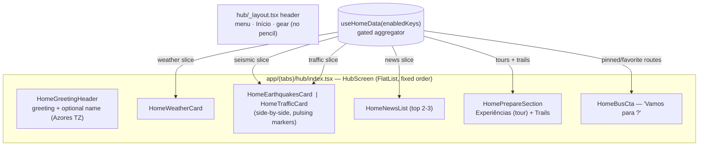
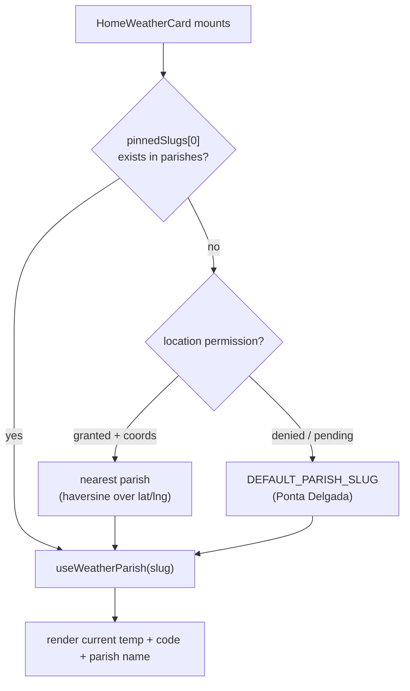
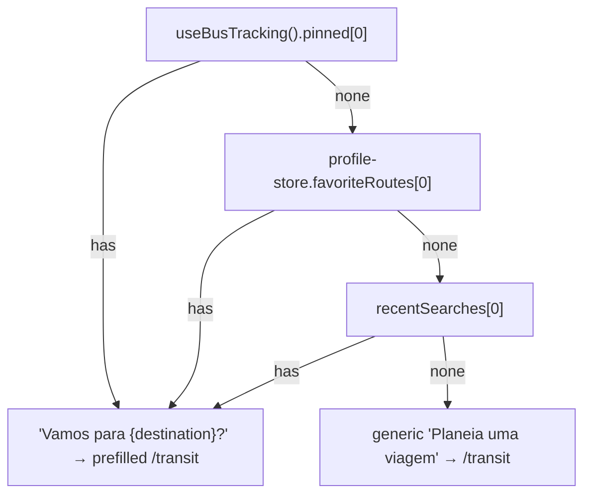

# feat: Hub Home Feed Redesign — "Inicio" Dashboard

> **Target repo:** `SaoMiguelBus` (Expo 56 / React Native client). All paths below are relative to that repo.

## Summary

Turn the Hub screen (`/hub`, titled **"Início"**) from a **module-launcher grid** into a **curated home dashboard** matching the mockup: a time-of-day greeting (+ optional user name, Azores timezone), a current weather card (pinned-parish → device-location → Ponta Delgada fallback), side-by-side **Earthquakes** and **Traffic** map-preview cards, a short **News** list, a "Quero preparar algo para hoje?" section pairing **Experiências** (Viator tours) and **Trails**, and a **"Vamos para &lt;destino&gt;?"** bus CTA driven by pinned/favorite routes.

The header keeps the menu and gear; the **pencil/edit affordance is removed** — this design is not user-customizable for now. Module discovery (the role the grid played) is already covered by the bottom `HubTabBar` (pinned shortcuts) and the `AppSidebar` (every module), so the grid is retired from Início entirely (no edit mode, no reorder, no per-user layout).

Every card is **gated by enabled modules** (an island without `weather`/`news`/etc. simply omits that card) and composed through a single gated aggregator hook in the established `useHubPreviews` style. The Earthquakes and Traffic cards use **SVG mini-maps with pulsing red markers** (not live `MapView`s) whose count and pulse intensity scale with the number of live events — keeping the always-visible screen cheap with **no new native dependencies**.

---

## Problem Frame

Today `app/(tabs)/hub/index.tsx` renders a `FlatList` of module tiles (`getEnabledHubModules`) with a thin `HubHero` header (greeting + island name) and live previews only for **seismic** (SVG `AzoresMiniMap`) and **traffic** (category count chips). The mockup is a fundamentally different screen — a personalized, content-first dashboard, not a launcher.

Gaps between the mockup and current state:

| Mockup element | Current state |
|---|---|
| Greeting "Bom Dia, &lt;name&gt;" (Azores TZ, name optional) | `HubHero` greeting is time-only **and** uses device `getHours()`, not Azores time (latent bug). No user name stored anywhere. |
| Current weather forecast card | No weather on hub. Full weather module exists (`/weather`) with `useWeatherParish`/`useWeatherParishes`, but no hub card and no pinned→location→default resolver. |
| Earthquakes card — "live Azores map" | Exists as a tile preview (`HubSeismicPreview` → `AzoresMiniMap`), not a standalone dashboard card. |
| Traffic card — "live São Miguel map, real-time" | Hub traffic preview is count chips only; no São Miguel mini-map. Real `TrafficMap` is full-screen only. |
| News list (1, 2…) | No hub news preview. `useNewsArticles` + `NewsCard` exist on `/news`. |
| "Quero preparar algo para hoje?" → Experiências + Trails | No section. `useTours`/`TourCard` and `useTrails`/`TrailCard` exist on their screens. |
| "Vamos para &lt;destino&gt;?" bus CTA | None. Pinned/favorite/recent routes live in `lib/profile-store.ts` + `useBusTracking()`. |
| Gear (settings) header; **no edit** | Header has `SidebarHeaderButton` + `HubEditHeaderButton` (pencil) + `SettingsHeaderButton` (gear) today. The **pencil is removed**; keep menu + gear. |

**Scope:** the `/hub` screen content, a handful of new home-card components, one aggregator hook, a parish resolver, a greeting fix, a user-name field, a São Miguel SVG mini-map with animated markers, and i18n keys. **Not** in scope: changing module screens, the API, routing files, the sidebar, the tab bar, or any per-user hub customization/edit mode.

---

## Key Technical Decisions

### KTD1 — Curated feed replaces the grid; no edit mode (not user-customizable for now)
The mockup has no module grid. The grid's only job was launching modules, which is now redundant: `HubTabBar` shows pinned shortcuts and `AppSidebar` lists **every** module (per `docs/plans/2026-06-03-001-...-sidebar`). So `HubScreen` renders a **fixed** curated dashboard — the section set and order are hard-coded (mockup order), filtered only by enabled modules. **There is no per-user customization**: no home edit mode, no reorder/hide, no grid/list toggle. The pencil/edit affordance is removed (KTD6). `lib/hub-store.ts` stays on disk because `HubTabBar` still reads `pinnedKeys` (defaults apply), but it is no longer edited from the hub. The grid tile components (`HubModuleTile`, `HubEditControls`, `LandingPagePicker`) are no longer rendered on Início; `LandingPagePicker` already also lives in `app/settings.tsx`, so the landing-page choice survives there.

### KTD2 — SVG mini-maps with pulsing markers, NOT live `MapView`s
The mockup labels both as "live maps." The repo deliberately avoids embedding `react-native-maps` on the always-visible hub (perf: cold-start, memory, scroll jank) — seismic already uses an SVG `AzoresMiniMap` (`features/hub/components/previews/AzoresMiniMap.tsx`) + `lib/azores-map-projection.ts`. Decision: SVG mini-maps with **animated, pulsing red markers** — one marker per event, and the **pulse intensity scales with the event count** (more events → faster/stronger flashing glow), so the card reads as a live, real-time map. **Earthquakes** reuses `AzoresMiniMap` (archipelago) and **Traffic** gets a new **São Miguel** SVG variant; both gain the pulsing-marker treatment. Animation via `react-native-reanimated` + `react-native-svg` animated circles; **reduced-motion disables the pulse** (static dots). Zero `MapView`s on Início; `react-native-maps` returns `null` on web anyway, so SVG is the only cross-platform option. *(A frozen non-interactive `MapView` like `TrailMap` is the deferred fallback.)*

### KTD3 — One gated aggregator hook: `useHomeData(enabledKeys)`
Mirror `features/hub/hooks/useHubPreviews.ts`. A single `features/hub/hooks/useHomeData.ts` internally gates each sub-query by `enabledKeys.includes(key)` (`enabled` flag), returning a per-slice `{ data, isLoading }` for weather, seismic, traffic, news, tours, trails, plus the bus-CTA source. Follows repo conventions: query keys `[module,'v1',kind,...params, islandKey|i18n.language]`, `staleTime` 30 min, traffic poll 60 s, seismic 24 h window. Disabled modules never fetch.

### KTD4 — Weather resolver: pinned parish → device location → Ponta Delgada default
New `features/weather/hooks/useResolvedParish.ts`:
1. `useWeatherStore().pinnedSlugs[0]` if it still exists in the parishes list.
2. Else, one-shot device location (reuse the permission pattern from `features/traffic/hooks/useNearbyLocation.ts`, but `getCurrentPositionAsync` not `watchPositionAsync`) → nearest parish by haversine over `ParishWeather.latitude/longitude`.
3. Else a `DEFAULT_PARISH_SLUG` constant (a Ponta Delgada freguesia, e.g. `sao-sebastiao-ponta-delgada`) — **verify the exact slug against `GET /api/v3/weather/parishes`** at implementation time. The card then uses `useWeatherParish(resolvedSlug)`. Location is opt-in and never blocks render (resolver returns the default while permission/coords are pending).

### KTD5 — Greeting fix + optional user name, Azores timezone
`lib/hub-greeting.ts` currently uses `new Date().getHours()` (device TZ → wrong for off-island users). Compute the hour in `Atlantic/Azores` via `Intl.DateTimeFormat('en', { hour: 'numeric', hour12: false, timeZone: 'Atlantic/Azores' })`. Keep the three existing keys (`hubGreetingMorning/Afternoon/Evening`). Add an **optional display name**: store `displayName` in `lib/profile-store.ts` (persisted), editable from the profile screen; greeting renders `t('hubGreetingNamed', { greeting, name })` ("Bom dia, {{name}}") when set, else the bare greeting. Mockup: "If no name just show the greeting."

### KTD6 — Remove the pencil/edit from the header
The hub stack header (`app/(tabs)/hub/_layout.tsx`) renders `SidebarHeaderButton` (menu) + `HubEditHeaderButton` (pencil) + `SettingsHeaderButton` (gear). **Remove `HubEditHeaderButton`** so the header is menu / "Início" / gear. Also remove the hub `customize-hub` FAB action in `app/(tabs)/hub/index.tsx`. `HubEditHeaderButton` and `useHubStore.editMode` are left on disk (unused by the hub) to avoid touching unrelated code, but nothing on Início toggles edit. Title stays `t('hubTitle')` → "Início".

### KTD7 — Fixed section order (no persistence/customization)
Section set and order are a hard-coded constant matching the mockup: greeting → weather → (earthquakes | traffic) row → news → "prepare" (experiências + trails) → bus CTA. The only runtime filter is enabled-module gating. No `useHomeStore`, no AsyncStorage, no reorder/hide — deliberately deferred (see Deferred section).

---

## High-Level Technical Design

Directional only — not implementation spec.

### Screen composition

### Weather parish resolver (KTD4)

### Bus CTA destination resolution

---

## Implementation Units

> No test harness exists in the repo (`package.json` has no `test`/jest). Test scenarios below are **behavioral specs** to verify manually + via `node check_locale_keys.js` and `npx tsc --noEmit`. They convert directly to RTL/jest if a harness lands.

### U1. i18n keys for the home dashboard (all 8 locales)
**Goal:** All new user-facing copy exists in every locale, `pt` as source/fallback.
**Requirements:** Every card and the greeting need translated strings (no hardcoded text — rebrand DoD, `docs/ui-SDD/00-overview.md` §5).
**Dependencies:** none (foundational — other units reference these keys).
**Files:**
- `locales/pt.json`, `locales/en.json`, `locales/de.json`, `locales/es.json`, `locales/fr.json`, `locales/it.json`, `locales/uk.json`, `locales/zh.json`
**Approach:** Add keys (reuse existing where present — `hubGreetingMorning/Afternoon/Evening`, `navBar*Label`, `weather*`, `news*`):
- `hubGreetingNamed` → "Bom dia, {{name}}" style wrapper taking `{{greeting}}` + `{{name}}` (or interpolate name into a single string per locale grammar).
- `homeWeatherTitle`, `homeWeatherUnavailable`, `homeWeatherLocating`.
- `homeEarthquakesTitle`, `homeTrafficTitle`, `homeNewsTitle`, `homeNewsEmpty`.
- `homePrepareTitle` → "Quero preparar algo para hoje?"; `homeExperiencesLabel`, `homeTrailsLabel`.
- `homeBusCtaNamed` → "Vamos para {{destino}}?"; `homeBusCtaGeneric` → "Planeia uma viagem".
**Patterns to follow:** flat camelCase keys in `locales/pt.json`; interpolation `{{count}}` style; `lib/i18n.ts` fallback `pt`.
**Test scenarios:**
- `node check_locale_keys.js` reports **zero** missing keys across all 8 locales for the new keys.
- Switching device locale renders translated greeting/section titles (manual).
- Missing-name path: `hubGreetingNamed` not used; bare greeting key renders.
**Verification:** locale-key parity clean; `tsc` clean.

### U2. Azores-timezone greeting + optional display name
**Goal:** Correct greeting regardless of device timezone, with "Bom dia, {{name}}" when a name is set.
**Requirements:** Mockup greeting (Azores TZ; name optional). Fixes a latent bug.
**Dependencies:** U1 (keys).
**Files:**
- `lib/hub-greeting.ts` (modify — compute hour in `Atlantic/Azores`)
- `lib/profile-store.ts` (modify — add persisted `displayName: string | null` + `setDisplayName`)
- `app/profile.tsx` (modify — add a name field/row to set/clear `displayName`)
- `features/hub/components/HomeGreetingHeader.tsx` (new — greeting + optional name; or fold into U7)
**Approach:** `hubGreetingKey(date)` keeps `<12 / <18 / else` tiers but derives `hour` from `Intl.DateTimeFormat('en', { hour: 'numeric', hour12: false, timeZone: 'Atlantic/Azores' }).format(date)`. `HomeGreetingHeader` reads `displayName` from `profile-store`; if present renders `t('hubGreetingNamed', { greeting: t(hubGreetingKey()), name })`, else `t(hubGreetingKey())`. Add `displayName` to `partialize` + bump store `version` with a `migrate` no-op.
**Patterns to follow:** `lib/hub-greeting.ts`, persisted-store shape in `lib/profile-store.ts`, profile rows in `app/profile.tsx`.
**Test scenarios:**
- At a UTC instant where Azores hour < 12 but device (e.g. UTC+2) hour ≥ 12, greeting = morning (verify Azores wins).
- Boundary: Azores 11:59 → morning; 12:00 → afternoon; 18:00 → evening.
- `displayName` set → "Bom dia, Maria"; cleared → "Bom dia".
- `displayName` survives app restart (persisted).
**Verification:** greeting matches Azores wall-clock on a device set to another TZ; name toggles correctly; `tsc` clean.

### U3. Weather parish resolver (pinned → location → default)
**Goal:** Resolve which parish the home weather card shows, per KTD4.
**Requirements:** Mockup: "Use the pinned parish as default, fallback to location, last fallback to Ponta Delgada."
**Dependencies:** none (independent of UI).
**Files:**
- `features/weather/hooks/useResolvedParish.ts` (new)
- `features/weather/weather-constants.ts` (new or extend — `DEFAULT_PARISH_SLUG`)
- `lib/geo.ts` (new or extend — `nearestByHaversine(coords, points)`) *(check for an existing haversine in `lib/island-map.ts` first and reuse)*
**Approach:** Hook returns `{ slug, source: 'pinned'|'location'|'default', isLocating }`. Order: (1) `useWeatherStore().pinnedSlugs[0]` validated against `useWeatherParishes().data.parishes`; (2) one-shot `getCurrentPositionAsync` (reuse permission handling from `features/traffic/hooks/useNearbyLocation.ts`; web → `navigator.geolocation.getCurrentPosition`) → nearest parish by haversine; (3) `DEFAULT_PARISH_SLUG`. Never throws/blocks: returns the default while location resolves. Gated so it only runs when `weather` is enabled.
**Patterns to follow:** `features/traffic/hooks/useNearbyLocation.ts` (permission + web branch), `features/weather/hooks/useWeatherQueries.ts`.
**Test scenarios:**
- Pinned slug exists → returns it, `source:'pinned'`, no location request fired.
- No pin, permission granted, coords near parish X → returns X, `source:'location'`.
- No pin, permission denied → returns `DEFAULT_PARISH_SLUG`, `source:'default'`, `isLocating:false`.
- No pin, permission pending → returns default immediately with `isLocating:true`, then updates when coords arrive.
- Pinned slug no longer in parishes list (stale) → falls through to next step.
**Verification:** all four branches reachable on device (toggle location perms); `DEFAULT_PARISH_SLUG` confirmed present in `GET /api/v3/weather/parishes`.

### U4. Pulsing SVG markers + São Miguel mini-map
**Goal:** Animated, pulsing red markers (count + intensity scale with event count) on both the Azores (earthquakes) and a new São Miguel (traffic) SVG mini-map (KTD2).
**Requirements:** Earthquakes "live Azores map" + Traffic "live São Miguel map," both with flashing red dots reflecting the number of events.
**Dependencies:** none.
**Files:**
- `features/hub/components/previews/PulsingMarker.tsx` (new — reusable animated SVG dot)
- `features/hub/components/previews/AzoresMiniMap.tsx` (modify — use `PulsingMarker`, drive pulse from event count)
- `features/hub/components/previews/SaoMiguelMiniMap.tsx` (new — São Miguel variant)
- `lib/azores-map-projection.ts` (modify — add São Miguel bbox/projection helper; or reuse `getIslandMapRegion()` from `lib/island-map.ts`)
**Approach:**
- `PulsingMarker`: a `react-native-svg` `Circle` (red — earthquakes accent `#dc2626`, or the module accent) animated with `react-native-reanimated` (`useSharedValue` + `withRepeat(withTiming(...))`) cycling opacity + radius for a "flash/glow" effect. A `intensity` prop (derived from total event count, e.g. `min(count/THRESHOLD, 1)`) scales pulse **speed and/or glow radius** — more events → faster, more prominent flashing. `reduceMotion` → static circle (no `withRepeat`).
- `AzoresMiniMap`: keep the existing archipelago projection; swap static dots for `PulsingMarker`s, passing `intensity` from `magnitudes.length` (or summed magnitude). Earthquakes already use red accent.
- `SaoMiguelMiniMap`: mirror `AzoresMiniMap` shape using the São Miguel bbox; plot one `PulsingMarker` per active traffic report, `intensity` from active-report count, red/traffic-accent tint.
- Light/dark aware via theme tokens; rendered in a `surfaceSunken` box.
**Patterns to follow:** `features/hub/components/previews/AzoresMiniMap.tsx`, `lib/azores-map-projection.ts`, `lib/island-map.ts`; reanimated repeat pattern from `components/GlobalFab.tsx` / sidebar overlay.
**Test scenarios:**
- N events → N pulsing markers; 0 events → empty island shape, no markers, no crash.
- Higher event count → visibly faster/stronger pulse than a low count (intensity mapping).
- Reduce-motion on → markers render static (no animation), still correct positions/count.
- Out-of-bounds coords clamped/skipped, not drawn outside the box.
- Light/dark correct token colors; renders on web (react-native-svg + reanimated support web).
**Verification:** markers land in plausible positions vs the full `SeismicMap`/`TrafficMap`; animation is smooth and stops under reduced-motion; no layout overflow at card width.

### U5. `useHomeData` gated aggregator hook
**Goal:** One hook that fetches only the enabled modules' data for the dashboard.
**Requirements:** All cards are module-gated; compose 6+ sources cheaply (KTD3).
**Dependencies:** U3 (weather resolver feeds the weather slice).
**Files:**
- `features/hub/hooks/useHomeData.ts` (new)
**Approach:** `useHomeData(enabledKeys: ModuleKey[])` calls each feature query with `enabled: enabledKeys.includes(key)`: `useWeatherParish(resolvedSlug, weatherOn)`, `useSeismicEvents(24, seismicOn)`, `useTrafficReports({ enabled: trafficOn, refetchInterval: 60_000, limit: 100 })`, `useNewsArticles({ category:'noticias', enabled: newsOn })` *(add `limit`/`enabled` support if the hook lacks it — slice client-side to 3 if needed)*, `useTours(eventsOn)`, `useTrails({}, trailsOn)`. Bus CTA source from `useBusTracking().pinned` + `useProfileStore` (no network). Returns a typed object with per-slice `{ data, isLoading }`. No fetching for disabled modules.
**Patterns to follow:** `features/hub/hooks/useHubPreviews.ts` (gating + poll intervals), all `features/*/hooks/use*Queries.ts`.
**Test scenarios:**
- `enabledKeys` without `weather` → weather query disabled (no request), slice `data` undefined.
- `enabledKeys` with all modules → each slice resolves; traffic refetches every 60 s while mounted.
- News slice returns at most 3 items.
- Hook returns stable references (no render thrash) when inputs unchanged.
**Verification:** network inspector shows only enabled-module requests; traffic polls at 60 s; `tsc` clean.

### U6. Home card components
**Goal:** The individual dashboard cards from the mockup, token-styled, with loading/empty/error states.
**Requirements:** Weather, Earthquakes, Traffic, News, Experiências+Trails, Bus CTA cards.
**Dependencies:** U1 (keys), U3 (resolver), U4 (SM mini-map), U5 (data).
**Files:**
- `features/hub/components/home/HomeWeatherCard.tsx` (new)
- `features/hub/components/home/HomeEarthquakesCard.tsx` (new)
- `features/hub/components/home/HomeTrafficCard.tsx` (new)
- `features/hub/components/home/HomeNewsList.tsx` (new)
- `features/hub/components/home/HomePrepareSection.tsx` (new — Experiências `TourCard` + `TrailCard`)
- `features/hub/components/home/HomeBusCta.tsx` (new)
**Approach:** Each is a `components/ui/Card` (`elevated`, `radius.lg`) with a `typography.overline`/`headline` title and a `StateView` for loading (skeleton/shimmer) + empty + error. Weather: temp + `weatherCodeEmoji`/`weatherCodeLabelKey` (`features/weather/weatherCodes.ts`) + parish name; tap → `/weather/[slug]`. Earthquakes: `AzoresMiniMap` + count/"calm" line; tap → `/earthquakes`. Traffic: `SaoMiguelMiniMap` + active count; tap → `/traffic`. News: top 2–3 rows (reuse/compact `NewsCard`); tap row → `/news/[id]`, header tap → `/news`. Prepare: one `TourCard` + one `TrailCard` side-by-side; taps → `/tours`, `/trails`. Bus CTA: resolves destination per the CTA diagram; tap → prefilled `/transit` (`applySearch(origin,destination)` contract) or generic. All use module `accent` at 12% tint for chips; Lucide icons only; haptics on commit taps only; reduced-motion aware.
**Patterns to follow:** `components/ui/Card.tsx`, `components/ui/StateView.tsx`, `features/hub/components/HubModuleTile.tsx` (accent chip), `features/news/components/NewsCard.tsx`, `features/events/components/TourCard.tsx`, `features/trails/components/TrailCard.tsx`, `features/transit/components/PinnedRoutesSection.tsx`.
**Test scenarios:**
- Each card: loading → content, and empty/error → correct `StateView` (e.g. weather unavailable, news empty, no traffic = "tudo livre").
- Tapping a card/row navigates to the right route with correct params (weather slug, news id, prefilled transit O/D).
- Bus CTA shows destination from pinned route; with none, shows generic CTA.
- Light/dark + RTL-safe; web renders (no `MapView` dependency).
- Reduced-motion on → no enter animation.
**Verification:** every card matches the mockup blocks visually on iOS + Android + web; taps route correctly; accent identity per module.

### U7. Compose the new `HubScreen` (Início) layout + remove edit affordances
**Goal:** Replace the module-grid render with the curated, fixed-order, gated dashboard, and strip the pencil/edit + customize FAB.
**Requirements:** The full mockup layout, scrollable, pull-to-refresh, gated by enabled modules; no per-user customization.
**Dependencies:** U2, U5, U6.
**Files:**
- `app/(tabs)/hub/index.tsx` (modify — swap grid for dashboard; remove `customize-hub` FAB action + grid/edit code paths)
- `app/(tabs)/hub/_layout.tsx` (modify — remove `HubEditHeaderButton` from `headerRight`, keeping menu + gear)
- `features/hub/components/HomeGreetingHeader.tsx` (from U2, if not already)
**Approach:** Keep `useBootstrap`, `resolveEnabledModules`, `useStackScrollProps`, `useScrollContentPadding`. Compute `enabledKeys`, call `useHomeData(enabledKeys)`. Build the section list from a **hard-coded order constant** (greeting → weather → earthquakes+traffic row → news → prepare → bus CTA), filtered only by `enabledKeys`. Render via `FlatList`/`ScrollView` with `RefreshControl` (tinted `theme.primary`) that refetches the aggregator. Bootstrap-pending → per-card skeletons (reuse/extend `HubSkeletonTiles`). Earthquakes + Traffic render in a 2-col row; everything else full-width. Remove all `useHubStore` edit usage, the `customize-hub` FAB action, and `HubEditControls`/`HubModuleTile` rendering from this screen. In `_layout.tsx`, drop `HubEditHeaderButton` so `headerRight` is just `SettingsHeaderButton`.
**Patterns to follow:** current `app/(tabs)/hub/index.tsx` (scroll props, bootstrap), `docs/ui-SDD/10-hub.md` (states, motion, a11y).
**Test scenarios:**
- All modules enabled → all cards render in mockup order; **no pencil** in the header; no customize FAB.
- `weather` disabled → weather card absent, no gap/crash; remaining order intact.
- Pull-to-refresh refetches visible slices (spinner tinted primary).
- Empty island (no enabled content modules) → greeting + a sensible `EmptyState`/bus CTA only.
- Loading state shows skeletons, not blank.
- `HubTabBar` bottom shortcuts still render from default `pinnedKeys` (unaffected).
**Verification:** screen matches mockup composition; gating works per island; header shows only menu + gear; scroll/refresh smooth; no `MapView` mounted; `tsc` clean.

---

## System-Wide Impact

- **No new native deps.** Reuses `react-native-svg`, `react-native-reanimated`, `expo-location`, `expo-haptics`, `expo-blur` (all already in `package.json`). Keep `@react-native-async-storage/async-storage` pinned to `2.2.0` (SDK 56) — do not bump.
- **i18n:** 8 locale files gain ~15 keys; `pt` is source + fallback. `node check_locale_keys.js` must pass.
- **Web:** SVG mini-maps render under `react-native-web`; no `MapView` is mounted, so no web map fallback needed on the hub.
- **Navigation untouched:** `HubTabBar`, `AppSidebar`, routing files, tab order, and the pin/enable model are unchanged. `HubTabBar` keeps reading default `pinnedKeys` from `lib/hub-store.ts`; the grid components remain on disk but are no longer rendered.
- **Lost capability (intentional, for now):** removing edit mode means users can no longer change bottom-bar pins or hub layout from the hub. Defaults apply; landing-page choice still lives in Settings. Re-introducing customization is deferred.
- **Perf:** the always-visible Início stays cheap (SVG + reanimated pulse, gated queries, traffic poll 60 s, no live maps) — the established hub-perf posture is preserved.
- **Read the versioned Expo 56 docs** (`docs.expo.dev/versions/v56.0.0/`) before touching `expo-location`/`expo-haptics` APIs (per repo `AGENTS.md`).

---

## Risks & Mitigations

- **"Live map" expectation vs SVG mini-map (KTD2).** Mockup says "live map"; we ship SVG with pulsing markers. → Reads as a live, real-time map and matches the existing seismic tile; real-MapView is deferred. If stakeholders insist on a real map, swap the traffic card for a frozen `MapView` (TrailMap pattern) — single map, web-gated — without touching other units.
- **Pulse animation perf.** Many pulsing markers (e.g. a busy quake swarm) could be costly. → Cap rendered markers (e.g. top N by recency/magnitude), drive intensity from total count, share one shared-value clock across markers; reduced-motion fully disables animation.
- **`DEFAULT_PARISH_SLUG` mismatch.** The exact Ponta Delgada freguesia slug must exist server-side. → Verify against `GET /api/v3/weather/parishes` at implementation; pick a stable city freguesia (`sao-sebastiao-ponta-delgada` / `sao-jose-ponta-delgada`).
- **Location permission UX.** One-shot location could prompt on first Início view. → Default to Ponta Delgada immediately; only request location when there's no pinned parish; never block render. Consider deferring the prompt until the user taps "use my location" (optional refinement).
- **Pinning unreachable after edit removal.** Bottom-bar pins can no longer be changed from the hub. → Accepted for now (KTD1); defaults apply, landing-page choice survives in Settings. Re-introduce later if needed.
- **No test harness.** Scenarios are manual/behavioral + `tsc` + locale check. → Flagged, not a blocker; converts to RTL later.
- **News hook may lack `limit`/`enabled`.** → Add params or slice client-side in `useHomeData` (U5).

---

## Open Questions (non-blocking — sensible defaults chosen)

1. **Where does the user set their display name?** Defaulted to the **profile screen** (`app/profile.tsx`). Could also live in Settings.
2. **Earthquakes + Traffic side-by-side on small screens** — keep 2-col always, or stack on narrow widths? Defaulted to 2-col row (matches mockup); revisit if cards get cramped.
3. **Pulse intensity mapping** — exact `count → speed/glow` curve and the marker cap (Risks). Defaulted to a simple `min(count/THRESHOLD, 1)`; tune visually during U4.

---

## Scope Boundaries

**In scope:** `/hub` screen content, home card components, `useHomeData`, parish resolver, greeting/timezone fix + display name, pulsing SVG markers + São Miguel mini-map, removing the pencil/edit + customize FAB, i18n keys.

### Deferred to Follow-Up Work
- **Any per-user hub customization / edit mode** (reorder/hide cards, bottom-bar pin management) — explicitly removed for now.
- Real (frozen) `MapView` traffic preview as an alternative to the SVG mini-map.
- Per-section badge counts / "new since last visit" indicators.
- Deferring the location permission prompt behind an explicit "use my location" tap.
- A dedicated "All modules" launcher / shortcut-management surface (to restore pinning UX later).
- Capturing the timezone + map-perf + pulse decisions via `/ce-compound` after ship (repo has no `docs/solutions/` yet).

### Out of scope
- API changes, new endpoints, backend work.
- Sidebar (`AppSidebar`), `HubTabBar`, routing files, module screens.
- The enable/pin model in `lib/hub-store.ts` (left on disk for the tab bar; not edited).

---

## Sources & Research

- **Screen/spec:** `app/(tabs)/hub/index.tsx`, `app/(tabs)/hub/_layout.tsx`, `docs/ui-SDD/10-hub.md`, `docs/ui-SDD/00-overview.md`, prior plan `docs/plans/2026-06-03-001-feat-modules-sidebar-drawer-plan.md`.
- **Hub internals:** `features/hub/components/HubHero.tsx`, `HubModuleTile.tsx`, `HubEditControls.tsx`, `HubSkeletonTiles.tsx`, `LandingPagePicker.tsx`, `previews/AzoresMiniMap.tsx`, `previews/HubSeismicPreview.tsx`, `previews/HubTrafficPreview.tsx`, `features/hub/hooks/useHubPreviews.ts`, `lib/hub-store.ts`, `lib/hub-greeting.ts`, `lib/azores-map-projection.ts`, `lib/island-map.ts`, `lib/modules.tsx`.
- **Data layer:** `lib/api.ts`, `lib/query-provider.tsx`, `lib/types.ts`, `config/island.ts`.
- **Modules:** `features/weather/hooks/useWeatherQueries.ts`, `features/weather/weather-store.ts`, `features/weather/weatherCodes.ts`; `features/earthquakes/hooks/useEarthquakeQueries.ts`, `features/earthquakes/components/SeismicMap.tsx`; `features/traffic/hooks/useTrafficQueries.ts`, `features/traffic/hooks/useNearbyLocation.ts`, `features/traffic/components/TrafficMap.tsx`; `features/news/hooks/useNewsQueries.ts`, `features/news/components/NewsCard.tsx`; `features/events/hooks/useTourQueries.ts`, `features/events/components/TourCard.tsx`; `features/trails/hooks/useTrailQueries.ts`, `features/trails/components/TrailCard.tsx`; `features/transit/hooks/useBusTracking.ts`, `features/transit/components/PinnedRoutesSection.tsx`, `lib/profile-store.ts`.
- **Design system:** `components/ui/Card.tsx`, `components/ui/StateView.tsx`, `components/ui/ListRow.tsx`, `lib/tokens.ts`, `lib/theme.tsx`, `lib/color-utils.ts`, `lib/i18n.ts`, `locales/pt.json`.
- **Env:** Expo `~56.0.8`, RN `0.85.3`, react-native-maps `1.27.2`, reanimated `4.3.1`, svg `15.15.4`; `EXPO_PUBLIC_API_URL` drives the API base. No gesture-handler. No test harness.

