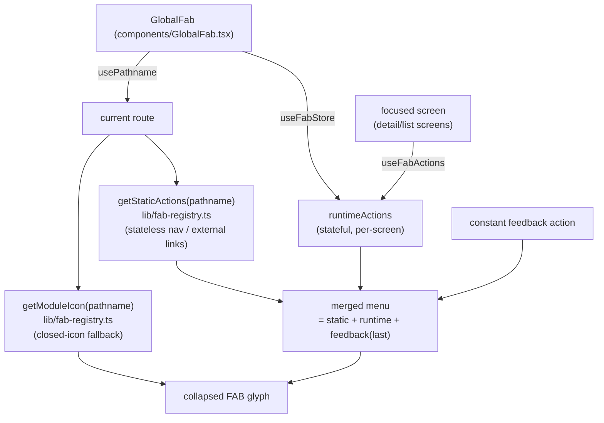
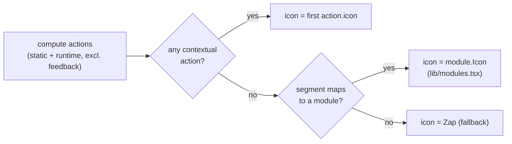

# feat: Smart per-screen FAB action matrix + contextual closed icon

## Summary

The global speed-dial FAB already exists and works (`components/GlobalFab.tsx`, `lib/fab-registry.ts`, `lib/fab-store.ts`), but its "smart" behaviour is thin: only **5 screens** contribute a contextual action (transit index, news/\*, trails/\*, marketplace index, traffic index). The other ~14 screens show **only "Send feedback"**, and on those the collapsed FAB falls back to a generic `Zap` icon that means nothing.

This plan does two things:

1. **A full per-screen action matrix** — every screen gets a deliberate, prioritized set of contextual actions, sourced almost entirely by **wiring handlers that already exist on each screen** into the FAB (share, call, WhatsApp, directions, book, browse, refresh, pin, customize, plan-a-trip). New behaviour is limited to trivial `Share.share` / `WebBrowser` / `Linking` calls that mirror patterns already in the codebase.
2. **A contextual collapsed icon** — the closed FAB shows the **primary (first) contextual action's icon**; when a screen has no contextual action it falls back to the **current module's icon** (from `lib/modules.tsx`) instead of `Zap`. The FAB now visually reflects "where you are and what you can do here."

No backend, no new native dependency, no change to the feedback form or the FAB's visual style. The registry/runtime-store architecture is unchanged — this fills it in and sharpens its routing.

---

## Problem Frame

The FAB's contract (UI-SDD 02 §7b) is "actions are route-aware." In practice the registry is sparse and the routing is coarse:

- **Segment-only matching.** `getStaticActions` keys off the first path segment, so `news/[articleId]` and `trails/[id]` silently inherit list-level actions ("Suggest a source" on an article screen), while transit detail/`directions` get nothing because transit is special-cased to the exact `/transit` path only. The matching is inconsistent across modules.
- **Feedback-only majority.** Hub, transit directions, transit trip detail, earthquakes (list + detail), marketplace detail, traffic detail, tours (list + detail), weather (list + detail), profile-adjacent flows — none contribute an action. The FAB is dead weight on most of the app.
- **Meaningless collapsed icon.** `closedFabIcon` resolves to the first non-feedback action's icon, else `Zap`. With most screens feedback-only, users mostly see a lightning bolt that has no relationship to the screen — directly undercutting the "changes icons when relevant" intent.
- **Rich handlers already exist but are buried.** Trip detail can share (`ShareTripButton`), tours can book/browse (`openViatorExternal`), marketplace detail can call/WhatsApp/route (`ContactRow`), trails detail can get directions / download GPX, weather has a pin store, hub has an edit-mode store. None of these are reachable from the always-present FAB.

The opportunity: the plumbing is done. Filling the registry + adding a contextual fallback icon turns the FAB from "a feedback button that's sometimes smart" into a genuine per-screen quick-action surface, at low risk, by reusing handlers that already ship.

---

## Requirements

| ID | Requirement |
|----|-------------|
| R1 | Every non-hidden screen has a **deliberate** contextual FAB action set (which may legitimately be empty for a few screens), defined in one place and documented as a matrix. |
| R2 | The collapsed FAB icon reflects the screen: the **first contextual action's icon** when one exists, otherwise the **current module's icon** from `lib/modules.tsx`; `Zap` only as a last-resort fallback for unmapped routes. |
| R3 | Route matching is **precise**: detail screens no longer accidentally inherit list-level actions. Each route (or route family) maps to exactly the actions intended for it. |
| R4 | Contextual actions **reuse existing screen handlers/helpers** wherever they exist (`Share.share` per `ShareTripButton`, `openViatorExternal`, `WebBrowser.openBrowserAsync`, contact `Linking`, `useWeatherStore` pin, `useHubStore` edit mode, traffic picker/recenter). Behaviour parity with the on-screen affordance is the bar. |
| R5 | The permanent **"Send feedback"** action remains appended last on every screen, unchanged. |
| R6 | Existing migrated actions (marketplace "Add listing", traffic "Report traffic") keep identical behaviour. |
| R7 | Stateful actions (anything needing screen state, a specific item id, or a store) are registered via `useFabActions()` on the owning screen; stateless nav/external-link actions live in the static registry. |
| R8 | All new user-facing strings are added to `locales/pt.json` (source of truth) and the other 7 catalogs, keyed identically; locale parity preserved (`node check_locale_keys.js` if applicable / project parity check). |
| R9 | No new native dependency, no backend call, no change to `Fab`/`FabAction` visual style or the feedback form. |
| R10 | The FAB collapses on navigation (existing behaviour) and never overlaps the tab bar (existing offset preserved). |

---

## High-Level Technical Design

### Where each action lives (static vs runtime)

### Collapsed-icon resolution (R2)

The load-bearing decisions: (a) keep the static/runtime split untouched and route each new action to the correct layer, (b) make the collapsed icon fall back to the **module icon** rather than `Zap`. Exact per-route action lists below are the deliverable but remain tunable during implementation.

---

## Per-Screen Action Matrix

Order = menu order; **the first row drives the collapsed icon**. "Layer" is `static` (in `getStaticActions`, stateless) or `runtime` (registered by the screen via `useFabActions`). "Send feedback" is implicitly appended last everywhere and omitted from the table. Empty sets are deliberate (the module icon carries the context). Icons are lucide names.

| Screen (clean route) | Action (labelKey) | Icon | Layer | Behaviour / handler to reuse |
|---|---|---|---|---|
| **Hub** `/hub` | Plan a trip (`fabPlanTrip`) | `Map` | static | push `/(tabs)/transit/directions` |
| | Customize hub (`fabCustomizeHub`) | `Pencil` | runtime | `useHubStore` toggle `editMode` (same as header Edit) |
| **Transit** `/transit` | Plan a trip (`fabPlanTrip`) | `Map` | static | push `/(tabs)/transit/directions` *(existing)* |
| | My favorites (`fabMyFavorites`) | `Star` | static | push `/profile` |
| **Transit directions** `/transit/directions` | Bus search (`fabBusSearch`) | `Bus` | static | push `/(tabs)/transit` |
| **Transit trip** `/transit/[tripId]` | Share trip (`fabShareTrip`) | `Share2` | runtime | reuse `ShareTripButton`'s `Share.share` summary for the loaded trip |
| | Plan a trip (`fabPlanTrip`) | `Map` | static | push `/(tabs)/transit/directions` |
| **News** `/news` | Suggest a source (`fabSuggestSource`) | `Newspaper` | static | feedback preset `newsSource` *(existing)* |
| **News article** `/news/[articleId]` | Share article (`fabShareArticle`) | `Share2` | runtime | `Share.share({ message: title + link })` |
| | Open original (`fabOpenOriginal`) | `ExternalLink` | runtime | reuse `WebBrowser.openBrowserAsync(data.link)` |
| **Earthquakes** `/earthquakes` | *(none — module icon `Activity`)* | — | — | filters/segmented already on screen |
| **Earthquakes detail** `/earthquakes/[id]` | Felt it (`fabFeltIt`) | `Activity` | runtime | open `FeltVoteSheet` |
| | Share event (`fabShareEvent`) | `Share2` | runtime | `Share.share` magnitude/region/time summary |
| **Trails** `/trails` | Suggest a trail (`fabSuggestTrail`) | `Mountain` | static | feedback preset `trail` *(existing)* |
| **Trails detail** `/trails/[id]` | Get directions (`fabDirections`) | `Navigation` | runtime | reuse Apple/Google maps `Linking` handler |
| | Share trail (`fabShareTrail`) | `Share2` | runtime | `Share.share` name + link |
| | Suggest a trail (`fabSuggestTrail`) | `Mountain` | static | feedback preset `trail` |
| **Marketplace** `/marketplace` | Add listing (`marketplaceAddListing`) | `Plus` | runtime | push `/(tabs)/marketplace/new` *(existing)* |
| **Marketplace detail** `/marketplace/[id]` | Call (`fabCall`) | `Phone` | runtime | `Linking` `tel:` (when phone present) |
| | WhatsApp (`fabWhatsApp`) | `MessageCircle` | runtime | reuse `ContactRow` WhatsApp link (when present) |
| | Directions (`fabDirections`) | `Navigation` | runtime | reuse maps `Linking` |
| | Write review (`fabWriteReview`) | `Star` | runtime | open `ReviewSheet` |
| | Edit listing (`fabEditListing`) | `Pencil` | runtime | **owner only** → push `/(tabs)/marketplace/edit/[id]` |
| **Traffic** `/traffic` | Report traffic (`trafficReportTitle`) | `Plus` | runtime | open `CategoryPickerSheet` *(existing)* |
| | Center on me (`fabCenterOnMe`) | `LocateFixed` | runtime | recenter map on user location |
| | Scheduled events (`fabScheduledEvents`) | `Calendar` | runtime | open the scheduled-reports sheet |
| **Traffic detail** `/traffic/[id]` | Report another (`fabReportAnother`) | `Plus` | static | push `/(tabs)/traffic` |
| | Directions (`fabDirections`) | `Navigation` | runtime | reuse maps `Linking` |
| **Tours** `/tours` | Browse all on Viator (`fabBrowseViator`) | `ExternalLink` | static | `openViatorExternal(VIATOR_FALLBACK_URL)` |
| **Tours detail** `/tours/[tourId]` | Book on Viator (`fabBookTour`) | `Ticket` | runtime | `openViatorExternal(data.bookingUrl)` |
| | Share tour (`fabShareTour`) | `Share2` | runtime | `Share.share` title + booking url |
| **Weather** `/weather` | Refresh forecasts (`fabRefresh`) | `RefreshCw` | runtime | call list `refetch()` |
| **Weather parish** `/weather/[slug]` | Pin parish (`fabPinParish`) | `Pin` | runtime | `useWeatherStore` pin toggle for this slug |
| | Refresh (`fabRefresh`) | `RefreshCw` | runtime | parish `refetch()` |
| **Settings / Profile / Feedback / Onboarding / create forms** | *(FAB hidden — `isFabHidden`)* | — | — | unchanged |

> Marketplace detail can surface up to 5 contextual actions; gate each on data presence (no phone → no Call) so the menu only lists what's actionable. "Edit listing" appears only when the viewer owns the listing.

---

## Key Technical Decisions

- **Reuse, don't reinvent.** Every action maps to a handler/helper that already exists on its screen (`ShareTripButton` → `Share.share`; `openViatorExternal`; `ContactRow` `Linking`; trails maps `Linking`; `WebBrowser`; `useWeatherStore`/`useHubStore`). New code is the FAB wiring + tiny `Share.share` summaries for article/event/trail/tour. Keeps risk low and behaviour consistent with the visible affordance (R4).
- **Static vs runtime split is the routing rule.** Pure navigation and external-link actions that need no screen state go in `getStaticActions` (hub plan-a-trip, transit favorites, directions→bus-search, traffic-detail→report-another, tours→browse-viator, plus the existing news/trails feedback presets). Anything needing a loaded item, store, or sheet handler is registered by the screen via `useFabActions` (R7).
- **Precise matching replaces segment-inheritance.** `getStaticActions` switches to explicit route handling per module so detail screens stop inheriting list actions (R3). Stateless detail actions are declared for the detail route specifically; stateful ones come from the screen.
- **Module-icon fallback for the collapsed glyph.** Add `getModuleIcon(pathname)` to `fab-registry` (segment→`HUB_MODULES` icon, with `hub`→`LayoutGrid`). `GlobalFab` uses it when there's no contextual action, before `Zap` (R2). This is what makes the FAB feel "alive" on otherwise-quiet screens.
- **Data-gated runtime actions.** Marketplace detail / weather parish / earthquakes detail build their action list from loaded data and only include actions whose target exists, so the menu never shows a dead "Call" with no number.
- **No visual or dependency change.** `Fab`/`FabAction` styling, the speed-dial mechanics, the feedback form, and the offset/collapse behaviour are untouched (R9, R10).

---

## Implementation Units

> Sequencing: U1 (registry/icon model) is the spine and unblocks everything. U2 (smart icon in `GlobalFab`) depends on U1. U3–U7 (per-screen runtime actions) depend on U1 and are largely parallel. U8 (i18n + docs + verify) closes it out. New `Share.share` summaries reuse the `ShareTripButton` pattern.

### U1. Expand static registry + add module-icon resolver

**Goal:** One precise, documented source of truth for stateless actions and the closed-icon fallback.
**Requirements:** R1, R2, R3, R7.
**Dependencies:** none.
**Files:**
- `lib/fab-registry.ts` — rework `getStaticActions(pathname)` into explicit per-route handling: hub (`plan-trip`), transit index (`plan-trip` + `my-favorites`→`/profile`), transit directions (`bus-search`→`/(tabs)/transit`), transit trip detail (`plan-trip`), news (`suggest-source`, existing), trails index + detail (`suggest-trail`, existing), traffic detail (`report-another`→`/(tabs)/traffic`), tours index (`browse-viator`→`openViatorExternal`). Add `getModuleIcon(pathname): LucideIcon | null` mapping first segment → `HUB_MODULES` icon (and `hub`/''→`LayoutGrid`). Keep `isFabHidden`, `getScreenLabelKey` as-is.
**Approach:** Replace the current `if (pathname === '/transit') … if (seg === 'news') …` chain with a small route table keyed on a normalized path (strip `(tabs)`), distinguishing index vs detail vs sub-route per module. Import `openViatorExternal` + `VIATOR_FALLBACK_URL` from `features/events/viator` for the tours static action.
**Patterns to follow:** existing `getStaticActions`, `firstSegment`, `SEGMENT_LABEL_KEY`; `HUB_MODULES`/`getModule` in `lib/modules.tsx`.
**Test scenarios:**
- `getStaticActions('/transit')` → `[plan-trip, my-favorites]`; `getStaticActions('/(tabs)/transit')` → same.
- `getStaticActions('/transit/directions')` → `[bus-search]` (NOT plan-trip+favorites).
- `getStaticActions('/transit/123')` → `[plan-trip]`.
- `getStaticActions('/news/abc')` → `[suggest-source]` (segment behaviour preserved intentionally).
- `getStaticActions('/traffic/42')` → `[report-another]`.
- `getStaticActions('/tours')` → `[browse-viator]`.
- `getModuleIcon('/weather/foo')` → `CloudSun`; `getModuleIcon('/hub')` → `LayoutGrid`; `getModuleIcon('/settings')` → `null`.
**Verification:** Type-checks; a dev log of the above calls matches the matrix.

### U2. Contextual collapsed icon in `GlobalFab`

**Goal:** Closed FAB shows the screen's primary action icon, else the module icon.
**Requirements:** R2, R10.
**Dependencies:** U1.
**Files:**
- `components/GlobalFab.tsx` — change `closedFabIcon`: first non-feedback action's icon → else `getModuleIcon(pathname)` → else `Zap`. Import `getModuleIcon`.
**Approach:** One-line resolver change in the existing `useMemo`. Keep open→`X` and the rest untouched.
**Patterns to follow:** existing `closedFabIcon` memo.
**Test scenarios:** Test expectation: none (trivial UI mapping) — covered by U8 manual pass. Optional: on a feedback-only screen (e.g. `/weather` before U7, or `/earthquakes`) the closed icon renders the module glyph, not `Zap`.
**Verification:** On earthquakes list (no static action) the collapsed FAB shows `Activity`; on transit it shows `Map`.

### U3. Transit detail + directions runtime actions (Share trip)

**Goal:** Trip detail can share; directions/detail nav comes from the static registry.
**Requirements:** R4, R7.
**Dependencies:** U1.
**Files:**
- `app/(tabs)/transit/[tripId].tsx` — `useFabActions([{ key:'share-trip', labelKey:'fabShareTrip', icon: Share2, onPress: shareTrip }])` once the trip is loaded, reusing the `Share.share` summary logic from `features/transit/components/ShareTripButton.tsx` (extract a small `shareTrip(trip)` helper if cleaner).
**Approach:** Memoize the action; guard until `trip` is available. Share text mirrors `ShareTripButton` (route, O→D, times).
**Patterns to follow:** `features/transit/components/ShareTripButton.tsx`, `useFabActions` usage in `marketplace/index.tsx`.
**Test scenarios:** Test expectation: none (native share bridge); manual — trip detail FAB shows "Share trip" + "Plan a trip" + feedback; share sheet opens with the trip summary; directions screen FAB shows "Bus search".
**Verification:** Share opens the OS share sheet with the same text as the in-card share button.

### U4. News article + tours detail runtime actions (share / open / book)

**Goal:** Article and tour detail expose share and their primary external action.
**Requirements:** R4, R7.
**Dependencies:** U1.
**Files:**
- `app/(tabs)/news/[articleId].tsx` — runtime actions: `share-article` (`Share2`, `Share.share({ message: title + ' ' + data.link })`), `open-original` (`ExternalLink`, reuse the existing `WebBrowser.openBrowserAsync(data.link)` handler). Gate on `data` loaded.
- `app/(tabs)/tours/[tourId].tsx` — runtime actions: `book-tour` (`Ticket`, `openViatorExternal(data.bookingUrl)`), `share-tour` (`Share2`, `Share.share({ message: data.title + ' ' + data.bookingUrl })`). Gate on `data` loaded; book requires online (same as sticky CTA).
**Approach:** Build the memoized list from loaded data; reuse the screen's existing open/book handlers verbatim.
**Patterns to follow:** existing `WebBrowser`/`openViatorExternal` calls in those two screens; `Share.share` in `ShareTripButton`.
**Test scenarios:** Test expectation: none (UI/native); manual — article FAB: Share article + Open original + Suggest a source + feedback; tour FAB: Share tour + Book on Viator + feedback; book opens Viator booking url; open-original opens the article link.
**Verification:** Each action matches its on-screen counterpart's destination.

### U5. Earthquakes detail + trails detail runtime actions

**Goal:** Seismic detail can felt-vote/share; trail detail can route/share.
**Requirements:** R4, R7.
**Dependencies:** U1.
**Files:**
- `app/(tabs)/earthquakes/[id].tsx` — runtime: `felt-it` (`Activity`, open `FeltVoteSheet`), `share-event` (`Share2`, `Share.share` magnitude/region/depth/time summary).
- `app/(tabs)/trails/[id].tsx` — runtime: `trail-directions` (`Navigation`, reuse Apple/Google maps `Linking` handler), `share-trail` (`Share2`, `Share.share` name + link). (Static `suggest-trail` already applies via segment match.)
**Approach:** Reuse the screens' existing sheet/`Linking` handlers; add tiny share summaries. Guard on loaded data.
**Patterns to follow:** `FeltVoteSheet` usage in the earthquakes screens; maps `Linking` in `trails/[id].tsx`.
**Test scenarios:** Test expectation: none (UI); manual — earthquake detail FAB: Felt it + Share event + feedback (closed icon `Activity`); trail detail FAB: Get directions + Share trail + Suggest a trail + feedback; directions opens the maps app.
**Verification:** Felt-it opens the same sheet as the on-screen button; directions opens the same maps URL.

### U6. Marketplace detail runtime actions (contact / review / edit)

**Goal:** Provider detail exposes its contact + review + owner-edit actions in the FAB, data-gated.
**Requirements:** R4, R7.
**Dependencies:** U1.
**Files:**
- `app/(tabs)/marketplace/[id].tsx` — build a runtime action list from the loaded provider: `call` (`Phone`, `tel:` — only if phone), `whatsapp` (`MessageCircle` — only if WhatsApp link), `directions` (`Navigation`, maps `Linking`), `write-review` (`Star`, open `ReviewSheet`), `edit-listing` (`Pencil`, push `/(tabs)/marketplace/edit/[id]` — only if owner).
**Approach:** Reuse `ContactRow`/`ReviewSheet`/edit handlers already on the screen; conditionally include actions so the menu only shows what's actionable. Memoize on `provider` + ownership.
**Patterns to follow:** `ContactRow`, `ReviewSheet`, owner-edit nav already in `marketplace/[id].tsx`.
**Test scenarios:** Test expectation: none (UI); manual — provider with phone+WhatsApp shows Call + WhatsApp + Directions + Write review (+ Edit if owner) + feedback; provider without phone omits Call; non-owner omits Edit; each opens the same target as the on-screen control.
**Verification:** Actions match `ContactRow` destinations; Edit only visible to owner.

### U7. Traffic + weather runtime actions

**Goal:** Traffic gains map actions; weather list/detail gain refresh + pin.
**Requirements:** R4, R6, R7.
**Dependencies:** U1.
**Files:**
- `app/(tabs)/traffic/index.tsx` — keep `report-traffic` (existing); add `center-on-me` (`LocateFixed`, recenter on user location) and `scheduled-events` (`Calendar`, open the scheduled-reports sheet). Reuse existing recenter + scheduled-sheet handlers.
- `app/(tabs)/weather/index.tsx` — runtime: `refresh` (`RefreshCw`, call list `refetch()`).
- `app/(tabs)/weather/[slug].tsx` — runtime: `pin-parish` (`Pin`, `useWeatherStore` pin toggle for this slug), `refresh` (`RefreshCw`, parish `refetch()`).
**Approach:** Wire to existing handlers/stores; ensure `report-traffic` stays first so the traffic closed icon remains `Plus`. Weather pin reuses `useWeatherStore` even though the parish screen doesn't surface a pin control today.
**Patterns to follow:** existing `useFabActions` in `traffic/index.tsx`; `useWeatherStore` in `weather/index.tsx`.
**Test scenarios:** Test expectation: none (UI); manual — traffic FAB: Report traffic + Center on me + Scheduled events + feedback (report still opens the category picker; recenter centers; scheduled opens the sheet); weather list FAB: Refresh forecasts + feedback (refetches); parish FAB: Pin parish + Refresh + feedback (pin toggles store state).
**Verification:** Traffic report flow unchanged; weather pin reflected in `useWeatherStore`.

### U8. i18n parity, hub action, docs, end-to-end verification

**Goal:** Lock translations, add the hub customize action, document the matrix, verify across screens.
**Requirements:** R1, R5, R8, R9, R10.
**Dependencies:** U1–U7.
**Files:**
- `app/(tabs)/hub/index.tsx` — runtime `customize-hub` (`Pencil`, toggle `useHubStore` edit mode); static `plan-trip` already applies. (Placed here because it needs the store.)
- `locales/pt.json` — add all new keys (authoritative): `fabMyFavorites`, `fabBusSearch`, `fabShareTrip`, `fabCustomizeHub`, `fabRefresh`, `fabShareArticle`, `fabOpenOriginal`, `fabShareEvent`, `fabShareTrail`, `fabDirections`, `fabFeltIt`, `fabCall`, `fabWhatsApp`, `fabWriteReview`, `fabEditListing`, `fabCenterOnMe`, `fabScheduledEvents`, `fabReportAnother`, `fabBrowseViator`, `fabBookTour`, `fabShareTour`, `fabPinParish`. (Reuse `fabPlanTrip`, `fabSuggestSource`, `fabSuggestTrail`, `marketplaceAddListing`, `trafficReportTitle`, `fabSendFeedback` as-is.)
- `locales/en.json`, `de.json`, `es.json`, `fr.json`, `it.json`, `uk.json`, `zh.json` — mirror every new key.
- `docs/ui-SDD/02-navigation-shell.md` §7b — replace the thin static-actions description with a pointer to the per-screen matrix + the module-icon fallback rule.
**Approach:** Add keys to `pt.json` first, mirror across the other 7, run the project locale-key parity check. Verify the FAB on a representative screen per module on iOS + Android.
**Patterns to follow:** the i18n add-a-key flow (`lib/i18n.ts` header comment); `check_locale_keys.js` if wired for this app.
**Test scenarios:**
- Locale parity: no missing/extra keys across all 8 catalogs.
- End-to-end manual sweep: hub (Plan a trip + Customize hub, closed icon `Map`), transit (Plan a trip + My favorites), transit detail (Share trip), news article (Share + Open original), earthquakes detail (Felt it + Share), trails detail (Directions + Share + Suggest), marketplace detail (Call/WhatsApp/Directions/Review/Edit, data-gated), traffic (Report + Center + Scheduled), tours detail (Book + Share), weather list (Refresh) + parish (Pin + Refresh). Feedback present and last everywhere. No tab-bar overlap; FAB collapses on navigation.
**Verification:** Parity check green; manual sweep matches the matrix on iOS + Android.

---

## Scope Boundaries

**In scope:** a deliberate contextual action set for every screen (the matrix); precise route matching; module-icon fallback for the collapsed glyph; wiring existing handlers/helpers + trivial `Share.share` summaries into the FAB; i18n across 8 locales; doc update.

### Deferred to Follow-Up Work
- Reordering/customizing FAB actions per user preference.
- Badge/count affordance on the FAB (UI-SDD 02 §3.1 reserves a tab-bar badge slot; FAB badges are out here).
- Animated open/close transition polish (reanimated) — current behaviour kept.
- Surfacing a visible "pin" control on the parish screen itself (FAB-only here).
- Net-new actions with no existing handler (e.g. transit "report wrong schedule", offline-data refresh on transit index).

### Non-goals
- No backend, no analytics dependency, no new native dependency.
- No change to `Fab`/`FabAction` visual style, the speed-dial mechanics, or the feedback form.
- No change to which routes hide the FAB (`isFabHidden`).

---

## Risks & Dependencies

- **Sharing extraction.** Reusing `ShareTripButton`'s logic from the trip-detail screen may need a tiny `shareTrip(trip)` helper to avoid duplicating the summary string. *Mitigation:* extract a pure function; keep the button using it too.
- **Data-gated menus.** Marketplace/earthquakes/weather actions depend on loaded data; registering before data is ready could show a partial/empty menu. *Mitigation:* memoize on the loaded entity and only register when present; `useFabActions` already clears on blur.
- **Runtime action staleness.** `useFabActions` requires a memoized array (documented in `fab-store.ts`); a handler closing over stale state would misbehave. *Mitigation:* include real deps in `useMemo`, mirroring the existing marketplace/traffic registrations.
- **Locale parity.** 8 catalogs, ~22 new keys. *Mitigation:* pt-first, mirror, run the parity check before done.
- **Traffic recenter/scheduled handlers.** Must confirm the index screen exposes reusable recenter + scheduled-sheet handlers (the report picker already is). *Mitigation:* if not directly reusable, lift the existing handler into a callback; behaviour parity is the bar (U7).

---

## Open Questions (non-blocking; defaults chosen)

- **Detail-screen "Share" everywhere vs. only where a link/summary is meaningful.** Default: include Share on trip/article/event/trail/tour (all have a shareable summary or url). Earthquakes/trails share text is a generated summary (no canonical public URL) — acceptable.
- **Marketplace detail menu length (up to 5 + feedback).** Default: data-gate aggressively so most providers show 3–4. If still too long, drop WhatsApp (kept on-screen via `ContactRow`).
- **Hub FAB.** Default: Plan a trip (primary) + Customize hub. Alternative: drop Customize (already in header) and keep hub FAB to Plan a trip only — trivial to trim in U8.
- **Weather list Refresh.** Default: include (forecast staleness matters). If pull-to-refresh already covers it, this is the easiest action to drop.
