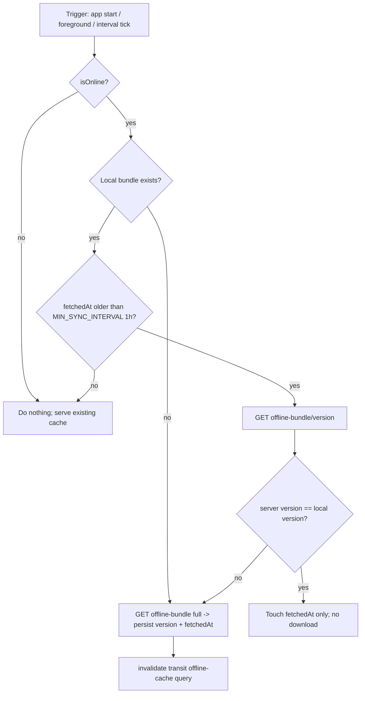
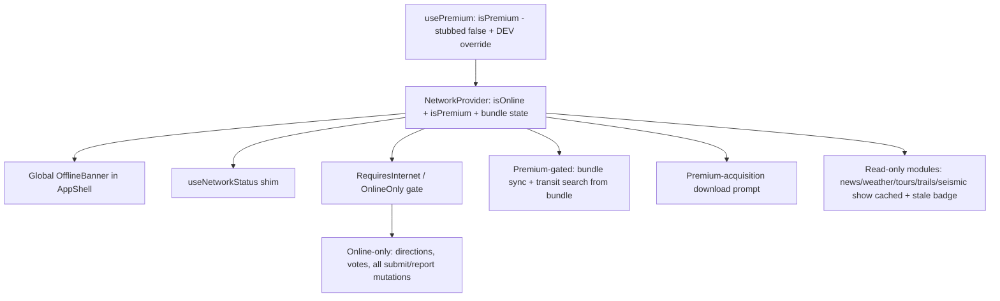
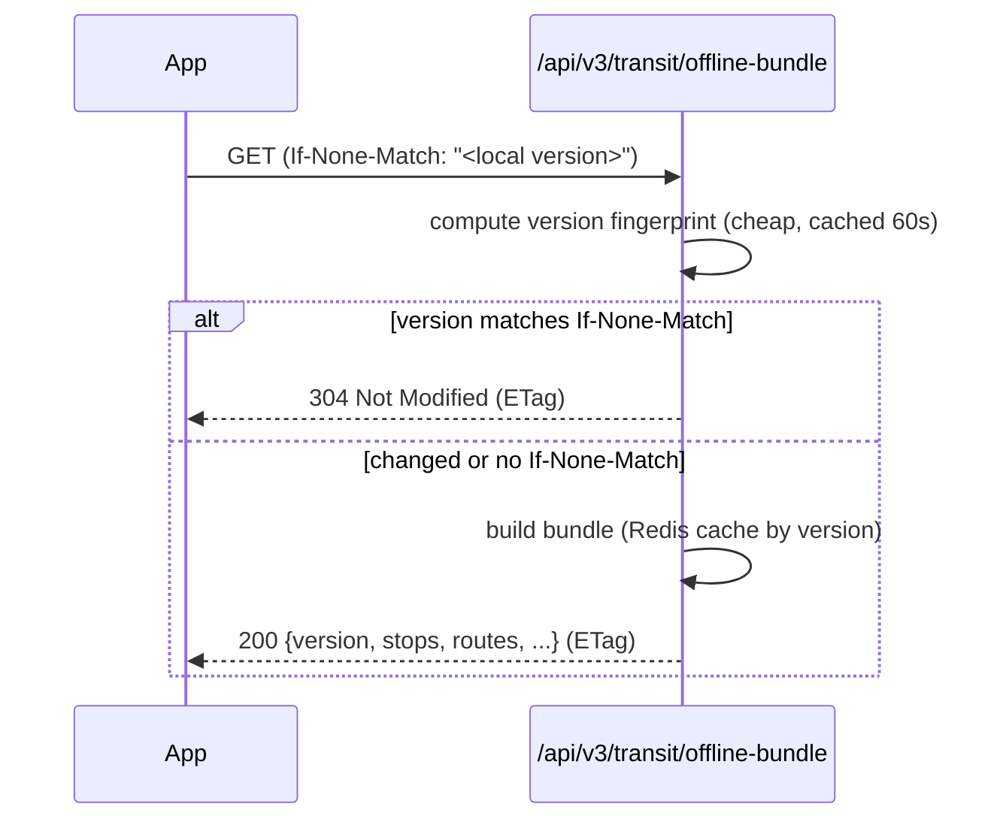

# feat: Offline transit bundle download endpoint, periodic sync, and app-wide offline state

This plan spans two repos:

- **`SaoMiguelBus-api`** (branch `revamp`, new backend under `src/`) — a new versioned offline-bundle download endpoint.
- **`SaoMiguelBus`** (Expo SDK 56 mobile client, "Azores Hub") — version-aware periodic sync plus an app-wide offline state.

API-side units are marked **[api: SaoMiguelBus-api]**; mobile-side units are marked **[mobile: SaoMiguelBus]**. All paths are repo-relative to the repo named in the unit's tag.

---

## Summary

Add a dedicated, versioned `/api/v3/transit/offline-bundle` endpoint (full island dataset + a cheap staleness check) so the mobile app can periodically download the schedule, persist it, and skip the transfer when nothing changed. On the client, lift offline bundle sync out of the transit screen into an app-wide network context that drives staleness-based refresh and a consistent offline experience: cached route search keeps working, online-only actions (directions, votes, every submit/report mutation) are cleanly blocked, and read-only content modules show last-known cached data instead of erroring. **Offline access is a premium-only capability**: a lightweight entitlement flag (defaulting to non-premium until billing exists, with a DEV-only override for testing) gates bundle sync and offline search, and a one-time prompt nudges newly-premium users to download the data while they still have a connection.

---

## Problem Frame

The transit offline path already half-exists: `lib/offline-bundle.ts` caches the full `GET /api/v2/webapp/load` array to AsyncStorage and `useOfflineSearch.ts` runs client-side route matching. But the implementation has three structural gaps:

1. **Source is the frozen legacy compat blob.** `fetchWebappLoad()` hits `/api/v2/webapp/load`, which returns a legacy array with stop *names* only (no coordinates), no version token, and no conditional-GET support. Every sync re-downloads the whole ~1–3 MB payload.
2. **Sync is once-per-mount and screen-local.** `useOfflineBundleSync(true)` runs only in `app/(tabs)/transit/index.tsx`; there is no staleness check (`hasOfflineCache()` checks `routes.length`, not age), no foreground refresh, and no app-wide scheduling.
3. **Offline handling is ad-hoc and incomplete.** `useNetworkStatus()` is consumed in 13 files with no shared context and no global banner. Several online-only actions are *not* gated — `useTripVote` always mutates, `useTripDetail` keeps fetching offline, seismic felt-reports aren't gated — and read-only modules (news/weather/tours/trails/seismic) have no "showing cached data" affordance.

The SDD (`SDD/10-frontend-architecture.md` §6, `SDD/09-modules.md` §1) already calls for an app-wide offline strategy with graceful degradation; this plan closes the gap between that intent and the shipped per-screen reality, and gives the backend a proper sync contract instead of reusing the compat shim.

Offline is also the first concrete **premium** capability (SDD `SDD/08-monetization-freemium.md` describes a client entitlement cache). Billing/IAP isn't built yet, and that's fine — this plan introduces only the entitlement *flag* (always non-premium for now) plus a DEV override, so the premium gate is real and testable today and slots into real entitlements later. The existing premium surface is marketing-only (`features/transit/components/PremiumLaunchModal.tsx`, `components/PremiumHeaderButton.tsx`) with no entitlement state — this adds that state.

---

## Requirements

> Naming note: user-facing module names map to code directories as **seismic** → `features/earthquakes/`, **tours** → `features/events/`. Requirement prose uses the user-facing names; unit `Files` use the code paths.

### API — download endpoint

- R1. A new `GET /api/v3/transit/offline-bundle` returns the full island transit dataset in a v3 object shape: `version`, `generatedAt`, island key, `counts`, `stops` (with `lat`/`lng` and cleaned name), `holidays`, `infos`, and `routes` (trip rows compatible with the existing client `OfflineRouteRow`).
- R2. A cheap staleness check is available: `GET /api/v3/transit/offline-bundle/version` returns `{ version, generatedAt, counts }` without building the full payload. This is the client's staleness path (KTD8). The full endpoint additionally honors `If-None-Match` and returns `304 Not Modified` (with the `ETag`) *before* serializing the bundle as a secondary safety net for other consumers.
- R3. Responses are island-scoped (via `request.island` / `for_island`) and Redis-cached following the events/weather pattern; `version` is a deterministic token driven by a write-triggered `data_revision` (KTD3), stable across requests and changing whenever any transit data changes — including in-place `StopTime` edits, stop renames, line enable/disable, and holiday/info changes.

### Mobile — periodic sync

- R4. The app downloads the bundle from the new v3 endpoint and persists it with its `version` and `fetchedAt`; the stored bundle includes stop coordinates.
- R5. Bundle sync runs app-wide (on app start, on return to foreground, and on a generous interval), only when online, and skips the download when the `/version` check reports an unchanged version (KTD8).

### Mobile — app-wide offline state

- R6. An app-wide network context exposes online status plus bundle availability, version, and staleness, replacing per-screen `NetInfo` subscriptions.
- R7. Offline route search works from the cached bundle; when offline with no cache, search is clearly blocked with actionable messaging rather than failing silently.
- R8. Online-only actions are disabled with consistent messaging when offline: live directions, transit votes, and every submit/report mutation (marketplace CRUD, traffic create/confirm/delete, seismic felt-report).
- R9. Read-only content modules (news, weather, tours, trails, seismic lists) display last-known cached data with a "cached" indicator when offline instead of erroring, and suppress live refetch/spinners.
- R10. A single global offline indicator replaces the ad-hoc per-screen offline banners.

### Premium gating

- R11. Offline access is premium-only: bundle download/sync and offline route search are enabled only for premium users. Non-premium users get the existing online behavior with no cached fallback (offline = blocked, same as a premium user with no cache).
- R12. A client entitlement flag (`usePremium()` / a premium store) determines premium status. The real entitlement source isn't built yet, so it returns non-premium for now, behind a stable interface that a future billing integration replaces without touching call sites. A DEV-only setting toggles premium on for testing (no effect / hidden in production builds).
- R13. When a user transitions to premium and has no fresh offline bundle, the app shows a one-time prompt warning them to download the offline data (while online) so it's usable offline; accepting triggers a sync.

---

## Key Technical Decisions

- KTD1 — New endpoint lives in the existing transit v3 app, not a new app. `transit` already registers `/api/v3/transit/` via `src/transit/urls_v3.py`. Add the two routes there plus a new `src/transit/services/offline_bundle.py`; do **not** touch the frozen `/api/v2/webapp/load` compat handler.
- KTD2 — Bundle is a v3 object that stays route-shape-compatible with the client. The `routes` array reuses the `_trip_to_load_route` shape (`id`, `route`, `stops`, `times`, `weekday`, `information`) so client `offlineSearch()` changes minimally, but the bundle is wrapped in an object `{ version, generatedAt, island, counts, stops, holidays, infos, routes }`. `stops` carries `lat`/`lng` (merged from `serialize_stops_v3`) — primarily for offline stop disambiguation in search, and as a free enabler for the deferred offline-map work; see Scope Boundaries for the payload-size note.
- KTD3 — Version is a write-triggered `data_revision`, not a count/timestamp fingerprint. Bare aggregate fingerprints (`counts + max trip id + Island.updated_at + LegacyImportJob.finished_at`) have proven correctness holes: they miss `StopTime` edits/inserts, `Stop.cleaned_name` fixes, `Line.disabled` toggles, and `Holiday`/`RouteInfo` changes — all of which alter offline search results — and `Island.updated_at`/`LegacyImportJob.finished_at` only move on the bulk-import path, not on admin/script edits. Instead, the primary signal is an integer `data_revision` bumped on **any** transit write (a `post_save`/`post_delete` signal on `Stop`/`Line`/`Trip`/`StopTime`/`Calendar`/`Holiday`/`RouteInfo`, plus an explicit management-command bump for bulk imports). `version` is a short hash of `(data_revision, stops count, operator-trips count)` — the counts are a cheap belt-and-suspenders, `data_revision` is the source of truth. Do **not** read `feature_flags['version']` (that key does not exist and is never set — it would be dead entropy or a `KeyError`). Dynamic vote counts (likes/dislikes) are intentionally excluded so a vote doesn't bust every client's cache and force a full re-download (offline vote percentages may be up to a sync-interval stale — acceptable; ratios don't gate any UI decision).
- KTD4 — Redis caches both the serialized bundle and the version, with single-flight on rebuild. Cache the full bundle under `transit:offline_bundle:{island_key}:{version}` (long TTL, e.g. 24h — safe because the key is version-scoped) and the computed version under `transit:offline_bundle_version:{island_key}` (short TTL, e.g. 60s). Because client sync fires app-wide on import-triggered version changes (KTD5), a version bump would otherwise produce a thundering herd of concurrent full-bundle rebuilds (the heaviest read in the system). Guard the build with a single-flight lock (`cache.add(lock_key, ..., nx)`), and pre-warm the new version's bundle in the same path that bumps `data_revision` on import completion so the post-import burst is a cache hit. Follows the `cache.get`/`cache.set` pattern in `events/services.py` and `weather/services.py`.
- KTD5 — Client sync is foreground/staleness-based, not OS background fetch. No background-task package is installed (SDK 56). A root-level hook inside the network provider refreshes on mount, on `AppState` → `active`, and on a long interval, gated on `isOnline` and on a staleness check. `MIN_SYNC_INTERVAL` (the floor that short-circuits repeat triggers) is pinned to **1h**; the background interval tick is **6h**; the cheap `/version` check always runs on foreground once the bundle is older than `MIN_SYNC_INTERVAL`. True OS-level background sync (`expo-background-task` + `expo-task-manager`) is deferred (battery, Expo Go limits) — see Scope Boundaries.
- KTD6 — Offline state is one provider + a declarative gate, not 30 rewritten call sites. Add a `NetworkProvider` exposing `useNetwork()` (`isOnline`, `hasTransitBundle`, `bundleVersion`, `bundleFetchedAt`, `isBundleStale`, `refreshBundle`). `useNetworkStatus()` is kept as a thin shim delegating to the context to avoid churning existing consumers. Online-only surfaces use a shared `RequiresInternet` wrapper / `OnlineOnly` affordance and `react-query` `networkMode: 'online'` + `enabled: isOnline`; read-only modules render persisted query data with a stale indicator. Connectivity transitions are debounced (~2–3s) in the provider so the global banner doesn't flicker on `NetInfo` reachability flaps.
- KTD7 — Switch the bundle source to the v3 endpoint with a true endpoint fallback, plus parse tolerance. `refreshOfflineBundle()` calls `fetchOfflineBundle()`; on a failed v3 request (network error, `404`, non-JSON) it **catches and falls back** to `fetchWebappLoad()` (`/api/v2/webapp/load`) so a client build that ships before the API deploys still gets a bundle — shape tolerance alone (object vs legacy array) does not cover a missing endpoint. The parser then accepts either shape and degrades gracefully on absent fields.
- KTD8 — One client staleness path: the `/version` endpoint. The client polls `GET /api/v3/transit/offline-bundle/version`, compares to the stored `version`, and downloads the full bundle only on mismatch. It does **not** send `If-None-Match`. Server-side `If-None-Match`→`304` on the full endpoint is retained as a secondary safety net for other/3rd-party consumers, but it is not the app's primary mechanism — this removes the two-mechanism ambiguity.
- KTD9 — Offline write actions block by default; safety/incident reports get a local draft. Votes and marketplace CRUD are simply disabled offline (no value in queuing a stale vote). Seismic felt-reports and traffic-incident reports, however, are most valuable exactly when connectivity is degraded (during a quake, at a remote incident site); for those two, persist a local draft when offline and surface it for one-tap submission on reconnect rather than discarding it. Full general-purpose queue/replay remains deferred (Scope Boundaries).
- KTD10 — Entitlement is a stable `usePremium()` interface over a Zustand store, real source stubbed to false. `lib/premium-store.ts` exposes `isPremium` computed as `realEntitlement() || (__DEV__ && devPremiumOverride)`. `realEntitlement()` returns `false` today (single place a future billing/IAP integration plugs in — no call-site churn). `devPremiumOverride` is a persisted boolean flipped by a DEV-only settings toggle; it is force-`false` in production (`__DEV__` guard) so there is no way to unlock premium in a release build. This deliberately avoids building any paywall/purchase flow (Scope Boundaries).
- KTD11 — Premium gates the offline capability at the network/sync layer, not per screen. `useNetwork()`'s offline-capability fields fold in `isPremium`: bundle sync (U5) is a no-op for non-premium users, and `hasTransitBundle`/`isBundleStale`/`useCanSearchOffline` report "no offline capability" when not premium — so `useCanSearchOffline` becomes `isOnline || (isPremium && hasBundle)`. This keeps the gate in one place; downstream UI (banners, search) already keys off those fields. Non-premium offline behavior is identical to premium-with-no-cache: blocked, not silently failing.

---

## High-Level Technical Design

### Periodic sync decision (client)

Client staleness uses the `/version` poll path (KTD8); the server's `If-None-Match`→`304` below is a secondary safety net, not the app's path.

### Offline gating topology (client)

### Conditional GET (server)

---

## Implementation Units

### U1. `data_revision` signal + offline bundle serializer/version [api: SaoMiguelBus-api]

- Goal: A write-triggered data-revision signal plus the bundle dict and version token, decoupled from the HTTP layer.
- Requirements: R1, R3
- Dependencies: none
- Files:
  - `src/transit/services/offline_bundle.py` (new — `build_offline_bundle`, `compute_bundle_version`)
  - `src/transit/signals.py` (new — `post_save`/`post_delete` handlers bumping `data_revision`) and registration in `src/transit/apps.py` `ready()`
  - `src/transit/models.py` (storage for `data_revision` — per-island integer; reuse `Island.feature_flags['data_revision']` to avoid a transit-model migration, or a small dedicated field — implementer's call)
  - `src/transit/management/commands/` (bump `data_revision` at the end of the legacy import path) — coordinate with `legacy_import.py`
  - `src/transit/tests/test_offline_bundle.py` (new)
  - reference: `src/transit/services/compat.py` (`_trip_to_load_route`, `serialize_webapp_load_v2`, `_serialize_active_infos`), `src/transit/services/v3.py` (`serialize_stops_v3`)
- Approach:
  - `data_revision`: a monotonically increasing integer per island, bumped by a `post_save`/`post_delete` signal on `Stop`, `Line`, `Trip`, `StopTime`, `Calendar`, `Holiday`, `RouteInfo`, and explicitly at the end of the bulk import (one bump per import run, not per row — guard the signal during bulk import to avoid thrashing, then bump once). This is the primary staleness source of truth.
  - `build_offline_bundle(island) -> dict`: reuse the operator-trip query and `_trip_to_load_route` row shape for `routes`; build `stops` from `serialize_stops_v3` (name, cleaned name, lat, lng); include `holidays`, `infos` (reuse `_serialize_active_infos`), `counts` (`stops`, `routes`), `generatedAt`, `version`, and `island` key.
  - `compute_bundle_version(island) -> str`: short hash (first 16 hex of sha256) over `(data_revision, Stop.objects.count(), Trip.objects.filter(source=OPERATOR).count())`. Do **not** read `feature_flags['version']`. If `Max('id')` is used at all, filter it by `source=OPERATOR` to avoid churn from any future gmaps-trip persistence — but `data_revision` makes a max-id term unnecessary.
  - Note on active infos: `_serialize_active_infos` is time-windowed (`start<=now<=end`); the bundle is version-cached for up to 24h (KTD4), so a window boundary crossing won't refresh mid-cache. `data_revision` bumps when a `RouteInfo` row is created/edited; for pure clock-driven window changes, the 24h cache is the accepted staleness bound (record in Risks).
  - All queries run under the caller's island/tenant context (the view wraps in `for_island`).
- Patterns to follow: serialization-in-services convention from `events/services.py` / `weather/services.py`; tenant scoping via `TenantManager`; Django signal registration in `apps.py.ready()`.
- Test scenarios:
  - Given a seeded island (`ensure_transit_fixtures()`), `build_offline_bundle` returns `routes` whose rows have `id/route/stops/times/weekday/information`, `stops` rows carrying `lat`/`lng`, and an `island` key; `counts` matches fixtures. Covers R1.
  - `compute_bundle_version` is stable across two calls with unchanged data. Covers R3.
  - Version **changes** on each of: adding a `Trip`; editing a `StopTime.departure_time` in place; renaming a `Stop.cleaned_name`; toggling `Line.disabled`; adding/removing a `Holiday`; adding a `RouteInfo`. (These are the fingerprint blind spots a count/timestamp approach missed — each must move `data_revision`.) Covers R3.
  - Casting a vote (like/dislike) does **not** change the version. Covers KTD3.
  - Bulk import bumps `data_revision` exactly once (signal suppressed during the run, single explicit bump after).
  - Bundle is island-scoped: a second island's trips are absent, and its `data_revision` is independent.
- Verification: `cd src && python manage.py test transit.tests.test_offline_bundle`.

### U2. v3 endpoints, URL wiring, Redis cache, conditional GET [api: SaoMiguelBus-api]

- Goal: Expose the bundle and the cheap version check over HTTP with caching and `If-None-Match` support.
- Requirements: R1, R2, R3
- Dependencies: U1
- Files:
  - `src/transit/api_v3.py` (add two views)
  - `src/transit/urls_v3.py` (register `offline-bundle`, `offline-bundle/version`)
  - `src/transit/tests/test_api_v3_offline_bundle.py` (new)
  - reference: `src/events/api_v3.py` (`_require_island`, `for_island` usage), `src/events/services.py` (cache pattern), `src/compat/api.py` (`get_webapp_load_v2`)
- Approach:
  - `offline_bundle_view`: `_require_island`; compute version (cached 60s under `transit:offline_bundle_version:{island_key}`); if `If-None-Match` equals current version → return `304` with `ETag` before building payload (secondary path per KTD8); else read/build bundle from `transit:offline_bundle:{island_key}:{version}` (24h TTL) and return `200` with `ETag: "<version>"`.
  - Single-flight on miss (KTD4): wrap the build in a `cache.add(lock_key, 1, timeout)` lock; the loser briefly polls the cache or serves the previous version, so an import-triggered herd doesn't run N concurrent full-bundle builds.
  - `offline_bundle_version_view`: return `{ version, generatedAt, counts }` from the cached version; no payload build.
  - Throttle: apply a generous DRF throttle scope (`ScopedRateThrottle`) to the full-bundle view — the full payload is meant to transfer only on version change, so legitimate cadence is low; this caps egress amplification on a ~1–3 MB public endpoint.
  - `island_key` in every cache key comes from the **resolved/validated** `Island` (via `_require_island`/`for_island`), never the raw `X-Island` header, so a bogus header cannot mint cache keys.
  - Register routes in `urls_v3.py`: `path('offline-bundle', ...)`, `path('offline-bundle/version', ...)`. Root URLconf already includes `transit.urls_v3` — no root change.
  - `@permission_classes([AllowAny])` consistent with other compat/transit reads (public, non-PII schedule data already exposed via `/api/v2/webapp/load`).
- Patterns to follow: DRF `@api_view(['GET'])` function views, `with for_island(request.island)`, `@override_settings(CACHES=...LocMem...)` in tests as in `events/tests`.
- Test scenarios:
  - `GET /api/v3/transit/offline-bundle` with `X-Island` returns `200`, an `ETag` header, and a body with `version`, `island`, `stops`, `routes`, `counts`. Covers R1.
  - `GET /api/v3/transit/offline-bundle/version` returns `{version, generatedAt, counts}`; its `version` equals the full endpoint's `ETag`. Covers R2.
  - Repeat full `GET` with `If-None-Match: "<version>"` returns `304`, no body (secondary path). Covers R2.
  - Second identical request is served from Redis cache (spy `build_offline_bundle`, assert called once across two same-version requests). Covers R3.
  - Concurrent same-version requests on a cold cache build the bundle once (single-flight) — assert `build_offline_bundle` call count is 1 under N parallel requests. Covers KTD4.
  - Unknown/garbage `X-Island` returns the standard `_require_island` error and writes **no** Redis key.
  - Bundle reflects the active island only (two-island fixture).
- Verification: `cd src && python manage.py test transit.tests.test_api_v3_offline_bundle`; manual `curl -H 'X-Island: sao-miguel' .../api/v3/transit/offline-bundle/version`.

### U3. Point client bundle at v3 endpoint; version-aware persistence [mobile: SaoMiguelBus]

- Goal: Download from the new endpoint and persist `version` + stop coordinates; keep parsing tolerant.
- Requirements: R4, R7
- Dependencies: U2
- Files:
  - `lib/api.ts` (add `fetchOfflineBundle`, `fetchOfflineBundleVersion`; keep `fetchWebappLoad` for fallback)
  - `lib/offline-bundle.ts` (extend `OfflineBundle` type with `version`; map v3 object; add `lat`/`lng` to stops; bump `bundleKey` or migrate)
  - `lib/types.ts` (offline bundle / stop types if shared)
  - reference: existing `refreshOfflineBundle`, `loadCachedBundle`, `saveCachedBundle`, `offlineSearch`
- Approach:
  - `fetchOfflineBundle()` → `apiFetch('/api/v3/transit/offline-bundle')`; `fetchOfflineBundleVersion()` → `apiFetch('/api/v3/transit/offline-bundle/version')`.
  - `refreshOfflineBundle()` calls `fetchOfflineBundle()` inside a `try`; on **any request failure** (network error, `404`/non-2xx, non-JSON) it `catch`es and calls `fetchWebappLoad()` (`/api/v2/webapp/load`), then parses the legacy array. This true endpoint fallback (not just shape tolerance) is what lets a client build ship before the API deploy (KTD7).
  - On success, parse the v3 object (`{ version, stops, holidays, infos, routes, generatedAt }`) into the existing `OfflineBundle`, now carrying `version` and `stops: { name, lat?, lng? }[]`. `offlineSearch()` is unchanged (still keys off `routes`). Persist `version` (empty string for the legacy-array path).
- Patterns to follow: existing `apiFetch` typing and AsyncStorage usage in `lib/offline-bundle.ts`.
- Test scenarios:
  - `refreshOfflineBundle` maps a v3 object fixture into a bundle with `version` set and `stops` carrying coords.
  - A legacy-array fixture still parses (shape tolerance).
  - When `fetchOfflineBundle()` rejects (simulate `404`/network error), `fetchWebappLoad()` is called and the legacy array is parsed (endpoint fallback). Covers KTD7.
- Verification: `npx tsc --noEmit` clean; offline search still returns results from a manually-seeded v3 bundle.

### U4. NetworkProvider context + useNetworkStatus shim [mobile: SaoMiguelBus]

- Goal: One app-wide source of truth for connectivity, bundle state, and offline capability (premium-folded).
- Requirements: R6, R11
- Dependencies: U3, U9
- Files:
  - `lib/network-provider.tsx` (new — context + provider)
  - `lib/network-status.ts` (refactor `useNetworkStatus` to read from context, preserving the `{ isOnline }` API)
  - `app/_layout.tsx` (mount `<NetworkProvider>` inside `AppQueryProvider`, wrapping `AppShell`)
  - reference: provider nesting in `app/_layout.tsx`, persisted query client in `lib/query-provider.tsx`
- Approach:
  - `NetworkProvider` subscribes to `NetInfo` once (and `navigator.onLine` on web, mirroring current `network-status.ts`), debounces transitions (~2–3s) to avoid flicker on reachability flaps, and exposes `useNetwork()` → `{ isOnline, isPremium, hasTransitBundle, bundleVersion, bundleFetchedAt, isBundleStale, refreshBundle }`. Bundle fields are backed by the `['transit','offline-cache']` query + `loadCachedBundle()` metadata. Per KTD11, `hasTransitBundle`/`isBundleStale` report no offline capability when `!isPremium`, so the gate lives here, not in each consumer.
  - `useNetworkStatus()` becomes `() => ({ isOnline: useNetwork().isOnline })` so the 13 existing consumers keep working unchanged.
  - Mount order: `AppQueryProvider` → `NetworkProvider` → `AppShell` (provider needs the query client for bundle queries).
- Patterns to follow: React context provider; existing `useNetworkStatus` semantics (`isConnected && isInternetReachable !== false`).
- Test scenarios:
  - `Test expectation: none — pure wiring/refactor`, verified via `tsc` + the behavior tests in U5–U8. If a component test harness exists, assert `useNetworkStatus()` still returns `{ isOnline }` and `useNetwork()` exposes bundle fields.
- Verification: app boots; `tsc --noEmit` clean; existing transit offline behavior unchanged.

### U5. App-wide staleness-based periodic sync [mobile: SaoMiguelBus]

- Goal: Replace once-per-mount, screen-local sync with app-wide version-aware sync, gated on premium.
- Requirements: R4, R5, R11
- Dependencies: U3, U4, U9
- Files:
  - `lib/network-provider.tsx` (the sync hook lives here, per KTD5 — not in `useOfflineSearch.ts`)
  - `app/(tabs)/transit/index.tsx` (remove the local `useOfflineBundleSync(true)` call — line 78)
  - `lib/offline-bundle.ts` (add `isBundleStale(maxAgeMs)` / `syncOfflineBundle()` that does the version-check-then-download flow; export `MIN_SYNC_INTERVAL`)
- Approach:
  - Constants: `MIN_SYNC_INTERVAL = 1h` (the floor that short-circuits repeat triggers), background interval tick = `6h`. These are distinct values — do not conflate.
  - `syncOfflineBundle()`: if no cache → full download; else if `fetchedAt` older than `MIN_SYNC_INTERVAL` → call `fetchOfflineBundleVersion()`, compare to stored `version`; download full bundle only on mismatch, otherwise touch `fetchedAt`.
  - Drive it from the provider: run on mount, on `AppState` change to `active`, and on a `setInterval` (6h) — all gated on `isOnline` **and `isPremium`** (R11: non-premium users never download a bundle). The foreground (`active`) trigger always runs the cheap `/version` check once the bundle is older than `MIN_SYNC_INTERVAL`, so a daily-online user can't drift multi-day-stale before going offline. Invalidate `['transit','offline-cache']` after a download.
  - Remove the transit-screen sync call so sync is no longer tied to visiting the transit tab.
- Patterns to follow: existing `useOfflineBundleSync` effect + `queryClient.invalidateQueries`.
- Test scenarios:
  - Mount while online with no cache → triggers a full download (mock `fetchOfflineBundle`). Covers R4.
  - Mount while online with a fresh cache (recent `fetchedAt`) → no version call, no download. Covers R5.
  - Stale cache + server version equal to local → version endpoint hit, full bundle **not** re-downloaded, `fetchedAt` refreshed. Covers R5.
  - Stale cache + server version changed → full bundle downloaded and persisted with the new version. Covers R5.
  - Non-premium user online with no cache → sync is a no-op, no download. Covers R11.
  - Offline at trigger time → no network calls.
- Verification: `tsc --noEmit` clean; with network throttling/airplane toggling in a dev build, confirm a single version check and no full download when unchanged.

### U6. Global offline banner + RequiresInternet gate + CachedBadge + i18n [mobile: SaoMiguelBus]

- Goal: One consistent offline indicator app-wide and a single canonical set of offline affordances (blocked action, cached badge) so the 8 modules don't diverge.
- Requirements: R7, R8, R9, R10, R11
- Dependencies: U4, U9
- Files:
  - `components/ui/GlobalOfflineBanner.tsx` (new) mounted in `AppShell` (`app/_layout.tsx`)
  - `components/ui/RequiresInternet.tsx` (new — canonical blocked-action affordance)
  - `components/ui/CachedBadge.tsx` (new — shared cached/stale indicator with relative age)
  - `features/transit/components/OfflineBanner.tsx` (fold into / delegate to the global banner)
  - `app/(tabs)/transit/index.tsx` (own the offline + no-cache "search blocked" empty state — R7 second half)
  - `locales/{pt,en,de,es,fr,it,uk,zh}.json` (add keys; `pt` is source + fallback)
  - reference: `components/ui/Banner.tsx`, existing keys `offlineBanner`, `offlineBannerCached`, `offlineSearchDisabled`
- Approach:
  - `GlobalOfflineBanner` reads `useNetwork()`. Fixed position (top, below header, inside safe-area), non-dismissible while offline, slide animation; relies on the provider's debounced `isOnline` (U4) so it doesn't flicker. Generic offline message app-wide, upgraded to "cached schedules available" on transit surfaces when `hasTransitBundle`. Accessibility: `accessibilityLiveRegion="polite"` (Android) + `AccessibilityInfo.announceForAccessibility` so the offline/online transition is announced without moving focus.
  - `RequiresInternet` — canonical blocked state (touch app, no tooltips): renders `children` when online; when offline renders the control at reduced opacity with a cloud-off icon, `accessibilityState={{ disabled: true }}` + an `accessibilityHint` explaining it needs a connection, and a tap surfaces the `offlineActionDisabled` message as a toast/snackbar. U7 just wraps trigger UI in this — no per-call-site affordance decisions.
  - `CachedBadge` — single placement in the screen header/title row (not per-item), shared icon + label, carries relative age from `fetchedAt`/`bundleFetchedAt` ("Updated 3h ago" / "Updated yesterday"), `accessibilityLabel` includes the age. Modules pass their data's `fetchedAt`; weather/seismic always show age, tours/trails may.
  - Precedence (R10 vs R9): the global banner is the **connectivity** truth (always, app-wide); `CachedBadge` is the **data-provenance** truth (per data region). They coexist by design and mean different things — banner = "you're offline", badge = "this data is from <age> ago". Documented so they aren't treated as redundant.
  - Recovery (online→offline→online): on reconnect the banner animates out, gated controls re-enable, and `CachedBadge`s clear after a successful refetch (read-only modules show a brief non-blocking "refreshing" cue, not a full-screen spinner). See AE6.
  - Offline + no-cache search empty state (R7): an explicit blocked state with a "Retry" affordance that re-checks connectivity plus copy explaining offline search needs a one-time online sync — not a bare static string.
  - i18n: add keys (e.g. `offlineActionDisabled`, `offlineCachedBadge` with an age-format key, `offlineSearchNoCacheTitle`/`offlineSearchNoCacheBody`, `offlineRetry`) to all 8 locales; reuse existing keys where they fit. Run the SDD-referenced locale-key check against `pt`.
- Patterns to follow: `components/ui/Banner.tsx` variants; current `OfflineBanner` cached-vs-generic selection.
- Test scenarios:
  - Banner hidden when online; shown when offline; does not toggle on a sub-debounce connectivity blip. Covers R10.
  - On a transit surface with a cached bundle the banner shows the cached-schedules message; with no cache the generic offline message. Because `hasTransitBundle` folds premium (KTD11), a non-premium user offline always gets the generic message (never the cached-schedules promise). Covers R7, R10, R11.
  - `RequiresInternet`: renders `children` online; offline renders the disabled affordance, sets `accessibilityState.disabled`, and a tap fires the toast (no navigation/mutation). Covers R8.
  - `CachedBadge` renders the relative age from a given `fetchedAt` and exposes it in `accessibilityLabel`. Covers R9.
  - Offline + no cached bundle: transit search shows the blocked empty state with a working Retry. Covers R7 (AE2).
  - Reconnect: banner clears and a gated control re-enables. Covers AE6.
  - Locale check: every new key present in all 8 catalogs.
- Verification: locale-key check passes; airplane-mode toggle in a dev build shows correct banner, blocked affordance, badge age, and clean recovery; VoiceOver/TalkBack announces the offline transition.

### U7. Gate online-only actions [mobile: SaoMiguelBus]

- Goal: Block live-network actions consistently when offline; fix the ungated ones.
- Requirements: R8
- Dependencies: U4, U6
- Files:
  - `features/transit/hooks/useTransitQueries.ts` (`useTripVote`: gate; `useTripDetail`: gate or serve from bundle)
  - `features/transit/components/RouteCard.tsx` (don't mutate votes offline)
  - `features/marketplace/hooks/useMarketplaceQueries.ts` + marketplace `new.tsx` / `edit/[id].tsx` / `[id].tsx`
  - `features/traffic/hooks/useTrafficQueries.ts` + `app/(tabs)/traffic/new.tsx`
  - `features/earthquakes/hooks/useEarthquakeQueries.ts` (felt-report mutation)
  - `app/(tabs)/transit/directions.tsx` (already gated — verify consistency only)
  - reference: existing `networkMode: 'online'` usage on `useDirections`
- Approach:
  - Standardize via the U6 `RequiresInternet` affordance: wrap online-only trigger UI in it; online-only mutations early-return when `!isOnline`; set `networkMode: 'online'` on online-only queries. No per-call-site affordance reinvention.
  - `useTripVote`: no-op + disabled control when offline (currently always mutates). `useTripDetail`: gate it — show the offline banner and skip the fetch (don't spin) when offline. (Serving trip detail from the bundle is deferred — see Scope Boundaries — to keep U7 about gating.)
  - Block-by-default for votes + marketplace CRUD. Per KTD9, seismic felt-report and traffic-incident create instead persist a **local draft** when offline and surface it for one-tap submission on reconnect (these are most valuable when connectivity is degraded). The draft is local state (a small Zustand `persist` store), not a general queue/replay engine.
- Patterns to follow: directions screen's `enabled: ... && isOnline` + form `disabled={!isOnline}`; existing Zustand `persist` stores in `lib/*-store.ts`.
- Test scenarios:
  - Offline: `useTripVote` does not call `voteTrip`; the vote control is disabled. Covers R8.
  - Offline: a directions submit is blocked (existing behavior preserved).
  - Offline: marketplace create/edit/**delete** and traffic **delete** are blocked with the shared affordance and fire no request. Covers R8.
  - Offline: a seismic felt-report / traffic-incident create persists a local draft (no request) and the draft is surfaced on reconnect. Covers R8, KTD9.
  - Online: all of the above behave exactly as today (no regression).
- Verification: `tsc --noEmit`; manual offline pass through each gated action shows the disabled affordance and fires no network request; a draft survives an offline→online toggle.

### U8. Read-only modules: serve cached data offline [mobile: SaoMiguelBus]

- Goal: News/weather/tours/trails/seismic show last-known data offline with a "cached" affordance instead of erroring or spinning.
- Requirements: R9
- Dependencies: U4, U6
- Files:
  - `features/news/hooks/useNewsQueries.ts`, `features/weather/hooks/useWeatherQueries.ts`, `features/events/hooks/useTourQueries.ts`, `features/trails/hooks/useTrailQueries.ts`, `features/earthquakes/hooks/useEarthquakeQueries.ts`
  - `features/hub/hooks/useHomeData.ts` (aggregator — suppress refetch loops offline)
  - the corresponding list screens for the "cached data" badge
  - reference: `lib/query-provider.tsx` (24h `PersistQueryClientProvider`)
- Approach:
  - Lean on existing react-query persistence. Use `networkMode: 'online'` on these reads so that while offline the query is paused (fires **no** request) and the persisted data renders — this matches the "no network call offline" expectation (do **not** use `offlineFirst`, which would fire a request and contradict it). Disable `refetchOnMount`/pull-to-refresh spinners while offline.
  - Render the shared `CachedBadge` (U6) in each screen's header when data is served from persisted cache while offline, passing that query's last-updated timestamp so the badge shows age.
  - `useHomeData`: skip `refetchAll` on focus/pull when offline.
- Patterns to follow: `lib/query-provider.tsx` persist config; SDD §6 graceful degradation; the U6 `CachedBadge`.
- Test scenarios:
  - Offline with persisted data → list renders cached items, shows the `CachedBadge` with age, fires no network request. Covers R9.
  - Offline with no persisted data → empty/offline state, not an error toast.
  - Online → unchanged refetch behavior. Covers R9 (no regression).
  - `useHomeData` does not loop refetch while offline.
- Verification: `tsc --noEmit`; offline pass on each list screen shows cached content + badge and no spinner.

### U9. Premium entitlement flag + DEV-only toggle [mobile: SaoMiguelBus]

- Goal: A stable premium-status interface (stubbed non-premium) with a DEV-only override, so offline can be gated and tested today.
- Requirements: R12
- Dependencies: none
- Files:
  - `lib/premium-store.ts` (new — Zustand `persist` store: `devPremiumOverride`, `setDevPremiumOverride`; selector/hook `usePremium()` → `{ isPremium }`)
  - `app/settings.tsx` (add a DEV-only "Premium (dev)" toggle, rendered only when `__DEV__`)
  - `locales/{pt,en,de,es,fr,it,uk,zh}.json` (toggle label/help keys)
  - reference: existing Zustand `persist` stores in `lib/*-store.ts` (e.g. `lib/profile-store.ts`, `lib/theme-prefs.ts`); `components/PremiumHeaderButton.tsx` / `PremiumLaunchModal.tsx` for premium visual language (Crown icon, keys)
- Approach:
  - `usePremium()` returns `isPremium = realEntitlement() || (__DEV__ && devPremiumOverride)`. `realEntitlement()` is a single stubbed function returning `false` — the documented seam a future billing/IAP integration replaces. No call site reads the store directly; they go through `usePremium()` (and, for offline, through `useNetwork()` per KTD11).
  - `devPremiumOverride` persists in AsyncStorage via Zustand `persist`; force-`false` effect when `!__DEV__` so a release build can never be premium.
  - Settings toggle: only mounted under `__DEV__`; flips `devPremiumOverride`; copy makes clear it's a dev testing switch.
- Patterns to follow: Zustand `persist` store shape used by `lib/theme-prefs.ts`; settings row components in `app/settings.tsx`.
- Test scenarios:
  - `usePremium()` returns `isPremium=false` by default (real entitlement stubbed false). Covers R12.
  - In `__DEV__`, flipping `devPremiumOverride` makes `isPremium=true`; flipping back makes it `false`.
  - With `__DEV__` false, `devPremiumOverride=true` still yields `isPremium=false` (no release-build unlock). Covers R12.
  - The DEV toggle is not rendered when `__DEV__` is false.
- Verification: `tsc --noEmit`; in a dev build the toggle unlocks offline sync/search; the toggle is absent in a production build.

### U10. Premium-acquisition offline-download prompt [mobile: SaoMiguelBus]

- Goal: Warn newly-premium users (while online) to download offline data so it works offline.
- Requirements: R13
- Dependencies: U5, U6, U9
- Files:
  - `lib/premium-store.ts` (track `offlineDownloadPromptSeenForVersion` / a "prompted" flag) or a small dedicated piece of state
  - `lib/network-provider.tsx` or a hook mounted in `AppShell` (detect premium transition + missing/stale bundle → trigger prompt)
  - `components/ui/...` reuse `Sheet`/`Banner` for the prompt; `locales/*` keys
  - reference: `PremiumLaunchModal.tsx` (`Sheet` usage), `useNetwork()` `refreshBundle`
- Approach:
  - Detect transition to `isPremium === true` (or first app open while premium) when `isOnline` and there's no fresh bundle (`!hasTransitBundle || isBundleStale`). Show a one-time prompt (sheet or prominent banner) warning that offline use requires a download; primary action calls `refreshBundle()` and shows progress, secondary dismisses.
  - One-time: gate on a persisted "prompted" flag so it doesn't nag every launch; re-arm if the user clears the bundle. If offline at transition time, defer the prompt until back online.
  - Reuse premium visual language (Crown) and the existing `Sheet` component.
- Patterns to follow: `PremiumLaunchModal.tsx` `Sheet` pattern; persisted flags via Zustand `persist`.
- Test scenarios:
  - Becoming premium while online with no bundle → prompt shown once; accepting calls `refreshBundle()`. Covers R13.
  - Prompt not shown again after being seen (persisted flag).
  - Becoming premium while offline → no prompt until back online, then shown. Covers R13.
  - Premium user who already has a fresh bundle → no prompt.
  - Non-premium user → never prompted.
- Verification: `tsc --noEmit`; toggling the DEV premium switch on (no cache, online) surfaces the prompt and a successful download.

---

## Acceptance Examples

- AE1 — Offline search with cache. Given a previously synced bundle, When the device goes offline and the user searches a route, Then results are returned from the cached bundle and the global banner shows the cached-schedules message. (R7, U5, U6)
- AE2 — Offline search without cache. Given a fresh install that never synced, When offline and the user opens transit search, Then search is disabled with actionable messaging (not a silent failure). (R7, U6)
- AE3 — Unchanged data skips download. Given a synced bundle whose `version` matches the server, When a sync trigger fires while online, Then only `GET /api/v3/transit/offline-bundle/version` is called and no full payload is transferred. (R5, U5, KTD8)
- AE4 — Blocked online-only action. Given the device is offline, When the user taps "get directions", votes on a route, or edits a marketplace listing, Then the action shows the shared disabled affordance and no request is sent. (R8, U7)
- AE5 — Read-only cached content. Given news/weather were loaded earlier, When the device is offline and the user opens those screens, Then the last-known content renders with a `CachedBadge` showing its age and no refetch spinner. (R9, U8)
- AE6 — Recovery on reconnect. Given the device was offline with the banner showing and actions disabled, When connectivity returns (after the debounce settles), Then the global banner animates out, gated controls re-enable, and read-only modules refresh with a brief non-blocking cue and clear their cached badge. (R10, U6)
- AE7 — Stale data still detected after admin edit. Given an operator edits a departure time in the admin (no import run), When a client next runs its `/version` check while online, Then the server reports a changed `version` (via `data_revision`) and the full bundle is re-downloaded. (R3, U1)
- AE8 — Non-premium gets no offline. Given a non-premium user (default), When they go offline, Then no bundle was ever downloaded and offline search is blocked exactly like a premium user with no cache — the generic offline banner shows, not the cached-schedules message. (R11, U5, U6)
- AE9 — Premium download prompt. Given a user toggles premium on (DEV) while online with no cached bundle, Then a one-time prompt warns them to download offline data, and accepting downloads the bundle; the prompt does not reappear afterward. (R13, U10)

---

## Scope Boundaries

### In scope
- New versioned offline-bundle endpoint (+ cheap version check) in the transit v3 app.
- Version-aware, app-wide periodic/staleness sync on the client.
- App-wide network context, global offline banner, and consistent gating of online-only actions; cached display for read-only modules.
- A premium entitlement flag (stubbed non-premium) + DEV-only override gating offline, and a one-time premium-acquisition download prompt.

### Deferred to Follow-Up Work
- True OS-level background sync (`expo-background-task` + `expo-task-manager`) so the bundle refreshes without the app being foregrounded.
- Wi-Fi-only / metered-connection preference for bundle downloads.
- Offline map tiles (MapLibre/MBTiles) for trails/traffic (SDD `12-risks-open-questions.md` §9 — licensing/storage open question) — the bundle carries stop coords (cheap, also aids offline stop disambiguation), but tile packaging is out of scope.
- Delta sync (a `changed-since-version` endpoint). Justified for now by low schedule-change frequency: a version bump re-downloads the full ~1–3 MB. If invalidation becomes frequent this is the first optimization to add.
- Serving transit trip-detail from the cached bundle when offline (U7 gates it instead).
- General-purpose write-action queue/replay. The two safety/incident reports get a minimal local draft (KTD9, U7); votes and marketplace CRUD are blocked, not queued.

### Outside this plan
- Changing or deprecating the legacy `/api/v2/webapp/load` compat endpoint — it stays frozen.
- Caching dynamic per-module content (news/weather/marketplace bodies) beyond what react-query persistence already provides.
- Any real billing/IAP/paywall or purchase flow, server-side entitlement, or restore-purchases. This plan ships only the client entitlement *flag* (stubbed false) + DEV override; the real source plugs into `realEntitlement()` later. Gating other (non-offline) features behind premium is also out of scope.

---

## Risks & Dependencies

- Bundle size (~1–3 MB) on metered data. Mitigated by version-gated downloads (R5) — the full payload transfers only when schedule data actually changes; Wi-Fi-only and delta sync are deferred.
- Staleness detection correctness. A count/timestamp fingerprint was rejected because it misses `StopTime` edits/inserts, stop renames, `Line.disabled` toggles, and `Holiday`/`RouteInfo` changes, and because `Island.updated_at`/`LegacyImportJob.finished_at` only move on the bulk-import path (not admin/script edits). KTD3's write-triggered `data_revision` closes this; the residual risk is a missed signal registration on a model that affects search — U1's test list enumerates each mutation type to guard against that.
- Time-windowed active infos. `_serialize_active_infos` is clock-driven (`start<=now<=end`); the bundle is version-cached up to 24h (KTD4), so a window boundary crossing won't refresh mid-cache. Accepted staleness bound; `data_revision` still bumps on `RouteInfo` row changes.
- Cache stampede on version bump. Import-triggered version changes make every foregrounded client miss the new version-keyed bundle key at once. Mitigated by single-flight on build + pre-warming the bundle on import (KTD4).
- Vote freshness offline. Like/dislike percentages are excluded from the version, so offline (and up-to-24h-cached) results can show slightly stale ratios — accepted; ratios don't gate any UI decision.
- Battery/AppState interval. Interval is 6h and the per-trigger work is the cheap `/version` check first (KTD5).
- Cross-repo sequencing. U3–U8 depend on U1–U2 being deployed; until then `refreshOfflineBundle()` catches the failed v3 request and falls back to `/api/v2/webapp/load` (KTD7, true endpoint fallback — not just parse tolerance).

---

## Sources / Research

- Server bundle shape & query: `SaoMiguelBus-api/src/transit/services/compat.py` (`serialize_webapp_load_v2`, `_trip_to_load_route`), `src/transit/services/v3.py` (`serialize_stops_v3`).
- v3 endpoint + cache patterns: `SaoMiguelBus-api/src/events/api_v3.py`, `src/events/services.py` (`CACHE_TTL`, `cache.get/set` keys), `src/weather/services.py`; root URLconf `src/src/urls.py` (`/api/v3/transit/` already included).
- Staleness signals: transit models have no per-row `updated_at` (`SaoMiguelBus-api/src/transit/models.py`) and `Island.updated_at`/`LegacyImportJob.finished_at` (`src/tenancy/models.py`) only move on import — hence the write-triggered `data_revision` (KTD3). `feature_flags` has no `version` key (`src/tenancy/models.py`).
- Tests: `SaoMiguelBus-api/src/events/tests/test_tours.py`, `src/weather/tests/test_weather.py`, `src/transit/tests/fixtures.py` (`ensure_transit_fixtures`).
- Client offline path: `SaoMiguelBus/lib/offline-bundle.ts`, `features/transit/hooks/useOfflineSearch.ts`, `lib/network-status.ts`, `lib/api.ts` (`apiFetch`, `fetchWebappLoad`).
- Provider tree & deps: `SaoMiguelBus/app/_layout.tsx`, `lib/query-provider.tsx`, `package.json` (Expo 56, react-query 5, NetInfo 12, no background-task packages).
- Prior plans: `SaoMiguelBus/docs/plans/2026-06-02-005-feat-buses-module-parity-profile-plan.md` (canonical offline bundle), `2026-06-02-006-fix-transit-directions-parity-plan.md` (`isOnline` vs `canSearchOffline` split).
- Architecture intent: `SaoMiguelBus/SDD/10-frontend-architecture.md` §6, `SDD/09-modules.md` §1, `SDD/01-architecture.md` §8.
- Premium surface (marketing-only today, no entitlement state): `SaoMiguelBus/components/PremiumHeaderButton.tsx`, `features/transit/components/PremiumLaunchModal.tsx`; monetization intent in `SDD/08-monetization-freemium.md`.
