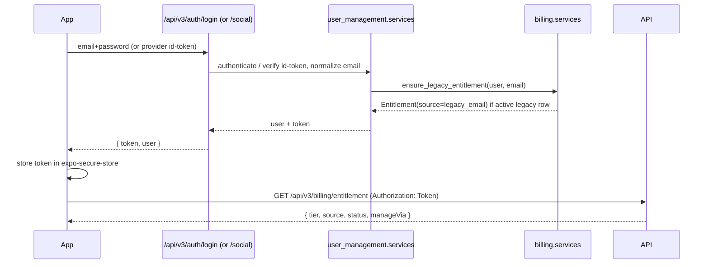

# feat: Account login + unified premium entitlement (legacy-honoring, source-aware)

This plan spans two repos:

- **`SaoMiguelBus-api`** (branch `revamp`, new backend under `src/`) — DRF-token auth endpoints (email/password + optional Apple/Google), and a unified `billing.Entitlement` that becomes the single premium source of truth (honoring legacy email subscriptions, source-tagged, admin-revocable).
- **`SaoMiguelBus`** (Expo SDK 56 mobile client, "Azores Hub") — secure token persistence, authed API calls, sign-in + account surface, real entitlement consumption replacing the DEV `usePremium()` stub, and premium-aware UI.

API-side units are marked **[api: SaoMiguelBus-api]**; mobile-side units are marked **[mobile: SaoMiguelBus]**. All paths are repo-relative to the repo named in the unit's tag. The architecture here implements the SDD: `SDD/08-monetization-freemium.md` §2 (unified `Entitlement`), `SDD/11-security-auth.md` §1 (auth actors), `SDD/03-data-model.md` §6 (entitlement schema), `SDD/04-api-design.md` §2.2 (billing/auth surface). SDD paths are relative to the `SaoMiguelBus` repo.

---

## Summary

Give the app real user accounts and a real premium signal. The API gains DRF-token auth (register/login/me/logout by email + password, no email verification for now) plus optional native Apple/Google sign-in via server-side id-token verification, and a unified `billing.Entitlement` model that consolidates premium across providers. On sign-in the backend automatically **honors any active legacy email subscription** by minting a provenance-tagged entitlement (`source="legacy_email"`), which — like admin `manual` grants — is fully revocable from Django admin so it can be turned off later. The mobile app persists the auth token in secure storage, sends it on every request, exposes sign-in + account + premium UI (badge plus a Premium section in Settings showing tier, where the subscription lives, and a source-aware "manage" action), and replaces the `__DEV__`-only `usePremium()` stub with the live entitlement from `GET /api/v3/billing/entitlement` (cached, fail-safe to free). RevenueCat/Stripe purchase flows are out of scope; only their `source` tracking and webhook-reconcile seam ship so future IAP slots in without touching call sites.

---

## Problem Frame

Today there is no account system anywhere in the stack. The Expo client identifies users only by an anonymous `session_id` UUID (`lib/session.ts`), sends no auth header (`lib/api.ts`), and premium is a `__DEV__`-only Zustand override that is hard-`false` in production (`lib/premium-store.ts`). The only premium UX is marketing copy (`components/PremiumHeaderButton.tsx`, `features/transit/components/PremiumLaunchModal.tsx`); the single real gate is offline transit (from the prior offline-bundle plan).

On the backend, "premium" is a legacy email allow-list: a row in `billing.Subscription` (`src/billing/models.py`, `db_table='subscriptions'`) keyed by email, surfaced only through the compat shim `POST /api/v1/subscription/verify/` (`src/compat/api.py` → `src/billing/services.py`). There is no user model beyond stock Django `auth.User`, no REST auth for mobile (allauth is browser/session-only and gated behind `AUTHENTICATION_REQUIRED`, default `False`), no link between Stripe one-off payments and premium, and no provider/source tracking. The compat verify path is also case-sensitive (it does not lowercase email, unlike the legacy serializer), so legacy users can silently lose premium on a casing mismatch.

The SDD already specifies the destination — a single `Entitlement` reconciled from Stripe, RevenueCat, and the legacy email allow-list, with the app asking the backend "am I premium?" rather than the store — but none of it is built. This plan implements that destination end-to-end: accounts, legacy honoring with a revocable provenance tag, a source-aware client experience, and the premium UI the user can actually see. It deliberately stops short of wiring real purchases (RevenueCat on device, Stripe on web), which the user is sequencing afterward; it ships the model fields and webhook seam so that work is additive.

---

## Requirements

### Accounts & authentication (API)

- R1. A user can register with email + password via `POST /api/v3/auth/register` and immediately receive an auth token; email is normalized to lowercase and treated as the unique account key. No email verification is required.
- R2. A user can log in with email + password via `POST /api/v3/auth/login` and receive the same token shape.
- R3. `GET /api/v3/auth/me` returns the authenticated user's profile (id, email, display name, date joined) and `POST /api/v3/auth/logout` invalidates the presented token.
- R4. The token authenticates all account-bound v3 endpoints via `Authorization: Token <token>`; public read endpoints remain anonymous (`AllowAny` default preserved). Brute-force protection (django-axes, already enabled) covers the login endpoint.
- R5. Optional native social sign-in: `POST /api/v3/auth/social` accepts a provider (`apple` | `google`) and the provider's identity token, verifies it server-side against the provider's public keys, finds-or-creates the matching user by verified email, and returns the same token shape. Email collision with an existing password account links to that account.

### Premium entitlement (API)

- R6. A unified `billing.Entitlement` model is the single source of truth for premium, carrying `tier` (`free` | `premium`), `source` (`legacy_email` | `manual` | `revenuecat` | `stripe`), `status` (`active` | `canceled` | `expired`), `current_period_end` (nullable), `features` (JSON), `external_id`, and a link to `User` (with `email` retained for not-yet-linked legacy rows).
- R7. On account creation and on every login/social sign-in, the backend honors an active legacy subscription: if `billing.Subscription` has an active row for the (lowercased) email, an `Entitlement(source="legacy_email", tier="premium", status="active")` is created or refreshed and linked to the user.
- R8. Legacy-honored and admin-`manual` entitlements are revocable: a staff user can deactivate (`status="canceled"`/`expired`) any entitlement from Django admin, which immediately removes premium on the next entitlement fetch. `source` distinguishes honored-legacy vs manual vs paid so revocation is auditable.
- R9. `GET /api/v3/billing/entitlement` (auth required) returns the caller's effective entitlement: `tier`, `source`, `status`, `currentPeriodEnd`, `features`, and `manageVia` (where the subscription is managed: `app_store` | `play_store` | `stripe` | `none`). When no active entitlement exists it returns a well-formed free response, never an error.
- R10. Email matching across the legacy compat verify path (`POST /api/v1/subscription/verify/`) and entitlement resolution is consistently lowercased, closing the existing case-sensitivity gap.

### Mobile accounts & session (mobile)

- R11. The auth token persists across app restarts in secure storage (`expo-secure-store`), and `lib/api.ts` attaches `Authorization: Token <token>` automatically whenever a token is present.
- R12. The app exposes sign-in (email/password, plus Apple/Google when available) and an account view in Settings showing the signed-in email with a sign-out action; signed-out users see a sign-in entry point.
- R13. Native Apple Sign In (iOS) and Google Sign In (Android) post their identity token to `POST /api/v3/auth/social`; these are additive — the app remains fully functional with email/password alone if a platform's native flow is unavailable.

### Premium experience (mobile)

- R14. `usePremium()` resolves from the live entitlement (`GET /api/v3/billing/entitlement`) for the signed-in user, cached and persisted, fail-safe to free on any error or signed-out state; the `__DEV__` override is retained for testing.
- R15. Premium status is visible: the existing crown/header surface and the relevant gated UX reflect real entitlement state (not marketing-only), and offline transit gating (prior plan) is driven by the real flag.
- R16. Settings has a Premium section showing tier, status, renewal date when present, and **where the subscription lives** (App Store / Google Play / Stripe / Legacy or Manual), with a source-aware "Manage subscription" action that routes correctly (native subscription settings for IAP, billing portal for Stripe, informational for legacy/manual).

---

## Acceptance Examples

- AE1. **Legacy premium is honored on sign-in.** Given `billing.Subscription` has an active row for `maria@example.com`, when a user registers or logs in with `Maria@Example.com`, then an `Entitlement(source="legacy_email", tier="premium", status="active")` linked to that user exists and `GET /api/v3/billing/entitlement` returns `tier="premium"`, `source="legacy_email"`, `manageVia="none"`. (Covers R7, R9, R10)
- AE2. **Manual premium can be turned off.** Given a staff user granted `Entitlement(source="manual", tier="premium")` to an account, when they set its `status` to `canceled` in Django admin, then the next `GET /api/v3/billing/entitlement` for that user returns `tier="free"`. (Covers R8)
- AE3. **No account, no premium leak.** Given a signed-out app, when the client resolves premium, then `usePremium()` is `false` and no entitlement request is made (or a 401 is treated as free). (Covers R14)
- AE4. **Entitlement fetch failure fails safe.** Given the entitlement endpoint is unreachable, when the app resolves premium, then `usePremium()` returns `false` (free/ads), matching the SDD fail-safe. (Covers R14)
- AE5. **Source drives manage routing.** Given an entitlement with `source="legacy_email"` (`manageVia="none"`), when the user opens the Premium section, then the manage action is informational, not a store deep-link; given a future `source="revenuecat"` on iOS (`manageVia="app_store"`), the action deep-links to the system subscription settings. (Covers R16)
- AE6. **Token persists across restart.** Given a logged-in user, when the app is killed and reopened, then they remain logged in and authed requests carry the token without re-entering credentials. (Covers R11)

---

## Key Technical Decisions

- KTD1. **DRF `TokenAuthentication`, not JWT.** Matches the SDD ("DRF token auth") and `rest_framework.authtoken` is a zero-dependency stdlib-of-DRF add. Tokens are opaque, server-revocable on logout (R3), and stored in `expo-secure-store`. Add `TokenAuthentication` + `SessionAuthentication` to `DEFAULT_AUTHENTICATION_CLASSES` but keep `DEFAULT_PERMISSION_CLASSES = [AllowAny]` so public endpoints stay open; auth/billing endpoints opt into `IsAuthenticated`. JWT/refresh rotation is heavier than this app needs and is not in the SDD; revisit only if multi-device token hygiene becomes a requirement.
- KTD2. **`user_management` owns the REST auth surface; stock `auth.User`.** No custom `AUTH_USER_MODEL` (avoids a destructive migration on an existing DB, consistent with current FKs in `stripe_payments`/`consent`). Add `user_management/api_v3.py` + `serializers.py` + `urls_v3.py` following the repo's `@api_view` + `serializers.Serializer` + thin `services.py` convention (no ViewSets/routers anywhere in `src/`). allauth stays as-is for the (optional) browser surface; this plan does not flip `AUTHENTICATION_REQUIRED`.
- KTD3. **Social sign-in verifies the provider id-token directly, server-side.** The client obtains the identity token natively (`expo-apple-authentication`, native Google sign-in) and POSTs it; the server validates signature + audience + expiry against Apple JWKS (`appleid.apple.com`) and Google's token endpoint/JWKS, then maps `verified email → User`. `PyJWT==2.8.0` + `cryptography` are already in `src/requirements.txt`, so no browser-redirect allauth social flow is needed. This keeps the native UX (no web popup) and avoids adding `dj-rest-auth`.
- KTD4. **Unified `Entitlement` is the source of truth; `Subscription` is demoted to legacy data + compat.** Per SDD §2. The legacy `Subscription` table keeps feeding the compat `verify` endpoint (unchanged contract) and becomes the input to legacy-honoring (R7). New code reads premium only from `Entitlement`. This avoids a fragile dual-write and gives one place for source/status/renewal.
- KTD5. **`source` is the provenance + "turn it off" lever.** `legacy_email` (honored from the allow-list), `manual` (admin grant), `revenuecat`/`stripe` (paid). Revocation is `status` change in admin (R8). The user's "mark it manual so we can turn it off later" maps to `source ∈ {legacy_email, manual}` + admin-editable `status`; no separate boolean flag.
- KTD6. **Entitlement resolution is recompute-on-read with honoring on auth events.** `GET /billing/entitlement` returns the highest-priority active entitlement (paid > manual > legacy_email). Legacy honoring runs at register/login/social (R7), not on every read, to keep reads cheap; an idempotent `ensure_legacy_entitlement(user)` is also safe to call elsewhere. Redis caching follows the events/weather pattern but is keyed per user and invalidated on entitlement write.
- KTD7. **`manageVia` is derived from `source`, computed server-side.** `app_store`/`play_store` for `revenuecat` (by stored platform), `stripe` for `stripe`, `none` for `legacy_email`/`manual`. The client never guesses where to send the user to cancel; this is the user's "keep track of where the subscription is" requirement.
- KTD8. **Client premium keeps a stable `usePremium()` seam.** The prior offline plan introduced `usePremium()`/`getIsPremium()` as a stub; this plan swaps the implementation to read a persisted, query-backed entitlement store without touching the ~handful of call sites. Fail-safe free (KTD/SDD), `__DEV__` override retained, signed-out ⇒ free.
- KTD9. **Auth header injection lives in `apiFetch`.** A single chokepoint in `lib/api.ts` reads the token from the auth store and adds `Authorization`. Keeps existing `X-Island` / `X-Session-Id` behavior; anonymous calls are unchanged when no token is present.
- KTD10. **RevenueCat/Stripe purchase flows are deferred; the seam ships.** Model `source` values + a `POST /api/v3/billing/webhooks/revenuecat` reconcile endpoint exist so device IAP (next milestone) reconciles into the same `Entitlement`. No RC SDK, no paywall purchase, no Stripe checkout in this plan.

---

## High-Level Technical Design

Premium is computed by the backend from one table, fed by three providers; the app only asks "am I premium, and where do I manage it?":

```mermaid
flowchart TB
  subgraph providers[Premium sources]
    L[Legacy Subscription<br/>email allow-list] -->|register/login honoring| E
    M[Admin manual grant] --> E
    RC[RevenueCat webhook<br/>deferred] -.->|reconcile| E
    ST[Stripe webhook<br/>deferred] -.->|reconcile| E
  end
  E[(billing.Entitlement<br/>user, tier, source, status,<br/>current_period_end, features)]
  E -->|GET /api/v3/billing/entitlement| API[entitlement resolver<br/>priority: paid &gt; manual &gt; legacy]
  API -->|tier, source, status, manageVia| APP[Mobile usePremium + Premium UI]
  APP -->|Authorization: Token| AUTH[/api/v3/auth/*]
  AUTH --> U[(auth.User)]
  E -. user FK .- U
```

Auth + honoring sequence on login:



---

## Output Structure

New files (repo-relative to each tagged repo):

```
SaoMiguelBus-api/src/
├── user_management/
│   ├── api_v3.py            # register, login, me, logout, social
│   ├── serializers.py       # auth request/response serializers
│   ├── services.py          # authenticate, create_account, social verify
│   ├── social.py            # Apple/Google id-token verification
│   └── urls_v3.py
└── billing/
    ├── models.py            # + Entitlement
    ├── services.py          # + entitlement resolve / ensure_legacy / manage_via
    ├── api_v3.py            # entitlement endpoint + revenuecat webhook (stub)
    ├── serializers.py       # entitlement serializer
    ├── admin.py             # Entitlement admin (revocation)
    └── urls_v3.py

SaoMiguelBus/
├── app/auth/sign-in.tsx     # sign-in screen (email + social)
├── lib/auth-store.ts        # token + user, persisted (secure-store)
├── lib/secure-token.ts      # expo-secure-store wrapper
├── lib/entitlement-store.ts # live entitlement cache (replaces premium stub source)
├── features/account/
│   ├── hooks/useAuth.ts
│   ├── hooks/useEntitlement.ts
│   └── components/PremiumSettingsSection.tsx
```

`lib/premium-store.ts` and `lib/api.ts` are modified in place (not recreated).

---

## Implementation Units

> Sequencing: API auth (U1–U3) → API entitlement (U4–U7) → mobile auth (U8–U10) → mobile premium UX (U11–U12). Mobile entitlement work (U11) depends on the API entitlement endpoint (U6) and mobile auth (U8). API tests run `cd src && python manage.py test`. The mobile client has no JS unit-test runner today (no `test` script / jest config in `package.json`); mobile units specify logic tests where pure functions allow them and otherwise an explicit manual verification path — adding a test runner is out of scope here.

### U1. Enable DRF token auth scaffolding [api: SaoMiguelBus-api]

- Goal: Turn on `rest_framework.authtoken` and token auth without changing public-endpoint behavior.
- Requirements: R4
- Dependencies: none
- Files: `src/src/settings.py` (add `rest_framework.authtoken` to enabled apps; set `REST_FRAMEWORK['DEFAULT_AUTHENTICATION_CLASSES'] = ['rest_framework.authentication.TokenAuthentication', 'rest_framework.authentication.SessionAuthentication']`; keep `DEFAULT_PERMISSION_CLASSES = ['rest_framework.permissions.AllowAny']`), new migration via `python manage.py migrate authtoken`.
- Approach: Verify `authtoken` slots into the `apps = [(name, bool), ...]` toggle convention (append as always-on like `shared`). Confirm django-axes still wraps credential auth. Do not enable `AUTHENTICATION_REQUIRED` or `LoginRequiredMiddleware` for APIs.
- Patterns to follow: app toggle list in `src/src/settings.py`; existing DRF config block.
- Test scenarios:
  - Covers R4. A public endpoint (e.g. `GET /api/v3/transit/...` or compat `GET /api/v2/stops`) still returns 200 with no `Authorization` header.
  - A request with a bogus `Authorization: Token xxx` to a public endpoint is not rejected (AllowAny default holds).
- Verification: `manage.py check` passes; migration applies; existing API test suite stays green.

### U2. Email/password auth endpoints [api: SaoMiguelBus-api]

- Goal: Register, login, me, logout returning an opaque token.
- Requirements: R1, R2, R3, R4
- Dependencies: U1
- Files: `src/user_management/api_v3.py`, `src/user_management/serializers.py`, `src/user_management/services.py`, `src/user_management/urls_v3.py` (new); wire into `src/src/urls.py` under `api/v3/auth/`.
- Approach: `@api_view` function views. `register` normalizes email to lowercase, enforces uniqueness on email, creates `User` (username=email), hashes password via Django, returns `{ token, user }`. `login` authenticates and returns existing-or-new token. `me`/`logout` require `IsAuthenticated`; logout deletes the `Token`. Call `billing.services.ensure_legacy_entitlement(user)` on register and login (the U5 hook) — guard with try/except so an entitlement hiccup never blocks auth.
- Execution note: Start with a failing API test for the register→token→me round-trip before wiring views.
- Patterns to follow: `src/consent/api.py` + `serializers.py` + `urls.py`; compat `@api_view` style in `src/compat/api.py`.
- Test scenarios:
  - Covers R1. Register with new email returns 201 + token; `me` with that token returns the email lowercased.
  - Covers R1. Register with mixed-case duplicate email (`A@B.com` after `a@b.com`) returns 400, not a second account.
  - Covers R2. Login with correct password returns token; wrong password returns 401/400.
  - Covers R3. Logout invalidates the token (subsequent `me` returns 401).
  - Covers R4. `me` without a token returns 401.
- Verification: round-trip test passes; axes lockout still triggers on repeated bad logins.

### U3. Native social sign-in verification [api: SaoMiguelBus-api]

- Goal: Verify Apple/Google identity tokens and issue the app token.
- Requirements: R5
- Dependencies: U2
- Files: `src/user_management/social.py` (new — Apple JWKS + Google token verification), `src/user_management/api_v3.py` (add `social` view), `src/user_management/serializers.py` (social request), `src/user_management/urls_v3.py`.
- Approach: `POST /api/v3/auth/social` with `{ provider, identity_token, [nonce] }`. Apple: fetch + cache `appleid.apple.com/auth/keys`, verify RS256 signature, `aud` = app bundle id, `iss` = `https://appleid.apple.com`, expiry, optional nonce. Google: verify `aud` = configured client id(s), `iss` ∈ Google issuers, expiry (verify via Google's tokeninfo/JWKS). Extract verified email, find-or-create `User` (link to existing password account on email match), then `ensure_legacy_entitlement`. Provider client ids / bundle id from env (`APPLE_BUNDLE_ID`, `GOOGLE_IOS_CLIENT_ID`, `GOOGLE_ANDROID_CLIENT_ID`) added to `src/src/.env.example`.
- Patterns to follow: existing `PyJWT` usage; env access in `settings.py`.
- Test scenarios:
  - Covers R5. Valid (mocked-verified) Apple token for a new email creates a user + returns token.
  - Covers R5. Valid Google token whose email matches an existing password account returns that account's token (link, not duplicate).
  - An expired or wrong-`aud` token returns 401 and creates no user.
  - Covers AE1. A social sign-in whose email has an active legacy subscription yields `source="legacy_email"` premium.
- Verification: verification helpers unit-tested with mocked JWKS; bad-signature/bad-aud/expiry paths covered.

### U4. `Entitlement` model + admin [api: SaoMiguelBus-api]

- Goal: The unified premium table with admin revocation.
- Requirements: R6, R8
- Dependencies: none (can land parallel to U1–U3)
- Files: `src/billing/models.py` (add `Entitlement`), `src/billing/admin.py` (new or extend), migration.
- Approach: Fields per SDD §6: `user` FK (`null=True` for unlinked legacy), `email` (for unlinked/legacy match), `tier` (`free`/`premium`), `source` (`legacy_email`/`manual`/`revenuecat`/`stripe`), `status` (`active`/`canceled`/`expired`), `external_id`, `current_period_end` (nullable), `features` (JSON, default `["ad_removal"]`), timestamps. Index on `(user, status)` and `(email, status)`. Admin list shows user/email/tier/source/status with a filter on `source`/`status` and an inline editable `status` for revocation. Keep `Subscription` model untouched.
- Patterns to follow: `src/billing/models.py` `Subscription`; `consent` models for FK-to-User-nullable.
- Test scenarios:
  - Covers R6. Creating an `Entitlement` with each `source` value persists and round-trips.
  - Covers R8. Setting `status="canceled"` is reflected by the resolver (asserted in U5/U6 tests).
  - `__str__`/admin display renders without error for unlinked (email-only) rows.
- Verification: migration applies cleanly on a DB that already has the `subscriptions` table; admin loads.

### U5. Entitlement services: resolve, legacy honoring, manage routing [api: SaoMiguelBus-api]

- Goal: The business logic the endpoint and auth hooks call.
- Requirements: R6, R7, R8, R10, KTD6, KTD7
- Dependencies: U4
- Files: `src/billing/services.py` (extend).
- Approach: `ensure_legacy_entitlement(user)` — lowercase user.email, if active `Subscription` exists, `get_or_create`/refresh `Entitlement(user=user, source="legacy_email", tier="premium", status="active")` (idempotent). `resolve_entitlement(user)` — return highest-priority active entitlement (paid `stripe`/`revenuecat` > `manual` > `legacy_email`), else a free result. `manage_via(entitlement)` — derive `app_store`/`play_store`/`stripe`/`none` from `source` (+ stored platform for revenuecat). Lowercase email in the existing `verify_subscription` and in the compat handler path (R10). Per-user Redis cache for `resolve_entitlement`, invalidated on entitlement save.
- Patterns to follow: existing `src/billing/services.py verify_subscription`; events/weather Redis cache helpers.
- Test scenarios:
  - Covers R7, AE1. User whose email has an active legacy row gets a `legacy_email` entitlement after `ensure_legacy_entitlement`; calling twice does not duplicate.
  - Covers R8, AE2. With both a `manual` (canceled) and a `legacy_email` (active) entitlement, resolve returns the active one; canceling all returns free.
  - Priority: an active `revenuecat` entitlement wins over an active `legacy_email`.
  - Covers R10. `verify_subscription("Maria@Example.com")` matches a lowercase legacy row.
  - Covers KTD7. `manage_via` returns `none` for legacy/manual, `stripe` for stripe.
- Verification: service tests green; cache invalidation verified by mutate-then-resolve.

### U6. Entitlement endpoint + email-parity fix [api: SaoMiguelBus-api]

- Goal: The client-facing read endpoint and the compat casing fix.
- Requirements: R9, R10
- Dependencies: U5
- Files: `src/billing/api_v3.py` (new), `src/billing/serializers.py` (new), `src/billing/urls_v3.py` (new), wire under `api/v3/billing/`; `src/compat/api.py` (lowercase email in `verify_subscription_view`).
- Approach: `GET /api/v3/billing/entitlement`, `IsAuthenticated`, returns `{ tier, source, status, currentPeriodEnd, features, manageVia }` from `resolve_entitlement` + `manage_via`; free response when none. Serializer mirrors field names the client expects (camelCase like other v3 responses).
- Execution note: Failing test for the authed entitlement contract first.
- Patterns to follow: `marketplace/api_v3.py` + `urls_v3.py`; v3 camelCase response convention.
- Test scenarios:
  - Covers R9, AE1. Authed user with legacy premium gets `tier="premium"`, `source="legacy_email"`, `manageVia="none"`.
  - Covers R9. Authed user with no entitlement gets `tier="free"` (200, well-formed), not 404.
  - Covers R9, AE3. Unauthenticated request returns 401.
  - Covers R10. `POST /api/v1/subscription/verify/` with mixed-case email matches a lowercase legacy row (compat parity).
- Verification: contract tests green; compat verify test for casing passes.

### U7. RevenueCat reconcile webhook (seam only) [api: SaoMiguelBus-api]

- Goal: Land the reconcile endpoint so device IAP slots in later without touching clients.
- Requirements: R6 (source coverage), KTD10
- Dependencies: U5
- Files: `src/billing/api_v3.py` (add `revenuecat_webhook`), `src/billing/services.py` (`reconcile_revenuecat`), `src/billing/urls_v3.py`, `src/src/.env.example` (`REVENUECAT_WEBHOOK_SECRET`).
- Approach: `POST /api/v3/billing/webhooks/revenuecat`, verify shared secret/signature, map RC event → `Entitlement(source="revenuecat", external_id=app_user_id, current_period_end, status)` with `platform` for `manage_via`. This is the only RevenueCat code in scope; no SDK, no client purchase. Mark clearly as the future-IAP seam.
- Patterns to follow: `stripe_payments/services.py handle_webhook_event` signature-verification shape.
- Test scenarios:
  - Covers KTD10. A signed RC "active subscription" payload creates/updates a `revenuecat` entitlement that `resolve_entitlement` returns as premium with `manageVia` = the platform store.
  - Bad signature returns 400 and writes nothing.
  - Test expectation note: Stripe reconcile is deferred with web purchases; only the `stripe` source value exists in the model.
- Verification: webhook test green; endpoint excluded from auth (uses secret, not token).

### U8. Mobile secure token storage + auth store + authed client [mobile: SaoMiguelBus]

- Goal: Persist the token and send it on every request.
- Requirements: R11
- Dependencies: U2 (contract); can build against the contract before API deploy
- Files: `lib/secure-token.ts` (new, `expo-secure-store` wrapper), `lib/auth-store.ts` (new Zustand store: `token`, `user`, hydrate-on-start, `setSession`/`clearSession`), `lib/api.ts` (inject `Authorization: Token` in `apiFetch` when token present), `package.json` (`expo-secure-store`), `app.json` (plugin if required).
- Approach: Token in secure-store (not AsyncStorage) per security posture; non-sensitive `user` may sit in the persisted Zustand store. `apiFetch` reads the in-memory token (hydrated at boot) and adds the header alongside existing `X-Island`/`X-Session-Id`. Anonymous calls unchanged when no token.
- Patterns to follow: existing Zustand `persist` stores (`lib/premium-store.ts`, `lib/consent-store.ts`); `lib/api.ts islandHeaders`/`apiFetch`.
- Test scenarios:
  - Covers R11 (logic). A pure header-builder unit (extracted) includes `Authorization` only when a token is set — testable if a runner is added; otherwise manual.
  - Manual: log in, kill app, reopen → still authed (AE6); authed request carries the header (network inspector).
- Verification: manual AE6 walkthrough on a dev build; no token ⇒ requests identical to today.

### U9. Mobile sign-in + account UI (email/password) [mobile: SaoMiguelBus]

- Goal: Sign-in screen and account section in Settings.
- Requirements: R12
- Dependencies: U8
- Files: `app/auth/sign-in.tsx` (new, registered in `app/_layout.tsx` stack), `features/account/hooks/useAuth.ts` (new, TanStack mutations for register/login/logout + `me`), `app/settings.tsx` (account row: signed-in email + sign out, or sign-in entry), `locales/*.json` (account/auth keys — reuse existing unused subscription/account keys where present).
- Approach: Email/password form with register/login toggle; on success store session + invalidate entitlement query. Account section in Settings shows email + sign-out (clears session, secure-store, entitlement cache). Wire the sign-in entry point from Settings (and optionally the premium surface).
- Patterns to follow: `app/settings.tsx` section structure + `useTranslation`; existing modal/formSheet routes (`app/settings.tsx`, `app/profile.tsx`); TanStack mutation hooks under `features/*/hooks`.
- Test scenarios:
  - Manual: register a new email → lands signed-in, Settings shows email.
  - Manual: login existing → signed-in; sign out → entry point returns, entitlement resets to free.
  - Manual: invalid credentials show an error, no session stored.
- Verification: manual flows on dev build; i18n keys present in all locales (`node check_locale_keys.js` equivalent / locale parity).

### U10. Native Apple & Google sign-in [mobile: SaoMiguelBus]

- Goal: One-tap native sign-in posting to the social endpoint. Additive/skippable.
- Requirements: R13
- Dependencies: U9, U3
- Files: `app/auth/sign-in.tsx` (Apple/Google buttons), `features/account/hooks/useAuth.ts` (social mutation), `package.json` (`expo-apple-authentication`, native Google sign-in lib), `app.json` (plugins, iOS `usesAppleSignIn`, URL schemes / client ids), `.env`/`app.json extra` (Google client ids).
- Approach: iOS — `expo-apple-authentication` (Apple button, get `identityToken`) → `POST /auth/social {provider:"apple"}`. Android — native Google sign-in → id-token → `{provider:"google"}`. Gate buttons by platform + availability; email/password remains the always-available fallback. **App Store rule:** if Google sign-in is offered on iOS, Apple Sign In must also be offered on iOS — surface Apple on iOS regardless. Requires a dev build / prebuild (the app already uses `expo run:*` + native modules; not Expo Go).
- Patterns to follow: existing native-module usage (`react-native-maps`, `expo-location`) and prebuild scripts.
- Test scenarios:
  - Manual (iOS dev build): Apple button → signed-in; new email creates account, returning email logs in.
  - Manual (Android dev build): Google button → signed-in.
  - Manual: with no native availability, the screen still works via email/password.
- Verification: manual on both platforms; Apple capability enabled in the iOS entitlements during prebuild.

### U11. Live entitlement consumption (replace premium stub) [mobile: SaoMiguelBus]

- Goal: Make `usePremium()` real, cached, fail-safe.
- Requirements: R14, R15, KTD8
- Dependencies: U6, U8
- Files: `lib/entitlement-store.ts` (new — persisted last-known entitlement), `features/account/hooks/useEntitlement.ts` (new — TanStack query for `GET /billing/entitlement`, enabled only when authed, refetch on launch/login/foreground), `lib/premium-store.ts` (rewire `usePremium()`/`getIsPremium()` to read entitlement; retain `__DEV__` override; signed-out ⇒ free).
- Approach: Query gated on `auth-store.token`; on success persist `{tier, source, status, currentPeriodEnd, manageVia}`; `usePremium()` returns `tier === "premium"` from the persisted value OR the `__DEV__` override; any error / 401 / signed-out ⇒ free (AE3, AE4). All existing call sites (offline gating, header) keep working through the unchanged seam (KTD8).
- Patterns to follow: `lib/query-provider.tsx` persistence; `lib/premium-store.ts` current stub interface; feature query hooks under `features/*/hooks`.
- Test scenarios:
  - Covers R14, AE3 (logic). `usePremium()` is `false` when signed out and no `__DEV__` override — extract a pure resolver for unit testing if a runner exists; else manual.
  - Covers AE4 (logic/manual). Forcing the entitlement request to fail leaves `usePremium()` false.
  - Manual: a legacy-premium account signs in → offline transit gating + crown reflect premium without a code change at call sites.
- Verification: manual end-to-end with a known legacy-premium email; offline gate (prior plan) now driven by real entitlement.

### U12. Premium UI: badge + source-aware Settings section [mobile: SaoMiguelBus]

- Goal: The user can see they are premium and where their subscription lives.
- Requirements: R15, R16
- Dependencies: U11
- Files: `features/account/components/PremiumSettingsSection.tsx` (new), `app/settings.tsx` (mount Premium section), `components/PremiumHeaderButton.tsx` + `features/transit/components/PremiumLaunchModal.tsx` (reflect real state), `locales/*.json` (premium status/source/manage keys — reuse existing unused premium keys).
- Approach: Premium section shows tier (Free/Premium), status, renewal date when `currentPeriodEnd` present, and a "Subscription managed via" line mapping `manageVia` → App Store / Google Play / Stripe / "Legacy or manual access". "Manage subscription" action routes by `manageVia`: `app_store`/`play_store` → open native subscription settings (deep link/`Linking`), `stripe` → open billing portal URL (web browser), `none` → informational copy. Header crown/marketing modal switch from marketing-only to entitlement-aware (premium users see status, not the upsell). Free users keep the existing upsell entry point (purchase flow itself remains future RevenueCat work).
- Patterns to follow: `app/settings.tsx` section + `SegmentedControl`/rows; `expo-web-browser` + `lib/legal-urls.ts` (for portal/link); `expo-linking` for native settings.
- Test scenarios:
  - Covers R16, AE5 (manual). Legacy-premium account shows "Premium", `manageVia="none"` → informational manage action (no store deep-link).
  - Covers R16 (manual, future). A `revenuecat` entitlement on iOS shows "App Store" + deep-links to system subscription settings.
  - Manual: free user sees Free + the existing upsell; premium user sees status instead of the upsell.
- Verification: manual across sources (force `source` values via API/admin or `__DEV__`); locale parity for new keys.

---

## Scope Boundaries

In scope: accounts (email/password + optional native Apple/Google), DRF-token auth, unified `Entitlement` with legacy honoring + admin revocation, source-aware entitlement read API, mobile token persistence + authed calls, live `usePremium()`, premium badge + Settings Premium section, email-casing parity fix.

### Deferred to Follow-Up Work

- RevenueCat client SDK, paywall purchase flow, and on-device IAP (the user is sequencing this next). U7 ships only the reconcile webhook seam.
- Stripe web checkout / billing portal purchase flow and its reconcile webhook (only the `stripe` source value + `manageVia` routing exist).
- Email verification, password reset / forgot-password, and account deletion (DSAR) flows.
- Account-bound favorites/recents migration from the local `lib/profile-store.ts` to the server account.
- A JS unit-test runner for the mobile app (jest/RNTL) — mobile units currently rely on extracted pure-function tests where possible plus manual verification.
- Multi-device token rotation / refresh tokens.

### Outside this product's identity (for now)

- Multi-island entitlement scoping. The SDD leaves open whether `Entitlement` is per-island (`SDD/12-risks-open-questions.md`). This plan treats premium as account-global (no `island` FK on `Entitlement`); revisit if/when a second island hub ships.

---

## Risks & Dependencies

- Apple App Store policy: offering any third-party/social sign-in on iOS obligates offering Apple Sign In on iOS (handled in U10). Also, gating real digital benefits may invite IAP-rule scrutiny later — relevant when RevenueCat purchases land, not now.
- Social token verification correctness is security-critical: must validate signature, `aud`, `iss`, and expiry, and trust only the verified email (U3). Mocked-JWKS tests cover the failure paths.
- Token storage: `expo-secure-store` requires a dev/prebuild build (already the app's posture); ensure the iOS keychain entitlement is present after prebuild.
- Legacy data quality: honoring depends on `billing.Subscription.email` accuracy and casing — U5/U6 normalize to lowercase; an active legacy row with a different email than the account's will not be honored (acceptable; manual grant covers edge cases).
- Fail-safe direction: entitlement errors default to **free/ads**, matching SDD — a transient backend issue downgrades premium rather than leaking it. Acceptable per SDD; surfaced so it is a conscious choice.
- Cross-repo sequencing: mobile entitlement/auth units build against the API contract; they need the API units deployed to function end-to-end. Build mobile against a local/staging API.
- `AUTHENTICATION_REQUIRED` stays `False`; this plan must not accidentally gate public read endpoints when adding token auth (U1 keeps `AllowAny` default).

---

## Documentation / Operational Notes

- Update `SaoMiguelBus-api/AGENTS.md` "Webapp drop-in deploy" / env section with new env vars: `APPLE_BUNDLE_ID`, `GOOGLE_IOS_CLIENT_ID`, `GOOGLE_ANDROID_CLIENT_ID`, `REVENUECAT_WEBHOOK_SECRET`, and the new `api/v3/auth/*` + `api/v3/billing/entitlement` surface.
- Note in the SDD compat/billing tables that `GET /api/v3/billing/entitlement` and `/api/v3/auth/*` move from "specified" to "implemented".
- Django admin becomes the operational tool for premium: grant `manual` entitlements, revoke (`legacy_email`/`manual`) by setting `status` — document for staff.
