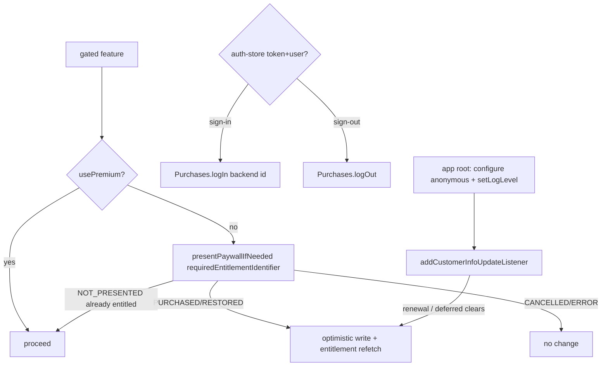

# feat: RevenueCat IAP — paywall, purchases, and entitlement parity

**Target repo:** `SaoMiguelBus` (Expo SDK 56 mobile client, "São Miguel Hub"). All paths are repo-relative to `SaoMiguelBus` unless tagged otherwise.

This is the on-device In-App-Purchase milestone deferred by `docs/plans/2026-06-04-001-feat-account-login-premium-entitlement-plan.md` ("RevenueCat client SDK, paywall purchase flow, and on-device IAP — the user is sequencing this next"). That prior plan shipped the seams this one consumes: backend-driven `usePremium()` reading `GET /api/v3/billing/entitlement`, the persisted `entitlement-store` whose `Entitlement` type already carries `source="revenuecat"` and `manageVia` (`app_store`/`play_store`), DRF-token auth in secure storage, and the API-side `POST /api/v3/billing/webhooks/revenuecat` reconcile endpoint (`source="revenuecat"`).

---

## Summary

Integrate `react-native-purchases` + `react-native-purchases-ui` (10.2.2) so the app can sell the "São Miguel Hub Premium" subscription on iOS and Android. Configure the SDK at app root with platform-specific keys, bind the RevenueCat App User ID to the signed-in backend account, drive purchases off a dashboard-configured offering (weekly / monthly / yearly), present a RevenueCat-hosted Paywall to gate premium, and reconcile every purchase back through the existing backend `Entitlement` so `usePremium()` stays the single client gate and premium is consistent across platforms. The marketing-only header upsell / launch modal become real paywall entry points, and Settings gains a source-aware "Manage subscription" action backed by Customer Center (with a native-store-deep-link fallback). The backend remains the parity source of truth (purchase → store webhook → entitlement refetch); RevenueCat `customerInfo` is used only for instant local unlock.

---

## Problem Frame

The app can identify premium users (`usePremium()` reads the persisted `entitlement-store`, fed by `GET /api/v3/billing/entitlement` for the signed-in user) but cannot **sell** premium. The only premium UX is marketing: `components/PremiumHeaderButton.tsx` opens `features/transit/components/PremiumLaunchModal.tsx`, a sheet with copy and a dismiss button — no purchase, no routing, no price. There is no IAP SDK in the project (`react-native-purchases` is absent from `package.json`), so a user who wants premium has no way to pay, and `Entitlement.source="revenuecat"` / `manageVia` (already modeled) are never exercised.

App-store rules require IAP for digital subscriptions on mobile, and the SDD (`SDD/08-monetization-freemium.md` §2) names RevenueCat as the iOS/Android billing provider that wraps StoreKit / Play Billing and reconciles into the unified `billing.Entitlement`. The destination is: the app asks the backend "am I premium?" (already true) while RevenueCat handles the store transaction and a server webhook updates the durable entitlement so premium is identical on a user's phone, their other phone, and (future) web. This plan builds the on-device half of that: SDK config, identity binding, paywall, purchase, restore, subscription management, and the client-side reconciliation that makes a fresh purchase feel instant without trusting the client for durable authorization.

---

## Requirements

### SDK setup & identity

- R1. `react-native-purchases` and `react-native-purchases-ui` are installed at a version compatible with Expo SDK 56 / RN 0.85 / React 19, and the app builds as a dev/prebuild build (these are native modules; Expo Go falls back to a no-op preview mode).
- R2. The SDK is configured exactly once at app root with a **platform-specific** public API key (Apple `appl_…` on iOS, Google `goog_…` on Android), read from env, before any other Purchases call; a RevenueCat **Test Store** key (`test_…`) is used for development.
- R3. The RevenueCat App User ID is bound to the backend account: on sign-in the app calls `logIn(<backend user id>)`, on sign-out it calls `logOut()`. The app boots anonymous and identifies once auth resolves, so the store webhook's `app_user_id` maps 1:1 to a backend user.

### Offerings & purchase

- R4. The app reads products from the **current offering** (never hardcoded product IDs) and can present weekly, monthly, and yearly packages configured in the RevenueCat dashboard.
- R5. A user can purchase a package; on success the "São Miguel Hub Premium" entitlement becomes active in `customerInfo`, and the app reflects premium immediately.
- R6. A user can restore previous purchases (App Store Guideline 3.1.1), and purchases made while the app is open (renewals, Ask-to-Buy approvals, family sharing) are detected via a `customerInfo` update listener.

### Entitlement parity (multi-platform)

- R7. The backend `Entitlement` remains the single client gate: after a purchase the app refetches `GET /api/v3/billing/entitlement` so the durable, cross-platform entitlement (set by the store webhook) becomes authoritative.
- R8. A just-completed purchase unlocks premium instantly via an **optimistic** local entitlement derived from `customerInfo` (`source="revenuecat"`, `manageVia` = the current platform store), reconciled to the backend value on the next successful fetch.
- R9. Purchase gating requires a signed-in user; an unauthenticated user who taps "Go premium" is routed to sign-in first, then into the paywall.

### Paywall & upsell

- R10. A RevenueCat-hosted Paywall is presented from the premium upsell entry points, replacing the marketing-only `PremiumLaunchModal` purchase-less sheet.
- R11. Gated premium features present the paywall only when the user is not already entitled (no paywall shown to existing premium users).
- R12. The premium header surface and launch modal are entitlement-aware: premium users see status, not an upsell.

### Subscription management

- R13. Settings has a source-aware Premium section showing tier, status, renewal date (when present), and where the subscription is managed, with a "Manage subscription" action.
- R14. The manage action uses RevenueCat Customer Center when available; when Customer Center is unavailable it falls back to the existing `manageVia` routing (native store subscription settings for IAP, Stripe portal for web, informational for legacy/manual).

### Compliance & i18n

- R15. All new user-facing strings exist in every locale catalog (`locales/*.json`), following the existing premium/account key conventions; the app falls back to Portuguese.
- R16. The integration degrades safely: a configuration or store error never crashes the app, never grants premium it cannot verify, and leaves the existing backend-driven free/premium state intact (fail-safe to the last backend value).

---

## Acceptance Examples

- AE1. **Purchase unlocks premium instantly and durably.** Given a signed-in free user, when they open the paywall and buy the monthly package, then `customerInfo.entitlements.active` contains "São Miguel Hub Premium", the app shows premium within the same session (optimistic), and after the store webhook + entitlement refetch `GET /api/v3/billing/entitlement` returns `tier="premium"`, `source="revenuecat"`. (Covers R5, R7, R8)
- AE2. **Premium is consistent on a second device.** Given a user who bought premium on device A, when they sign in on device B, then `GET /api/v3/billing/entitlement` returns premium without re-purchasing (backend parity), and `restorePurchases()` on device B also reflects the active entitlement. (Covers R6, R7 — the backend-parity half depends on the deferred API RevenueCat webhook (KTD10); the client half, `restorePurchases()` reflecting the store entitlement, is verifiable within this plan's scope.)
- AE3. **Cancelled purchase is a no-op.** Given the paywall is open, when the user dismisses the native purchase sheet, then no error is surfaced as a failure, no entitlement changes, and the app returns to the prior screen. (Covers R5, R16)
- AE4. **Signed-out upsell routes through sign-in.** Given a signed-out user, when they tap "Go premium", then they are sent to sign-in and, after authenticating, land on the paywall with their account identified to RevenueCat. (Covers R9, R3)
- AE5. **Already-premium sees no paywall.** Given a premium user, when a gated feature would present the paywall via the "if needed" path, then nothing is shown and access proceeds. (Covers R11, R12)
- AE6. **Manage routes by source.** Given a `revenuecat` entitlement on iOS, when the user taps "Manage subscription", then Customer Center opens (or, if unavailable, the system App Store subscription settings); given a `legacy_email` entitlement, the action is informational. (Covers R13, R14)
- AE7. **Store/network failure fails safe.** Given offerings cannot be fetched or `configure` fails, when the user opens the upsell, then the app shows a graceful error (not a crash) and premium state remains whatever the backend last reported. (Covers R16)

---

## Key Technical Decisions

- KTD1. **Native integration on RN 0.85 (New Architecture) is the real risk and must be de-risked first.** RN 0.85 is bridgeless / New-Arch-only (this app already forces New Arch via `react-native-reanimated@4.3.1` + `react-native-worklets`), and there is current (2026) evidence of `NativeModules.RNPurchases === null` under Expo New-Arch autolinking and `logIn`/`logOut` native crashes on the 10.x line. Treat the install as unproven until validated on a real dev build: confirm whether the package needs an `app.json` `plugins[]` config-plugin entry, a project-level `react-native.config.js` registration (the package may lack `expo-module.config.json`, so `expo-modules-autolinking` may not discover it), and that `npx expo-doctor` / the RN Directory New-Arch flag are green — **do not assume frictionless autolinking** (U1 is the gating spike). A dev/prebuild rebuild is required after install (hot-reload over the old binary throws `new NativeEventEmitter() requires a non-null argument`). Keep both packages on the **same** version and let `npx expo install` pin the SDK-56-compatible one; record the resolved version after the spike rather than hardcoding it.
- KTD2. **Platform-specific keys from env; test key for dev.** Add `EXPO_PUBLIC_REVENUECAT_IOS_API_KEY` (`appl_…`), `EXPO_PUBLIC_REVENUECAT_ANDROID_API_KEY` (`goog_…`), and a dev `EXPO_PUBLIC_REVENUECAT_TEST_API_KEY` (`test_…`, the `test_buMLLvz…` value the user has) following the existing `EXPO_PUBLIC_*` + `app.json extra` pattern used for Google client IDs. Branch with `Platform.select`. The hybrid SDK requires a per-store public key — a single key cannot serve both stores. Never ship the test key to production (guard the test-key branch on `__DEV__` so a prod build can never select it); rotate the plaintext test value before launch. The webhook secret stays API-side only (`REVENUECAT_WEBHOOK_SECRET`), never in the client. **Test-Store caveat:** with the `test_` key the SDK transacts against RevenueCat's Test Store, so U2–U5 can pass green without a working native StoreKit/Play path — real-key sandbox validation (U1) is what proves the integration, not Test-Store success.
- KTD3. **RevenueCat App User ID = a stable opaque backend identifier, bound to auth lifecycle, and verified before purchase.** Configure anonymous at boot, `Purchases.logIn(<stable backend id>)` once `auth-store` has a token+user, `Purchases.logOut()` on `clearSession`. Prefer an **opaque, stable per-user identifier** over the raw sequential Django PK (the PK is enumerable and leaks to RevenueCat); coordinate the chosen id shape with the API's `reconcile_revenuecat` lookup so the webhook's `app_user_id` resolves to the right backend `User`. Because the `logIn` bind can fail or crash natively (see below), **gate the actual purchase on `Purchases.getAppUserID()` matching the signed-in user's id** — not merely `isSignedIn()` — so a failed identity bind can never attribute a purchase to an anonymous or previous RC id (lost durable premium, or cross-account grant on a shared device). Consequence: **purchases require sign-in** (R9); no anonymous-purchase-then-alias path in scope. **`logIn`/`logOut` crash caveat:** the New-Arch failure mode can be a native `NSException`→SIGABRT that a JS `try/catch` cannot catch — validate the sign-in/out loop in the U1 spike; if it reproduces, the resolution is a patched SDK version and/or moving `logIn` off the synchronous auth transaction. Do not treat "guarded so it never blocks auth" as settled until proven.
- KTD4. **Backend `Entitlement` stays the single client gate; `customerInfo` is optimistic-with-a-grace-window.** `usePremium()` continues to read `entitlement-store`. On purchase success the app writes an **optimistic** entitlement (`tier="premium"`, `source="revenuecat"`, `manageVia` from `Platform`) into `entitlement-store` for instant UX, then refetches `GET /api/v3/billing/entitlement` (short bounded retry to absorb webhook latency). Reconcile rule (resolves the lagging-webhook ambiguity): **a successful backend fetch is authoritative in both directions** — it upgrades to premium and downgrades to free (so refunds/chargebacks/revocations propagate). The one exception is a bounded **grace window** (TTL) immediately after a just-verified purchase: during the window a `free` backend result is treated as webhook lag and does not downgrade; once the window elapses, the backend value wins unconditionally. A failed fetch leaves the last good value (never crashes, never grants premium the SDK didn't report). The client is never trusted for durable authorization of server resources; the store webhook → backend is the parity mechanism. This preserves the user's stated model: "paywall triggers the subscription, the API stores the state for parity across platforms."
- KTD5. **Offerings-driven, never hardcoded product IDs.** Read `offerings.current` and its `weekly` / `monthly` / `annual` package slots — the user-facing "yearly" plan maps to the SDK's `annual` slot. Products and the single "current" offering are configured in the RevenueCat dashboard + App Store Connect / Play Console (a documented prerequisite, not code). This lets pricing/experiments change with no app update, matching SDD ("configured as products in Stripe/RevenueCat, not hardcoded in the client").
- KTD6. **Paywall via `RevenueCatUI`, two entry shapes.** Use `presentPaywallIfNeeded({ requiredEntitlementIdentifier: PREMIUM_ENTITLEMENT_ID })` for feature-gated entry (shows nothing if already entitled → AE5), and `presentPaywall()` for the explicit "Go premium" upsell CTA. Both resolve to a `PAYWALL_RESULT` the app maps to "reconcile entitlement" vs "no-op". The hosted paywall is configured in the dashboard (template, copy, fonts) — no custom purchase UI to maintain. `PREMIUM_ENTITLEMENT_ID` is a single shared constant that **must** equal the dashboard entitlement identifier and the value the backend webhook maps to premium.
- KTD7. **Customer Center for manage, with `manageVia` fallback.** "Manage subscription" calls `RevenueCatUI.presentCustomerCenter({ callbacks })` (handles cancel / restore / refund / plan change / promo offers and store deep links). Customer Center is a RevenueCat Pro/Enterprise plan feature; when it is unavailable the action falls back to the prior plan's `manageVia` routing (native subscription settings via `Linking` for `app_store`/`play_store`, Stripe portal via `expo-web-browser` for `stripe`, informational for `legacy_email`/`manual`).
- KTD8. **A `customerInfo` update listener keeps the optimistic state fresh.** Register `addCustomerInfoUpdateListener` at the same lifecycle scope as `configure`; it fires on renewals, deferred (Ask-to-Buy / SCA) approvals, restores, and family-sharing changes while the app is open. The handler updates the optimistic entitlement and triggers a backend refetch — so a `PAYMENT_PENDING` purchase that later clears unlocks without a manual refresh.
- KTD9. **Cancellation is a no-op; errors map by code.** Treat `error.code === PURCHASES_ERROR_CODE.PURCHASE_CANCELLED_ERROR` as expected (no error UI). Map `NETWORK_ERROR` / `OFFLINE_CONNECTION_ERROR` / `STORE_PROBLEM_ERROR` to a retry-able message, `PAYMENT_PENDING_ERROR` to "purchase pending — we'll unlock when it clears" (do not grant yet; wait for the listener), `PRODUCT_ALREADY_PURCHASED_ERROR` to a "restore" suggestion. Use `error.code` (string enum), not the deprecated `error.userCancelled`.
- KTD10. **Cross-repo dependency on the API RC webhook, with a client fallback.** Durable parity needs the API-side `POST /api/v3/billing/webhooks/revenuecat` → `reconcile_revenuecat` to be live (specced in the prior plan as a seam). This plan is mobile-only and treats that as a hard dependency; until/if the backend reflects a purchase, the optimistic-`customerInfo` path (KTD4/KTD8) still gives the buyer premium on-device, so the app is usable even if backend reconciliation lags. The plan does not modify the API.

---

## High-Level Technical Design

Purchase → parity flow. The store transaction is RevenueCat's; the durable entitlement is the backend's; the client bridges them with an optimistic write plus a refetch:

```mermaid
sequenceDiagram
  participant U as User
  participant Paywall as RevenueCatUI Paywall
  participant RC as Purchases SDK
  participant Store as App Store / Play
  participant RCSrv as RevenueCat
  participant API as /api/v3/billing
  participant ES as entitlement-store (usePremium)

  U->>Paywall: tap "Go premium" (signed in; logIn = backend id)
  Paywall->>RC: purchasePackage(pkg)
  RC->>Store: native purchase sheet
  Store-->>RC: success (or PURCHASE_CANCELLED → no-op)
  RC-->>Paywall: { customerInfo }
  Paywall->>ES: optimistic entitlement (premium, source=revenuecat, manageVia=store)
  RCSrv-->>API: webhook reconcile_revenuecat(app_user_id=backend id)
  Paywall->>API: GET /billing/entitlement (bounded retry for webhook latency)
  API-->>ES: authoritative { tier, source, status, manageVia }
  Note over ES: usePremium() === true throughout; backend value wins on success
```

Identity + listener lifecycle (tied to existing auth-store), and how a gated feature decides to show the paywall:



---

## Output Structure

New files (and the in-place modifications) cluster in a new `features/premium/` feature plus small edits to existing seams:

```
SaoMiguelBus/
├── lib/
│   └── revenuecat.ts                 # configure, logIn/logOut, listener, entitlement id constant
├── features/premium/
│   ├── hooks/usePurchases.ts         # offerings, purchasePackage, restore (TanStack)
│   ├── hooks/useReconcileEntitlement.ts  # optimistic write + backend refetch
│   ├── lib/purchase-errors.ts        # PURCHASES_ERROR_CODE → message (pure, testable)
│   ├── lib/optimistic-entitlement.ts # customerInfo → Entitlement (pure, testable)
│   ├── components/PaywallButton.tsx   # "Go premium" CTA (auth-gated entry)
│   └── components/PremiumSettingsSection.tsx  # tier/status/renewal + manage action
```

Modified in place: `app/_layout.tsx` (configure + identity binding + customerInfo listener), `lib/auth-store.ts` (logIn/logOut hooks on session change), `components/PremiumHeaderButton.tsx` + `features/transit/components/PremiumLaunchModal.tsx` (entitlement-aware + paywall entry), `app/settings.tsx` (mount Premium section), `locales/*.json`, `.env.example`, `app.json` (`extra` keys), `package.json`. Native wiring (`react-native.config.js` / `app.json` `plugins[]`) is added only if the U1 spike requires it.

---

## Implementation Units

> Sequencing: foundation (U1–U2) → purchase + parity (U3–U4) → UI (U5–U7). U3 depends on the SDK being configured (U2); U5 (paywall) depends on the purchase/reconcile path (U3–U4); U6/U7 are UI on top. The mobile client has no JS unit-test runner today (no `test` script / jest config in `package.json`), so units specify **pure-function logic tests** where the logic is extractable (error mapping, optimistic-entitlement builder, manage-action resolver) and an explicit **manual sandbox verification path** otherwise. Adding a test runner is out of scope (carried as a deferred item).

### U1. Install SDKs + native-integration de-risk spike (gating)

- Goal: Add the RevenueCat packages, wire env keys, and **prove the native module registers and can transact on a real RN 0.85 dev build before any further work** — this is the gate for U2+ (KTD1).
- Requirements: R1, R2
- Dependencies: none
- Files: `package.json` (add `react-native-purchases`, `react-native-purchases-ui` via `npx expo install`), `.env.example` + `app.json` (`extra`) (add `EXPO_PUBLIC_REVENUECAT_IOS_API_KEY`, `EXPO_PUBLIC_REVENUECAT_ANDROID_API_KEY`, `EXPO_PUBLIC_REVENUECAT_TEST_API_KEY`), `react-native.config.js` and/or `app.json` `plugins[]` (only if the spike shows they are needed), `README.md` / `docs` note for the rebuild + New-Arch requirement.
- Approach: `npx expo install react-native-purchases react-native-purchases-ui` (let Expo pin; keep both identical, record the resolved version). Run `npx expo-doctor` and check the RN Directory New-Arch flag for both packages. Prebuild + dev build, then assert on-device: (1) `NativeModules.RNPurchases != null` (not the silent Preview/Test-Store fallback); (2) `getOfferings()` returns the current offering against a **real** `appl_`/`goog_` key with a sandbox tester; (3) one sandbox `purchasePackage` completes; (4) a `logIn`→`logOut` loop does not crash (the SIGABRT failure mode in KTD3). If any fail, resolve via a `react-native.config.js` registration, an `app.json` config-plugin entry, and/or a patched SDK version — and update KTD1/KTD3 with what was actually required. Green on all four is the entry condition for U2.
- Execution note: This unit is an investigation gate; its deliverable is a working native path proven by a real-key sandbox purchase, not just a green build.
- Patterns to follow: env access in `features/account/components/SocialSignInButtons.tsx` (`EXPO_PUBLIC_GOOGLE_*`); `app.json` `extra`; native-module install posture (`expo-secure-store`, `expo-apple-authentication`); existing New-Arch / autolinking handling for `react-native-reanimated`.
- Test scenarios:
  - Covers R1 (manual, gating): on an iOS dev build, `NativeModules.RNPurchases` is non-null and `getOfferings()` returns the current offering with a real key.
  - Covers R1 (manual, gating): one sandbox `purchasePackage` completes on iOS and on an Android dev build.
  - Covers R16 (manual, gating): a `logIn`→`logOut` loop on RN 0.85 does not crash the app.
  - Edge (manual): with the `test_` key the SDK enters Test-Store mode — confirm this is distinguishable from the real-key path so a green Test-Store run is not mistaken for working IAP.
- Verification: all four gating assertions pass on both platforms; the resolved package version and any required `react-native.config.js`/plugin wiring are recorded in the plan/README before U2 starts.

### U2. Configure RevenueCat + bind App User ID to auth lifecycle

- Goal: Initialize the SDK once at app root and keep its identity in sync with the backend account.
- Requirements: R2, R3, R16
- Dependencies: U1
- Files: `lib/revenuecat.ts` (new — `configureRevenueCat()`, `PREMIUM_ENTITLEMENT_ID` constant, a stable-opaque-id helper, `setLogLevel` in `__DEV__`, key selection via `Platform.select` with the `__DEV__`-guarded test key), `app/_layout.tsx` (call `configureRevenueCat()` in a top-level effect, register the `customerInfo` listener), `lib/auth-store.ts` (call `Purchases.logIn(<stable id>)` in `setSession`, `Purchases.logOut()` in `clearSession`).
- Approach: Configure anonymous at boot, before any other Purchases call; `setLogLevel(LOG_LEVEL.DEBUG)` before `configure` in `__DEV__`. Select key: `test_` key only when `__DEV__`, else `Platform.select({ ios: applKey, android: googKey })`. Bind identity in the auth store's existing `setSession`/`clearSession` (the same chokepoint that already drives secure-store + entitlement) using the stable opaque id (KTD3), so sign-in/out and `logIn`/`logOut` cannot drift. Wrap all SDK calls so a missing key / offline configure degrades to "no purchases available" rather than crashing (R16). Per KTD3, the `logIn`/`logOut` native-crash risk on RN 0.85 must be validated in U1; if a JS guard proves insufficient (native SIGABRT), move `logIn` off the synchronous auth transaction rather than asserting it is safe.
- Execution note: Build the key-selection and `__DEV__` branch as a pure helper so it can be logic-tested without the native module.
- Patterns to follow: boot sequence in `app/_layout.tsx` (`hydrate()` then `useEntitlementSync()`); the single-chokepoint pattern in `lib/auth-store.ts` and `lib/api.ts authHeaders`.
- Test scenarios:
  - Happy path (logic): key selector returns the `appl_`/`goog_` key per platform in non-dev, and the `test_` key in dev.
  - Integration (manual): cold start signed-out → RC anonymous id present in debug logs; sign in → `logIn` called with the backend user id; sign out → `logOut` called and a fresh anonymous id issued.
  - Error path (manual): launch with a blank/invalid key → app still starts, upsell shows a graceful "purchases unavailable" state, no crash. (Covers R16)
- Verification: debug logs show one `configure` per launch and identity transitions matching sign-in/out; auth still succeeds if the SDK throws.

### U3. Offerings, purchase, and restore service

- Goal: Read the current offering and run purchases/restores with correct error handling.
- Requirements: R4, R5, R6, R9, R16
- Dependencies: U2
- Files: `features/premium/hooks/usePurchases.ts` (new — TanStack query for `getOfferings()`, mutations for `purchasePackage()` and `restorePurchases()`), `features/premium/lib/purchase-errors.ts` (new, pure — `PURCHASES_ERROR_CODE` → localized message key + "is-cancellation" predicate).
- Approach: Query `getOfferings()` keyed `['revenuecat','offerings', appUserId]`, expose `current` plus the `weekly`/`monthly`/`annual` package slots. `purchasePackage(pkg)` resolves to `{ customerInfo, productIdentifier }`; on success hand `customerInfo` to U4's reconcile. Cancellation (`PURCHASE_CANCELLED_ERROR`) resolves as a benign no-op (AE3); other codes map via `purchase-errors.ts` (KTD9). `restorePurchases()` returns `customerInfo` → same reconcile path. **Gate the purchase on `Purchases.getAppUserID()` matching the signed-in user's stable id** (KTD3), not merely `isSignedIn()` — abort with a re-bind/retry if it mismatches so a purchase is never attributed to an anonymous or stale RC id. Callers route to sign-in first when signed out (R9).
- Execution note: Implement `purchase-errors.ts` test-first — it is pure and the error taxonomy is the part most likely to regress.
- Patterns to follow: feature query/mutation hooks under `features/*/hooks` (e.g. `features/account/hooks/useAuth.ts`); TanStack conventions in `lib/query-provider.tsx`.
- Test scenarios:
  - Happy path (logic): error mapper returns the cancellation predicate `true` for `PURCHASE_CANCELLED_ERROR` and distinct message keys for `NETWORK_ERROR`, `STORE_PROBLEM_ERROR`, `PAYMENT_PENDING_ERROR`, `PRODUCT_ALREADY_PURCHASED_ERROR`.
  - Edge (logic): an unknown/未mapped code falls back to a generic message key, never throws.
  - Covers R5 (manual, sandbox): buy the monthly package with a sandbox tester → mutation resolves, `customerInfo.entitlements.active` includes the premium id.
  - Covers R9 (manual): when `getAppUserID()` does not match the signed-in user's id, the purchase is blocked/re-bound rather than attributed to the wrong RC id.
  - Covers AE3 (manual): dismiss the native sheet → mutation resolves as no-op, no error toast.
  - Covers R6 (manual): `restorePurchases()` on a tester with an active sub returns premium.
  - Error path (manual): airplane mode → purchase surfaces the network message, no crash.
- Verification: sandbox purchase + restore both yield an active premium entitlement in `customerInfo`; cancellation produces no error UI.

### U4. Entitlement reconciliation (optimistic + backend refetch)

- Goal: Make a fresh purchase feel instant while the backend stays authoritative for parity.
- Requirements: R5, R7, R8, R16
- Dependencies: U3
- Files: `features/premium/hooks/useReconcileEntitlement.ts` (new), `features/premium/lib/optimistic-entitlement.ts` (new, pure — `customerInfo` → `Entitlement`), `app/_layout.tsx` (wire the `customerInfo` listener handler to this reconcile, KTD8). Reuses `lib/entitlement-store.ts` and `features/account/hooks/useEntitlement.ts`.
- Approach: On a `customerInfo` carrying the active premium entitlement, build an optimistic `Entitlement` (`tier="premium"`, `source="revenuecat"`, `status` from the entitlement, `currentPeriodEnd` from `expirationDate`, `manageVia` = `app_store` on iOS / `play_store` on Android) and write it to `entitlement-store` for instant `usePremium()` (R8). Then invalidate `['billing','entitlement']` and refetch `GET /api/v3/billing/entitlement`, with a short bounded retry/backoff to absorb store-webhook latency. Apply the KTD4 reconcile rule: a **successful** backend fetch is authoritative in **both** directions (upgrades and downgrades), except that a `free` result within a bounded grace-window TTL after a just-verified purchase is treated as webhook lag and does not downgrade; after the TTL the backend wins unconditionally (so refunds/chargebacks/revocations propagate, R7). A **failed** fetch leaves the last good value. The `customerInfo` listener (KTD8) runs the same reconcile so renewals / deferred-clears update without manual refresh. Never grants premium the SDK didn't report; never strands an unverified premium past the grace window.
- Execution note: Build `optimistic-entitlement.ts` test-first (pure mapping with date/platform edge cases).
- Patterns to follow: `lib/entitlement-store.ts` setter; `features/account/hooks/useEntitlement.ts` (`useEntitlementSync`) query + invalidation; query keys in `lib/query-provider.tsx`.
- Test scenarios:
  - Happy path (logic): `customerInfo` with active premium → `Entitlement{ tier:"premium", source:"revenuecat", manageVia: <platform> }`; `expirationDate` (ISO string) maps to `currentPeriodEnd`; lifetime (`null` expiration) maps to `currentPeriodEnd: null`.
  - Edge (logic): `customerInfo` with **no** active premium → does **not** fabricate a premium entitlement (returns null/free), so the optimistic path can't grant unverified premium.
  - Covers R8 (manual): immediately after purchase, `usePremium()` is true before the backend refetch completes.
  - Covers R7, AE1 (manual): after the webhook + refetch, `entitlement-store` holds the backend value (`source="revenuecat"`); offline-transit gate and crown reflect it.
  - Covers R7 (manual): after a refund/revocation, a successful backend fetch returning `free` (past the grace window) downgrades `usePremium()` to false.
  - Edge (logic): a `free` backend result **within** the grace-window TTL after a just-verified purchase does not downgrade; the same result after the TTL does.
  - Error path (manual): force the refetch to fail post-purchase → premium stays on (optimistic), no crash; on next successful fetch it reconciles. (Covers R16)
- Verification: end-to-end sandbox buy shows instant unlock then a backend-sourced entitlement; a renewal event while open updates without user action.

### U5. Paywall presentation + upsell entry points

- Goal: Present the RevenueCat paywall from the real upsell surfaces and gate premium features.
- Requirements: R9, R10, R11, R12
- Dependencies: U4
- Files: `features/premium/components/PaywallButton.tsx` (new — auth-gated "Go premium" CTA using the imperative `presentPaywall()`), `components/PremiumHeaderButton.tsx` (entitlement-aware; tapping when free opens the paywall, premium shows status), `features/transit/components/PremiumLaunchModal.tsx` (replace the dismiss-only sheet with a paywall CTA).
- Approach: Use the imperative `RevenueCatUI` API as the single presentation mechanism (KTD6). Explicit upsell → `presentPaywall()` (always shows). Feature-gated entry (e.g. offline transit) → `presentPaywallIfNeeded({ requiredEntitlementIdentifier: PREMIUM_ENTITLEMENT_ID })` so existing premium users see nothing (AE5). Map `PAYWALL_RESULT.PURCHASED`/`RESTORED` → U4 reconcile; `CANCELLED`/`ERROR`/`NOT_PRESENTED` → no change. Auth gate (R9): if `!isSignedIn()`, route to `app/auth/sign-in.tsx` first, then open the paywall (AE4). Entitlement-aware surfaces use `usePremium()` to switch between upsell and status. (An embedded `<RevenueCatUI.Paywall>` screen route is intentionally **not** added — see Deferred.)
- Patterns to follow: `router.push` navigation and the current `PremiumHeaderButton` → `PremiumLaunchModal` wiring it replaces.
- Test scenarios:
  - Covers R10 (manual): tapping the header crown / launch-modal CTA opens the hosted paywall with weekly/monthly/yearly packages and live prices.
  - Covers AE5, R11 (manual): a premium user hitting the "if needed" gate sees no paywall and proceeds.
  - Covers AE4, R9 (manual): signed-out tap → sign-in → paywall, with RC identified to the account afterward.
  - Covers R12 (manual): premium user sees status (not upsell) on the header and in the launch modal.
  - Edge (manual): paywall dismissed without buying → returns to prior screen, no state change.
- Verification: paywall presents from both entry shapes; gating respects existing entitlement; signed-out flow lands in the paywall post-auth.

### U6. Source-aware Premium Settings section + Customer Center

- Goal: Show subscription state and provide a working "Manage subscription" action.
- Requirements: R6, R13, R14
- Dependencies: U4 (entitlement), U3 (restore)
- Files: `features/premium/components/PremiumSettingsSection.tsx` (new), `features/premium/lib/manage-action.ts` (new, pure — `source` + `manageVia` + Customer-Center-availability → resolved action), `app/settings.tsx` (mount the Premium section), reuse `expo-web-browser` (Stripe portal) and `expo-linking` (native settings) per the prior plan.
- Approach: Section shows tier (Free/Premium), status, renewal date when `currentPeriodEnd` present, and a "managed via" line from `manageVia`. "Manage subscription" prefers `RevenueCatUI.presentCustomerCenter({ callbacks })` (wire `onRestoreCompleted`/`onManagementOptionSelected` → U4 reconcile / `Linking.openURL` for custom-url). When Customer Center is unavailable (plan tier / platform), fall back to routing keyed on `manageVia`/`source`: `manageVia` `app_store`/`play_store` → native subscription settings via `Linking`, `stripe` → portal via `expo-web-browser`, and `source ∈ {legacy_email, manual}` (i.e. `manageVia === 'none'`) → informational copy (AE6). Also expose a "Restore purchases" affordance here (App Store compliance, R6).
- Execution note: `manage-action.ts` is pure (input: source + manageVia + availability; output: action descriptor) — test-first.
- Patterns to follow: `app/settings.tsx` section + `ListRow` structure and `useTranslation`; the inline premium/`manageVia` copy currently in `features/account/components/AccountSection.tsx` (this section supersedes it); `lib/legal-urls.ts` for portal URLs.
- Test scenarios:
  - Happy path (logic): resolver returns `customer_center` when available; falls back to `native_settings` for `app_store`/`play_store`, `web_portal` for `stripe`, `informational` for `legacy_email`/`manual` when unavailable.
  - Covers AE6 (manual): `revenuecat` on iOS → Customer Center (or App Store settings fallback); `legacy_email` → informational, no store deep-link.
  - Edge (manual): premium with no `currentPeriodEnd` (lifetime/legacy) renders without a renewal row.
  - Covers R6 (manual): "Restore purchases" triggers `restorePurchases()` and reflects the result.
- Verification: section renders correct copy per source; manage action routes correctly across sources with the fallback exercised.

### U7. i18n keys + entitlement-aware polish

- Goal: Localize all new strings and finish the free-vs-premium UI switch.
- Requirements: R12, R15
- Dependencies: U5, U6
- Files: `locales/pt.json`, `en.json`, `de.json`, `es.json`, `fr.json`, `it.json`, `uk.json`, `zh.json`, plus any final touch-ups in `components/PremiumHeaderButton.tsx` / `features/transit/components/PremiumLaunchModal.tsx` / `features/premium/*`.
- Approach: Add keys for paywall CTA, purchase pending/error states, restore, manage-subscription, renewal, and Customer-Center entry, reusing the existing `premium*`/`auth*` naming. Provide Portuguese first (fallback locale) and translate across all eight catalogs; reuse the many already-present-but-unused legacy subscription keys where the wording fits to avoid duplication.
- Patterns to follow: existing premium/account keys in `locales/*.json`; `lib/i18n.ts` fallback behavior.
- Test scenarios:
  - Covers R15 (logic/manual): every new key exists in all eight locale files (key-parity scan); no `t('…')` renders a raw key at runtime.
  - Covers R12 (manual): switching device language shows translated paywall/manage strings; PT used as fallback for any gap.
- Verification: locale key parity holds across catalogs; UI shows no untranslated keys in PT/EN at minimum.

---

## Scope Boundaries

In scope: RevenueCat SDK install + dev-build wiring, platform-keyed configure, App-User-ID↔account binding, offerings-driven purchase/restore with error handling, optimistic + backend-refetch entitlement reconciliation, RevenueCat-hosted paywall from the upsell entry points, source-aware Premium Settings section with Customer Center (+ `manageVia` fallback), entitlement-aware header/modal, and full i18n.

### Deferred to Follow-Up Work

- The API-side `POST /api/v3/billing/webhooks/revenuecat` → `reconcile_revenuecat` implementation (lives in `SaoMiguelBus-api`; treated here as a hard dependency per KTD10, not modified by this plan).
- Stripe web checkout / billing portal **purchase** flow (web premium) — only the `stripe` `manageVia` routing is touched here; buying on web is separate.
- A JS unit-test runner (jest / RNTL) for the mobile app — this plan relies on extracted pure-function tests plus manual sandbox verification.
- An embedded `<RevenueCatUI.Paywall>` screen route — the imperative `presentPaywall`/`presentPaywallIfNeeded` API is the single presentation mechanism (KTD6); a second embedded mechanism is only worth adding if a future custom-layout need appears.
- RevenueCat paywall **experiments / A-B offerings**, promotional/win-back offers configuration, and exit-offer tuning (dashboard-side; the SDK supports them once configured).
- AdMob/ad-removal enforcement tied to premium (SDD §3) — premium gating of features beyond what already consumes `usePremium()`.
- Anonymous-purchase-then-link flow (KTD3 requires sign-in before purchase).

### Outside this product's identity (for now)

- Per-island entitlement scoping — premium remains account-global, consistent with the prior plan and `SDD/12-risks-open-questions.md`.

---

## Risks & Dependencies

- RN 0.85 New-Architecture native integration is the top risk (KTD1): bridgeless RN + reported null-module/`logIn` crashes on the 10.x line mean the native path is unproven until the U1 spike passes. A failure here silently routes the SDK to Test-Store mode and is the most likely source of late, expensive surprises. The spike is sequenced first specifically to surface this on day one.
- App User ID shape (KTD3): using the raw sequential backend PK is enumerable and leaks to RevenueCat; the plan prefers an opaque stable id, but this requires coordinating the id shape with the API's `reconcile_revenuecat` lookup (cross-repo). If the API already keys on the numeric PK, switching to an opaque id is a coordinated change, not a unilateral one.
- Identity-bind failure (KTD3): a failed/crashed `logIn` plus a purchase gated only on `isSignedIn()` could attribute a purchase to an anonymous/previous RC id — mitigated by gating the purchase on `getAppUserID()` matching the user.
- Cross-repo / sequencing: durable multi-platform parity depends on the API RC webhook being deployed (KTD10). Until then the optimistic-`customerInfo` path keeps buyers premium on-device; verify the webhook before relying on cross-device parity (AE2).
- Store configuration is a hard prerequisite: products (weekly/monthly/yearly), a "current" offering, App Store Connect IAP + agreements, and Play Console subscriptions must exist or `getOfferings()` returns empty and the paywall has nothing to sell. This is dashboard/console work, documented but not code.
- `PREMIUM_ENTITLEMENT_ID` must be identical across the RevenueCat dashboard entitlement, the client constant (KTD6), and whatever the backend webhook maps to premium — a mismatch silently sells a subscription that never grants in-app premium.
- API keys: the provided `test_…` key only works with the RevenueCat Test Store; real iOS/Android purchases need the `appl_…`/`goog_…` public keys and a real store setup (KTD2). Shipping the test key to prod disables real purchases.
- Native build: the packages require a dev/prebuild build; an OTA/JS-only update over an old binary will crash on the native module (`NativeEventEmitter`). Coordinate the package install with a full rebuild/release (KTD1).
- App Store policy: a visible "Restore purchases" path is mandatory (Guideline 3.1.1) — covered in U6; missing it risks rejection.
- Customer Center is a paid RevenueCat plan tier (KTD7); if the project isn't on Pro/Enterprise, only the `manageVia` fallback ships — acceptable, but plan for it.
- Fail-safe direction: a verified purchase is never downgraded mid-session on a transient backend error (KTD4), but the durable record still depends on the webhook; surfaced so it is a conscious trade-off.

---

## Documentation / Operational Notes

- Document the dashboard/console prerequisites: RevenueCat project + app entries, the three products and the current offering, the "São Miguel Hub Premium" entitlement identifier, App Store Connect IAP, Play Console subscriptions, and sandbox/license tester setup.
- Add the new env vars (`EXPO_PUBLIC_REVENUECAT_IOS_API_KEY`, `EXPO_PUBLIC_REVENUECAT_ANDROID_API_KEY`, `EXPO_PUBLIC_REVENUECAT_TEST_API_KEY`) to `.env.example` and the app README; note that the rebuild is required after install and that the test key must never ship to production.
- Note the cross-repo dependency on `SaoMiguelBus-api`'s RevenueCat webhook so whoever deploys this coordinates both sides.
- Sandbox testing runbook: iOS sandbox tester on a dev build, Android internal-testing track + license testers, or the RevenueCat Test Store key for store-free local iteration.
