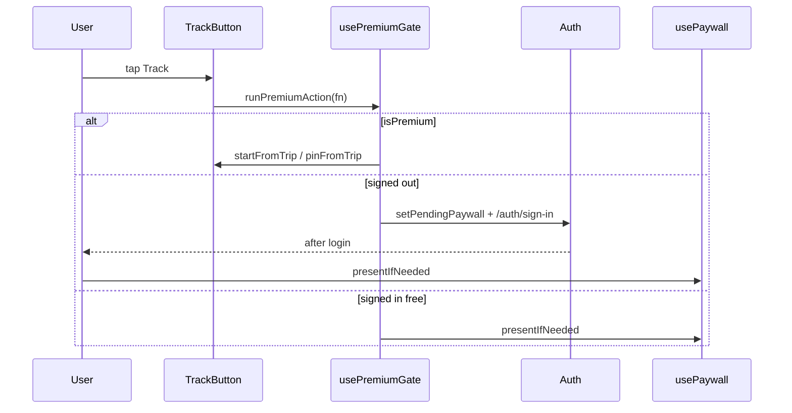

# feat: Transit first-party ads + webapp premium gating

**Target repos:** `SaoMiguelBus` (Expo client, primary) and `SaoMiguelBus-api` (admin + ad serving tweak for iOS).

Ship **first-party SMB ad banners** on the bus module (same inventory as the legacy webapp via compat `GET /api/v1/ad`), hidden for premium users, **without** interstitials or in-banner subscribe CTAs. Gate **bus tracking + pinned routes** to premium (webapp parity): controls stay visible; free users get paywall on tap (sign-in first if logged out). **Offline search stays premium-only** (Expo differentiator, not reversed). **First-party ads do not require `ads` consent** — that purpose remains for future third-party ad SDKs only.

Builds on completed work: `docs/plans/2026-06-04-001-feat-account-login-premium-entitlement-plan.md` (`usePremium()`), `docs/plans/2026-06-04-002-feat-revenuecat-iap-paywall-plan.md` (`usePaywall()`), `docs/plans/2026-06-02-005-feat-buses-module-parity-profile-plan.md` (tracking UI shipped **free** — this plan re-gates it).

---

## Summary

Add compat-backed ad fetch/render/click on the transit search and directions surfaces for free users, and lock schedule-based bus tracking (active + pinned) behind premium with upsell-on-tap UX. One small API change ensures `platform=all` ads serve iOS and adds a Django admin bulk action to retag selected campaigns.

---

## Problem Frame

The legacy webapp monetizes the bus module with first-party image ads (`/api/v1/ad`) and premium-only bus tracking. The Expo app has the opposite gap: **no ads at all**, and tracking/pinned routes were intentionally shipped **free for all** in the buses-parity plan. Premium entitlement + RevenueCat paywall now exist (`usePremium()`, `usePaywall()`), but transit does not use them except offline search.

User intent: replicate webapp **ads placement** (banners only, no popup/CTA clutter) and webapp **premium gates** (tracking + pins), while keeping offline search premium and treating consent as external-ads-only.

---

## Requirements

| ID | Requirement |
|----|-------------|
| R1 | Free users see first-party ad banners on the transit search screen (top slot) and inline between route results (every 2 cards, matching webapp `createInlineAdBanner` cadence). |
| R2 | Premium users (`usePremium() === true`) see **no** ad banners anywhere in transit. |
| R3 | First-party ads use `GET /api/v1/ad?on={slot}&platform={ios\|android}` and `POST /api/v1/ad/click?id={id}`; 404/no payload renders nothing (no error UI). |
| R4 | Ad UI is image + external link only — no "get rid of ads", no subscribe modal, no interstitial. |
| R5 | First-party ads are **not** gated on `consent.purposes.ads`; that flag applies only to future third-party ad SDKs (document/clarify in code). |
| R6 | Bus **tracking** (start active track) and **pin route** are premium-only; buttons remain visible for free users. |
| R7 | On premium action tap: signed-out → sign-in then paywall resume; signed-in free → `presentIfNeeded()` (RevenueCat paywall). Premium users proceed normally. |
| R8 | `ActiveTrackingSection` and `PinnedRoutesSection` are visible only to premium users (webapp hides home widgets for non-premium). |
| R9 | Offline search remains premium-only (unchanged; `useNetwork().hasOfflineBundle`). |
| R10 | API: ads with `platform=all` are eligible for any client platform; Django admin bulk action sets selected ads' `platform` to `all`. |
| R11 | New copy localized in official locales (pt/en/de/es/fr; extend it/uk/zh where trivial). |
| R12 | Analytics: `track('transit', 'ad_impression' \| 'ad_click', …)` when analytics consent granted (impression = successful fetch render; click = tap). |

---

## Key Technical Decisions

| ID | Decision | Rationale |
|----|----------|-----------|
| KTD1 | **Reuse compat `/api/v1/ad`**, not SDD `/api/v3/ads` (unbuilt). | Production inventory + `transit.services.ads` already power compat; `apiFetch` already sends `X-Island`. |
| KTD2 | **`platform` = `Platform.OS`** (`ios` / `android`). | Real targeting; API already falls back to `status=default` when no match. iOS inventory fixed via `all` + admin bulk action (R10). |
| KTD3 | **`on` slots:** `home` for search top + inline results; `routes` for directions inline (webapp parity). Optional: pass `origin->destination` for geo ads later — out of scope (webapp never sends it). |
| KTD4 | **404 → null ad**, no throw. | Compat returns 404 when empty; `apiFetch` throws on non-2xx — dedicated `fetchAd` catches 404. |
| KTD5 | **`usePremiumGate()`** shared hook: `requiresPremium(action)` → if premium, run; else route sign-in/paywall. | Single seam for TrackButton, pin, and future gates; mirrors `usePaywall` sign-in deferral. |
| KTD6 | **Do not gate** favorites, recents, votes, alerts, share, directions planner — free on webapp. | User asked only ads + webapp premium features (tracking/pins). |
| KTD7 | **Consent:** add `canShowFirstPartyAds(isPremium)` helper (true when `!isPremium`); reserve `purposes.ads` for external SDK init only. | User confirmed first-party = all free users; avoids blocking SMB banners behind CMP. |
| KTD8 | **API `select_ad`:** treat `platform=all` on **active** ads like web/android — filter `platform in (requested, 'all')`. | Today only `platform != 'all'` branch filters; `all` rows may be excluded incorrectly. |

---

## High-Level Technical Design

### Ad visibility vs premium

```mermaid
flowchart TD
  A[Transit screen render] --> B{usePremium?}
  B -- yes --> C[Skip all ad fetches and AdBanner mounts]
  B -- no --> D{Online?}
  D -- no --> E[No ads]
  D -- yes --> F[fetchAd on=home|routes platform=ios|android]
  F --> G{200 payload?}
  G -- yes --> H[AdBanner image + link]
  G -- no 404 --> I[Render nothing]
  H --> J[User tap → POST click + Linking.openURL]
```

### Premium gate on track/pin



### Inline insertion (search results)

Mirror webapp: after route cards 2, 4, 6… insert `<InlineAd slotIndex={n} on="home" />`. Top banner above planner or between planner and results when `hasResults`.

---

## Implementation Units

> **Sequencing:** U1 (API) can land in parallel with U2–U3. U4 depends on U2–U3. U5 depends on paywall (already shipped). U6 optional after U4. U7 last.

### U1. API — `platform=all` serving + admin bulk action [api: SaoMiguelBus-api]

- **Goal:** iOS clients receive `platform=all` campaigns; staff can bulk-retag ads to `all`.
- **Requirements:** R10, KTD8
- **Dependencies:** none
- **Files:**
  - `src/transit/services/ads.py` (modify `select_ad` platform filter)
  - `src/transit/admin.py` (bulk action on `AdAdmin`)
  - `src/transit/tests/test_ads.py` (create)
- **Approach:** In `select_ad`, when `platform` is `ios` or `android`, filter `Q(platform=platform) | Q(platform='all')` for active ads (and defaults). Add `@admin.action` **"Set platform to all (selected)"** updating `platform='all'` with success message count.
- **Patterns to follow:** `src/transit/services/ads.py` existing `select_ad`; Django admin actions elsewhere in repo.
- **Test scenarios:**
  - Active ad `platform=all` is returned for `platform=ios`.
  - Active ad `platform=web` is not returned for `platform=ios` unless default fallback applies.
  - Bulk action updates N selected rows to `all`.
- **Verification:** `cd src && python manage.py test transit.tests.test_ads` green.

### U2. Mobile — ad API client [mobile: SaoMiguelBus]

- **Goal:** Typed fetch/click helpers against compat endpoints.
- **Requirements:** R3, R4, KTD1, KTD4
- **Dependencies:** none
- **Files:**
  - `lib/api.ts` (add `fetchAd`, `recordAdClick`)
  - `lib/types.ts` (add `AdPayload` type)
- **Approach:** `fetchAd({ on, platform })` → `GET /api/v1/ad?on=…&platform=…` using `getApiBase()` + island headers; return `null` on 404. `recordAdClick(id)` → fire-and-forget `POST /api/v1/ad/click?id=`. Map `action === 'directions'` → Maps URL from `target` (same as webapp).
- **Patterns to follow:** `fetchWebappLoad`, `apiFetch` header injection.
- **Test scenarios:**
  - 404 response yields `null` without throwing.
  - 200 parses `id`, `entity`, `media`, `action`, `target`.
- **Verification:** manual fetch against staging API; TypeScript clean.

### U3. Mobile — `AdBanner` + `useAd` hook [mobile: SaoMiguelBus]

- **Goal:** Reusable banner component; premium and offline suppress ads.
- **Requirements:** R1–R5, R12, KTD7
- **Dependencies:** U2
- **Files:**
  - `features/ads/hooks/useAd.ts` (create — TanStack `useQuery`, key `['ad', on, platform]`)
  - `features/ads/components/AdBanner.tsx` (create)
  - `features/ads/lib/ad-link.ts` (create — resolve href from payload)
  - `lib/consent-store.ts` (comment + optional `canShowExternalAds()`; **do not** block first-party)
- **Approach:** `useAd(on)` returns `{ ad, openAd }`; disabled when `usePremium()` or `!isOnline`. `AdBanner`: small "AD" label, `expo-image` or RN `Image`, `Pressable` → click POST + `Linking.openURL`. No dismiss, no upsell row. Track impression on successful render if `hasAnalyticsConsent()`.
- **Patterns to follow:** `components/ui/Card`, `useAppTheme`, `lib/tokens`; webapp HTML structure (image-only).
- **Test scenarios:**
  - Premium: hook `enabled: false`, component returns null.
  - No ad payload: component returns null (no layout jump — use min height 0).
  - Tap: `recordAdClick` invoked with correct id.
- **Verification:** free user online sees banner when API returns ad; premium never fetches.

### U4. Mobile — wire ads on transit search [mobile: SaoMiguelBus]

- **Goal:** Top + inline ads on bus search/results.
- **Requirements:** R1, R2, R4
- **Dependencies:** U3
- **Files:**
  - `app/(tabs)/transit/index.tsx` (top `AdBanner` when results or after search)
  - `features/transit/components/RouteResults.tsx` (inline every 2 results)
- **Approach:** Top slot: `<AdBanner on="home" />` below planner when `hasResults` (or fixed below offline banner). Inline: loop `results.map` with index; when `(index+1) % 2 === 0`, insert `<AdBanner on="home" key={ad-inline-${index}} />` (separate query per slot = webapp rotation). Refetch top banner on new search (invalidate `['ad','home']` in `runSearch`).
- **Patterns to follow:** webapp `apiHandler.js` `loadAdBanner` + inline insert; `RouteResults` gap layout.
- **Test scenarios:**
  - 4 results → 2 inline ad slots attempted.
  - New search invalidates/refetches top ad.
  - Premium user: no ad components mounted.
- **Verification:** device test with free account; confirm network calls only when free+online.

### U5. Mobile — premium gate bus tracking + pinned sections [mobile: SaoMiguelBus]

- **Goal:** Webapp parity for tracking/pins; upsell UX preserved.
- **Requirements:** R6–R8, KTD5
- **Dependencies:** existing `usePaywall`, `usePremium`
- **Files:**
  - `features/premium/hooks/usePremiumGate.ts` (create)
  - `features/transit/components/TrackButton.tsx` (wrap actions)
  - `features/transit/components/ActiveTrackingSection.tsx` (premium-only render)
  - `features/transit/components/PinnedRoutesSection.tsx` (premium-only render)
  - `app/(tabs)/transit/index.tsx` (conditional sections)
- **Approach:** `usePremiumGate().guardPremiumAction(fn)` — if `usePremium()`, `fn()`; else if no token → `setPendingPaywall` + `router.push('/auth/sign-in')`; else `presentIfNeeded()`. `TrackButton`: gate `onTrack` and `pinFromTrip` only (buttons stay visible). Hide `ActiveTrackingSection` / `PinnedRoutesSection` when `!isPremium` (webapp `updateActiveTrackingSection` behavior).
- **Patterns to follow:** `usePaywall` sign-in deferral; webapp `busTrackingUI.js` pricing modal on non-premium click.
- **Test scenarios:**
  - Free signed in: tap Track → paywall presents (or RC unavailable → no crash).
  - Free signed out: tap Track → sign-in → paywall resume.
  - Premium: track starts; sections show active/pinned data.
  - Free: active/pinned sections not rendered.
- **Verification:** manual on dev build with `premiumDevOverride` toggle.

### U6. Mobile — directions inline ads (optional parity) [mobile: SaoMiguelBus]

- **Goal:** Inline ads between direction steps like webapp `on=routes`.
- **Requirements:** R1 (directions surface)
- **Dependencies:** U3
- **Files:**
  - `features/transit/components/DirectionsResults.tsx` (inline every 2 steps)
- **Approach:** Same inline cadence as U4 with `on="routes"`.
- **Test scenarios:** Premium hides; 404 silent.
- **Verification:** directions flow manual smoke.

### U7. Mobile — i18n + analytics [mobile: SaoMiguelBus]

- **Goal:** Accessible labels and consent-gated telemetry.
- **Requirements:** R11, R12
- **Dependencies:** U3–U6
- **Files:**
  - `locales/*.json` (`transitAdLabel`, `transitAdAccessibilityHint`, premium gate strings if missing)
  - `features/ads/components/AdBanner.tsx` (wire `track`)
- **Approach:** Reuse existing `adBanner*` keys where possible; add minimal new keys. Events: `ad_impression` `{on, adId}`, `ad_click` `{on, adId}`.
- **Verification:** locale switch; analytics only when `hasAnalyticsConsent()`.

---

## Scope Boundaries

**In scope:** first-party banners (top + inline search, optional directions inline); premium hides ads; tracking/pin gate + section visibility; API `all` platform + admin bulk action; consent clarification for external-only.

**Out of scope:** interstitial modal, bottom sticky upsell, homeAdBanner-style subscribe strips, AdMob/AdSense, `/api/v3/ads`, geo `on=origin->destination`, premium "ask for features" mailto (not in Expo), gating favorites/votes/alerts.

### Deferred to Follow-Up Work

- Pass `on={origin}->{destination}` for geo-targeted campaigns.
- v3 ads endpoint + slot enum when backend formalizes mobile slots.
- Third-party ad SDK wired to `consent.purposes.ads`.
- Profile screen premium-only "feature request" row (webapp has it; low priority).

---

## Risks and Dependencies

| Risk | Mitigation |
|------|------------|
| iOS shows only default ads until admin bulk-sets `all` | U1 bulk action + document ops step in `AGENTS.md` |
| Many inline slots = many GETs (webapp same) | Acceptable; consider shared cache key per `on` if load is high |
| RC not configured in Expo Go | `presentIfNeeded` already no-ops safely; gate still blocks tracking |
| Re-gating tracking upsets users who relied on free tracking | Intentional product change per user request |

**Depends on:** `usePremium()`, `usePaywall()`, compat ad endpoints, existing tracking UI from buses-parity plan.

---

## Sources and Research

- Legacy webapp: `SaoMiguelBus-webapp/js/apiHandler.js` (ads), `js/adRemovalHandler.js` (premium hide), `js/busTrackingHandler.js` / `busTrackingUI.js` (tracking gate).
- API: `SaoMiguelBus-api/src/transit/services/ads.py`, `src/compat/api.py` (`get_ad_v1`, `click_ad_v1`).
- Expo: `features/transit/components/RouteResults.tsx`, `TrackButton.tsx`, `app/(tabs)/transit/index.tsx`, `lib/premium-store.ts`, `features/premium/hooks/usePaywall.ts`.
- Prior plans: `2026-06-02-005` (tracking shipped free), `2026-06-04-001/002` (entitlement + paywall).