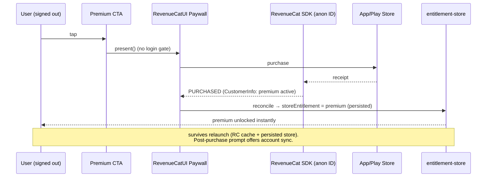
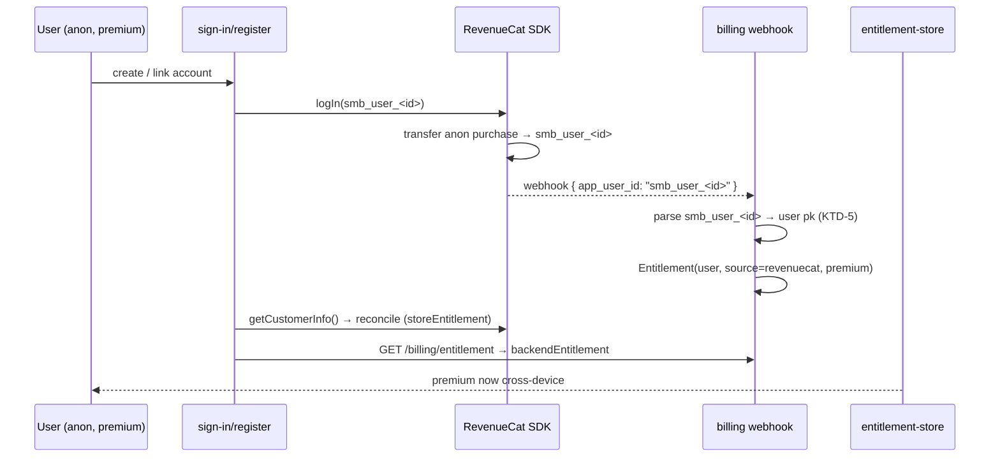

# feat: Anonymous paywall purchase + post-login subscription sync

**Created:** 2026-06-16
**Type:** feat
**Depth:** Deep
**Target repos:** `SaoMiguelBus` (Expo client — primary), `SaoMiguelBus-api` (Django backend — webhook fix)
**Origin:** builds on `docs/plans/2026-06-04-001-feat-account-login-premium-entitlement-plan.md` and `docs/plans/2026-06-04-002-feat-revenuecat-iap-paywall-plan.md`

---

## Summary

Today every premium CTA forces sign-in *before* the paywall. We remove that gate so a tap on any CTA opens the RevenueCat paywall immediately and lets an anonymous user pay. The purchase is attributed to RevenueCat's anonymous App User ID (backed by the user's Apple/Google store account), premium unlocks on-device, and persists across launches. If the user later creates/links an account, RevenueCat transfers the anonymous purchase to the account-bound App User ID and the backend webhook materializes a cross-device `Entitlement`.

This is a fail-open change for a high-value path (payments). The riskiest pieces are (1) keeping premium from being wiped on signed-out boot, and (2) a pre-existing backend bug that drops RevenueCat webhooks for the real client App User ID format — both fixed here.

---

## Problem Frame

**Current behavior (forced login):**
- `usePaywall.openPaywall()` → if `!isSignedIn`, set `pendingPaywall`, route to `/auth/sign-in`, resume paywall after auth.
- `usePremiumGate.guardPremiumAction()` → signed-out free users routed to sign-in instead of the paywall.
- `usePremiumPurchases.purchase` throws `SIGN_IN_REQUIRED` when no user, and `IDENTITY_UNBOUND` unless the RC SDK identity equals `smb_user_<id>`.
- `usePremium()` resolves only from the entitlement store, which is fed by the **backend** `GET /api/v3/billing/entitlement` (token-gated) plus a 5-minute optimistic grace from RevenueCat `CustomerInfo`.
- `useEntitlementSync` **clears** the entitlement store whenever `hydrated && !token` → a signed-out user has no durable premium source.

**Why this blocks anonymous purchase:** even if we let an anonymous user pay (RC supports it), premium would evaporate after the 5-minute optimistic window and on the next signed-out boot, because the only durable source is the token-gated backend.

**User's mental model (correct):** subscriptions are tied to the Apple/Google store account; the SMB account is only for cross-platform/cross-device access. So the device (RevenueCat) can be the source of truth while signed out, and the SMB account becomes a *sync target* on login — not a gate on purchase.

---

## How It Works Today (reference)

```
CTA tap ─▶ openPaywall()
            │ signed in? ──no──▶ setPendingPaywall(true) ─▶ /auth/sign-in ─▶ (on success) present()
            │ yes
            ▼
        RevenueCatUI.presentPaywall()  (identity = smb_user_<id>)
            │ PURCHASED/RESTORED
            ▼
        reconcile(CustomerInfo): optimistic premium (5 min) + invalidate ['billing','entitlement']
            ▼
        useEntitlementSync (token-gated) fetches backend entitlement ─▶ authoritative
```

Premium = `entitlementStore.entitlement?.tier === 'premium'`. Signed-out boot runs `clearEntitlement()`.

---

## Key Technical Decisions

**KTD-1 — RevenueCat `CustomerInfo` becomes a first-class, durable premium source.**
Premium resolves from a merge: `usePremium() = backendPremium || storePremium`. `storePremium` is derived from `Purchases.getCustomerInfo()` at boot and on every `customerInfoUpdate`, and persisted. This makes anonymous + offline premium work and fails *open* for paying signed-in users when the backend lags. Rationale: matches the user's "store account owns the subscription" model. This is a deliberate, scoped deviation from SDD §08.6 ("the app asks the backend, not the store") — documented in Risks.

**KTD-2 — Separate the two entitlement sources in the store instead of one overwritten field.**
`entitlement-store` keeps `backendEntitlement` and `storeEntitlement` separately, plus a derived `entitlement` getter (premium-wins, backend preferred on tie). Signing out clears only `backendEntitlement`; the RC-derived `storeEntitlement` survives. This is what prevents the signed-out-boot wipe without special-casing booleans everywhere.

**KTD-3 — Keep purchases anonymous-by-default; bind identity only when signed in.**
Remove the `SIGN_IN_REQUIRED` hard stop. When signed in, still require identity binding (`smb_user_<id>`) so purchases attribute to the account; when signed out, purchase against the RC anonymous ID. The hosted paywall (`RevenueCatUI.presentPaywall`) already purchases under whatever identity is set, so the main path just needs the login gate removed.

**KTD-4 — Login = transfer + reconcile, not a precondition.**
On sign-in/register/social success, `Purchases.logIn(smb_user_<id>)` runs (existing effect). RevenueCat transfers the anonymous purchase to the account ID (requires dashboard "transfer to new App User ID" — see Risks). We then refetch `CustomerInfo`, reconcile, and invalidate the backend query so the webhook-created `Entitlement` syncs. No new "sync" endpoint is needed — RC's transfer + existing webhook is the sync mechanism.

**KTD-5 — Fix the backend App User ID parsing (pre-existing bug).**
`reconcile_revenuecat` must recognize `smb_user_<id>` (the client's actual format) and resolve it to the Django user pk. Without this, the webhook drops every RevenueCat event and cross-device sync silently never happens. Keep the digit/username/email fallbacks for safety.

**KTD-6 — Post-purchase "save to account" prompt is non-blocking.**
After an anonymous purchase succeeds, surface a dismissible prompt offering to create/link an account for cross-device access. Never block premium activation on it.

---

## High-Level Technical Design

### Anonymous purchase flow (new)



### Post-login sync flow (new)



### Premium resolution (new merge)

```
usePremium = devOverride(__DEV__)
           || backendEntitlement.tier == premium   (authoritative, cross-device)
           || storeEntitlement.tier == premium      (RevenueCat device truth; anon + offline + fail-open)
```

---

## Requirements

- **R1** — Tapping any premium CTA while signed out opens the paywall directly (no sign-in detour).
- **R2** — An anonymous user can complete a purchase and premium unlocks immediately.
- **R3** — Anonymous premium persists across app relaunches and offline.
- **R4** — After an anonymous purchase, the user is offered (non-blocking) to save the subscription to an account.
- **R5** — On sign-in/register/social, an existing anonymous subscription transfers to the account and becomes cross-device.
- **R6** — The backend webhook correctly maps the client's `smb_user_<id>` App User ID to the user (cross-device entitlement materializes).
- **R7** — Signed-in premium is fail-open: backend lag or webhook drop does not lock out a user RevenueCat reports as premium.
- **R8** — Backend-authoritative downgrades still apply where RC also reflects them (expiry/refund); see Open Questions for manual revocation.
- **R9** — Restore and manage-subscription work for anonymous premium users (Settings shows premium state without a login).
- **R10** — No regression to the existing signed-in purchase/restore/manage flows.

---

## Output Structure

No new directories. All changes modify existing files in `features/premium/`, `features/account/`, `lib/`, plus one backend service file. New i18n keys added to existing locale JSON.

---

## Implementation Units

### U1. Remove the forced-login gate from paywall entry points

**Goal:** CTA taps present the paywall directly when signed out (R1).
**Files:** `features/premium/hooks/usePaywall.ts`, `features/premium/hooks/usePremiumGate.ts`
**Approach:**
- `usePaywall.openPaywall()` — drop the `!isSignedIn` branch; always call `present()`. Keep `present()`/`presentIfNeeded()` unchanged.
- `usePremiumGate.guardPremiumAction()` — for signed-out free users, call `presentIfNeeded()` directly instead of `setPendingPaywall + router.push('/auth/sign-in')`.
- `paywall-intent.ts` (`setPendingPaywall`/`consumePendingPaywall`) is no longer the primary path but stays for users who *choose* to sign in first; leave it in place (still consumed by `sign-in.tsx`).
- Update the JSDoc on both hooks to reflect anonymous-first behavior.
**Patterns to follow:** existing `present()` error/`isRevenueCatConfigured()` guards.
**Test scenarios:**
- Covers R1. Signed-out CTA tap → `present()` called, no navigation to `/auth/sign-in`.
- Signed-out premium-gated action (e.g. track) → `presentIfNeeded()` called, no sign-in route.
- Signed-in free user → behavior unchanged (paywall presented).
- Premium user → `guardPremiumAction` runs the action immediately.
- RevenueCat not configured (web/Expo Go) → no-op, no crash.

### U2. Make RevenueCat `CustomerInfo` a durable premium source (store split)

**Goal:** Persistent device-level premium independent of auth (R2, R3, R7).
**Files:** `lib/entitlement-store.ts`, `features/premium/lib/optimistic-entitlement.ts` (reuse), `lib/premium-store.ts`, new `features/premium/hooks/useStoreEntitlementSync.ts`
**Approach:**
- Refactor `entitlement-store` to hold `backendEntitlement: Entitlement | null` and `storeEntitlement: Entitlement | null`, keep `optimisticUntil` for the post-purchase flip. Add a derived selector `selectEntitlement(state)` → premium-wins (prefer `backendEntitlement` when both premium). Persist both.
- Replace `setEntitlement`/`reconcileFromBackend` semantics: `reconcileFromBackend` writes `backendEntitlement` (respecting optimistic grace for a `free` result); add `reconcileFromStore(entitlement | null)` writing `storeEntitlement`; `applyOptimisticPremium` writes `storeEntitlement` + `optimisticUntil`.
- `lib/premium-store.ts` `usePremium()`/`getIsPremium()` read the derived selector (`backendPremium || storePremium`), keep `__DEV__` override.
- New `useStoreEntitlementSync()` hook: at boot (after RC configured) and on `onCustomerInfoUpdate`, call `Purchases.getCustomerInfo()` → `optimisticEntitlementFromCustomerInfo` → `reconcileFromStore(result)` (result may be `null` → clears store premium, e.g. expiry). Mount near app root.
**Patterns to follow:** existing `useEntitlementSync` structure; `optimisticEntitlementFromCustomerInfo` already maps `CustomerInfo` → `Entitlement`.
**Test scenarios:**
- Covers R2/R3. `reconcileFromStore(premium)` → `usePremium()` true; persists across store rehydrate.
- `reconcileFromStore(null)` after expiry → store premium cleared.
- Both sources premium → derived prefers `backendEntitlement` (manageVia/source correct in Settings).
- Backend free + store premium (signed-in, webhook lag) → `usePremium()` true (R7 fail-open).
- Optimistic grace: store premium set, backend returns free within grace → premium retained.

### U3. Stop wiping premium on signed-out boot

**Goal:** Signing out / booting signed-out must not clear RC-derived premium (R3).
**Files:** `features/account/hooks/useEntitlement.ts`, `features/account/hooks/useAuth.ts`
**Approach:**
- `useEntitlementSync`: change the `hydrated && !token` effect to clear **only** `backendEntitlement` (new `clearBackendEntitlement()`), not `storeEntitlement`.
- `useAuth` logout/deleteAccount `onSuccess`: clear `backendEntitlement` only; leave `storeEntitlement` (the device subscription is still valid until the store says otherwise). On logout also `Purchases.logOut()` already runs via bootstrap effect → RC returns to anonymous and `useStoreEntitlementSync` re-derives.
- Keep the entitlement query keyed on `token` and `enabled: Boolean(token)`.
**Test scenarios:**
- Covers R3. Anonymous premium, relaunch signed-out → premium still true.
- Signed-in premium → logout → `Purchases.logOut()`; if the store account still entitles the device, premium re-derives from RC; otherwise false.
- `deleteAccount` → backend entitlement cleared; store entitlement reflects RC truth.
- Pre-hydration window → no premature clear.

### U4. Allow anonymous purchase in the custom-purchase path

**Goal:** Custom paywall / direct purchase works signed out (R2).
**Files:** `features/premium/hooks/usePremiumPurchases.ts`
**Approach:**
- Remove the `SIGN_IN_REQUIRED` throw. When `useAuthStore.user` exists, keep the `isIdentityBound` check + rebind (preserve account attribution). When signed out, purchase directly against the anonymous ID.
- Keep `reconcile(info)` on success (now writes `storeEntitlement`).
- `restore` already needs no auth — leave it, it now feeds `storeEntitlement`.
**Test scenarios:**
- Covers R2. Signed-out `purchase(pkg)` → no throw, `purchasePackage` called, reconcile runs.
- Signed-in `purchase` with unbound identity → rebinds, then purchases (existing guard).
- Signed-in `purchase` where rebind fails → still throws `IDENTITY_UNBOUND` (no mis-attribution).
- `restore` signed out → reconciles store entitlement.

### U5. Transfer + reconcile on login

**Goal:** Logging in moves an anonymous subscription onto the account and syncs cross-device (R5).
**Files:** `lib/revenuecat.ts` (`bindRevenueCatIdentity`), `features/premium/hooks/useRevenueCatBootstrap.ts`, `features/account/hooks/useAuth.ts`
**Approach:**
- `bindRevenueCatIdentity(user)`: after a successful `Purchases.logIn(...)`, return the resulting `CustomerInfo` (the SDK returns `{ customerInfo, created }`) so callers can reconcile. Currently the result is discarded.
- `useRevenueCatBootstrap` identity effect: after binding on `userId` change, `reconcile(customerInfo)` so a transferred purchase reflects immediately.
- `useAuth.onSession` already invalidates `['billing','entitlement']`; ensure ordering: session set → bind/transfer (effect) → backend webhook lands → query refetch. Add a short delayed refetch/poll is **not** required (optimistic grace + RC reconcile cover the gap) — note as deferred if flakey.
**Execution note:** add an integration-style test for the logIn→reconcile contract using a mocked `Purchases`.
**Test scenarios:**
- Covers R5. Anonymous premium → register → `logIn(smb_user_<id>)` called; reconcile runs with transferred `CustomerInfo`.
- `logIn` failure → defensive catch, app does not crash, purchase still attributed to anon (no data loss).
- Signed-in already-premium user re-login (cold start rehydrate) → no double-reconcile glitch.

### U6. Post-purchase account-sync prompt + Settings for anonymous premium

**Goal:** Offer cross-device sync without forcing it; let anonymous premium users see/restore/manage (R4, R9).
**Files:** new `features/premium/components/SaveSubscriptionPrompt.tsx`, `features/premium/hooks/usePaywall.ts` (trigger), `features/premium/components/PremiumSettingsSection.tsx`, `features/account/components/AccountSection.tsx`
**Approach:**
- After `present()`/`openPaywall()` returns `PURCHASED` while signed out, show `SaveSubscriptionPrompt` (non-blocking modal/sheet) → CTA routes to `/auth/sign-in`. Reuse existing `Sheet`/`Modal` patterns. Track an analytics event.
- `PremiumSettingsSection`: remove the early `if (!isSignedIn) return null`. Render premium status + Restore + Manage for anonymous premium too. Add a "Sign in to sync across devices" row when premium && !signedIn → routes to sign-in.
- `AccountSection`: when signed-out, if `usePremium()` is true, adjust the sign-in subtitle to mention syncing the active subscription.
**Patterns to follow:** `PremiumLaunchModal` (Sheet usage), `PremiumSettingsSection` ListRow layout.
**Test scenarios:**
- Covers R4. Signed-out purchase success → prompt shown; dismiss → premium still active; CTA → sign-in route.
- Signed-in purchase → prompt NOT shown.
- Covers R9. Anonymous premium → Settings shows active state, Restore, Manage, and "Sign in to sync" row.
- Restore from Settings while signed out → reconciles, alert reflects result.

### U7. i18n keys for new copy

**Goal:** Localize all new strings; no missing-key regressions.
**Files:** all locale JSON under `locales/` (`en`, `pt`, `de`, …), validated by `node check_locale_keys.js` if present in client (note: lives in webapp repo — use the client's locale completeness convention).
**Approach:** add keys for the save-subscription prompt (title/body/primary/secondary), the "sign in to sync" Settings row, and the updated account subtitle. Mirror existing key naming (`premium*`, `auth*`).
**Test expectation:** none beyond locale-key completeness — pure copy. Add keys to every locale to avoid fallback gaps.

### U8. Backend: parse `smb_user_<id>` in the RevenueCat webhook (bug fix)

**Goal:** Webhook materializes the cross-device entitlement for the real client ID format (R6).
**Target repo:** `SaoMiguelBus-api`
**Files:** `src/billing/services.py` (`reconcile_revenuecat`), `src/billing/tests.py`
**Approach:**
- In `reconcile_revenuecat`, before the digit/username/email resolution, detect the `smb_user_<id>` prefix (mirror the client's `revenueCatAppUserId` format), extract the integer id, and look up the user by pk. Keep existing fallbacks.
- Ignore anonymous events (`$RCAnonymousID:...`) gracefully — they already fall through to the "unknown app_user_id" warning; downgrade that to debug-level for anon IDs to avoid log noise.
- Add a small shared constant/helper documenting the `smb_user_` contract on both sides (cross-repo coordination point already noted in `lib/revenuecat.ts`).
**Test scenarios:**
- Covers R6. Event `app_user_id="smb_user_42"` → resolves to user 42 → premium `Entitlement` created with `source=revenuecat`, correct platform.
- `CANCELLATION`/`EXPIRATION` events update status (canceled/expired).
- Anonymous `$RCAnonymousID:abc` → no entitlement, no warning-level log.
- Legacy digit/username/email `app_user_id` still resolve (no regression).
- Unauthorized webhook (bad secret) → 400 (existing behavior unchanged).

### U9. RevenueCat dashboard + webhook configuration (ops)

**Goal:** Enable transfer + delivery (R5, R6) — config, not code.
**Files:** documentation only — append to `AGENTS.md` (client) RevenueCat section and `SaoMiguelBus-api/AGENTS.md` webhook env notes.
**Approach (checklist, owner action):**
- Set RevenueCat **"When a user logs in, transfer purchases to the new App User ID"** (a.k.a. transfer behavior) so anonymous purchases move to `smb_user_<id>` on login. Without this, U5 sync fails.
- Configure the RevenueCat **webhook URL** → `POST /api/v3/billing/revenuecat/webhook` and set the shared `REVENUECAT_WEBHOOK_SECRET` (Authorization header) in the API env.
- Confirm the entitlement identifier matches `PREMIUM_ENTITLEMENT_ID` ("Sao Miguel Hub Premium") in the dashboard.
**Test expectation:** none (config) — verify via a sandbox purchase + login in QA.

---

## Scope Boundaries

**In scope:** anonymous purchase, durable device premium, post-login transfer/sync, the backend webhook ID-parsing fix, Settings/Account affordances for anonymous premium, dashboard config doc.

**Deferred to follow-up work:**
- Web/Stripe anonymous checkout (this plan is mobile/RevenueCat only).
- A dedicated `/billing/link` endpoint or email-based entitlement reconciliation (RC transfer + webhook is sufficient now).
- Merging conflicting subscriptions when an anonymous purchase logs into an account that already has a different active sub (surface in Open Questions; default to RC transfer rules for now).
- Background polling/backoff for webhook latency on login (only if QA shows a visible gap).

**Out of scope (non-goals):** removing accounts entirely; changing pricing/products; AdMob/consent flows.

---

## Risks & Dependencies

- **RC transfer behavior (blocking dependency):** if the dashboard is set to "keep purchases with original App User ID", anonymous purchases won't move to the account on login → cross-device sync silently fails. U9 must be done before U5 is meaningful.
- **SDD deviation (KTD-1/R7):** SDD §08.6 states the backend is the single source of truth and fail-safe is free. Treating RC as a durable signed-out source + OR-merge changes that for the device. Accepted because the store account legitimately owns the IAP; documented here and should be reflected in SDD §08 on merge.
- **Manual backend revocation vs. active RC (R8):** with `backendPremium || storePremium`, a *manual* backend downgrade while RC still reports active will not lock the user out. Acceptable (rare, admin-only); see Open Questions.
- **Backend webhook was effectively dead (KTD-5):** because `smb_user_<id>` never matched, no RevenueCat `Entitlement` rows exist today. After U8, signed-in purchases also start materializing backend entitlements — verify this doesn't surprise existing test users.
- **Restore on a shared device:** `restorePurchases` while anonymous pulls whatever the store account owns onto the device — expected, matches store semantics.
- **iOS/Play sandbox:** transfer + webhook must be validated in sandbox, not just unit tests.

---

## Open Questions

- **OQ-1 (deferred):** Account-conflict policy when an anonymous purchase logs into an account with a different active subscription. Default: rely on RC transfer rules; revisit if support tickets appear.
- **OQ-2 (deferred):** Should a manual backend revocation force-clear the device `storeEntitlement`? Would require a push/refetch signal; deferred unless needed.
- **OQ-3:** Does QA observe a visible premium "flicker" between RC transfer and backend webhook on login? If so, add a brief post-login optimistic hold (the existing `OPTIMISTIC_GRACE_MS` likely covers it).

---

## Verification (overall)

- Manual QA (sandbox): signed-out CTA → pay → premium unlocks → relaunch still premium → register account → premium persists and appears on a second device.
- `npm test` (client) covers U1–U6 unit/integration; `python manage.py test billing` covers U8.
- No missing locale keys (U7).
- Regression: signed-in purchase/restore/manage and the ads-gating paths unchanged.


