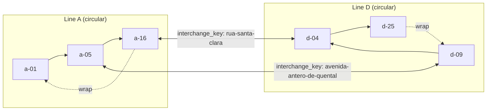
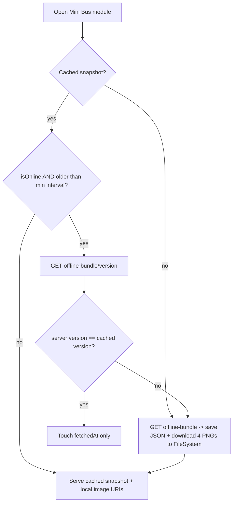
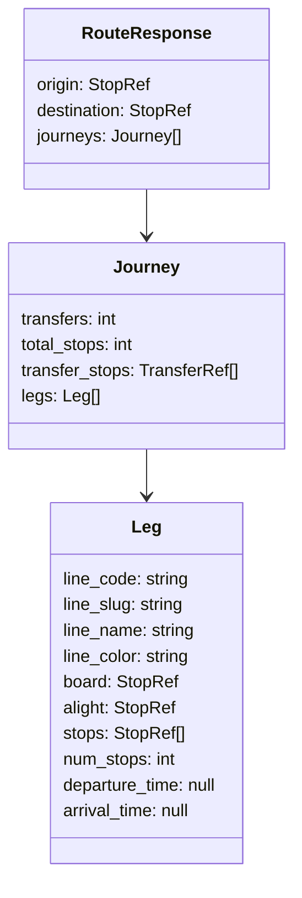

# feat: Mini Bus origin→destination route search + offline-for-all

**Target repos:** `SaoMiguelBus-api` (Django 5, branch `revamp`, code under `src/`) + `SaoMiguelBus` (Expo SDK 56 mobile client). API-side units are tagged **[api]**, mobile-side **[mobile]**. All paths are repo-relative to the repo in the unit tag.

> Builds directly on prior work: the `minibus` app (lines/tariffs/documents/network endpoints) and `network_stops_sao_miguel.json` (per-line stop sequences + interchange graph) already exist. This plan adds journey planning on top of that graph, switches per-line display from PDF to the extracted line images, and makes the whole dataset usable offline for **all** users.

---

## Summary

Add origin→destination journey planning for the PDL Mini Bus network (lines A–D): given two stops, return which line(s) to take, where to board and alight, the stops in between, and how many interchanges — ranked by fewest transfers then fewest stops. The route result shape carries empty timing slots (`departure_time`/`arrival_time` = `null`) so real schedules drop in later without a breaking change. The same routing runs in two places: a Python API endpoint (`GET /api/v3/minibus/route`) and a TypeScript mirror on-device for offline search. The full Mini Bus dataset — lines, network stops, tariffs, metadata, and the four line images — is exposed as a single versioned offline snapshot the app downloads and caches on first open (JSON in AsyncStorage, PNGs on the filesystem via `expo-file-system`), **ungated for all users** (this is free third-party data with no monetization rights). Each line's in-app view switches from the current PDF to the `line-{a..d}.png` image, with those PNGs moved into git-tracked API source so the deployed server serves them.

---

## Problem Frame

The `minibus` module currently shows static line metadata, tariffs, and PDF/SVG documents. Three gaps remain against what users actually need from an urban network:

1. **No journey planning.** Users can see each line's stops but cannot ask "how do I get from X to Y?". The interchange graph already exists in `network_stops_sao_miguel.json` (13 multi-line interchange nodes, name-matched), but nothing traverses it.
2. **Per-line view is a PDF.** Line A–D each open an image-based PDF in a WebView. The cleaner extracted PNGs (`src/media/minibus/lines/line-{a..d}.png`) exist on disk but are **gitignored** (`src/media/` is ignored), so they would never reach the deployed API.
3. **No offline access.** Unlike transit (which has an offline bundle, but premium-gated), Mini Bus has no offline path. The data is small, static between deploys, and free — it should work fully offline for everyone, images included.

This must be built so that **route schedules (real timings) integrate afterwards** without reshaping the API contract or the client cache.

---

## Requirements

### Route search (API + offline mirror)

- R1. A new `GET /api/v3/minibus/route?origin=<stop>&destination=<stop>` returns ranked journeys over the A–D network. Each journey lists ordered **legs** (one per line ridden); each leg names the line, the board stop, the alight stop, the inclusive in-between stops, and the leg stop-count. Journeys also report transfer count and the transfer stop(s).
- R2. Origin and destination are resolved by stop identity (a stop `key` like `a-05`, or a `match_key`/`interchange_key`/`name_pt`), and a single physical place that appears on multiple lines (shared `interchange_key`) is treated as all of its per-line stops (multi-source/multi-target search).
- R3. Transfers happen **only** at stops sharing an `interchange_key` (name match), per the existing `interchanges_by_key` map — no walking transfers, no distance, no geo. Ranking is fewest transfers, then fewest total stops.
- R4. The leg shape carries schedule-ready optional fields (`departure_time`, `arrival_time`, both `null` today) so a later schedules pass fills them without changing the contract. Lines are `direction: "circular"`; sequence wrap (last→first stop) is a valid forward edge.
- R5. The identical journey result shape is produced on-device from the cached network data so offline search returns the same structure as the API.

### Per-line images (replace PDFs)

- R6. The four line PNGs are git-tracked in the API so the deployed server serves them; `import_minibus` copies them into `MEDIA_ROOT` like the existing PDFs, with the bundled-source fallback intact.
- R7. Each line's API payload exposes a line-image URL (served via the existing `/api/v3/minibus/documents/{slug}/file` stream), and the mobile line view renders that image inline instead of opening the PDF. Network-map, tariffs, and schematic documents are unchanged (out of scope for this swap).

### Offline-for-all (data + images)

- R8. A single versioned snapshot endpoint `GET /api/v3/minibus/offline-bundle` (+ a cheap `GET /api/v3/minibus/offline-bundle/version`) returns the whole Mini Bus dataset for an island: lines, full network stops, tariffs, attribution/meta, and the per-line image document URLs, plus a `version` token and `generatedAt`.
- R9. On first open of the Mini Bus module (and on staleness), the app downloads the snapshot, persists the JSON to AsyncStorage, and downloads the line PNGs to the device filesystem, recording their local URIs. This is **ungated** — available to every user, never routed through the premium offline path.
- R10. With a cached snapshot the app works fully offline: line list, line detail (image from local URI), tariffs, and origin→destination search all function with no network. Online refresh skips the download when the server `version` matches the cached one.

---

## Key Technical Decisions

- KTD1 — **Routing logic written once per runtime, identical result shape.** There is no shared Python/TS runtime, so the graph search is implemented twice: Python in `src/minibus/services.py` for the endpoint, TypeScript in `features/minibus/` for offline. Both consume the same `network_stops_sao_miguel.json` structure and emit the same `Journey` JSON shape (R5). The algorithm is small (BFS/Dijkstra over ~89 nodes) and the result shape is the contract that keeps them in sync; a shared test fixture (same origin/destination → same journeys) guards drift.
- KTD2 — **Graph model.** Nodes = per-line stops keyed by `key` (`a-05`). Intra-line edges connect consecutive `sequence` stops, plus a wrap edge last→first (circular). Transfer edges connect any two stops sharing an `interchange_key` (authoritative set = `interchanges_by_key`), with a transfer cost. Search cost is lexicographic `(transfers, stops)`; return up to a small N best journeys (e.g. 3), de-duplicated by leg signature.
- KTD3 — **Schedule-ready, schedule-free.** Legs carry `departure_time: null` / `arrival_time: null` now. No `StopTime`-style model is added in this plan; the contract simply reserves the fields. This is the seam a later schedules feature fills (recorded in Deferred).
- KTD4 — **PNGs become git-tracked source, mirroring the PDF pipeline.** Copy `src/media/minibus/lines/line-{a..d}.png` into the git-tracked bundled-source dir and reference them from `catalog_sao_miguel.json`. Do **not** rely on `src/media/` (gitignored — never deployed from git). `import_minibus` then copies them to `MEDIA_ROOT` and `open_document_file`'s bundled fallback serves them even before import runs. Per-line document `source_filename` switches from the `.pdf` to the `.png`; the PDF line files are dropped from the per-line documents.
- KTD5 — **Separate, ungated offline snapshot — do NOT reuse the transit `NetworkProvider` path.** Mirror the *shape* of `src/transit/services/offline_bundle.py` (version token, Redis cache by version, `/version` probe, single-flight) but as a new minibus bundle. On the client, a **separate** AsyncStorage key and a **separate** sync function — never `NetworkProvider.syncNow()` and never `useNetwork().hasOfflineBundle` (both premium-gated). This keeps Mini Bus offline free for all without touching premium logic.
- KTD6 — **Line images cached on the filesystem, JSON in AsyncStorage.** `expo-file-system` (new dependency, managed-Expo compatible) downloads the four PNGs to `documentDirectory` once; their local URIs are stored alongside the snapshot. The JSON snapshot (small) lives in AsyncStorage like the transit bundle. React-query persistence is insufficient because it does not cache binary images.
- KTD7 — **Snapshot version.** Derive `version` from a hash of `MinibusImportMeta.source_revision` (already a digest of the bundled file bytes) combined with a hash of the two data JSON files. This changes whenever line data, tariffs, or the imported binaries change, and is stable across requests. Redis-cache the bundle by version (24h TTL, version-scoped) and the version itself short-TTL, following the transit pattern.

---

## High-Level Technical Design

### Route-search graph



Nodes are per-line stops; solid arrows are intra-line sequence edges (with a circular wrap); double arrows are transfer edges between stops that share an `interchange_key`. Search minimizes `(transfers, total stops)`.

### Offline snapshot sync (client, ungated)



### Journey result shape (API + offline, identical)



---

## Implementation Units

> Dependency order: U1→U2 (API route search), U3 (PNG source swap) is independent, U4 depends on U1+U3 (snapshot), then mobile U5→U6→U7→U8→U9 build on the API. U10 is wiring/docs.

### U1. Route-search graph + journey builder [api]

- **Goal:** Pure Python journey planner over `network_stops_sao_miguel.json` producing the `Journey` shape.
- **Requirements:** R1, R2, R3, R4
- **Dependencies:** none
- **Files:**
  - `src/minibus/services.py` (add `build_network_graph`, `resolve_stop_refs`, `search_routes`)
  - `src/minibus/tests/test_minibus_routes.py` (new)
  - reference: `src/minibus/data/network_stops_sao_miguel.json` (stop/interchange shapes), `src/transit/services/v3.py` (`search_transit_v3` result-shape conventions)
- **Approach:** Build an in-memory graph from the loaded network JSON: nodes keyed by stop `key`; intra-line edges between consecutive `sequence` stops plus a wrap edge (last→first) since all lines are `circular`; transfer edges between any two stops sharing an `interchange_key` (use `interchanges_by_key` + `interchange_aliases` as the authoritative multi-line set). `resolve_stop_refs(token)` maps a user token to one or more stop nodes by exact `key`, else by `match_key`/`interchange_key`/normalized `name_pt`. `search_routes` does a lexicographic-cost search (`(transfers, stops)`) from all origin nodes to all destination nodes, reconstructs legs by grouping the path per line, and returns up to N=3 distinct journeys. Each leg includes `departure_time`/`arrival_time` keys hardcoded to `None` (KTD3). Graph build is cheap; build per request (no caching needed at this size) but keep it a pure function for reuse by the snapshot.
- **Technical design (directional):** node id = stop `key`; cost tuple `(num_transfers, num_stops)`; transfer detected when consecutive path nodes belong to different line codes but share `interchange_key`. Leg `stops` is the inclusive slice along one line's sequence (handling wrap).
- **Patterns to follow:** services-layer pure functions (`serialize_*` in `src/minibus/services.py`); result dicts shaped like `search_transit_v3`.
- **Test scenarios:**
  - Same-line direct journey: origin and destination both on Line C returns one leg, zero transfers, correct inclusive `stops` and `num_stops`. Covers R1, R4.
  - One-transfer journey: an A-only origin to a B-only destination transfers at an A↔D and D↔B chain (or A↔D then D↔B) — assert leg order, the transfer stop's `interchange_key`, and `transfers == legs-1`. Covers R1, R3.
  - Multi-source resolution: a destination token that names a `praca-vasco-da-gama` (on B, C, D) resolves to all three per-line nodes and the cheapest journey wins. Covers R2.
  - Circular wrap: an origin later in a line's sequence than the destination still reaches it via wrap on the same line (one leg, no transfer). Covers R4.
  - Ranking: when both a 0-transfer longer route and a 1-transfer shorter route exist, the 0-transfer route ranks first. Covers R3.
  - Unknown origin/destination token resolves to no nodes → empty `journeys` (not an error). Covers R2.
  - Every returned leg has `departure_time` and `arrival_time` keys equal to `None`. Covers R4 (schedule-ready).
- **Verification:** `cd src && python manage.py test minibus.tests.test_minibus_routes`.

### U2. Route-search v3 endpoint [api]

- **Goal:** Expose `search_routes` over HTTP.
- **Requirements:** R1, R2, R3
- **Dependencies:** U1
- **Files:**
  - `src/minibus/api_v3.py` (add `route_search_view`)
  - `src/minibus/urls_v3.py` (register `route`)
  - `src/minibus/tests/test_minibus.py` (extend `MinibusApiTestCase`)
  - `src/minibus/README.md` (add `/route` to the endpoint table)
  - reference: `lines_list_view` (`_require_island`, `for_island`, `build_meta_payload` merge)
- **Approach:** `@api_view(['GET'])` + `@permission_classes([AllowAny])`. Read `origin`/`destination` query params; `_require_island`; under `for_island`, load network + line metadata (color/localized name via existing `serialize_line` lookups) and call `search_routes`; return `{origin, destination, journeys, **build_meta_payload}`. Missing params → 400 with the standard `error` shape. Locale via `resolve_locale` for line names.
- **Patterns to follow:** existing minibus views; `network_stops_view` for the line-metadata overlay.
- **Test scenarios:**
  - `GET /api/v3/minibus/route?origin=a-05&destination=praca-vasco-da-gama` with `X-Island` → 200, body has `journeys` with the leg shape and `attribution`. Covers R1.
  - Missing `origin` or `destination` → 400 `error.code`. 
  - Unknown stop tokens → 200 with empty `journeys`. Covers R2.
  - Journey legs carry localized `line_name` and `line_color` from the DB. Covers R1.
- **Verification:** `cd src && python manage.py test minibus`; `curl -H 'X-Island: sao-miguel' '.../api/v3/minibus/route?origin=a-05&destination=b-01'`.

### U3. Git-track line PNGs and swap per-line document source [api]

- **Goal:** Make the four line images deployable and the per-line document point at the PNG instead of the PDF.
- **Requirements:** R6, R7
- **Dependencies:** none
- **Files:**
  - `src/minibus/data/source/line-{a,b,c,d}.png` (new — copied from `src/media/minibus/lines/`, git-tracked)
  - `src/minibus/data/catalog_sao_miguel.json` (per-line `documents[]` `source_filename` → `line-{x}.png`; keep slug `line-{x}`)
  - `src/minibus/migrations/0003_swap_line_images.py` (new — data migration updating `MinibusDocument.source_filename` for the four line docs; mirrors `0002_seed_catalog` style)
  - `src/minibus/management/commands/import_minibus.py` (no logic change — verify it copies the new PNGs; the loop is filename-driven)
  - `src/minibus/tests/test_minibus.py` (assert per-line doc resolves to a `.png` and streams `image/png`)
  - remove the now-unused `A - LINHA A - AMARELA.pdf` … `D - LINHA D - LARANJA.pdf` from `data/source/` and their `documents[]` rows
- **Approach:** Copy the PNGs into git-tracked source (KTD4). Update the catalog so each line document references the PNG; drop the per-line PDF rows (network-map/tariffs/schematic untouched). Add migration `0003` to update existing seeded rows' `source_filename` (so already-migrated DBs flip without re-seed). `open_document_file` already infers content-type from the filename, so `image/png` streaming is automatic. On deploy `import_minibus` re-copies into `MEDIA_ROOT`; until then the bundled fallback serves the PNG.
- **Patterns to follow:** `0002_seed_catalog.py` (data migration via `apps.get_model`); the `documents[]` mapping in `catalog_sao_miguel.json`.
- **Test scenarios:**
  - `seed_catalog` followed by the migration leaves each `line-{x}` document with a `.png` `source_filename`. Covers R6.
  - `GET /api/v3/minibus/documents/line-a/file` (bundled fallback, no import) returns 200 with `Content-Type: image/png`. Covers R7.
  - `import_minibus` into a tmp `MEDIA_ROOT` copies four PNGs and stays idempotent on a second run.
  - The removed per-line PDFs are no longer referenced by any catalog `documents[]` row.
- **Verification:** `cd src && python manage.py test minibus`; `python manage.py import_minibus` writes the PNGs.

### U4. Mini Bus offline-bundle endpoint (+ version) [api]

- **Goal:** One versioned snapshot of the whole Mini Bus dataset plus a cheap version probe.
- **Requirements:** R8, R10
- **Dependencies:** U1, U3
- **Files:**
  - `src/minibus/services.py` (add `build_offline_bundle`, `compute_bundle_version`)
  - `src/minibus/api_v3.py` (add `offline_bundle_view`, `offline_bundle_version_view`)
  - `src/minibus/urls_v3.py` (register `offline-bundle`, `offline-bundle/version`)
  - `src/minibus/tests/test_minibus_offline.py` (new)
  - reference: `src/transit/services/offline_bundle.py` (version token, Redis cache by version, single-flight, ETag), `src/events/services.py` (cache.get/set + TTL)
- **Approach:** `build_offline_bundle(island, locale, request)` assembles `{version, generatedAt, island, lines, network, tariffs, line_images, **meta}` where `lines` = `serialize_line` list, `network` = `serialize_network_stops` payload, `tariffs` = `serialize_tariff` list, and `line_images` = per-line `{code, slug, file_url}` (the document stream URL for the PNG). `compute_bundle_version` = short sha256 of `MinibusImportMeta.source_revision` + a hash of `catalog_sao_miguel.json` and `network_stops_sao_miguel.json` bytes (KTD7). Cache the bundle under `minibus:offline:{island_key}:{version}` (24h) and the version under `minibus:offline_version:{island_key}` (short TTL), single-flight on build; set `ETag: "{version}"`. `offline_bundle_version_view` returns `{version, generatedAt}` only. Both `AllowAny` + island-scoped.
- **Patterns to follow:** transit offline bundle view (cache keys, single-flight, ETag, `If-None-Match`→304 as a secondary safety net); island_key taken from the resolved `Island`, never the raw header.
- **Test scenarios:**
  - `GET /api/v3/minibus/offline-bundle` → 200 with `version`, `lines`, `network`, `tariffs`, `line_images` (4 entries with `file_url`), `attribution`, and an `ETag`. Covers R8.
  - `GET /api/v3/minibus/offline-bundle/version` → `{version, generatedAt}` whose `version` equals the full endpoint's `ETag`. Covers R8.
  - Second identical request is a Redis cache hit (spy `build_offline_bundle`, asserted called once). Covers R10.
  - Version changes when `catalog_sao_miguel.json`/`network_stops_sao_miguel.json` content hash changes (simulate by patching the hash input); stable otherwise. Covers KTD7.
  - Bundle is island-scoped (second island absent).
- **Verification:** `cd src && python manage.py test minibus.tests.test_minibus_offline`.

### U5. API client + types: route search and offline bundle [mobile]

- **Goal:** Typed client functions and types for the new endpoints.
- **Requirements:** R1, R5, R8
- **Dependencies:** U2, U4
- **Files:**
  - `lib/api.ts` (add `fetchMinibusRoute`, `fetchMinibusOfflineBundle`, `fetchMinibusOfflineBundleVersion`)
  - `lib/types.ts` (add `MinibusStopRef`, `MinibusLeg`, `MinibusJourney`, `MinibusRouteResponse`, `MinibusNetworkLine`/`MinibusNetworkStop`, `MinibusOfflineBundle`)
  - `__tests__/features/minibus/route-shape.test.ts` (new — type/parse smoke)
  - reference: existing minibus fetch fns (`lib/api.ts:434–470`), `fetchOfflineBundle`/`fetchOfflineBundleVersion` patterns, `apiFetch` + `islandHeaders`
- **Approach:** Add `fetchMinibusRoute({origin, destination, locale?})` → `GET /api/v3/minibus/route`, `fetchMinibusOfflineBundle({locale?})` → `GET /api/v3/minibus/offline-bundle`, and `fetchMinibusOfflineBundleVersion()` → `.../version`. Mirror the API's `Journey`/`Leg` shape exactly in `lib/types.ts` (with `departure_time: string | null`, `arrival_time: string | null`).
- **Patterns to follow:** `minibusQuery(locale)` helper, `apiFetch<T>` typing.
- **Test scenarios:** `Test expectation: none — typed client wiring; covered indirectly by U6/U7 tests and tsc.`
- **Verification:** `npx tsc --noEmit` clean.

### U6. Offline snapshot store: JSON + image download (ungated) [mobile]

- **Goal:** Persist the snapshot and the line images on-device, version-aware, for all users.
- **Requirements:** R9, R10
- **Dependencies:** U5
- **Files:**
  - `package.json` (add `expo-file-system`)
  - `features/minibus/offline.ts` (new — `loadMinibusBundle`, `saveMinibusBundle`, `refreshMinibusBundle`, `refreshMinibusBundleIfStale`, `MINIBUS_MIN_SYNC_INTERVAL`, image download → `documentDirectory`)
  - `features/minibus/hooks/useMinibusOffline.ts` (new — react-query hook driving sync on module open; ungated)
  - `__tests__/features/minibus/offline.test.ts` (new)
  - reference: `lib/offline-bundle.ts` (AsyncStorage key shape, version probe, `refreshOfflineBundleIfStale`), `features/trails/trailImageCache.ts` (image-cache shape); **avoid** `lib/network-provider.tsx` premium gates (KTD5)
- **Approach:** Separate AsyncStorage key `azores_hub_minibus_offline_{islandKey}` (KTD5). `refreshMinibusBundle` fetches the bundle, downloads each `line_images[].file_url` PNG (with `X-Island` header) to `${documentDirectory}minibus/{islandKey}/line-{x}.png` via `expo-file-system`, and stores `{ ...bundle, lineImageUris: {code: localUri}, fetchedAt }`. `refreshMinibusBundleIfStale` probes `/version`, skips download when cached `version` matches. No premium check anywhere; `useMinibusOffline` runs the stale-refresh on module open gated only on `isOnline` (from the existing `useNetworkStatus()` shim, which is not premium-gated).
- **Patterns to follow:** `loadCachedBundle`/`saveCachedBundle`/`refreshOfflineBundleIfStale` in `lib/offline-bundle.ts`; `useNetworkStatus()` (NOT `useNetwork().hasOfflineBundle`).
- **Test scenarios:**
  - First sync with no cache downloads the bundle and writes four image files; `lineImageUris` has 4 local URIs. Covers R9.
  - Stale cache + matching server `version` → `/version` hit, no full download, no image re-download. Covers R10.
  - Stale cache + changed `version` → bundle + images re-downloaded and persisted. Covers R10.
  - Offline at trigger time → no network calls, cached snapshot still loads. Covers R10.
  - No premium dependency: sync runs with the premium store stubbed false. Covers R9 (ungated).
  - Image download failure for one PNG degrades gracefully (snapshot still saved; missing URI falls back to remote URL). 
- **Verification:** `npx tsc --noEmit`; with `expo-file-system` mocked the test asserts file writes and URI mapping.

### U7. Offline-capable route-search logic (TS mirror) [mobile]

- **Goal:** Client journey planner producing the same `Journey` shape as the API, from the cached network.
- **Requirements:** R5, R10
- **Dependencies:** U6
- **Files:**
  - `features/minibus/routeSearch.ts` (new — `buildMinibusGraph`, `resolveStopRefs`, `searchMinibusRoutes`)
  - `features/minibus/hooks/useMinibusRouteSearch.ts` (new — online → `fetchMinibusRoute`; offline → local search over cached network)
  - `__tests__/features/minibus/routeSearch.test.ts` (new — shares fixtures/expected journeys with API U1)
  - reference: `lib/offline-bundle.ts` `normalizeStopKey`, `features/transit/hooks/useOfflineSearch.ts` (`useTransitSearchWithOffline` online/offline branch — but ungated here), U1 Python algorithm
- **Approach:** Port U1's graph build + lexicographic search to TS, consuming the cached `network` payload. `useMinibusRouteSearch` branches on `isOnline`: online calls `fetchMinibusRoute`; offline runs `searchMinibusRoutes` over `loadMinibusBundle().network`. Reuse `normalizeStopKey` for token resolution. Keep `networkMode: 'always'` so it runs offline. **No premium gate.**
- **Execution note:** Start from a shared fixture (a trimmed network JSON) with hand-verified expected journeys, asserted identically here and in U1, to lock the two implementations together (KTD1).
- **Patterns to follow:** `offlineSearch()` normalization; `useTransitSearchWithOffline` branch (minus premium).
- **Test scenarios:**
  - Same fixture as U1: direct same-line journey, one-transfer journey, multi-source resolution, circular wrap, ranking — all produce journeys structurally equal to the API's. Covers R5.
  - Online path calls `fetchMinibusRoute` and returns its `journeys`; offline path computes locally with no network. Covers R10.
  - Offline with no cached bundle → search blocked with actionable empty state (no crash). Covers R10.
- **Verification:** `npx tsc --noEmit`; `npm run test:unit` (node:test) green; spot-check a journey matches the API fixture.

### U8. Mini Bus search UI + offline-aware line list/tariffs [mobile]

- **Goal:** A route-search screen and offline-served list/tariffs, all ungated.
- **Requirements:** R1, R10
- **Dependencies:** U7
- **Files:**
  - `app/(tabs)/minibus/search.tsx` (new — origin/destination pickers + journey results)
  - `app/(tabs)/minibus/_layout.tsx` (register `search`)
  - `app/(tabs)/minibus/index.tsx` (add a "Plan a route" entry; serve lines/tariffs from cache when offline)
  - `features/minibus/components/MinibusJourneyCard.tsx` (new — legs, transfers, board/alight, stop count)
  - `features/minibus/components/MinibusStopPicker.tsx` (new — pick from network stops)
  - `features/minibus/hooks/useMinibusQueries.ts` (fall back to cached snapshot offline for lines/tariffs)
  - reference: `app/(tabs)/transit/index.tsx` (search UX, online/offline empty states — minus premium), `MinibusLineCard`, `MinibusTariffTable`
- **Approach:** Stop pickers list network stops (deduped by display name) from the cached snapshot or `/network`. Results render `MinibusJourneyCard` per journey (line color chips, board→alight, "N stops", "K transfers", transfer stop names). Offline with a cached snapshot: search works; lines/tariffs render from cache. Offline with no cache: actionable empty state. Reuse the transit screen's blocked-state UX but with no premium branch.
- **Patterns to follow:** transit search screen layout/empty states; existing minibus card components.
- **Test scenarios (component/helper-level):**
  - Stop-picker option list dedupes a physical stop shared across lines into one entry mapping to its `interchange_key`.
  - `MinibusJourneyCard` renders one leg with 0 transfers and multi-leg with correct transfer count and transfer stop labels.
  - Offline + cached snapshot: line list and tariffs render from cache (no fetch).
  - Offline + no cache: search disabled with retry affordance (no premium copy). Covers R10.
- **Verification:** `npx tsc --noEmit`; manual airplane-mode pass: search returns journeys from cache, line list renders.

### U9. Line detail shows the image (replace PDF) [mobile]

- **Goal:** Per-line view renders the line PNG (local URI offline, remote online) instead of the PDF.
- **Requirements:** R7, R10
- **Dependencies:** U6
- **Files:**
  - `app/(tabs)/minibus/[slug].tsx` (replace the "View timetable" PDF button with an inline image view)
  - `features/minibus/components/MinibusLineImage.tsx` (new — renders local URI if cached, else remote stream URL with `X-Island`, pinch/zoom optional)
  - `app/(tabs)/minibus/pdf.tsx` (retain only if still used by non-line docs; otherwise note removal in U10)
  - reference: `features/trails/components/TrailThumb.tsx` (RN `Image` + prefetch), `MinibusPdfViewer` (header pattern), `features/minibus/offline.ts` `lineImageUris`
- **Approach:** Line detail resolves the image source: prefer `lineImageUris[code]` from the cached snapshot (works offline), else the remote `file_url`. Render with RN `Image` (zoomable container). Drop the timetable-PDF navigation for lines. Keep analytics `track('minibus','view',{screen:'line'})`.
- **Patterns to follow:** RN `Image` usage in `TrailThumb`/`TourCard`; image source resolution from cache.
- **Test scenarios:**
  - Cached: line image source is the local file URI. Covers R7, R10.
  - Not cached but online: source is the remote `/documents/{slug}/file` URL with `X-Island`. Covers R7.
  - Offline + cached: image renders with no network. Covers R10.
- **Verification:** `npx tsc --noEmit`; manual: line A–D show the PNG online and offline.

### U10. i18n, module wiring, analytics, docs [mobile + api]

- **Goal:** Localize new UI, wire the search entry, record events, update docs.
- **Requirements:** R1, R7, R9
- **Dependencies:** U8, U9
- **Files:**
  - `locales/{pt,en,de,es,fr,it,uk,zh}.json` (keys: route search title/CTA, origin/destination labels, "N stops", "K transfers", transfer-at, no-route empty state, offline-no-cache state, image-view labels; `pt` source of truth)
  - `lib/modules.tsx` / `app/(tabs)/minibus/_layout.tsx` (ensure `search` route reachable)
  - `lib/analytics` call sites (add `track('minibus','search',{...})`, `track('minibus','view',{screen:'route'})`)
  - `SaoMiguelBus-api/src/minibus/README.md`, `SaoMiguelBus-api/AGENTS.md` (document `/route`, `/offline-bundle`, PNG swap)
  - `SaoMiguelBus/SDD/09-modules.md` (Mini Bus route-search + offline note)
- **Approach:** Add all new keys to the 8 locale catalogs (English fallback acceptable for non-pt/en where the API only returns pt/en line names). Document the three new API surfaces and the offline-for-all decision.
- **Test scenarios:** `Test expectation: none — copy/wiring/docs.` Verify every new key exists in all 8 catalogs (manual diff; no locale-check script in this repo).
- **Verification:** `npx tsc --noEmit`; new keys present in all 8 locales; docs updated.

---

## Acceptance Examples

- AE1 — Direct route. Given origin and destination on the same line, When the user searches, Then one journey with a single leg, zero transfers, and the inclusive board→alight stops is returned (online and offline identically). (R1, R5, U1, U7)
- AE2 — Route with a transfer. Given an origin on a line that doesn't reach the destination directly, When the user searches, Then a journey is returned naming each line, the interchange stop, and a transfer count ≥ 1, ranked above longer alternatives only if it has fewer transfers. (R1, R3, U1)
- AE3 — Offline search after first load. Given the user opened Mini Bus once while online (snapshot cached, images downloaded), When they go offline and search, Then journeys are returned from the cached network and the line images render from local files. (R9, R10, U6, U7, U9)
- AE4 — Unchanged data skips download. Given a cached snapshot whose `version` matches the server, When a sync trigger fires while online, Then only `GET /api/v3/minibus/offline-bundle/version` is called and neither the JSON nor the PNGs re-download. (R10, U6)
- AE5 — Line image, not PDF. Given any line, When the user opens its detail, Then the line PNG renders inline (no PDF/WebView), served from the deployed API online or the local file offline. (R7, U3, U9)
- AE6 — Free for all. Given a non-premium user (default), When they use Mini Bus offline, Then the snapshot was downloaded and search/line-images work — no premium gate, unlike transit offline. (R9, U6)
- AE7 — Schedule-ready contract. Given a route result today, Then every leg carries `departure_time`/`arrival_time` keys set to `null`, so a later schedules feature can populate them without changing the response shape. (R4, KTD3)

---

## Scope Boundaries

### In scope
- Origin→destination journey planning over the A–D network (API endpoint + offline TS mirror), name-match interchanges only, ranked by transfers then stops.
- Versioned Mini Bus offline snapshot endpoint + ungated client cache (JSON in AsyncStorage, line PNGs on the filesystem).
- Git-tracking the four line PNGs into API source and switching per-line display from PDF to image.
- Search UI, offline-served line list/tariffs/line-image, i18n, analytics, docs.

### Deferred to Follow-Up Work
- **Real schedules / timings.** The leg contract reserves `departure_time`/`arrival_time` (null now); populating them (a `StopTime`-style model, day-type service, next-departure) is the explicit next feature this plan is built to accept.
- OCR/transcription of the original timetable PDFs into structured per-stop times.
- Walking transfers, geo distance, or map rendering of journeys (no coordinates in the network data).
- A general "nearest stop" / geolocation-based origin.
- Auto-sync of source data from pdlminibus.pt.

### Outside this plan
- Changing the transit offline bundle or its premium gating — Mini Bus uses its own ungated path and does not touch `NetworkProvider`.
- Network-map / tariffs / schematic document handling — unchanged (only per-line docs swap to PNG).
- Any monetization of Mini Bus data (explicitly not allowed — free third-party data).

---

## Risks & Dependencies

- **Two implementations of the routing algorithm (Python + TS) can drift.** Mitigated by a shared fixture with hand-verified expected journeys asserted in both U1 and U7, and by the identical `Journey` JSON contract (KTD1).
- **New dependency `expo-file-system`.** Managed-Expo compatible; isolated to the offline image cache (U6). If a file write fails, the snapshot still saves and the line image falls back to the remote URL (graceful degradation tested in U6).
- **PNGs must reach production via git.** The current images are gitignored under `src/media/`; U3 moves them into git-tracked `data/source/`. Skipping this means the deployed API serves nothing for line images.
- **Circular-line modeling.** All lines are `direction: "circular"`; the wrap edge is required for correctness when the origin is later in sequence than the destination. Covered by a U1 wrap test.
- **Interchange completeness.** Transfers are limited to the 13 name-matched `interchange_key` nodes in the data; physically-close-but-differently-named stops won't transfer. This is the agreed model (name match only) — recorded so it isn't mistaken for a bug.
- **Cross-repo sequencing.** Mobile units U5–U9 depend on the API (U2, U4) being deployed; until then the client route search and snapshot fetch will fail and the app shows the offline/empty states. No legacy fallback exists for these new endpoints (unlike transit), so ship the API first.

---

## Deploy / Operational Notes

```bash
# API (after merge to revamp)
cd SaoMiguelBus-api/src
python manage.py migrate            # applies 0003_swap_line_images
python manage.py import_minibus     # copies line-{a..d}.png into MEDIA_ROOT (runs on deploy via runserver.sh)
python manage.py test minibus
```

- `import_minibus` already runs on every deploy in `runserver.sh`; the new PNGs flow through the existing copy loop with no command change.
- Mount the persistent `media` volume as today; the bundled `data/source/` fallback serves the PNGs even before import completes.

---

## Follow-up: Coordinates & in-app maps (shipped 2026-06-19)

Official PDL stop coordinates merged from `src/minibus/data/stops_registry_sao_miguel.json` into `network_stops_sao_miguel.json` (`external_id`, `latitude`, `longitude` on all 89 routable stops). Exposed via `/network`, `/route` leg stop refs, and offline bundle (cache key `minibus:offline:v3:*`).

Mobile: line detail route map (`MinibusLineMap`), journey search → directions screen with numbered steps + multi-leg map (`MinibusJourneyMap`). In-app only — no external maps deep links. Re-merge coords: `python manage.py merge_minibus_coordinates` (or `python minibus/data/merge_coordinates.py`).

---

## Sources / Research

- Minibus app: `SaoMiguelBus-api/src/minibus/{models,services,api_v3,urls_v3}.py`, `management/commands/import_minibus.py`, `data/{catalog_sao_miguel,network_stops_sao_miguel}.json`, `tests/test_minibus.py`.
- Network graph shapes (stop `key`/`match_key`/`interchange_key`/`interchange_lines`, `interchanges_by_key`, `interchange_aliases`, all `direction: circular`): `SaoMiguelBus-api/src/minibus/data/network_stops_sao_miguel.json`.
- Offline-bundle pattern to mirror (version, Redis cache by version, single-flight, ETag, `/version` probe): `SaoMiguelBus-api/src/transit/services/offline_bundle.py`, `src/transit/api_v3.py`, `src/transit/urls_v3.py`; cache conventions `src/events/services.py`.
- Git-tracking: `.gitignore` ignores `src/media/`; git-tracked binaries live in `src/minibus/data/source/`. Line PNGs currently only in gitignored `src/media/minibus/lines/`.
- Tenancy/flags: `src/tenancy/{middleware,bootstrap,services,models}.py`; minibus flag `0013_enable_minibus_feature_flag`; `_require_island` + `for_island` usage across views.
- Mobile module wiring: `lib/modules.tsx`, `config/island.ts` (`resolveEnabledModules`), `lib/hub-tab-screens.ts`, `app/(tabs)/_layout.tsx`, `app/(tabs)/minibus/*`.
- Mobile offline pattern (to mirror ungated): `lib/offline-bundle.ts` (`loadCachedBundle`, `refreshOfflineBundleIfStale`, `normalizeStopKey`, `MIN_SYNC_INTERVAL`), `features/transit/hooks/useOfflineSearch.ts`; **premium gates to avoid**: `lib/network-provider.tsx` (`syncNow` premium check, `hasOfflineBundle = isPremium && hasBundle`), `lib/premium-store.ts`.
- Mobile client/types/i18n/tests: `lib/api.ts` (`apiFetch`, `islandHeaders`, minibus fns ~434–470), `lib/types.ts` (`Minibus*` ~414–466), `locales/*.json` (8 locales, `pt` source), `__tests__/features/minibus/helpers.test.ts` (node:test + tsx runner).
- Image patterns + deps: `features/trails/{components/TrailThumb.tsx,trailImageCache.ts}`; `package.json` has `react-native-svg`, `react-native-webview`, no `expo-file-system`/`expo-image`.
- Prior art: `SaoMiguelBus/docs/plans/2026-06-16-002-feat-minibus-module-plan.md`, `2026-06-03-003-feat-offline-transit-bundle-sync-plan.md`; transcripts that produced the network data and `/network` endpoint.